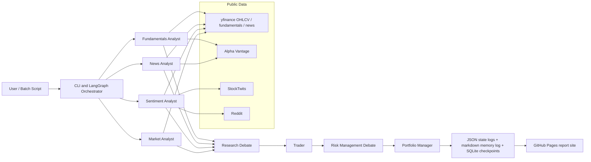
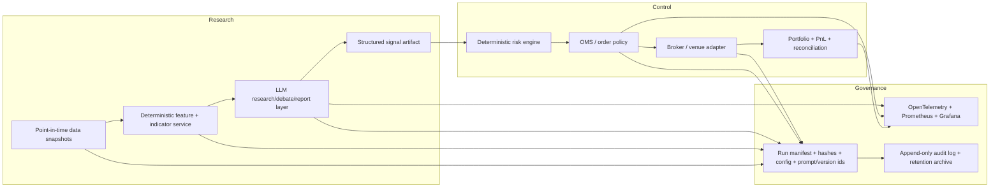
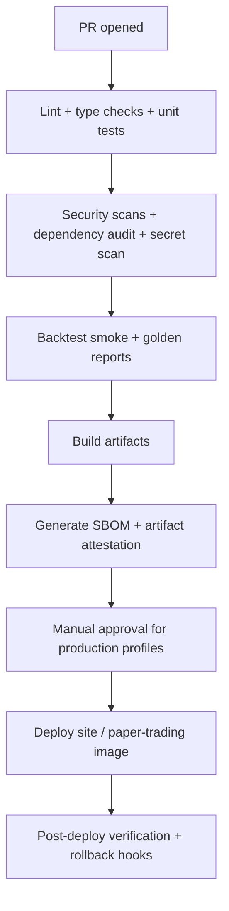

# TradingAgents Investment System Audit and Hardening Report

## Executive summary

TradingAgents, as exposed through the public GitHub Pages site and linked repository, is a **research-oriented, LLM-driven multi-agent analysis framework**, not yet a solidly evidenced production trading system. The public materials show a modular agent graph, checkpoint/resume support, a persistent decision log, structured output for some decision agents, and a growing automated test suite. The site also openly states that results are non-deterministic and that the framework should be treated as a research scaffold rather than a strategy with fixed, replicable returns. Those are strengths in transparency. However, the same public evidence also shows several blockers to calling the system solid, stable, profitable, and traceable in an institutional sense: historical-data leakage in non-price inputs, lack of a public execution stack with enforceable pre-trade controls, no visible CI pipeline that runs the substantial test suite, provenance gaps in the website publishing flow, and fragile summary extraction from free-form prose that already produces `n/a` values on the site. citeturn31view3turn43view0turn8view2turn5view0turn26view1turn20view1

The **single most important technical risk** is that historical runs are not point-in-time reproducible for all inputs. The repository explicitly says that news, StockTwits, and Reddit still reflect “now” even when a historical trade date is pinned, and the yfinance fundamentals function labels `curr_date` as “not used for yfinance.” That means historical reports can mix past prices with present-day news, sentiment, and fundamentals, which is unacceptable for credible backtesting, model validation, or profitability claims. The public site reinforces this concern by publishing research reports and daily summaries, but it does not publish realized return series, walk-forward validation, slippage assumptions, fill models, or broker reconciliation. citeturn43view0turn15view1turn22view0

The **single most important traceability risk** is that the publishing and artifact chain is inconsistent. The repo contains only two GitHub workflows, `pages.yml` and `auto-merge.yml`, while the `pre-commit` config runs only report-site checks, not tests or security scans. Separately, the local publishing script says report markdown under `docs/` is gitignored and therefore CI cannot build the site, so it force-pushes `gh-pages` from a local working tree. At the same time, `.gitignore` comments say the site is built in CI from raw stage files, but the ignore patterns include `docs/**/*.md`, which is broader than the comments suggest. That combination creates a provenance gap: the public site may not be cryptographically tied to a specific reviewed commit or CI run. citeturn5view0turn6view0turn6view1turn6view2turn33view0turn34view0

My overall conclusion is direct: **the public TradingAgents stack is promising as a research copilot, but it is not yet demonstrably production-grade for trading or investment decision automation**. The fastest path to make it materially more solid is to separate the system into three layers: a deterministic, point-in-time data and signal layer; a constrained LLM research and explanation layer; and an independent execution/risk-control layer with hard guardrails, audit trails, and reconciled performance measurement. If those changes are implemented, the framework could become much more stable, inspectable, and operationally credible. citeturn43view0turn39search1turn39search2turn39search4turn39search8

## Scope and observed public system

This report is based only on the public website and repository linked from it. I did **not** assume access to private infrastructure, unpublished broker integrations, private datasets, or internal runbooks. Several key deployment details are unspecified in public materials, including target markets beyond what Yahoo Finance covers, whether the intended use is equities versus crypto versus multi-asset, whether the latency requirement is intraday or higher frequency, what broker or OMS/EMS is intended, and what the budget or staffing envelope is. Where those details matter, I provide options rather than a single prescription. citeturn43view0turn22view0

Publicly, the system presents as a GitHub Pages site that publishes ticker-by-ticker reports and daily decision summaries. The repository is a public fork of `TauricResearch/TradingAgents`; GitHub’s compare surface shows 46 commits and 77 files changed in the fork relative to upstream. The website currently lists multiple ticker pages and daily decision summaries, with uneven daily coverage visible on the home page: for example, June 19, 2026 shows 13 reports, while several earlier days show 26 reports. The repo README describes a modular multi-agent framework built on LangGraph, with analyst agents, debate agents, a trader, risk management analysts, and a portfolio manager; it also states that approved transactions go to a “simulated exchange.” citeturn21search0turn22view0turn26view1turn31view3

A simplified representation of the **currently observed public architecture** is:



That representation is grounded in the README, default config, graph wiring, dataflow interfaces, memory log, checkpoint module, and site build scripts. citeturn31view3turn11view0turn12view0turn16view0turn17view0turn17view1turn20view1

## Detailed audit

### Architecture and code quality

The public codebase has several good foundational choices. The orchestration is modular, with separate packages for agents, graph logic, dataflows, and LLM clients. The graph class builds distinct tool nodes for market, social, news, and fundamentals; it supports provider abstraction, optional request pacing, checkpoint/resume, decision memory, and structured outputs for at least the research manager, trader, and portfolio manager. There is also meaningful test coverage by file count, including tests for checkpoint resume, report-site generation, indicator handling, model validation, market-data validation, ticker safety, and retry behavior. citeturn14view0turn14view1turn11view1turn35view0turn8view2turn9view0

The main code-quality problem is **delivery discipline rather than code organization**. The repository’s workflow directory contains only `pages.yml` and `auto-merge.yml`, and the pre-commit configuration runs site-building checks rather than the test suite. In other words, the public repo demonstrates many tests but not an automated, enforced gate that runs them on every change before merge or deploy. That gap matters more than adding still more unit tests, because it means regressions in data handling, summarization, or prompts can ship without systematic verification. citeturn5view0turn6view0turn6view1turn6view2turn8view2turn9view0

The public fork also appears to have **supply-chain and release-management weakness**. The README recommends `pip install .`, the Dockerfile installs the package from the local source tree, and `pyproject.toml` uses version ranges rather than a locked, CI-enforced environment for the documented install path. A `uv.lock` file exists, which is good, but the public installation and Docker flow do not clearly require it. That makes operational reproducibility weaker than it should be for a trading-related system. citeturn4view0turn4view2turn32view2turn43view0

### Data pipelines and historical validity

The public code shows real work to improve price-data integrity. The market-data validator explicitly excludes future rows, the verified market snapshot is deterministic, and the graph injects resolved instrument identity to reduce ticker hallucination. The price-return reflection logic also computes realized raw and alpha returns after the fact and writes them atomically to the memory log. Those are positive patterns. citeturn15view0turn16view1turn12view0turn17view0turn30view0

But the public evidence is equally clear that **the overall historical pipeline is not point-in-time safe**. The README states that news, StockTwits, and Reddit return different content as time passes and therefore still reflect “now” for the same historical trade date. The yfinance fundamentals function explicitly marks `curr_date` as unused. The yfinance news retriever fetches a current news set from Yahoo and filters it by article date, which is better than nothing, but it is still constrained by what the current Yahoo endpoint makes available today, not by an archived point-in-time news dataset. That means historical research runs can leak information or at least vary structurally over time. For any claim of backtested profitability, this is a major invalidation risk. citeturn43view0turn15view1turn38view0

The same issue exists for sentiment. Reddit and StockTwits fetch public live streams or recent search results, degrade gracefully on network and platform blocking, and are optimized for prompt injection into the agent, not for point-in-time archival replay. That is acceptable for present-tense research assistance, but it is not acceptable as the basis for historical signal validation unless the exact raw payloads are archived, versioned, and replayed. citeturn38view1turn38view2

### Backtesting, execution, and risk management

The public materials do **not** show a complete, deterministic backtesting engine or a live execution subsystem with venue adapters, order state reconciliation, slippage models, fill policy, market-hours enforcement, or portfolio-accounting truth. The README describes a simulated exchange, and the package contains signal processing plus a portfolio-manager decision schema, but the sections of the repo reviewed publicly do not expose a broker gateway or event-driven order lifecycle comparable to production trading engines. The public site also publishes reports and summary suggestions, not realized strategy equity curves, turnover, costs, drawdowns, or benchmarked walk-forward results. citeturn31view3turn17view2turn35view0turn22view0

Risk management in the public system is mostly **narrative**. The README describes risk management analysts and a portfolio manager; the portfolio decision schema includes rating, executive summary, thesis, optional price target, and optional time horizon. The reports themselves discuss sizing, stops, and staged entry in prose. What is missing publicly is a hard, machine-enforced risk layer: position limits, gross/net exposure caps, sector concentration, kill switches, max daily loss, market-hours checks, duplicate-order suppression, stale-data rejection, and pre-trade compliance checks. If market access is ever introduced, U.S. broker-dealer environments require reasonably designed risk controls and supervisory procedures under SEC Rule 15c3-5, and supervisory systems under FINRA Rule 3110; even outside regulated broker-dealer contexts, those are good design anchors for hard controls. citeturn35view0turn27view0turn27view1turn39search0turn39search4turn39search8turn42search1

### Logging, observability, security, and compliance

The logging story is mixed. Positively, the graph writes JSON end-state logs, maintains a markdown memory log with atomic updates, and uses per-ticker SQLite checkpoints for resumability. There is also a documented rate-limit retry layer and API-key environment mapping. The ticker path component is explicitly sanitized to prevent directory traversal, and there are tests for that protection. Those are real engineering wins. citeturn12view0turn17view0turn17view1turn18view0turn28view2turn28view0turn28view1

However, the current observability is still **artifact-centric rather than operations-centric**. There is no public evidence of distributed tracing, centralized metrics, structured log schemas, span correlation, SLOs, alerting, or dashboards. For a multi-component system, the current combination of JSON files, markdown memory, and batch shell logs is not enough to support incident response, latency analysis, or reliability engineering. OpenTelemetry provides a vendor-neutral model for traces, metrics, and logs, and Prometheus/Alertmanager provide a standard alerting stack; those are the natural next step here. citeturn39search3turn39search7turn40search0turn40search4

The compliance posture is also incomplete for any serious production use. Public reports do not include source URLs for cited news items in a standardized metadata block, commit hashes, environment hashes, dependency fingerprints, or immutable run identifiers. The memory log is append-oriented, but it is not a tamper-evident regulatory archive. If the system is ever used in a regulated broker-dealer or advisor setting, books-and-records and supervision expectations become much stricter under SEC Rule 17a-4 and FINRA supervision/recordkeeping requirements. On the software supply-chain side, GitHub artifact attestations and SLSA provenance are now mature enough to attach verifiable provenance to deployed site artifacts and containers; the current process does not show that. citeturn27view0turn27view1turn42search2turn42search10turn42search1turn40search1turn40search5turn42search3turn42search27

## Specific issues, vulnerabilities, and traceability gaps

The table below consolidates the highest-confidence findings from the public audit. Severity is my assessment of operational importance, not a CVSS score.

| Finding | Severity | Why it matters | Public evidence |
|---|---:|---|---|
| Historical leakage in fundamentals/news/sentiment | Critical | Invalidates backtests and “profitability” claims because historical runs can mix past prices with present-day non-price inputs | README reproducibility note says news/StockTwits/Reddit reflect “now”; yfinance fundamentals ignore `curr_date` citeturn43view0turn15view1turn38view0 |
| No public deterministic backtest/execution engine | Critical | No verified fill model, slippage, fees, order lifecycle, or realized PnL accounting visible | Public site publishes reports rather than realized performance; README mentions simulated exchange but reviewed code sections do not expose a production OMS/EMS | citeturn22view0turn31view3 |
| Tests exist but are not publicly enforced in CI | High | Regressions can merge and deploy without automated validation | Many test files exist; workflows directory only shows `pages.yml` and `auto-merge.yml`; pre-commit focuses on report-site scripts | citeturn8view2turn9view0turn5view0turn6view2 |
| Local `gh-pages` force-push deployment from working tree | High | Weak provenance, weak reproducibility, and risk of publishing unreviewed local state | `publish_site.sh` explicitly says CI cannot build the site from remote state and force-pushes `gh-pages` locally | citeturn33view0 |
| Inconsistent docs/source-of-truth story | High | Hard to know which artifacts are authoritative and reviewable | `.gitignore` comments say raw stage files are source of truth and CI rebuilds derived artifacts, but patterns broadly ignore `docs/**/*.md`; local publisher says docs markdown never reaches remote | citeturn34view0turn33view0turn6view0 |
| Summary-page extraction from prose is brittle | High | Site metrics become incomplete or wrong; traceability from report to summary is unreliable | Build script uses extensive regex heuristics; summary rows on June 19 contain many `n/a` values; AAPL report lacks standardized current-price field and summary row shows `n/a` current/target | citeturn20view1turn26view1turn27view0turn35view0 |
| Reports lack standardized run metadata | High | Hard to audit or replay a specific run | Public report pages do not show commit SHA, data vendor, dataset hash, dependency lock hash, or workflow run ID | citeturn24view2turn23view5turn23view6turn23view7 |
| Coverage is operationally uneven on the homepage | Medium | Incomplete daily universe without machine-readable status makes missing outputs look like implicit omissions rather than explicit failures | June 19 shows 13 reports, while several earlier days show 26 | citeturn26view1 |
| Auto-merge exists without visible public quality gates | Medium | Risk of merging unverified changes, depending on branch protection configuration | `auto-merge.yml` is present; no visible test workflow accompanies it | citeturn5view0turn6view1 |
| Dependency/install path is not strongly pinned in the documented flow | Medium | Undermines deterministic builds and incident reproduction | README recommends `pip install .`; Docker builds local package; `pyproject.toml` uses specified ranges; lockfile existence is not clearly enforced in the public install path | citeturn4view0turn4view2turn43view0turn32view2 |
| Memory log is useful but not a full audit ledger | Medium | Deferred reflections are only resolved when the same ticker runs again; no tamper-evident chain | Memory log stores decisions in markdown and resolves same-ticker pending entries later | citeturn12view0turn17view0turn43view0 |

One important nuance: I did **not** find a currently exposed path-traversal bug in the reviewed public code. On the contrary, the repo explicitly hardened ticker path components and added tests around it. In other words, this is a **positive control already in place**, not a current defect. citeturn28view0turn28view1

## Prioritized roadmap

The roadmap below is ordered by the combination of operational impact, implementation effort, and risk reduction. Scores are on a 1–5 scale, where higher impact means more value, higher effort means harder, and higher risk means larger downside if left unresolved.

| Priority | Task | Impact | Effort | Risk if deferred | Suggested timeline | Rationale |
|---|---|---:|---:|---:|---|---|
| Highest | Freeze inputs for historical replay | 5 | 3 | 5 | 2–3 weeks | Without point-in-time inputs, backtesting and profitability claims are not credible |
| Highest | Add run manifest and immutable artifact metadata | 5 | 2 | 5 | 1–2 weeks | Fastest way to improve traceability across reports, logs, and site artifacts |
| Highest | Add CI for tests, linting, security, and provenance | 5 | 2 | 4 | 1–2 weeks | Existing tests are underused until they become enforced merge gates |
| Highest | Replace prose scraping with structured summary artifacts | 4 | 2 | 4 | 1–2 weeks | Removes `n/a` summary errors and reduces parser drift |
| Highest | Introduce hard pre-trade risk engine | 5 | 3 | 5 | 3–5 weeks | Narrative risk management is not enough for automated execution |
| High | Separate research layer from execution layer | 5 | 4 | 5 | 4–8 weeks | Prevents LLM variability from directly controlling orders |
| High | Add walk-forward validation and cost-aware performance reporting | 5 | 4 | 5 | 4–8 weeks | Required to discuss stability and profitability with rigor |
| High | Instrument OpenTelemetry + Prometheus + dashboards | 4 | 3 | 4 | 2–4 weeks | Essential for reliability engineering and production support |
| High | Replace local `gh-pages` force-push with CI-built, attested deploys | 4 | 2 | 4 | 1–2 weeks | Closes provenance gap and simplifies audits |
| Medium | Move decision log to append-only event store with hashes | 4 | 3 | 3 | 3–4 weeks | Stronger audit trails and better replay/debugging |
| Medium | Add data/version governance with DVC or object-store manifests and MLflow tracking | 4 | 3 | 3 | 3–5 weeks | Reproducibility of datasets, prompts, parameters, and metrics |
| Medium | Add advisory/compliance mode profiles by jurisdiction | 3 | 3 | 4 | 4–6 weeks | Necessary if the system moves beyond research use |

A practical timeline is:

- **Phase Alpha** for research integrity and traceability: 2–4 weeks.
- **Phase Beta** for deterministic backtesting, metrics, and pre-trade controls: 4–8 weeks.
- **Phase Gamma** for paper trading, reconciled execution, and compliance hardening: 8–16 weeks.

That phasing aligns with public best-practice anchors for model risk management, secure SDLC, pre-trade controls, and observability. citeturn39search1turn39search2turn39search4turn39search8turn39search3turn40search0

## Target architecture and implementation blueprint

The cleanest design change is to make the LLM system **advisory and explanatory**, while a deterministic policy engine owns signals, limits, and execution decisions.



This separation is the core change that turns the current public framework from a research toy into a system that can be validated and governed. It also maps naturally to model-risk-management guidance: conceptual design, input-data integrity, independent validation, outcome analysis, and controlled change management. citeturn39search1turn39search5

### Implementation steps

The first concrete step should be to introduce a **run manifest** written for every analysis, backtest slice, and deployable artifact:

```python
from dataclasses import dataclass, asdict
from datetime import datetime
import hashlib, json, platform, subprocess

@dataclass
class RunManifest:
    run_id: str
    created_at_utc: str
    repo_commit: str
    workflow_run_id: str | None
    model_provider: str
    deep_model: str
    quick_model: str
    config_sha256: str
    prompt_bundle_sha256: str
    dataset_ids: dict
    dependency_lock_sha256: str
    analysis_date: str
    ticker: str
    asset_type: str
    artifact_paths: dict

def sha256_bytes(b: bytes) -> str:
    return hashlib.sha256(b).hexdigest()

def write_manifest(path: str, *, config: dict, prompt_bundle: bytes, deps_lock: bytes, **kwargs):
    manifest = RunManifest(
        created_at_utc=datetime.utcnow().isoformat() + "Z",
        config_sha256=sha256_bytes(json.dumps(config, sort_keys=True).encode()),
        prompt_bundle_sha256=sha256_bytes(prompt_bundle),
        dependency_lock_sha256=sha256_bytes(deps_lock),
        repo_commit=subprocess.check_output(["git", "rev-parse", "HEAD"]).decode().strip(),
        **kwargs,
    )
    with open(path, "w", encoding="utf-8") as f:
        json.dump(asdict(manifest), f, indent=2, sort_keys=True)
```

That one change would immediately make every public report and internal run more traceable. It should be emitted alongside the final report, the structured decision JSON, the feature snapshot, and any backtest statistics. The absence of this metadata is one of the clearest current public gaps. citeturn24view2turn23view5turn23view6turn23view7

The second step is to convert the current portfolio-manager output into a **fully structured, summary-safe artifact**, instead of relying on regex extraction from prose later. The codebase already has a structured `PortfolioDecision` schema with optional fields; make the operational fields mandatory for publishable runs and write them to a machine-readable `decision.json` that the site consumes directly. That removes the current summary fragility. citeturn35view0turn20view1turn26view1

The third step is to build a **deterministic pre-trade guard** that receives only structured inputs:

```python
def pretrade_check(order, portfolio, market_state, limits):
    assert order.symbol in limits.allowed_symbols
    assert market_state.is_fresh(order.symbol, max_age_seconds=5)
    assert market_state.is_open(order.symbol)
    assert abs(order.notional) <= limits.max_order_notional(order.symbol)
    assert portfolio.gross_exposure_after(order) <= limits.max_gross_exposure
    assert portfolio.net_exposure_after(order) <= limits.max_net_exposure
    assert portfolio.position_weight_after(order) <= limits.max_weight(order.symbol)
    assert portfolio.daily_loss_pct >= -limits.max_daily_loss_pct
    assert not portfolio.duplicate_order(order, within_seconds=30)
    return True
```

If the system remains research-only, this can be used by a paper-trading simulator. If it later touches live brokers, this layer becomes non-negotiable. citeturn39search0turn39search4turn39search8turn42search1

### Testing strategy

Testing should be split into five lanes:

1. **Deterministic data tests** for ETF/equity/crypto instruments, market calendars, corporate actions, vendor fallbacks, and point-in-time replay.
2. **Golden-file tests** for structured decision JSON and report rendering.
3. **Backtest validation tests** for fees, slippage, partial fills, stale data, and order sequencing.
4. **Property tests** for risk rules, exposure caps, and kill-switch behavior.
5. **End-to-end paper-trading tests** that replay historical data and assert final state, PnL, and audit logs.

The repo already contains many unit tests, which is encouraging. The missing move is to wire them into CI, add coverage thresholds, and fail deploys on regression. That is squarely aligned with NIST SSDF guidance for secure software development. citeturn8view2turn9view0turn39search2

### CI/CD and deployment pipeline

A safe deployment path would look like this:



GitHub artifact attestations and SLSA-style provenance are a strong fit for this repo, especially because the public site is currently published through a provenance-poor local push flow. citeturn40search1turn40search5turn42search3turn42search23

A minimal GitHub Actions strategy should add:

- `ci.yml` for lint, pytest, coverage, and security scans.
- `release.yml` for attested container/site artifact builds.
- `deploy.yml` for environment-specific deploy with approvals.
- branch protections that block merge unless CI passes.
- removal or tightening of the current auto-merge behavior unless guarded by those checks. citeturn5view0turn6view1turn39search2turn40search1

### Monitoring, alerting, and metrics

OpenTelemetry should instrument every analysis run, data-vendor call, risk-check decision, and order event. Prometheus should collect service metrics, and Alertmanager should notify on-call channels when thresholds breach. Those are the standard building blocks for reliable observability. citeturn39search3turn39search7turn40search0turn40search4

Recommended core metrics:

- `analysis_run_success_rate`
- `analysis_run_latency_seconds`
- `llm_call_error_rate`
- `vendor_data_missing_rate`
- `stale_market_data_events`
- `risk_check_rejections_total`
- `paper_trade_fill_slippage_bps`
- `portfolio_turnover`
- `daily_pnl`, `rolling_sharpe`, `max_drawdown`
- `summary_publish_missing_fields_total`
- `replay_reproducibility_mismatch_total`

Sample Prometheus alert rules:

```yaml
groups:
  - name: tradingagents
    rules:
      - alert: AnalysisFailureRateHigh
        expr: rate(analysis_run_failures_total[15m]) / rate(analysis_runs_total[15m]) > 0.05
        for: 10m
        labels: { severity: page }
        annotations:
          summary: "Analysis failure rate above 5%"

      - alert: DataFreshnessViolation
        expr: max(stale_market_data_events) > 0
        for: 1m
        labels: { severity: page }
        annotations:
          summary: "Stale market data detected"

      - alert: RiskEngineDisabled
        expr: max(risk_engine_enabled == 0) > 0
        for: 1m
        labels: { severity: critical }
        annotations:
          summary: "Risk engine disabled"

      - alert: PublishTraceabilityGap
        expr: increase(summary_publish_missing_fields_total[1h]) > 0
        for: 5m
        labels: { severity: warn }
        annotations:
          summary: "Published site has missing structured fields"
```

Those rules fit directly into Prometheus’s official alerting model. citeturn40search0turn40search4

### Sample dashboards

A useful operating dashboard should contain:

- **Reliability panel:** run success rate, p95 latency, vendor error rates, checkpoint resumes.
- **Data integrity panel:** vendor coverage, stale-data events, point-in-time replay mismatches.
- **Risk panel:** rejected orders, gross/net exposure, concentration, intraday drawdown.
- **Performance panel:** net return, benchmark-relative return, Sharpe, Sortino, hit rate, turnover, implementation shortfall.
- **Traceability panel:** report runs missing manifest, missing dataset hashes, missing decision JSON fields, unattested artifacts.

## Resource estimates and recommended tool choices

### Team and effort

Because budget, latency target, and market scope are unspecified, the most honest estimate is a range. A credible hardening program for this public system would require roughly the following engineering load:

| Role | Phase Alpha | Phase Beta | Phase Gamma | Total hours |
|---|---:|---:|---:|---:|
| Staff/lead engineer | 80–120 | 120–180 | 120–180 | 320–480 |
| Quant / trading systems engineer | 60–100 | 160–240 | 180–280 | 400–620 |
| Data engineer | 40–80 | 80–140 | 60–100 | 180–320 |
| SRE / DevSecOps | 40–80 | 80–120 | 80–140 | 200–340 |
| QA / validation engineer | 40–60 | 80–120 | 100–160 | 220–340 |

A realistic total is **1,320 to 2,100 person-hours** for a strong paper-trading and attested research platform, and **1,800 to 2,800+ person-hours** if live execution, reconciliations, and regulated-records controls are added. Those ranges assume reuse of the current repo rather than a full rewrite.

### Tool and platform comparison

For the trading-core layer, the public evidence strongly suggests that the repo should **not** continue to rely on LLM report artifacts as the operational source of truth. A better pattern is to pair the current research layer with a specialized research/backtest/execution engine. Official tool docs support the following comparison. citeturn41search1turn41search2turn41search3turn41search11

| Option | Best use | Pros | Cons | Migration note |
|---|---|---|---|---|
| Keep current LangGraph core and add a deterministic custom OMS/risk layer | Fastest incremental path | Preserves current repo and site; lowest disruption | More custom engineering burden; higher long-term maintenance risk | Best if goal is “research + paper trading” first |
| VectorBT for research/backtest, current LLM layer for annotation | Fast large-scale research | Very fast vectorized backtesting; good for signal research | Not a live-execution stack by itself | Good intermediate step for validating structured signals before deeper execution work |
| NautilusTrader | Unified deterministic sim + live execution | Explicitly positions itself as production-grade, event-driven, multi-asset, live-capable | Steeper learning curve; more architectural migration | Strong choice if live trading is a serious medium-term goal |
| QuantConnect LEAN | Mature institutional-grade engine | Broad portfolio modeling, backtest/live support, large ecosystem | Greater platform conventions; integration effort with custom LLM layer | Strong choice when broker/data ecosystem breadth matters most |

For observability, **OpenTelemetry + Prometheus + Grafana** is the most neutral default. For governance and experiment tracking, **MLflow** is strong for run tracking and metrics, while **DVC** is strong for data/artifact versioning. For software provenance, **GitHub Artifact Attestations** are the fastest practical addition in this repository. citeturn39search3turn40search0turn40search3turn40search7turn40search2turn40search10turn40search1turn40search5

### Tooling cost notes

If you want a lean, self-hosted stack, the lowest-cost path is:

- GitHub Actions for CI/CD
- self-hosted Prometheus/Grafana
- object storage for artifacts and snapshots
- PostgreSQL for manifests and structured events
- DVC remote on object storage
- MLflow OSS tracking server

If you want lower ops burden, use managed Grafana Cloud, managed Postgres, and a managed object store. Market-data cost is not estimable from public materials because the intended asset classes and vendor quality requirements are unspecified; that cost could remain near-zero in research mode with Yahoo/Alpha Vantage, or become a major budget line if you need institutional point-in-time corporate actions, fundamentals, and archived news.

## Governance, reproducibility, rollback, and limitations

### Data governance and audit trails

The minimum acceptable governance package for this system should include:

- immutable run manifests for every analysis and backtest slice
- raw input snapshot IDs for OHLCV, news, sentiment, and fundamentals
- prompt bundle version IDs
- config hash and dependency-lock hash
- signed deployment artifacts
- structured decisions stored separately from rendered markdown
- append-only event records for every policy check, order intent, fill, cancel, and reconciliation event

If the system is used only for research, this is chiefly for reproducibility and operational debugging. If it is ever used in a regulated advisory or broker-dealer setting, retention, supervision, and accessibility requirements become much stricter; SEC Rule 17a-4 and FINRA supervision/recordkeeping rules are the natural U.S. anchors. citeturn42search2turn42search10turn42search1

### Rollback and mitigation plan

A safe rollback plan should assume both **model regressions** and **data regressions**.

Operationally, I recommend:

- deploy new code and prompt bundles behind a feature flag
- keep old and new signal pipelines running in shadow mode for at least two weeks
- require no deterioration in paper-trading PnL, turnover, drawdown, rejection rate, and reproducibility checks before cutover
- hold last-known-good site artifacts, containers, and dependency locks with attestations
- auto-disable execution on any of: stale market data, missing data snapshots, risk-engine health failures, reconciliation mismatches, or missing signed provenance
- maintain a “research-only mode” that can always render reports without authority to place paper or live trades

This is precisely the kind of staged-control model encouraged by secure SDLC, provenance, and model-risk guidance. citeturn39search2turn40search1turn40search5turn42search3turn39search1

### Open questions and limitations

Several important items remain unspecified in the public materials, and they materially affect the ideal final design:

- whether the intended production scope is equities only, crypto only, or multi-asset
- whether the intended cadence is end-of-day, swing, intraday, or lower-latency
- whether the system is meant to stay research-only versus paper trade versus live trade
- which jurisdiction and compliance perimeter apply
- what broker, OMS/EMS, and market-data vendors are planned
- what acceptable drawdown, turnover, and cost targets are
- whether the website is a public marketing/reporting surface or an internal experiment log

Given those unknowns, the recommendations above are intentionally modular. But the hard conclusion does not depend on them: **before discussing profitability with confidence, the system must first become point-in-time reproducible, machine-verifiable, operationally observable, and protected by deterministic risk controls.** The current public repo is not there yet, but it has enough modular structure to get there without a full restart. citeturn43view0turn22view0turn11view1