# Design Document: Remaining Graph Hardening

## Overview

This design covers 5 independent PRs that close remaining graph-hardening gaps. Each PR is self-contained with no cross-dependencies, allowing parallel implementation and review.

| PR | Scope | Key Change |
|----|-------|------------|
| PR-1 | Execution failure injection | New `find_latest_execution_failures()` + `format_execution_failure_block()` in `historical_context.py`; inject into 4 agent prompts |
| PR-2 | Memory backtest safety | `as_of_date` on `ReflexionMemory`, micro_summary forwarding, `run_id` seeding |
| PR-3 | RunLogger telemetry wiring | Pass `RunLogger.callback` into `astream_events` config in the LangGraph engine |
| PR-4 | Commodity timeframe tagging | Split bare `change_pct` into `(daily)` and `(YoY)` labels in scanner context text |
| PR-5 | Research packet summary + metric extraction | Generate `research_packet_summary` at RM guard; extract typed `key_metrics` in fundamentals analyst |

## Architecture

```mermaid
graph TD
    subgraph "PR-1: Execution Failure Injection"
        EF_Loader["find_latest_execution_failures()"]
        EF_Fmt["format_execution_failure_block()"]
        EF_Loader --> EF_Fmt
        EF_Fmt --> Trader["Trader Node"]
        EF_Fmt --> RM["Research Manager Node"]
        EF_Fmt --> PM["Portfolio Manager Node"]
        EF_Fmt --> Risk["Risk Debater Nodes"]
    end

    subgraph "PR-2: Memory Backtest Safety"
        RM2["ReflexionMemory"]
        MS["micro_summary_agent"]
        PG["PortfolioGraph.run()"]
        MS -->|"as_of_date"| RM2
        PG -->|"run_id"| State["Initial State"]
    end

    subgraph "PR-3: RunLogger Telemetry"
        Engine["LangGraphEngine"]
        RL["RunLogger"]
        Engine -->|"config.callbacks"| RL
        RL -->|"on_llm_end"| Summary["run_log.jsonl summary"]
    end

    subgraph "PR-4: Commodity Timeframe"
        SCB["scanner_context.py"]
        SCB -->|"(daily, YoY)"| CTX["scanner_graph_context_text"]
    end

    subgraph "PR-5: Summary + Metrics"
        Guard["RM Consistency Guard"]
        FA["Fundamentals Analyst"]
        Guard -->|"status:ok"| RPS["research_packet_summary"]
        FA -->|"write time"| KM["key_metrics dict"]
        KM -->|"preferred"| FRB["_fundamentals_risk_block"]
    end
```



---

## Components and Interfaces

### PR-1: Execution Failure Injection

**File Map:**

| File | Change |
|------|--------|
| `tradingagents/agents/utils/historical_context.py` | Add `find_latest_execution_failures()` and `format_execution_failure_block()` |
| `tradingagents/agents/trader/trader.py` | Inject failure block into system prompt |
| `tradingagents/agents/research_manager.py` | Inject failure block into system prompt |
| `tradingagents/agents/portfolio/pm_decision_agent.py` | Inject failure block into system prompt |
| `tradingagents/agents/risk_debaters/*.py` | Inject failure block into system prompt |
| `tests/agents/utils/test_execution_failure_context.py` | Unit + property tests |

**Function Signatures:**

```python
# tradingagents/agents/utils/historical_context.py

def find_latest_execution_failures(
    portfolio_id: str,
    as_of_date: str,
    reports_root: Path | None = None,
    lookback_days: int | None = None,
) -> dict[str, Any] | None:
    """Return the most recent execution result with non-empty failed_trades.

    Scans reports/daily/{date}/{run_id}/portfolio/report/*_execution_result.json
    for the latest file strictly before as_of_date that contains a non-empty
    'failed_trades' list.

    Returns {"date": "YYYY-MM-DD", "failed_trades": [...]} or None.
    """
    ...


def format_execution_failure_block(
    failures: dict[str, Any] | None,
    max_chars: int = 600,
) -> str:
    """Format execution failures into a compact prompt block.

    Returns empty string if failures is None or failed_trades is empty.
    Each failure line: "- {action} {ticker} x{shares}: {reason}"
    Header: "## Prior Execution Failures ({date})"
    Total output capped at max_chars.
    """
    ...
```

**Data Flow:**

1. At node entry, call `find_latest_execution_failures(portfolio_id, trade_date)`
2. Pass result to `format_execution_failure_block(failures, max_chars=600)`
3. If non-empty, append block to system prompt after existing prior-context sections
4. Pattern mirrors existing `format_prior_context_block()` usage in trader.py

**Design Decisions:**
- Reuses the same `_candidate_dates()` + `_load_latest_in_date()` pattern from existing `historical_context.py`
- 600-char cap prevents prompt bloat while allowing ~8 failure lines
- Failure block is injected into all 4 agent types (trader, RM, PM, risk debaters) so each can independently adjust behavior

---

### PR-2: Memory Backtest Safety

**File Map:**

| File | Change |
|------|--------|
| `tradingagents/memory/reflexion.py` | Already has `as_of_date` on `get_history()` and `build_context()` — verify local JSON path handles corrupt files with warning |
| `tradingagents/agents/portfolio/micro_summary_agent.py` | Already passes `analysis_date` as `as_of_date` and raises RuntimeError when missing — verify behavior |
| `tradingagents/graph/portfolio_graph.py` | Already seeds `run_id` (generates UUID when not provided) — verify propagation |
| `tests/unit/test_reflexion_memory_as_of_date.py` | Property tests for as_of_date filtering |
| `tests/unit/test_micro_summary_date_forwarding.py` | Integration test for date forwarding |

**Current State Analysis:**

After reading the source, `ReflexionMemory` already implements:
- `as_of_date` parameter on `get_history()` and `build_context()` (both MongoDB and local JSON)
- Corrupt file handling with `logger.warning` and empty list return
- `micro_summary_agent` already raises `RuntimeError` when `analysis_date` is missing
- `PortfolioGraph.run()` already generates UUID when `run_id` is not provided

**Remaining Work:**
The implementation appears complete. PR-2 focuses on adding comprehensive property-based tests to validate the as_of_date filtering invariant and integration tests for the wiring.

**Function Signatures (existing):**

```python
# tradingagents/memory/reflexion.py
def get_history(
    self,
    ticker: str,
    limit: int = 10,
    *,
    as_of_date: str | None = None,
) -> list[dict[str, Any]]:
    """Excludes decisions with decision_date > as_of_date when provided."""
    ...

def build_context(
    self, ticker: str, limit: int = 3, *, as_of_date: str | None = None
) -> str:
    """Delegates to get_history with as_of_date forwarding."""
    ...
```

**Design Decisions:**
- The `as_of_date` comparison uses string comparison (`<=`) on ISO date prefixes, which is correct for YYYY-MM-DD format
- Local JSON path uses `_date_key()` helper to extract the YYYY-MM-DD prefix for comparison
- RuntimeError on missing `analysis_date` is intentional per scanner determinism rules — no silent fallback

---

### PR-3: RunLogger Telemetry Wiring

**File Map:**

| File | Change |
|------|--------|
| `agent_os/backend/services/langgraph_engine.py` | Verify `RunLogger.callback` is passed in `config["callbacks"]` to all `astream_events` calls |
| `tradingagents/observability.py` | No changes needed — `_LLMCallbackHandler` already captures tokens |
| `tests/backend/services/test_runlogger_telemetry.py` | Property + integration tests |

**Current State Analysis:**

The `LangGraphEngine` already:
- Creates a `RunLogger` via `_start_run_logger()` at run start
- Passes `config={"callbacks": [rl.callback]}` to `scanner.graph.astream_events()` in `run_scan()`

**Verification needed:** Ensure the same pattern is used in `run_pipeline()` and `run_portfolio()` methods. The `_LLMCallbackHandler` already:
- Captures `on_chat_model_start` and `on_llm_end` events
- Extracts `tokens_in` and `tokens_out` from `usage_metadata`
- Records events via `_append()`

**Remaining Work:**
- Verify all graph execution paths pass the callback
- Add a defensive warning if callback list is empty at run start
- Add property tests validating the accumulation invariant

**Function Signatures (existing):**

```python
# tradingagents/observability.py — RunLogger
def summary(self) -> dict:
    """Returns {"llm_calls": N, "tokens_in": M, "tokens_out": K, ...}"""
    ...

# _LLMCallbackHandler
def on_llm_end(self, response: LLMResult, *, run_id: Any = None, **kwargs: Any) -> None:
    """Extracts tokens from response.generations[0][0].message.usage_metadata"""
    ...
```

**Design Decisions:**
- The callback is already wired for scan runs; PR-3 ensures consistent wiring across all run types
- Defensive warning at run start uses Python logging (not an exception) to avoid blocking execution
- Token counts come from LangChain's `usage_metadata` which is populated by OpenAI/Anthropic providers

---

### PR-4: Commodity Timeframe Tagging

**File Map:**

| File | Change |
|------|--------|
| `agent_os/backend/services/scanner_context.py` | Modify `_fetch_ground_truth()` and commodity formatting to include `(daily)` and `(YoY)` labels |
| `tradingagents/agents/utils/scanner_tools.py` | May need to expose daily vs YoY fields from data source |
| `tests/backend/services/test_scanner_context_timeframe.py` | Property tests for format compliance |

**Current Implementation:**

The `build_scanner_context_packet()` function currently:
1. Calls `_fetch_ground_truth(get_gold_price, ...)` etc.
2. Formats results via `format_snapshot_lines()` which produces lines like `"Gold $4583 (-12%)"` — no timeframe label

**Proposed Change:**

```python
# New helper in scanner_context.py

def format_commodity_line(
    name: str,
    price: float,
    change_pct_daily: float,
    change_pct_yoy: float,
) -> str:
    """Format a single commodity with explicit timeframe labels.

    Returns: "Name: $price (+X.XX% daily, +Y.YY% YoY)"
    """
    return f"{name}: ${price:.2f} ({change_pct_daily:+.2f}% daily, {change_pct_yoy:+.2f}% YoY)"


def validate_commodity_block(text: str) -> bool:
    """Reject any bare percentage in commodity section without timeframe label.

    Returns True if all percentages have (daily) or (YoY) labels.
    """
    ...
```

**Data Flow:**

1. Scanner tools return raw price data with both daily and YoY change fields
2. `build_scanner_context_packet()` calls `format_commodity_line()` for each commodity
3. `validate_commodity_block()` is called as a post-condition check
4. If `scan_date` is missing from state, the node fails with a clear error (per scanner determinism rules — no wall-clock fallback)

**Design Decisions:**
- The format `"Name: $price (±X.XX% daily, ±Y.YY% YoY)"` is chosen for unambiguous parsing by downstream agents
- Validation rejects bare percentages (e.g., `"Gold -12%"`) to prevent the YoY-vs-daily conflation bug
- No wall-clock date fallback — if `scan_date` is missing, the node fails loudly per AGENTS.md rules

---

### PR-5: Research Packet Summary + Structured Metric Extraction

**File Map:**

| File | Change |
|------|--------|
| `tradingagents/graph/setup.py` | Extend `_make_rm_consistency_guard_node()` to generate `research_packet_summary` on status "ok" |
| `tradingagents/graph/_consistency_guard.py` | Add `generate_research_packet_summary()` function |
| `tradingagents/agents/utils/output_validation.py` | Extend `build_fundamentals_report_structured()` to extract typed `key_metrics` |
| `tradingagents/agents/utils/summary_context.py` | Modify `_fundamentals_risk_block()` to prefer structured metrics |
| `tradingagents/agents/portfolio/pm_decision_agent.py` | Inject `research_packet_summary` into PM prompt |
| `tests/graph/test_research_packet_summary.py` | Property tests for summary generation |
| `tests/agents/utils/test_metric_extraction.py` | Property tests for metric extraction + round-trip |

**Function Signatures:**

```python
# tradingagents/graph/_consistency_guard.py

def generate_research_packet_summary(
    *,
    ticker: str,
    trade_date: str,
    investment_plan: str,
    fundamentals_report: str,
) -> str:
    """Generate a 200-500 char structured summary of the research packet.

    Contains: ticker, trade_date, top bull points (with numbers),
    top bear points (with numbers), final RM rating, confidence score,
    entry price, target price.

    Returns empty string if inputs are insufficient.
    """
    ...
```

```python
# tradingagents/agents/utils/output_validation.py

@dataclass
class FundamentalsKeyMetrics:
    """Typed extraction of mandated fundamentals metrics."""
    pe_ratio: float | None = None
    debt_equity_ratio: float | None = None
    fcf_change_pct: float | None = None
    operating_margin_pct: float | None = None
    current_ratio: float | None = None
    working_capital_str: str | None = None

    def to_dict(self) -> dict[str, Any]:
        ...

    @classmethod
    def from_report_text(cls, report: str) -> "FundamentalsKeyMetrics":
        """Extract metrics from LLM output using the mandated format patterns.

        Sets fields to None when not found (never raises).
        """
        ...

    def format_risk_block(self) -> str:
        """Format extracted metrics as a risk block string."""
        ...
```

**Data Flow (Summary Generation):**

1. `rm_consistency_guard_node` runs claim verification
2. If `rm_consistency_status == "ok"`:
   - Call `generate_research_packet_summary(ticker, trade_date, investment_plan, fundamentals_report)`
   - Store result as `research_packet_summary` in returned state dict
3. If status != "ok": leave `research_packet_summary` as empty string
4. PM decision agent reads `research_packet_summary` from state and injects into prompt header

**Data Flow (Metric Extraction):**

1. Fundamentals analyst LLM returns report text
2. `build_fundamentals_report_structured()` is called (existing)
3. Inside that function, call `FundamentalsKeyMetrics.from_report_text(report)` to extract typed metrics
4. Store result in `structured_payload["key_metrics"]` (replacing the current `numeric_mentions`/`summary_table_rows` dict)
5. `_fundamentals_risk_block()` checks for `state.get("fundamentals_report_structured", {}).get("key_metrics")`
6. If `key_metrics` has typed fields, format from those; otherwise fall back to regex on raw text

**Design Decisions:**
- Summary generation is deterministic (regex-based extraction from RM plan text), not LLM-based, to avoid adding latency
- The 200-500 char constraint ensures the summary is compact enough for PM prompt injection without bloat
- `FundamentalsKeyMetrics` uses a dataclass for type safety; `from_report_text()` uses the same regex patterns as `_fundamentals_risk_block()` but returns typed values
- Fallback to regex ensures backward compatibility when structured metrics are unavailable (e.g., resumed runs with old checkpoints)

---

## Data Models

### Execution Failure Record (PR-1)

```python
# Shape of data in *_execution_result.json
{
    "failed_trades": [
        {
            "action": "BUY",
            "ticker": "AAPL",
            "shares": 100,
            "reason": "Insufficient cash: needed $18,500, available $12,000"
        }
    ],
    "successful_trades": [...],
    "date": "2026-05-01"
}
```

### FundamentalsKeyMetrics (PR-5)

```python
@dataclass
class FundamentalsKeyMetrics:
    pe_ratio: float | None          # e.g., 83.2
    debt_equity_ratio: float | None  # e.g., 15.63
    fcf_change_pct: float | None     # e.g., -73.0
    operating_margin_pct: float | None  # e.g., -3.0
    current_ratio: float | None      # e.g., 0.70
    working_capital_str: str | None  # e.g., "$2.3B (negative)"
```

### Research Packet Summary (PR-5)

```
{ticker} | {trade_date} | Rating: {rating} | Confidence: {confidence}
Bull: {bull_point_1}; {bull_point_2}
Bear: {bear_point_1}; {bear_point_2}
Entry: ${entry_price} | Target: ${target_price}
```

---

## Correctness Properties

*A property is a characteristic or behavior that should hold true across all valid executions of a system — essentially, a formal statement about what the system should do. Properties serve as the bridge between human-readable specifications and machine-verifiable correctness guarantees.*

### Property 1: Execution failure block structural completeness

*For any* non-empty list of failed trades (each with action, ticker, shares, and reason), `format_execution_failure_block()` SHALL produce a string containing the action, ticker, share count, and failure reason for every included trade, plus the date header.

**Validates: Requirements 1.1, 1.7**

### Property 2: Execution failure block length cap

*For any* input to `format_execution_failure_block()` (including arbitrarily large failure lists), the returned string SHALL never exceed 600 characters.

**Validates: Requirements 1.8**

### Property 3: ReflexionMemory as-of-date filtering

*For any* set of reflexion records and any `as_of_date` string, `ReflexionMemory.get_history(ticker, as_of_date=d)` SHALL return only records whose `decision_date` is less than or equal to `d`, and SHALL return them in descending date order.

**Validates: Requirements 2.1, 2.2, 2.3**

### Property 4: RunLogger event accumulation accuracy

*For any* sequence of N simulated LLM call events with known `tokens_in` and `tokens_out` values fired through `_LLMCallbackHandler`, the `RunLogger.summary()` SHALL report `llm_calls == N`, `tokens_in == sum(all tokens_in)`, and `tokens_out == sum(all tokens_out)`.

**Validates: Requirements 5.2, 5.3**

### Property 5: Commodity timeframe format compliance

*For any* commodity entry with a name, price, daily change percentage, and YoY change percentage, the formatted scanner context line SHALL match the pattern `"Name: $price (±X.XX% daily, ±Y.YY% YoY)"` and SHALL NOT contain any bare percentage without a timeframe label.

**Validates: Requirements 6.1, 6.2, 6.3, 6.4**

### Property 6: Research packet summary field completeness

*For any* valid research packet (non-empty investment_plan containing a rating, bull/bear points, entry price, and target price), `generate_research_packet_summary()` SHALL produce a string containing the ticker, trade date, at least one bull point, at least one bear point, the rating, and price information.

**Validates: Requirements 7.2**

### Property 7: Research packet summary length bounds

*For any* input to `generate_research_packet_summary()` that produces a non-empty result, the output length SHALL be between 200 and 500 characters inclusive.

**Validates: Requirements 7.3**

### Property 8: Fundamentals metric extraction correctness

*For any* fundamentals report text containing the mandated metric format lines (`P/E ratio: Xx`, `D/E ratio: X`, etc.), `FundamentalsKeyMetrics.from_report_text()` SHALL extract each present metric into its corresponding typed field, and SHALL set absent metrics to None without raising.

**Validates: Requirements 8.1, 8.2, 8.3**

### Property 9: Fundamentals metric round-trip preservation

*For any* set of valid metric values (pe_ratio, debt_equity_ratio, fcf_change_pct, operating_margin_pct, current_ratio, working_capital_str), formatting them into the mandated text format and then extracting via `FundamentalsKeyMetrics.from_report_text()` SHALL produce values equal to the originals within floating-point tolerance (±0.01 for percentages, ±0.1 for ratios).

**Validates: Requirements 8.6**

---

## Error Handling

| PR | Error Condition | Handling |
|----|----------------|----------|
| PR-1 | No prior execution result or empty `failed_trades` | Return empty string; agent prompts unchanged |
| PR-1 | Corrupt/unreadable execution result JSON | Return `None` (existing `_load_latest_in_date` pattern) |
| PR-2 | Corrupt local reflexion JSON | Log warning, return empty list (already implemented) |
| PR-2 | Missing `analysis_date` in micro_summary_agent | Raise `RuntimeError` with descriptive message (already implemented) |
| PR-3 | RunLogger callback not wired | Log warning at run start; telemetry will be incomplete |
| PR-4 | Missing `scan_date` in scanner context | Fail the node with clear error message (no wall-clock fallback) |
| PR-4 | Bare percentage without timeframe label | Validation rejects output; node fails |
| PR-5 | RM consistency guard fails (status != "ok") | Leave `research_packet_summary` empty |
| PR-5 | Metric not present in LLM output | Set field to `None` (never raise) |
| PR-5 | Structured metrics unavailable | Fall back to regex extraction from raw text |

---

## Testing Strategy

### Property-Based Tests (fast-check via Hypothesis)

Each property test uses **Hypothesis** (Python PBT library) with a minimum of **100 iterations** per property.

| Property | Test File | Tag |
|----------|-----------|-----|
| P1: Structural completeness | `tests/agents/utils/test_execution_failure_context.py` | Feature: remaining-graph-hardening, Property 1: execution failure block structural completeness |
| P2: Length cap | `tests/agents/utils/test_execution_failure_context.py` | Feature: remaining-graph-hardening, Property 2: execution failure block length cap |
| P3: as_of_date filtering | `tests/unit/test_reflexion_memory_as_of_date.py` | Feature: remaining-graph-hardening, Property 3: ReflexionMemory as-of-date filtering |
| P4: RunLogger accumulation | `tests/backend/services/test_runlogger_telemetry.py` | Feature: remaining-graph-hardening, Property 4: RunLogger event accumulation accuracy |
| P5: Commodity format | `tests/backend/services/test_scanner_context_timeframe.py` | Feature: remaining-graph-hardening, Property 5: commodity timeframe format compliance |
| P6: Summary completeness | `tests/graph/test_research_packet_summary.py` | Feature: remaining-graph-hardening, Property 6: research packet summary field completeness |
| P7: Summary length | `tests/graph/test_research_packet_summary.py` | Feature: remaining-graph-hardening, Property 7: research packet summary length bounds |
| P8: Metric extraction | `tests/agents/utils/test_metric_extraction.py` | Feature: remaining-graph-hardening, Property 8: fundamentals metric extraction correctness |
| P9: Metric round-trip | `tests/agents/utils/test_metric_extraction.py` | Feature: remaining-graph-hardening, Property 9: fundamentals metric round-trip preservation |

### Unit Tests (example-based)

| Test | Validates |
|------|-----------|
| Trader/RM/PM/Risk nodes include failure block in prompt when available | Req 1.2–1.5 |
| Empty failures → empty string, prompts unchanged | Req 1.6 |
| micro_summary_agent raises RuntimeError on missing analysis_date | Req 3.2 |
| PortfolioGraph.run() generates UUID when run_id omitted | Req 4.2 |
| RunLogger callback wired in all engine run methods | Req 5.1 |
| Warning logged when callback missing | Req 5.5 |
| Scanner context fails on missing scan_date | Req 6.5 |
| RM guard produces empty summary on failure | Req 7.4 |
| PM node receives research_packet_summary in prompt | Req 7.5 |
| _fundamentals_risk_block prefers structured over regex | Req 8.4 |
| _fundamentals_risk_block falls back to regex when structured unavailable | Req 8.5 |

### Integration Tests

| Test | Validates |
|------|-----------|
| End-to-end pipeline with mocked LLM produces non-zero telemetry | Req 5.4 |
| ReflexionMemory as_of_date works on both MongoDB mock and local JSON | Req 2.4 |
| run_id propagates through portfolio graph to downstream nodes | Req 4.3 |

### Test Configuration

- **Library:** Hypothesis (Python)
- **Min iterations:** 100 per property (via `@settings(max_examples=100)`)
- **Tagging:** Each property test includes a docstring with `Feature: remaining-graph-hardening, Property N: {title}`
- **Fixtures:** Shared Hypothesis strategies for generating failed trades, reflexion records, metric values, and commodity data
