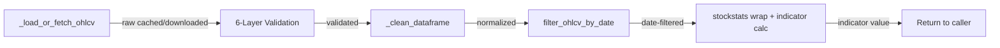
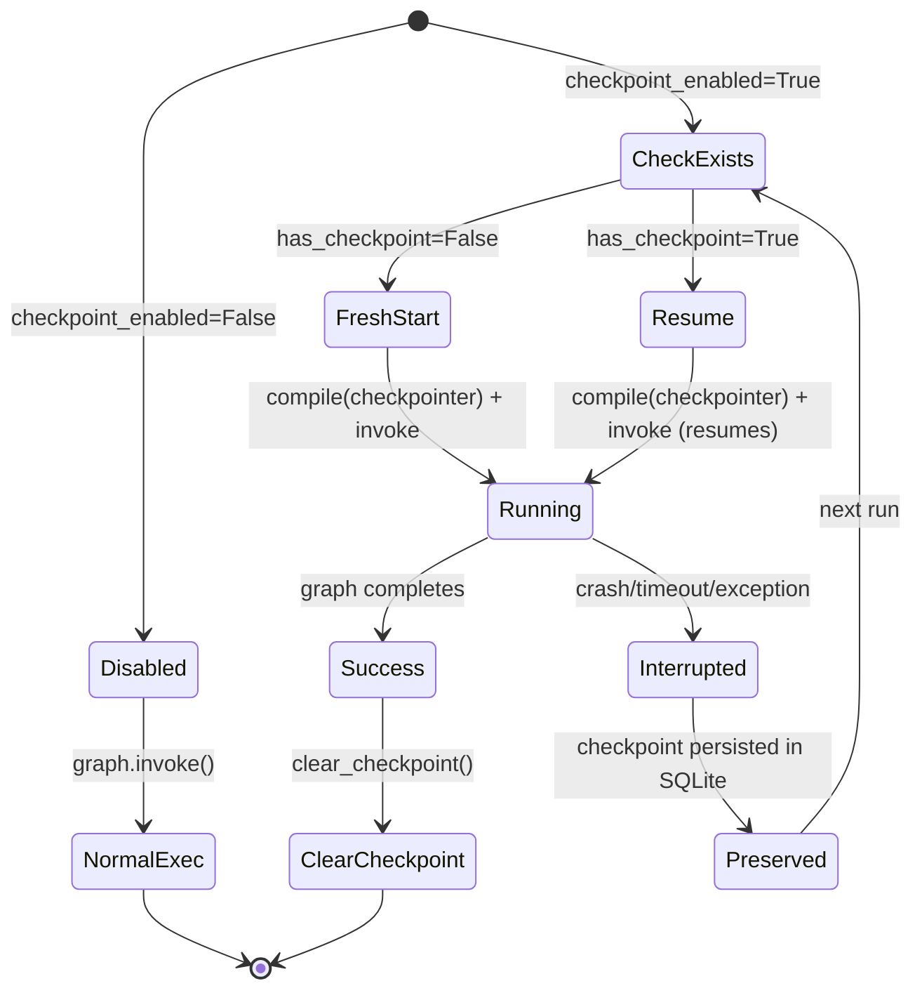
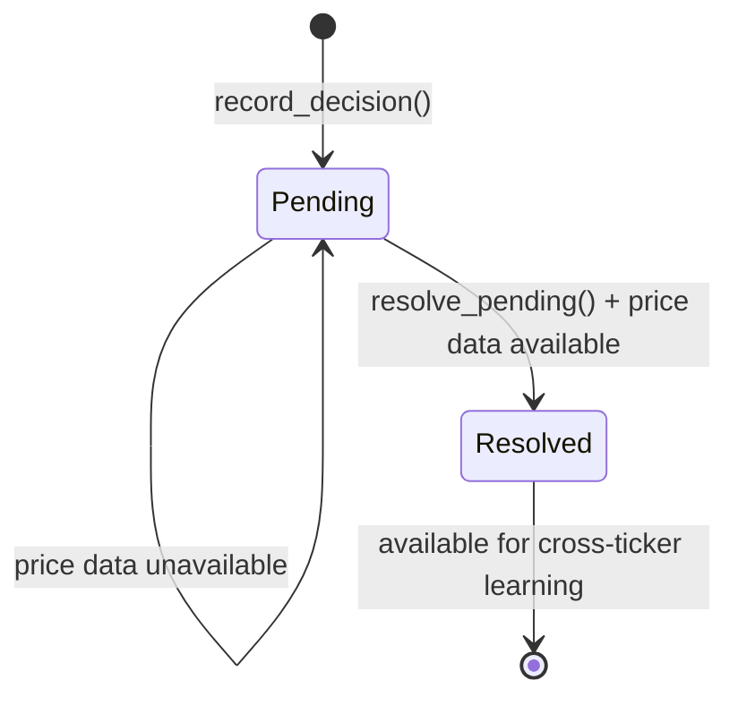
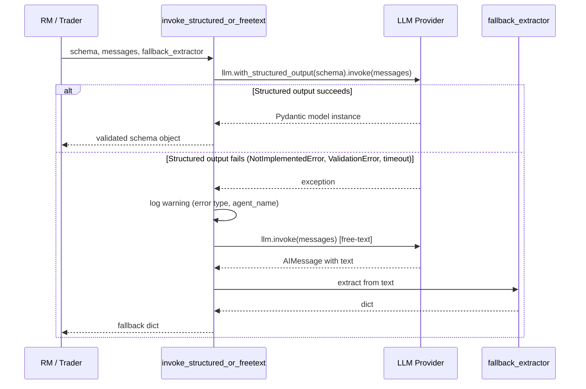

# Design Document: Upstream Feature Adoption

## Overview

This design covers four features adopted from upstream TauricResearch/TradingAgents commits, adapted to our fork's richer architecture. The features are ordered by priority:

1. **Look-Ahead Bias Prevention (P0)** — Date filtering across OHLCV, Alpha Vantage, and yfinance pipelines to prevent backtests from seeing future data.
2. **LangGraph Checkpoint Resume (P1)** — Per-ticker SQLite crash recovery with deterministic thread IDs, enabling interrupted multi-minute analyses to resume.
3. **Decision Outcome Tracker (P2)** — Append-only JSONL decision log with deferred outcome resolution and cross-ticker learning.
4. **Schema-Driven Structured Output (P3)** — Pydantic schemas for Research Manager and Trader with a reusable try-structured/fallback pattern.

All four features are additive and opt-in. They coexist with existing systems (BM25 memory, historical context, PM structured output, 6-layer OHLCV validation) without regression.

## Architecture

### High-Level Integration Diagram

```mermaid
graph TD
    subgraph "Data Layer (P0: Look-Ahead Bias)"
        OHLCV[_load_or_fetch_ohlcv] --> DateFilter[filter_by_date]
        DateFilter --> StockStats[StockstatsUtils / _get_stock_stats_bulk]
        AV[Alpha Vantage API] --> AVFilter[_filter_reports_by_date]
        YF[yfinance Financials] --> YFFilter[_filter_financials_by_date]
    end

    subgraph "Graph Layer (P1: Checkpoint Resume)"
        SetupGraph[setup_graph → StateGraph] --> Compile[workflow.compile]
        Compile --> Graph[self.graph]
        SetupGraph --> RecompileCP[workflow.compile + SqliteSaver]
        RecompileCP --> GraphCP[checkpoint-enabled graph]
        CPModule[checkpointer.py] --> RecompileCP
    end

    subgraph "Memory Layer (P2: Decision Tracker)"
        PropEnd[propagate → success] --> Record[record_decision]
        Record --> JSONL[decision_log.jsonl]
        PropStart[propagate → start] --> Resolve[resolve_pending]
        Resolve --> JSONL
        JSONL --> CrossTicker[get_cross_ticker_lessons]
    end

    subgraph "Agent Layer (P3: Structured Output)"
        RM[Research Manager] --> StructuredRM[with_structured_output + ResearchPlanSchema]
        StructuredRM -->|fail| FallbackRM[build_investment_plan_structured]
        Trader[Trader] --> StructuredT[with_structured_output + TraderProposalSchema]
        StructuredT -->|fail| FallbackT[build_trader_plan_structured]
        Utility[invoke_structured_or_freetext] --> StructuredRM
        Utility --> StructuredT
    end


## Components and Interfaces

### P0: Look-Ahead Bias Prevention

#### New Functions

```python
# tradingagents/dataflows/stockstats_utils.py

def filter_ohlcv_by_date(data: pd.DataFrame, curr_date: str | None) -> pd.DataFrame:
    """Filter OHLCV DataFrame to exclude rows after curr_date.
    
    Applied AFTER _load_or_fetch_ohlcv() validation and _clean_dataframe(),
    but BEFORE indicator calculation (stockstats wrap).
    
    Args:
        data: Cleaned OHLCV DataFrame with DatetimeIndex (lowercase columns).
        curr_date: Trading date in YYYY-MM-DD format. If None, returns data unchanged.
    
    Returns:
        DataFrame with only rows where index <= curr_date.
    
    Raises:
        ValueError: If curr_date is provided but not parseable as a date.
    """
```

```python
# tradingagents/dataflows/alpha_vantage_fundamentals.py

def _filter_reports_by_date(result: dict | str, curr_date: str | None) -> dict | str:
    """Filter Alpha Vantage report arrays to exclude entries after curr_date.
    
    Filters both 'annualReports' and 'quarterlyReports' keys by comparing
    each entry's 'fiscalDateEnding' field against curr_date.
    
    Args:
        result: Raw API response (dict with report arrays, or error string).
        curr_date: Cutoff date in YYYY-MM-DD format. If None, returns result unchanged.
    
    Returns:
        Filtered result dict, or original if curr_date is None or result is not a dict.
    """
```

```python
# tradingagents/dataflows/y_finance.py

def _filter_financials_by_date(data: pd.DataFrame, curr_date: str | None) -> pd.DataFrame:
    """Drop financial statement columns whose date header is after curr_date.
    
    yfinance returns financial statements with dates as column headers (Timestamps).
    This function drops columns representing future fiscal periods.
    
    Args:
        data: Financial statement DataFrame (rows=line items, columns=dates).
        curr_date: Cutoff date in YYYY-MM-DD format. If None, returns data unchanged.
    
    Returns:
        DataFrame with only columns where date <= curr_date.
        If all columns are filtered out, returns a message string instead.
    """
```

#### Data Flow: OHLCV Filter Pipeline



**Critical ordering constraint:** The date filter is applied AFTER all 6 validation layers (corruption detection, staleness check, plausibility guard, contamination check, row count assertion, retry logic) and AFTER `_clean_dataframe()`, but BEFORE `wrap()` and indicator calculation. This ensures:
- Validation operates on the full dataset (a 15-year file with only 30 rows post-filter is still valid)
- Indicators are computed only on historically-available data

#### Modified Call Sites

| Function | Current Behavior | New Behavior |
|----------|-----------------|--------------|
| `StockstatsUtils.get_stock_stats()` | Loads full data, wraps, looks up curr_date row | Loads → cleans → **filters** → wraps → looks up |
| `_get_stock_stats_bulk()` | Loads full data, wraps, returns all dates | Loads → cleans → **filters** → wraps → returns filtered dates |
| `get_balance_sheet()` (y_finance) | Returns full DataFrame as CSV | Returns **filtered** DataFrame as CSV |
| `get_cashflow()` (y_finance) | Returns full DataFrame as CSV | Returns **filtered** DataFrame as CSV |
| `get_income_statement()` (y_finance) | Returns full DataFrame as CSV | Returns **filtered** DataFrame as CSV |
| `get_balance_sheet()` (alpha_vantage) | Returns full API response | Returns **filtered** response |
| `get_cashflow()` (alpha_vantage) | Returns full API response | Returns **filtered** response |
| `get_income_statement()` (alpha_vantage) | Returns full API response | Returns **filtered** response |
| `get_fundamentals()` (alpha_vantage) | Returns full overview | Returns **filtered** overview (no date-indexed data, so no-op) |

---

### P1: LangGraph Checkpoint Resume

#### New Module: `tradingagents/graph/checkpointer.py`

```python
"""Per-ticker SQLite checkpoint management for LangGraph crash recovery."""

import hashlib
from contextlib import contextmanager
from pathlib import Path
from typing import Generator

from langgraph.checkpoint.sqlite import SqliteSaver


def thread_id(ticker: str, trade_date: str) -> str:
    """Generate deterministic thread_id from ticker and trade_date.
    
    Uses SHA-256 of '{ticker}:{trade_date}' to ensure:
    - Same ticker+date always resumes from prior checkpoint
    - Different date starts fresh (no stale state contamination)
    
    Args:
        ticker: Stock ticker symbol (e.g., 'AAPL').
        trade_date: Trading date in YYYY-MM-DD format.
    
    Returns:
        Hex digest string suitable for LangGraph thread_id.
    """


def _db_path(data_cache_dir: str, ticker: str) -> Path:
    """Resolve the SQLite database path for a ticker's checkpoints."""


@contextmanager
def get_checkpointer(data_cache_dir: str, ticker: str) -> Generator[SqliteSaver, None, None]:
    """Context manager providing a SqliteSaver for the given ticker.
    
    Creates the checkpoints directory if needed. Guarantees connection
    cleanup on both success and failure paths.
    
    Args:
        data_cache_dir: Base directory for data caches.
        ticker: Stock ticker symbol.
    
    Yields:
        SqliteSaver instance connected to the ticker's SQLite database.
    """


def has_checkpoint(data_cache_dir: str, ticker: str, trade_date: str) -> bool:
    """Check if a resumable checkpoint exists for ticker+date."""


def clear_checkpoint(data_cache_dir: str, ticker: str, trade_date: str) -> None:
    """Clear the checkpoint for a specific ticker+date thread."""


def clear_all_checkpoints(data_cache_dir: str) -> None:
    """Remove all checkpoint databases. Use for clean-slate testing."""
```

#### Checkpoint Lifecycle



#### Integration in `TradingAgentsGraph`

**`setup.py` change:** `setup_graph()` returns the uncompiled `StateGraph` instead of calling `.compile()`.

**`trading_graph.py` changes:**

```python
# In __init__:
self.workflow = self.graph_setup.setup_graph(selected_analysts)  # StateGraph (uncompiled)
self.graph = self.workflow.compile()  # Default compiled graph

# In propagate():
def propagate(self, company_name: str, trade_date: str) -> tuple[dict, Any]:
    if self.config.get("checkpoint_enabled"):
        tid = thread_id(company_name, str(trade_date))
        ctx = get_checkpointer(self.config["data_cache_dir"], company_name)
        saver = ctx.__enter__()
        try:
            graph = self.workflow.compile(checkpointer=saver)
            # ... invoke with config={"configurable": {"thread_id": tid}} ...
            # On success:
            clear_checkpoint(self.config["data_cache_dir"], company_name, str(trade_date))
            return result
        finally:
            ctx.__exit__(None, None, None)
    else:
        # Current behavior unchanged
        return self.graph.invoke(...)
```

---

### P2: Decision Outcome Tracker

#### New Module: `tradingagents/agents/utils/decision_outcome_tracker.py`

```python
"""Append-only decision log with deferred outcome resolution."""

import json
from dataclasses import dataclass, asdict
from pathlib import Path
from typing import Literal


@dataclass
class DecisionRecord:
    """A single trading decision entry in the log."""
    ticker: str
    trade_date: str
    rating: str  # Canonical 5-tier vocabulary
    rationale_summary: str
    status: Literal["pending", "resolved"]
    recorded_at: str  # ISO timestamp
    # Populated on resolution:
    actual_return: float | None = None
    benchmark_return: float | None = None
    alpha: float | None = None
    resolved_at: str | None = None


class DecisionOutcomeTracker:
    """Tracks trading decisions and resolves outcomes after holding period.
    
    Coexists with BM25_Memory and Historical_Context without modification.
    Uses JSONL format for append-only durability.
    """
    
    def __init__(self, data_cache_dir: str, holding_period_days: int = 5):
        """Initialize tracker.
        
        Args:
            data_cache_dir: Base directory for data caches.
            holding_period_days: Days to wait before resolving outcomes.
        """
    
    @property
    def log_path(self) -> Path:
        """Path to the JSONL decision log file."""
    
    def record_decision(
        self,
        ticker: str,
        trade_date: str,
        rating: str,
        rationale_summary: str,
    ) -> None:
        """Append a pending decision record to the log.
        
        No-op if rating is empty or None.
        Does not modify existing records (append-only).
        
        Args:
            ticker: Stock ticker symbol.
            trade_date: Date of the trading decision (YYYY-MM-DD).
            rating: Canonical rating (Buy/Overweight/Hold/Underweight/Sell).
            rationale_summary: One-paragraph summary of the decision rationale.
        """
    
    def resolve_pending(
        self,
        ticker: str,
        current_date: str,
        price_fetcher: callable = None,
    ) -> list[DecisionRecord]:
        """Resolve pending decisions older than holding_period_days.
        
        Called at the start of propagate(), before graph execution.
        Fetches actual returns and SPY benchmark for the holding period.
        
        Args:
            ticker: Current ticker being analyzed (resolves only this ticker's pending).
            current_date: Today's date for determining which decisions are resolvable.
            price_fetcher: Optional callable(ticker, start_date, end_date) -> float.
                          Defaults to yfinance-based fetcher.
        
        Returns:
            List of newly resolved DecisionRecord objects.
        """
    
    def get_cross_ticker_lessons(
        self,
        exclude_ticker: str,
        n: int = 3,
    ) -> str:
        """Get formatted lessons from other tickers' resolved decisions.
        
        Prioritizes recent decisions with the largest absolute alpha.
        
        Args:
            exclude_ticker: Ticker to exclude (the current analysis target).
            n: Maximum number of lessons to return.
        
        Returns:
            Formatted context string for prompt injection, or empty string if none.
        """
    
    def _read_all_records(self) -> list[DecisionRecord]:
        """Read all records from the JSONL log."""
    
    def _write_record(self, record: DecisionRecord) -> None:
        """Append a single record to the JSONL log (atomic write)."""
    
    def _update_record(self, old_record: DecisionRecord, new_record: DecisionRecord) -> None:
        """Update a record in-place by rewriting the log.
        
        Note: This rewrites the full file. For the expected log sizes
        (hundreds of records), this is acceptable.
        """
```

#### Decision State Machine



#### Integration Points

- **Recording:** Called at the end of `propagate()` after successful graph execution, extracting rating from `final_trade_decision`.
- **Resolution:** Called at the start of `propagate()` before graph execution.
- **Cross-ticker injection:** Called by PM agent prompt builder to inject lessons from other tickers.
- **Coexistence:** Does NOT replace BM25 memory (within-run context) or historical_context.py (prior analysis reports). Adds a new dimension: outcome-based learning.

---

### P3: Schema-Driven Structured Output

#### New Schemas

```python
# tradingagents/agents/utils/structured_schemas.py

from typing import Literal
from pydantic import BaseModel, Field


# Canonical 5-tier rating vocabulary
CANONICAL_RATINGS = ("Buy", "Overweight", "Hold", "Underweight", "Sell")

# Synonym mapping for legacy free-text parsing
RATING_SYNONYMS: dict[str, str] = {
    "Strong Buy": "Buy",
    "Aggressive Buy": "Buy",
    "Accumulate": "Overweight",
    "Outperform": "Overweight",
    "Neutral": "Hold",
    "Market Perform": "Hold",
    "Equal Weight": "Hold",
    "Reduce": "Underweight",
    "Underperform": "Underweight",
    "Strong Sell": "Sell",
    "Avoid": "Sell",
}


def normalize_rating(raw: str) -> str:
    """Map a raw rating string to the canonical 5-tier vocabulary.
    
    Args:
        raw: Raw rating text from LLM output.
    
    Returns:
        Canonical rating string. Defaults to 'Hold' if unmappable.
    """


class ResearchPlanSchema(BaseModel):
    """Structured output schema for the Research Manager agent."""
    
    recommendation: Literal["Buy", "Overweight", "Hold", "Underweight", "Sell"]
    confidence: Literal["HIGH", "MED", "LOW"]
    bull_evidence: list[str] = Field(
        description="Top 3 bull arguments with source attribution"
    )
    bear_evidence: list[str] = Field(
        description="Top 3 bear arguments with source attribution"
    )
    rationale: str = Field(
        description="2-3 sentence synthesis explaining the recommendation"
    )
    strategic_actions: str = Field(
        description="Concrete next steps for the trader"
    )
    conflict_resolution: str = Field(
        description="How conflicting bull/bear evidence was weighed"
    )


class TraderProposalSchema(BaseModel):
    """Structured output schema for the Trader agent."""
    
    action: Literal["Buy", "Hold", "Sell"]
    entry_price: float | None = Field(
        default=None, description="Proposed entry price (required for Buy/Sell)"
    )
    stop_loss: float | None = Field(
        default=None, description="Stop-loss level"
    )
    take_profit: float | None = Field(
        default=None, description="Take-profit target"
    )
    position_sizing: str | None = Field(
        default=None, description="Position sizing rationale"
    )
    reasoning: str = Field(
        description="Multi-sentence reasoning for the trade proposal"
    )
    catalyst_timeline: str = Field(
        description="Expected catalyst and time horizon"
    )
```

#### Fallback Utility

```python
# tradingagents/agents/utils/structured_output.py

import logging
from typing import Any, Callable, TypeVar

from pydantic import BaseModel

from tradingagents.agents.utils.llm_guard import invoke_with_timeout, resolve_timeout

logger = logging.getLogger(__name__)
T = TypeVar("T", bound=BaseModel)


def invoke_structured_or_freetext(
    llm: Any,
    schema: type[T],
    messages: list,
    fallback_extractor: Callable[[str], dict[str, Any]],
    *,
    agent_name: str = "unknown",
    timeout_tier: str = "deep",
) -> T | dict[str, Any]:
    """Attempt structured output, fall back to free-text extraction on failure.
    
    Args:
        llm: LangChain chat model instance.
        schema: Pydantic model class for structured output.
        messages: List of messages to send to the LLM.
        fallback_extractor: Function that extracts structured data from free-text.
        agent_name: Name of the calling agent (for logging).
        timeout_tier: Timeout tier ('quick', 'mid', 'deep').
    
    Returns:
        Either a validated Pydantic model instance (structured path) or
        a dict from the fallback extractor.
    
    Raises:
        No exceptions — always returns a result via one path or the other.
    """
```

#### Structured Output Call Flow



---

## Data Models

### New Config Keys

```python
# Added to DEFAULT_CONFIG in default_config.py:

# P1: Checkpoint Resume
"checkpoint_enabled": False,  # Opt-in; no behavior change when False

# P2: Decision Outcome Tracker
"decision_tracker_enabled": False,  # Opt-in
"decision_holding_period_days": 5,  # Days before resolving outcomes
"decision_cross_ticker_n": 3,  # Max cross-ticker lessons to inject

# P3: Structured Output
"structured_output_enabled": True,  # Can be disabled to force fallback path
```

### JSONL Decision Log Schema

Each line in `{data_cache_dir}/decision_log.jsonl`:

```json
{
  "ticker": "AAPL",
  "trade_date": "2026-05-01",
  "rating": "Buy",
  "rationale_summary": "Strong earnings beat with raised guidance...",
  "status": "pending",
  "recorded_at": "2026-05-01T14:30:00Z",
  "actual_return": null,
  "benchmark_return": null,
  "alpha": null,
  "resolved_at": null
}
```

After resolution:

```json
{
  "ticker": "AAPL",
  "trade_date": "2026-05-01",
  "rating": "Buy",
  "rationale_summary": "Strong earnings beat with raised guidance...",
  "status": "resolved",
  "recorded_at": "2026-05-01T14:30:00Z",
  "actual_return": 0.032,
  "benchmark_return": 0.011,
  "alpha": 0.021,
  "resolved_at": "2026-05-06T09:00:00Z"
}
```

### New Dependencies

| Package | Version | Feature |
|---------|---------|---------|
| `langgraph-checkpoint-sqlite` | `>=2.0.0` | P1: SQLite checkpointer for LangGraph |

No other new dependencies. All other features use existing packages (pandas, pydantic, yfinance).

---

## Correctness Properties

*A property is a characteristic or behavior that should hold true across all valid executions of a system — essentially, a formal statement about what the system should do. Properties serve as the bridge between human-readable specifications and machine-verifiable correctness guarantees.*

### Property 1: OHLCV Date Filter Correctness

*For any* valid OHLCV DataFrame with a DatetimeIndex and *for any* valid `curr_date` string, after applying `filter_ohlcv_by_date(data, curr_date)`, every row in the result SHALL have an index value less than or equal to `pd.Timestamp(curr_date)`.

**Validates: Requirements 1.1, 1.5**

### Property 2: OHLCV Date Filter Idempotence

*For any* valid OHLCV DataFrame and *for any* two dates `d1 <= d2`, `filter_ohlcv_by_date(filter_ohlcv_by_date(data, d2), d1)` SHALL produce an identical DataFrame to `filter_ohlcv_by_date(data, d1)`.

**Validates: Requirements 1.6**

### Property 3: OHLCV None Passthrough

*For any* valid OHLCV DataFrame, `filter_ohlcv_by_date(data, None)` SHALL return a DataFrame identical to the input.

**Validates: Requirements 1.4**

### Property 4: Alpha Vantage Report Date Filter

*For any* dict containing `annualReports` and/or `quarterlyReports` arrays with `fiscalDateEnding` fields, and *for any* valid `curr_date`, after applying `_filter_reports_by_date(result, curr_date)`, every remaining report entry SHALL have `fiscalDateEnding <= curr_date`.

**Validates: Requirements 2.1**

### Property 5: Alpha Vantage None Passthrough

*For any* Alpha Vantage API response dict, `_filter_reports_by_date(result, None)` SHALL return a dict identical to the input.

**Validates: Requirements 2.3**

### Property 6: YFinance Column Date Filter

*For any* financial statement DataFrame with Timestamp column headers and *for any* valid `curr_date`, after applying `_filter_financials_by_date(data, curr_date)`, every remaining column header SHALL represent a date less than or equal to `pd.Timestamp(curr_date)`.

**Validates: Requirements 3.1**

### Property 7: YFinance None Passthrough

*For any* financial statement DataFrame, `_filter_financials_by_date(data, None)` SHALL return a DataFrame identical to the input.

**Validates: Requirements 3.3**

### Property 8: Deterministic Thread ID

*For any* ticker string and trade_date string, `thread_id(ticker, trade_date)` SHALL always return the same value, AND for any two distinct `(ticker, trade_date)` pairs, the function SHALL return distinct values.

**Validates: Requirements 4.2**

### Property 9: Decision Log Append-Only Invariant

*For any* sequence of N valid decision records appended via `record_decision()`, after appending the (N+1)th record, the first N records in the JSONL file SHALL be byte-identical to their state before the append.

**Validates: Requirements 6.1, 6.3**

### Property 10: Decision Resolution Alpha Computation

*For any* pending decision record with known actual_return and benchmark_return values, after resolution the `alpha` field SHALL equal `actual_return - benchmark_return`, and the status SHALL be `"resolved"`.

**Validates: Requirements 7.2**

### Property 11: Cross-Ticker Lessons Ordering and Filtering

*For any* set of resolved decision records and *for any* target ticker, `get_cross_ticker_lessons(exclude_ticker=target, n=N)` SHALL return at most N records, all from tickers other than `target`, ordered by descending `abs(alpha)` with ties broken by recency.

**Validates: Requirements 8.1**

### Property 12: Cross-Ticker Context Field Completeness

*For any* resolved decision record included in cross-ticker lessons output, the formatted string SHALL contain the record's ticker, trade_date, rating, actual outcome (return), and a non-empty lesson summary.

**Validates: Requirements 8.2**

### Property 13: Rating Synonym Mapping

*For any* key in the `RATING_SYNONYMS` dictionary, `normalize_rating(key)` SHALL return the corresponding canonical value, AND *for any* canonical rating value, `normalize_rating(value)` SHALL return itself unchanged.

**Validates: Requirements 11.3**

### Property 14: Structured Output Fallback on Error Types

*For any* error of type `NotImplementedError`, `ValidationError`, or provider-specific unsupported-feature error raised during `llm.with_structured_output().invoke()`, the `invoke_structured_or_freetext` utility SHALL invoke the fallback path and return a result from `fallback_extractor` without raising.

**Validates: Requirements 12.2**

---

## Error Handling

### P0: Look-Ahead Bias Prevention

| Scenario | Handling |
|----------|----------|
| `curr_date` is not a valid date string | Raise `ValueError` with descriptive message |
| `curr_date` is before all data in the DataFrame | Return empty DataFrame (OHLCV) or empty list (Alpha Vantage) |
| `curr_date` is after all data | Return full dataset (filter is a no-op) |
| DataFrame has no DatetimeIndex | Raise `ValueError` — caller must pass cleaned data |

### P1: Checkpoint Resume

| Scenario | Handling |
|----------|----------|
| SQLite database is corrupted | Delete the .db file and start fresh (log warning) |
| Disk full during checkpoint write | Let SQLite exception propagate — graph fails, no partial state |
| Concurrent access to same ticker DB | SQLite handles locking; second process waits or fails with SQLITE_BUSY |
| `data_cache_dir` doesn't exist | Create it (mkdir -p semantics) |
| Context manager `__exit__` after exception | Always close DB connection; do NOT clear checkpoint (preserves resume state) |

### P2: Decision Outcome Tracker

| Scenario | Handling |
|----------|----------|
| JSONL file doesn't exist yet | Create on first `record_decision()` call |
| Price data unavailable for resolution | Leave record as "pending", log info-level message |
| yfinance rate limit during resolution | Retry with exponential backoff (reuse `yf_retry`) |
| Malformed JSONL line in log | Skip the line, log warning, continue processing other records |
| Empty or None rating passed to `record_decision()` | No-op (don't append) |

### P3: Structured Output

| Scenario | Handling |
|----------|----------|
| LLM provider doesn't support structured output | Catch `NotImplementedError`, fall back to free-text |
| Pydantic validation fails on LLM response | Catch `ValidationError`, fall back to free-text |
| LLM timeout on structured call | Respect `invoke_with_timeout` semantics, fall back |
| Fallback extractor also fails | Return the existing fallback plan (e.g., `build_trader_plan_fallback`) |
| `structured_output_enabled` is False in config | Skip structured attempt entirely, use free-text path |

---

## Testing Strategy

### Property-Based Testing

This feature set is well-suited for property-based testing. The date filtering functions are pure transformations with clear input/output contracts, the decision tracker has append-only invariants, and the rating normalization is a pure mapping function.

**Library:** [Hypothesis](https://hypothesis.readthedocs.io/) (already in use — `.hypothesis/` directory exists in the repo)

**Configuration:** Minimum 100 iterations per property test.

**Tag format:** Each property test will include a comment:
```python
# Feature: upstream-feature-adoption, Property {N}: {property_text}
```

### Test Organization

| Feature | Test File | Type |
|---------|-----------|------|
| P0: OHLCV filter | `tests/test_ohlcv_date_filter.py` | Property (Props 1-3) + Unit |
| P0: Alpha Vantage filter | `tests/test_alpha_vantage_date_filter.py` | Property (Props 4-5) + Unit |
| P0: YFinance filter | `tests/test_yfinance_date_filter.py` | Property (Props 6-7) + Unit |
| P1: Checkpointer | `tests/test_checkpointer.py` | Property (Prop 8) + Integration |
| P2: Decision tracker | `tests/test_decision_outcome_tracker.py` | Property (Props 9-12) + Unit |
| P3: Structured schemas | `tests/test_structured_schemas.py` | Property (Prop 13) + Unit |
| P3: Fallback utility | `tests/test_structured_output_fallback.py` | Property (Prop 14) + Unit |

### Unit Tests (Example-Based)

Unit tests complement property tests for:
- Specific edge cases (empty DataFrames, all-future dates, malformed inputs)
- Integration points (verifying `setup_graph()` return type, checkpoint lifecycle)
- Regression guards (PM schema unchanged, prompt content preserved)
- Smoke tests (config keys exist, schema fields match spec)

### Integration Tests

- **P1:** Full checkpoint lifecycle: enable → run partial graph → simulate crash → resume → verify completion
- **P2:** End-to-end decision recording and resolution with mocked yfinance
- **P3:** Full agent node execution with structured output enabled vs disabled
