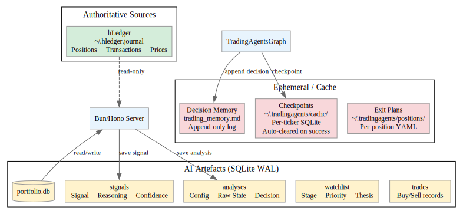

# TradingAgents Architecture

> **Purpose:** Single source of truth for system shape, data flow, and component relationships.
> When in doubt about where something lives or how it connects — this file.

---

## System Overview

TradingAgents is a **multi-agent LLM trading framework** (`tradingagents` Python package)
with a **web dashboard** (Bun/Hono) that wraps it. The dashboard never modifies the core
framework — communication is via subprocess bridge.



---

## Component Map

### Python Package (`tradingagents/`)

The upstream framework. Specialized LLM agents arranged in a LangGraph workflow.

```
tradingagents/
├── graph/
│   ├── trading_graph.py    ← TradingAgentsGraph: main entry point, .propagate()
│   ├── setup.py            ← Graph construction (nodes + edges)
│   └── checkpointer.py     ← LangGraph SQLite checkpointing
├── agents/
│   ├── schemas.py          ← Pydantic models for structured output
│   ├── utils/
│   │   ├── agent_utils.py  ← Helper functions
│   │   └── agent_states.py ← Agent state definitions
│   └── [agent dirs]        ← Individual agent prompts and tool definitions
├── default_config.py       ← DEFAULT_CONFIG dict (all keys + defaults)
└── __init__.py
```

**Workflow stages (fixed order):**
1. **Analyst Team** — Market, News, Fundamentals, Social (user selects 1-4)
2. **Research Team** — Bull vs Bear debate + Judge/Manager synthesis
3. **Trader** — Composes analyst+research reports into trading plan
4. **Risk Management** — Aggressive/Conservative/Neutral debate
5. **Portfolio Manager** — Final Buy/Sell/Hold decision



### CLI (`cli/`)

Typer-based interactive CLI. Handles user prompts, Rich display, report saving.

```
cli/
├── main.py                 ← `tradingagents analyze` entry point
├── config.py               ← Config helpers
├── models.py               ← Pydantic models (AnalystType enum, etc.)
├── utils.py                ← Prompt/input helpers
├── announcements.py        ← Remote announcement fetching
└── stats_handler.py        ← LLM/tool call callback handler
```

### Dashboard Server (`server/`)

Bun/Hono web server. 11 tabs, 12 API route groups, ~2400 lines total. TEST_MODE=1 uses test_portfolio.db with isolated data and a visual amber banner.

```
server/
├── index.tsx               ← Entry: route wiring, DB lifecycle, graceful shutdown
│
├── lib/
│   ├── db.ts               ← DatabaseFactory: WAL singleton, schema loader, migration helper
│   ├── schema.sql          ← 5 tables: positions, trades, signals, watchlist, analyses
│   ├── hledger.ts          ← hLedger subprocess wrapper (balance, prices, register)
│   ├── markdown.ts         ← Server-side MD rendering (marked + sanitizer)
│   ├── positions.ts        ← Exit plan helpers (load plans, compute exit status)
│   ├── governance.ts       ← Risk rules engine (max position %, sector cap, etc.)
│   ├── benchmark.ts        │   Portfolio vs. benchmark (3m/6m/1y alpha)
│   └── feedback.ts         │   Signal accuracy tracking, post-mortems
│
├── routes/                 ← 11 route modules
│   ├── portfolio.ts        │   Positions CRUD (GET/POST/DELETE)
│   ├── analysis.ts         │   SSE /analyze endpoint — spawns Python, streams events
│   ├── signals.ts          │   Signal history API
│   ├── prices.ts           │   Current price via yfinance subprocess
│   ├── analyses.ts         │   Past analyses listing, rendered reports, LLM summarisation
│   ├── holdings.ts         │   hLedger balance → JSON
│   ├── exits.ts            │   Position exit helpers
│   ├── prospects.ts        │   Watchlist pipeline (CRUD + stage management)
│   ├── governance.ts       │   Risk rules evaluation
│   ├── benchmark.ts        │   Benchmark comparison
│   └── feedback.ts         │   Signal accuracy, post-mortem CRUD
│
├── views/                  ← 11 .tsx views (Hono JSX SSR)
│   ├── layout.tsx          │   Shell: tab nav, header, HTMX wiring
│   ├── portfolio.tsx       │   Positions table + add form
│   ├── analysis.tsx        │   Analysis form, SSE progress, position context banner
│   ├── signals.tsx         │   Signal table + Datatype timeline
│   ├── history.tsx         │   Past analyses list → rendered markdown + summary cards
│   ├── holdings.tsx        │   hLedger holdings with live prices
│   ├── exits.tsx           │   Exit dashboard (stops, targets, thesis status)
│   ├── prospects.tsx       │   Watchlist pipeline by stage
│   ├── governance.tsx      │   Risk rules + violations
│   ├── benchmark.tsx       │   Portfolio vs. benchmark chart
│   ├── feedback.tsx        │   Signal accuracy + post-mortems
│   ├── datatype-test.tsx   │   Font test page
│   ├── intelligence.tsx    │   Portfolio Intelligence view
│   └── partials/           │   HTMX swap fragments
│
└── static/
    ├── style.css           │   Dashboard styles + signal color classes + Datatype
    ├── favicon.svg
    └── fonts/
        └── Datatype.woff2  │   Variable font (GSUB: calt + liga)
```

---

## Route Table

### Pages (JSX SSR)

| Route | View | Description |
|-------|------|-------------|
| `GET /` | Layout + PortfolioView | Dashboard home (portfolio tab) |
| `GET /portfolio` | PortfolioView | Positions tab (HTMX partial if HX-Request) |
| `GET /intelligence` | IntelligenceView | Portfolio Intelligence (GBP, hledger cash + live prices) |
| `GET /analyze` | AnalysisView | Run analysis tab |
| `GET /signals` | SignalsView | Signal history + timeline |
| `GET /history` | HistoryView | Past analyses with summary cards |
| `GET /holdings` | HoldingsView | hLedger holdings (GBP-converted via live FX) |
| `GET /exits` | ExitsView | Exit dashboard |
| `GET /prospects` | ProspectsView | Watchlist pipeline |
| `GET /governance` | GovernanceView | Risk rules |
| `GET /benchmark` | BenchmarkView | Benchmark comparison |
| `GET /feedback` | FeedbackView | Signal accuracy + post-mortems |
| `GET /workflow` | WorkflowView | Position lifecycle Kanban (hledger-gated) |
| `GET /test/datatype` | DatatypeTestView | Font test page |

### API Routes

| Route | Method | Handler | Returns |
|-------|--------|---------|---------|
| `/api/positions` | GET | List all positions | JSON array |
| `/api/positions` | POST | Create position | JSON |
| `/api/positions/:id` | DELETE | Close/remove position | JSON |
| `/api/positions/exits` | GET/POST | Exit management | JSON |
| `/api/portfolio/summary` | GET | Live P&L (GBP) for all open positions | JSON |
| `/api/portfolio/intelligence` | GET | Unified view: hledger cash + live positions + allocation + governance | JSON |
| `/api/analyze` | POST | Trigger analysis | SSE stream |
| `/api/signals` | GET | Signal history (filterable) | JSON array |
| `/api/signals/table` | GET | Signals + price history for sparklines | JSON array |
| `/api/signals/:ticker` | GET | Signal timeline per ticker | JSON array |
| `/api/prices/:ticker` | GET | Current price (yfinance) | JSON |
| `/api/analyses` | GET | Past analyses list | JSON array |
| `/api/analyses/:ticker/:date` | GET | Rendered analysis report | HTML/JSON |
| `/api/analyses/:ticker/:date/explain` | POST | LLM summarisation | JSON |
| `/api/holdings` | GET | hLedger balances (GBP-converted) | JSON |
| `/api/prospects` | GET/POST/DELETE | Watchlist pipeline CRUD | JSON |
| `/api/governance` | GET | Risk rules + violations | JSON |
| `/api/benchmark` | GET | Portfolio vs. benchmark | JSON |
| `/api/feedback` | GET | Accuracy + post-mortems | JSON |
| `/api/feedback/with-positions` | GET | Signals correlated with position P&L | JSON |
| `/api/workflow` | GET | Position lifecycle Kanban | JSON |
| `/api/health` | GET | Server health check | JSON |

---

## SSE Event Schema

Events flow from `scripts/analyze_stream.py` stdout → Bun SSE → browser.

```typescript
// Line format: {"event": string, "data": {...}}

type SSEEvent =
  | { event: "start";         data: { ticker: string; date: string; position_context?: string } }
  | { event: "agent_report";  data: { agent: string; content: string } }
  | { event: "debate_round";  data: { round: number; data: string } }
  | { event: "decision";      data: { signal: string; reasoning: string; confidence: number } }
  | { event: "complete";      data: { ticker: string } }
  | { event: "error";         data: { message: string; traceback?: string } };
```

The Bun server reads each line from the subprocess stdout, parses it as JSON,
and forwards it as an SSE event to the connected browser client.

---

## Persistence Layers



### SQLite (`portfolio.db` / `test_portfolio.db`)

WAL mode, singleton via `DatabaseFactory`. Schema in `server/lib/schema.sql`.

**Positions are deprecated in SQLite** — hledger is the authoritative source for what you own.
The `positions` table is kept for AI artefacts (signals, analyses, watchlist) only.
Set `TEST_MODE=1` to use `test_portfolio.db` instead of `portfolio.db`.

| Table | Purpose | Written by |
|-------|---------|-----------|
| `positions` | Seed data only — deprecated | Bun API routes (historical) |
| `trades` | Trade history (buy/sell records) | Bun API routes |
| `signals` | AI signal history (signal, reasoning, confidence) | Auto-saved after analysis |
| `watchlist` | Prospect pipeline + watchlist (stage, priority, thesis) | Bun API routes |
| `analyses` | Full analysis output (config, raw state, decision) | Auto-saved after analysis |
| `positions_archive` | Archive of non-test positions (before hledger migration) | Migration script |
| `signals_archive` | Archive of non-test signals (before hledger migration) | Migration script |

### hLedger (`~/.hledger.journal`)

Single source of truth for accounts + transactions. **Read-only** from dashboard perspective.

- Price file: `P 2026-05-02 TKA.DE €8.45` entries
- All operations via `just hl*` commands or `server/lib/hledger.ts` subprocess wrapper

### Decision Memory (`~/.tradingagents/memory/trading_memory.md`)

Append-only log maintained by the `tradingagents` package. Each completed run appends
its decision + reflection. Injected into future prompts for same ticker.

- Override path: `TRADINGAGENTS_MEMORY_LOG_PATH`
- Format: `[DATE | TICKER | SIGNAL | RETURN | ALPHA | CONFIDENCE]` + DECISION + REFLECTION

### Checkpoints (`~/.tradingagents/cache/checkpoints/<TICKER>.db`)

LangGraph SQLite checkpoints for crash recovery. Opt-in via `--checkpoint` flag.
Auto-cleared on successful completion.

### Exit Plans (`~/.tradingagents/positions/<platform>/<TICKER>.yaml`)

Per-position YAML files (platform subdirectory convention). Key fields: `platform:`,
`entry_price`, `invalidation` (stop loss), `targets`, `time_stop`. Used by the Exits
dashboard and Workflow Kanban. Route key: `${ticker}::${platform}`.

### Analysis Summaries (cache)

LLM-generated summaries cached as `summary_<ticker>_<date>.json` alongside log files
in `~/.tradingagents/logs/<TICKER>/<DATE>/`.

---

## Environment Variables

| Variable | Default | Used by |
|----------|---------|---------|
| `TA_DASHBOARD_PORT` | `3000` | `server/index.tsx` (canonical) |
| `PORT` | `3000` | `server/index.tsx` (fallback, for platform deploys like Render/Heroku) |
| `PORTFOLIO_DB` | `./portfolio.db` | `server/index.tsx` |
| `TRADINGAGENTS_MEMORY_LOG_PATH` | `~/.tradingagents/memory/trading_memory.md` | `tradingagents` package |
| `TRADINGAGENTS_CACHE_DIR` | `~/.tradingagents/cache` | `tradingagents` package |
| `HLEDGER_FILE` | `~/.hledger.journal` | `server/lib/hledger.ts`, Justfile |
| `TEST_MODE` | `0` | Set to `1` to use `test_portfolio.db` (isolated test environment) |
| `TEST_PORTFOLIO_DB` | `./test_portfolio.db` | Path to test SQLite DB |
| `OPENAI_API_KEY` | — | LLM provider |
| `GOOGLE_API_KEY` | — | LLM provider |
| `ANTHROPIC_API_KEY` | — | LLM provider |
| `OPENROUTER_API_KEY` | — | LLM provider (recommended) |
| `ALPHA_VANTAGE_API_KEY` | — | Data vendor (optional) |

LLM provider keys are loaded via `dotenv` in both the CLI (`cli/main.py`) and
the analysis script (`scripts/analyze_stream.py`). The Bun server loads `.env`
for the summarisation endpoint (`server/routes/analyses.ts`).

---

## Data Flow: Analysis Request


---

## Technology Stack

### Python (tradingagents package + CLI)

| Dependency | Purpose |
|------------|---------|
| `langgraph` | Agent workflow orchestration |
| `langchain-*` | LLM abstractions (openai, google, anthropic) |
| `typer` | CLI framework |
| `rich` | Terminal UI (CLI only, not in analyze_stream.py) |
| `yfinance` | Market data source |
| `pandas`, `stockstats` | Technical indicators |
| `langgraph-checkpoint-sqlite` | Checkpoint resume |
| `python-dotenv` | Environment variable loading |

### Bun/Hono (dashboard)

| Dependency | Purpose |
|------------|---------|
| `hono` | Web framework (Bun native) |
| `bun:sqlite` | SQLite bindings (WAL, singleton) |
| `marked` | Markdown → HTML rendering |
| `dotenv` | .env loading for summarisation endpoint |

### Frontend

| Technology | Purpose |
|------------|---------|
| HTMX 2.0 | Client-side interactivity (no JS framework) |
| Hono JSX | Server-side HTML rendering (.tsx) |
| Datatype variable font | Chart ligatures (sparklines, bars, pies) |
| Minimal CSS | Dashboard layout, signal color classes |

---

## Key Patterns

### `pageOrPartial()` — Dual-mode views

```typescript
function pageOrPartial(c: Context, view: JSX.Element): Response {
  const isHtmx = c.req.header("HX-Request") === "true";
  return c.html(isHtmx ? view : <Layout>{view}</Layout>);
}
```

Routes serving both full pages and HTMX partials use this helper. If the request
comes from HTMX (`HX-Request: true`), return just the view. Otherwise wrap in layout.

### `DatabaseFactory` — Singleton with enforced pragmas

```typescript
DatabaseFactory.connect("./portfolio.db");  // Call once at startup
const db = DatabaseFactory.get();           // Get instance everywhere
// On shutdown:
DatabaseFactory.close();  // Runs PRAGMA optimize + checkpoints WAL
```

Never `new Database()` directly. The factory enforces WAL mode, busy timeout,
foreign keys, and synchronous settings.

### Position Context Injection — Wrap, don't fork

The dashboard injects position context into TradingAgents by writing a synthetic
entry to the memory log **before** running the analysis. The `TradingAgentsGraph`
reads this as "past context" for the ticker. No modification to the core package.

### Error Response Structure

```typescript
{
  error: "short message",
  detail: "technical details",
  hint: "what the user should do"
}
```

All API errors follow this structure. Never return a bare string or stack trace
to the client.

---

## Not Done / Known Gaps

- [ ] `TA_DASHBOARD_PORT` env var not yet wired in `server/index.tsx` (currently uses `process.env.PORT`, not `process.env.TA_DASHBOARD_PORT`)
- [ ] Port constant `3000` should be exported from a config module, not inline in `index.tsx`
- [ ] Prices route is a stub (no yfinance subprocess implementation)
- [ ] No authentication or access control on the dashboard
- [ ] No error boundary for Python subprocess failures in the UI
- [ ] `datatype.tsx` JSX helper created but unused — inline JS is simpler
- [ ] Analysis tab shows raw event list, not rendered markdown
- [ ] No timeout handling for analyses exceeding 4 minutes
- [ ] Watchlist stage migration UI incomplete

---

*Last updated: 2026-05-03 | Version: 0.2.4*
