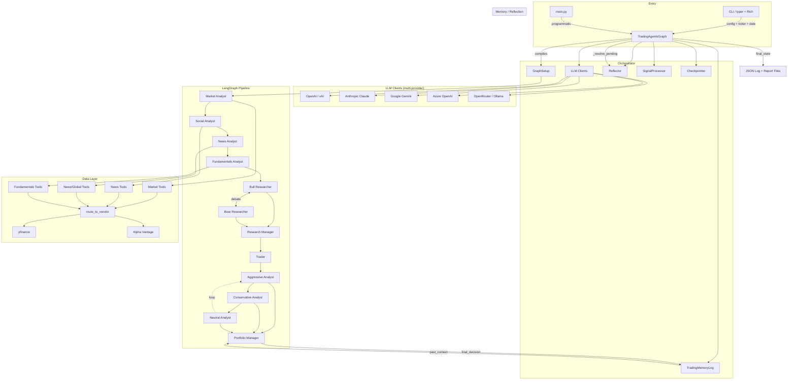

# TradingAgents Architecture

> Multi-Agent LLM Financial Trading Framework — 1329 symbols, 2153 relationships, 60 execution flows

## Overview

TradingAgents is a LangGraph-based multi-agent system that chains 12 specialized LLM agents through a structured trading analysis pipeline. A user supplies a ticker symbol and date; the framework orchestrates a 5-phase workflow — analyst research, bull/bear debate, transaction planning, risk analysis, and portfolio management — producing a final **Buy/Overweight/Hold/Underweight/Sell** decision backed by natural-language reasoning at every step.

## High-Level Architecture

```
┌──────────────┐     ┌─────────────────────────────────────────────────┐
│   CLI / API  │────▶│           TradingAgentsGraph                    │
│  (typer/Rich)│     │  (orchestrator + lifecycle + checkpointing)     │
└──────────────┘     └────────────┬────────────────────────────────────┘
                                  │ compiles & invokes
                                  ▼
┌─────────────────────────────────────────────────────────────────────┐
│                     LangGraph StateGraph                            │
│                                                                     │
│  Phase 1                 Phase 2             Phase 3                │
│  ┌──────────────┐    ┌──────────────┐    ┌──────────────┐           │
│  │  Analysts    │───▶│  Researchers  │───▶│    Trader    │           │
│  │  (1-4 agents)│    │  (Bull/Bear)  │    │ (structured) │           │
│  └──────────────┘    └──────┬───────┘    └──────┬───────┘           │
│                             │                    │                   │
│                      ┌──────▼───────┐            │                   │
│                      │   Research   │◀───────────┘                   │
│                      │   Manager    │                                │
│                      │  (structured)│                                │
│                      └──────────────┘                                │
│                                                                     │
│  Phase 4                              Phase 5                       │
│  ┌──────────────────────────┐    ┌──────────────────┐               │
│  │  Risk Analysts (Debate)  │───▶│    Portfolio     │               │
│  │  Aggressive/Neutral/     │    │     Manager      │               │
│  │  Conservative            │    │   (structured)   │               │
│  └──────────────────────────┘    └────────┬─────────┘               │
│                                           │                         │
└───────────────────────────────────────────┼─────────────────────────┘
                                            ▼
                                   Final Decision
                              (Buy/Overweight/Hold/
                               Underweight/Sell)
```

## Functional Areas (Knowledge Graph Clusters)

| Cluster | Cohesion | Symbol Count | Description |
|---------|----------|--------------|-------------|
| **Graph** | 1.0 | 16 | Orchestrator — `TradingAgentsGraph`, `GraphSetup`, checkpointer, reflector, signal processor |
| **Analysts** | 0.97 | 11 | Agent factory functions (4 analysts, 2 researchers, 2 managers, 1 trader, utility helpers) |
| **Tests** | 0.95–1.0 | 27 | `pytest` suite: checkpoint resume, model validation, signal processing, structured output |
| **LLM Clients** | 1.0 | 28 | Multi-provider LLM abstraction (OpenAI, Anthropic, Google, Azure, OpenRouter, Ollama) |
| **Dataflows** | 0.67–0.95 | 41 | Vendor-routed data layer (yfinance + Alpha Vantage), stock stats, fundamentals, news |
| **CLI** | 1.0 | 9 | Interactive terminal UI with model selection, live progress, and report saving |
| **Scripts** | 0.71 | 7 | `smoke_structured_output.py` — structured output validation |

## Key Execution Flows

### 1. Main Pipeline (`propagate → _run_graph`)

```
TradingAgentsGraph.propagate(ticker, date)
  ├── _resolve_pending_entries()          # resolve outcomes from prior runs
  ├── [checkpointer setup if enabled]      # SqliteSaver for crash-resume
  └── _run_graph()
        ├── Propagator.create_initial_state()   # build AgentState
        ├── graph.stream(state)                 # execute LangGraph workflow
        ├── _log_state()                        # save JSON log to disk
        ├── MemoryLog.store_decision()          # queue for deferred reflection
        └── process_signal()                    # extract rating from PM output
```

### 2. Agent Workflow (Graph Nodes)

```
START → [Analyst 1] → ... → [Analyst N]
  → Bull Researcher ⇄ Bear Researcher (debate loop)
  → Research Manager (structured: ResearchPlan)
  → Trader (structured: TraderProposal)
  → Aggressive → Conservative → Neutral (risk debate loop)
  → Portfolio Manager (structured: PortfolioDecision)
  → END
```

Each analyst node has a companion `ToolNode` for data retrieval (stock data, indicators, fundamentals, news). A `Msg Clear` node between analysts resets the message list for Anthropic compatibility.

### 3. Data Tool Routing

```
Agent tool call (e.g., get_fundamentals)
  → route_to_vendor("get_fundamentals", ...)
      → get_category_for_method() → "fundamental_data"
      → get_vendor() → reads config["data_vendors"]
      → VENDOR_METHODS dispatch → yfinance or alpha_vantage
      with fallback chain on rate-limit errors
```

### 4. Deferred Reflection (Phase B)

```
On next same-ticker run:
  _resolve_pending_entries(ticker)
    ├── Get pending entries from TradingMemoryLog (JSON file)
    ├── _fetch_returns() → yfinance historical prices
    ├── Reflector.reflect_on_final_decision() → 2-4 sentence prose
    └── batch_update_with_outcomes() → atomically write reflections
  → Past reflections injected into Portfolio Manager prompt as "lessons"
```

### 5. Structured Output Decision Chain

Three agents produce typed Pydantic output via `with_structured_output()`:

| Agent | Schema | Fields |
|-------|--------|--------|
| Research Manager | `ResearchPlan` | recommendation, rationale, strategic_actions |
| Trader | `TraderProposal` | action, reasoning, entry_price, stop_loss, position_sizing |
| Portfolio Manager | `PortfolioDecision` | rating, executive_summary, investment_thesis, price_target, time_horizon |

Fallback: `invoke_structured_or_freetext()` degrades gracefully to free-text when the provider doesn't support native structured output.

## Agent Inventory

| Agent | LLM Tier | Prompt Style | Tools | Output |
|-------|----------|-------------|-------|--------|
| Market Analyst | quick | ChatPromptTemplate + tools | get_stock_data, get_indicators | `market_report` |
| Social Media Analyst | quick | ChatPromptTemplate + tools | get_news | `sentiment_report` |
| News Analyst | quick | ChatPromptTemplate + tools | get_news, get_global_news | `news_report` |
| Fundamentals Analyst | quick | ChatPromptTemplate + tools | get_fundamentals, get_balance_sheet, get_cashflow, get_income_statement | `fundamentals_report` |
| Bull Researcher | quick | inline f-string | none (reads reports) | debate argument |
| Bear Researcher | quick | inline f-string | none (reads reports) | debate argument |
| Research Manager | **deep** | inline f-string (structured) | none | `investment_plan` |
| Trader | quick | message list (structured) | none | `trader_investment_plan` |
| Aggressive Debator | quick | inline f-string | none (reads reports) | risk argument |
| Conservative Debator | quick | inline f-string | none (reads reports) | risk argument |
| Neutral Debator | quick | inline f-string | none (reads reports) | risk argument |
| Portfolio Manager | **deep** | inline f-string (structured) | none | `final_trade_decision` |
| Reflector | quick | message list | none | 2-4 sentence reflection |

**LLM Tiers:**
- `quick_thinking_llm` — analysts, researchers, debaters, trader (throughput-sensitive)
- `deep_thinking_llm` — Research Manager, Portfolio Manager (quality-sensitive synthesis)

## Data Layer

```
Agent Tool Interface (tradingagents/agents/utils/*_tools.py)
        │
        ▼
   route_to_vendor()  ◀── config["data_vendors"]
        │
   ┌────┴────┐
   ▼         ▼
yfinance   alpha_vantage
   │         │
   ▼         ▼
 yfinance   Alpha Vantage
  Python      REST API
  library     (API key)
```

**Vendor categories:**
- `core_stock_apis` — OHLCV price data
- `technical_indicators` — SMA, EMA, MACD, RSI, Bollinger, ATR, VWMA
- `fundamental_data` — company overview, balance sheet, cash flow, income statement
- `news_data` — company news, global news, insider transactions

## Prompt Architecture

All prompts are defined inline in agent factory functions. Extracted to `tradingagents/agent_prompts.json` for configuration. Three styles:

1. **ChatPromptTemplate + partial()** — 4 analyst agents, uses LangChain's template system with bound tools
2. **Inline f-string** — 6 debate/research agents + 2 managers, interpolates state variables directly
3. **Message list** — Trader + Reflector, list of `{role, content}` dicts

Shared fragments factored out: base analyst system message, language instruction, instrument context, markdown table suffix.

## Configuration

```
tradingagents/default_config.py  ← defaults
tradingagents/dataflows/config.py ← runtime get/set/init
cli/main.py                      ← user selections overlay defaults
```

Key config keys: `llm_provider`, `deep_think_llm`, `quick_think_llm`, `backend_url`, `max_debate_rounds`, `max_risk_discuss_rounds`, `data_vendors`, `output_language`, `checkpoint_enabled`, provider-specific thinking configs.

## Directory Map

```
TradingAgents/
├── main.py                          # programmatic entry point example
├── cli/                             # interactive terminal UI (typer + rich)
│   ├── main.py                      # CLI app, 8-step wizard, Live display
│   ├── utils.py                     # model selection, ticker validation
│   ├── models.py                    # AnalystType enum
│   ├── stats_handler.py             # LLM/tool call stats tracking
│   └── announcements.py             # fetch + display announcements
├── tradingagents/
│   ├── agents/
│   │   ├── analysts/                # 4 analyst factory functions
│   │   ├── researchers/             # bull/bear debate agents
│   │   ├── managers/                # research + portfolio managers
│   │   ├── trader/                  # transaction proposal agent
│   │   ├── risk_mgmt/               # aggressive/conservative/neutral debaters
│   │   ├── utils/                   # tools, memory log, rating parser, structured output
│   │   └── schemas.py               # Pydantic models (ResearchPlan, TraderProposal, PortfolioDecision)
│   ├── graph/
│   │   ├── trading_graph.py         # TradingAgentsGraph orchestrator
│   │   ├── setup.py                 # GraphSetup: compiles LangGraph StateGraph
│   │   ├── conditional_logic.py     # debate round limits, edge routing
│   │   ├── reflection.py            # Reflector: deferred outcome reflection
│   │   ├── signal_processing.py     # SignalProcessor: parse rating from PM output
│   │   ├── propagation.py           # Propagator: initial state + graph args
│   │   └── checkpointer.py          # SqliteSaver checkpoint/resume
│   ├── llm_clients/                 # multi-provider LLM abstraction
│   │   ├── factory.py               # create_llm_client() dispatcher
│   │   ├── base_client.py           # BaseLLMClient: validate, normalize
│   │   ├── openai_client.py         # OpenAI / xAI / OpenRouter
│   │   ├── anthropic_client.py      # Anthropic Claude
│   │   ├── google_client.py         # Google Gemini
│   │   ├── azure_client.py          # Azure OpenAI
│   │   ├── model_catalog.py         # known model lists per provider
│   │   └── validators.py            # model validation helpers
│   └── dataflows/
│       ├── interface.py             # vendor routing (yfinance / alpha_vantage)
│       ├── config.py                # runtime config get/set
│       ├── y_finance.py             # yfinance data source
│       ├── yfinance_news.py         # yfinance news source
│       ├── stockstats_utils.py      # technical indicators via stockstats
│       └── alpha_vantage/           # Alpha Vantage REST API source
├── tests/                           # pytest suite
├── scripts/                         # smoke tests for structured output
└── docker-compose.yml               # Docker Compose (app + optional Ollama)
```

## Mermaid Architecture Diagram



## Technology Stack

| Layer | Technology |
|-------|-----------|
| Agent Framework | LangGraph (`StateGraph`, `ToolNode`, `SqliteSaver`) |
| LLM Providers | OpenAI, Anthropic Claude, Google Gemini, Azure OpenAI, OpenRouter, Ollama |
| Prompt Templates | LangChain `ChatPromptTemplate` + custom f-strings |
| Structured Output | Pydantic v2 models + provider-native `with_structured_output()` |
| Data Vendors | yfinance (default), Alpha Vantage REST API (optional) |
| Financial Indicators | stockstats (pandas-based technical analysis) |
| CLI Framework | typer (commands) + rich (live TUI, markdown rendering) |
| Configuration | Python dict (no YAML/TOML config file) |
| Testing | pytest with markers: unit, integration, smoke |
| Containerization | Docker + docker-compose (with optional Ollama profile) |
| Memory | JSON file-based trading log with atomic batch writes |
| Checkpointing | LangGraph's `SqliteSaver` for crash-resume |

## Data Flow Summary

```
User Input (ticker, date, config)
  → TradingAgentsGraph.__init__()
    → create_llm_client() ×2 (quick + deep)
    → create tool nodes
    → GraphSetup.setup_graph() compiles StateGraph
  → propagate(ticker, date)
    → resolve pending outcomes (reflection)
    → create initial AgentState
    → graph.stream() through 5-phase pipeline
    → each agent node: construct prompt → LLM call → extract output
    → log state to JSON
    → store decision for future reflection
    → process_signal() extract rating
  → Return (final_state, rating)
```
