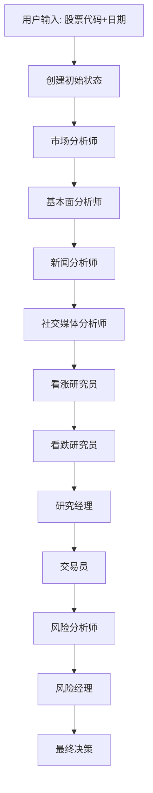
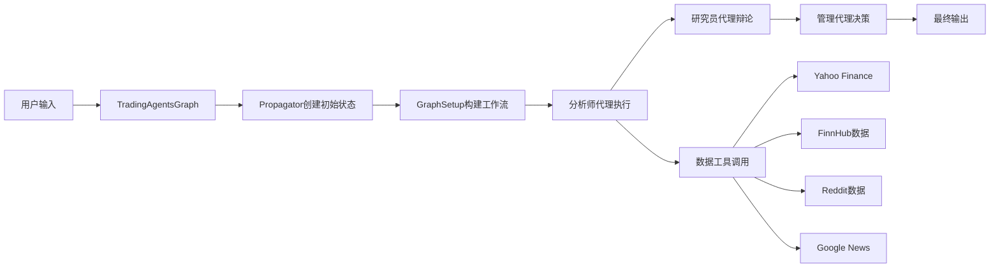

# TradingAgents 核心架构与逻辑指南

## 📋 项目概述

TradingAgents是一个基于多代理大语言模型的金融交易分析框架，模拟真实交易公司的运作模式。通过多个专门的AI代理协作，从不同维度分析市场数据，最终形成综合的交易决策建议。

## 🏗️ 整体架构

### 核心设计理念

TradingAgents采用**多代理协作**的设计模式，每个代理都有明确的角色定位和职责分工：

```
┌─────────────────────────────────────────────────────────────┐
│                    TradingAgents 架构图                      │
├─────────────────────────────────────────────────────────────┤
│  数据层 (Data Layer)                                        │
│  ┌─────────┬─────────┬─────────┬─────────┬─────────┐        │
│  │Yahoo    │FinnHub  │Reddit   │Google   │技术指标  │        │
│  │Finance  │数据     │数据     │News     │计算     │        │
│  └─────────┴─────────┴─────────┴─────────┴─────────┘        │
├─────────────────────────────────────────────────────────────┤
│  代理层 (Agent Layer)                                       │
│  ┌─────────┬─────────┬─────────┬─────────┬─────────┐        │
│  │市场分析师│基本面分析师│新闻分析师│社交媒体分析师│风险管理  │        │
│  └─────────┴─────────┴─────────┴─────────┴─────────┘        │
│  ┌─────────┬─────────┬─────────┬─────────┬─────────┐        │
│  │看涨研究员│看跌研究员│研究经理  │交易员   │风险经理  │        │
│  └─────────┴─────────┴─────────┴─────────┴─────────┘        │
├─────────────────────────────────────────────────────────────┤
│  协调层 (Coordination Layer)                                │
│  ┌─────────┬─────────┬─────────┬─────────┐                  │
│  │图构建   │状态管理  │条件逻辑  │信号处理  │                  │
│  └─────────┴─────────┴─────────┴─────────┘                  │
├─────────────────────────────────────────────────────────────┤
│  决策层 (Decision Layer)                                    │
│  ┌─────────┬─────────┬─────────┐                            │
│  │辩论机制  │风险评估  │最终决策  │                            │
│  └─────────┴─────────┴─────────┘                            │
└─────────────────────────────────────────────────────────────┘
```

## 🚀 代码入口与执行流程

### 1. 主要入口点

#### 入口1: 直接运行 (main.py)
```python
# 导入核心模块
from tradingagents.graph.trading_graph import TradingAgentsGraph
from tradingagents.default_config import DEFAULT_CONFIG

# 创建配置
config = DEFAULT_CONFIG.copy()
config["llm_provider"] = "qwen"  # 使用国内免费模型

# 初始化交易代理图
ta = TradingAgentsGraph(debug=True, config=config)

# 运行分析
_, decision = ta.propagate("NVDA", "2024-05-10")
```

#### 入口2: 命令行界面 (cli/main.py)
```bash
python -m cli.main
```

### 2. 核心执行流程



## 🔧 核心模块详解

### 1. 图系统 (tradingagents/graph/)

#### TradingAgentsGraph - 主协调器
**文件**: `tradingagents/graph/trading_graph.py`

**核心职责**:
- 初始化所有AI模型和代理
- 协调整个分析流程
- 管理状态传递和结果输出

**关键方法**:
```python
def __init__(self, selected_analysts, debug, config):
    # 初始化AI模型
    # 创建代理节点
    # 设置图结构

def propagate(self, company_name, trade_date):
    # 创建初始状态
    # 执行图流程
    # 返回最终决策
```

#### GraphSetup - 图构建器
**文件**: `tradingagents/graph/setup.py`

**核心职责**:
- 构建LangGraph工作流
- 定义代理之间的连接关系
- 设置条件分支逻辑

**关键组件**:
```python
def setup_graph(self, selected_analysts):
    # 创建分析师节点
    # 创建研究员节点
    # 创建管理节点
    # 定义边连接
    # 设置条件逻辑
```

#### Propagator - 状态传播器
**文件**: `tradingagents/graph/propagation.py`

**核心职责**:
- 创建初始分析状态
- 管理状态在代理间的传递
- 控制递归限制

**关键方法**:
```python
def create_initial_state(self, company_name, trade_date):
    # 初始化状态字典
    # 设置公司信息和交易日期
    # 创建辩论状态

def get_graph_args(self):
    # 返回图执行参数
    # 设置递归限制
```

#### ConditionalLogic - 条件逻辑控制器
**文件**: `tradingagents/graph/conditional_logic.py`

**核心职责**:
- 控制代理间的流程分支
- 决定是否需要工具调用
- 管理辩论轮数

**关键方法**:
```python
def should_continue_market(self, state):
    # 判断市场分析是否需要工具调用

def should_continue_debate(self, state):
    # 判断辩论是否继续
```

### 2. 代理系统 (tradingagents/agents/)

#### 分析师代理 (analysts/)

**市场分析师** (`market_analyst.py`)
- **职责**: 技术分析，计算技术指标
- **工具**: Yahoo Finance数据、技术指标计算
- **输出**: 市场趋势报告

**基本面分析师** (`fundamentals_analyst.py`)
- **职责**: 财务分析，评估公司价值
- **工具**: 财务报表数据、内部交易数据
- **输出**: 基本面分析报告

**新闻分析师** (`news_analyst.py`)
- **职责**: 新闻事件分析，宏观影响评估
- **工具**: Google News、FinnHub新闻
- **输出**: 新闻影响报告

**社交媒体分析师** (`social_media_analyst.py`)
- **职责**: 社交媒体情绪分析
- **工具**: Reddit数据、社交媒体API
- **输出**: 情绪分析报告

#### 研究员代理 (researchers/)

**看涨研究员** (`bull_researcher.py`)
- **职责**: 构建看涨论点，寻找投资机会
- **输入**: 所有分析师报告
- **输出**: 看涨分析报告

**看跌研究员** (`bear_researcher.py`)
- **职责**: 构建看跌论点，识别风险因素
- **输入**: 所有分析师报告
- **输出**: 看跌分析报告

#### 管理代理 (managers/)

**研究经理** (`research_manager.py`)
- **职责**: 综合看涨和看跌观点，形成投资计划
- **输入**: 看涨/看跌研究报告
- **输出**: 综合投资计划

**风险经理** (`risk_manager.py`)
- **职责**: 评估投资风险，调整交易策略
- **输入**: 交易建议、风险分析
- **输出**: 最终交易决策

#### 交易代理 (trader/)

**交易员** (`trader.py`)
- **职责**: 基于研究结果制定具体交易策略
- **输入**: 投资计划、市场分析
- **输出**: 交易建议

### 3. 数据流系统 (tradingagents/dataflows/)

#### 数据接口统一管理 (`interface.py`)
- **职责**: 提供统一的数据访问接口
- **功能**: 封装各种数据源的调用逻辑

#### 具体数据工具
- **`yfin_utils.py`**: Yahoo Finance数据获取
- **`finnhub_utils.py`**: FinnHub数据读取（本地缓存）
- **`reddit_utils.py`**: Reddit数据获取
- **`googlenews_utils.py`**: Google新闻搜索
- **`stockstats_utils.py`**: 技术指标计算

### 4. 状态管理系统

#### AgentState - 主状态
```python
class AgentState(MessagesState):
    company_of_interest: str          # 目标公司
    trade_date: str                   # 交易日期
    investment_debate_state: InvestDebateState  # 投资辩论状态
    risk_debate_state: RiskDebateState          # 风险辩论状态
    market_report: str                # 市场分析报告
    fundamentals_report: str          # 基本面分析报告
    sentiment_report: str             # 情绪分析报告
    news_report: str                  # 新闻分析报告
    investment_plan: str              # 投资计划
    final_trade_decision: str         # 最终交易决策
```

## 🔄 详细执行流程

### 阶段1: 初始化
1. **配置加载**: 读取默认配置，支持自定义配置
2. **模型初始化**: 根据配置初始化AI模型（支持国内外多种模型）
3. **代理创建**: 创建所有需要的代理节点
4. **图构建**: 使用LangGraph构建工作流图

### 阶段2: 数据分析
1. **市场分析师**: 
   - 获取股票价格数据
   - 计算技术指标（RSI、MACD、布林带等）
   - 生成技术分析报告

2. **基本面分析师**:
   - 获取财务报表数据
   - 分析内部交易情况
   - 生成基本面分析报告

3. **新闻分析师**:
   - 搜索相关新闻
   - 分析宏观环境影响
   - 生成新闻影响报告

4. **社交媒体分析师**:
   - 获取社交媒体数据
   - 进行情绪分析
   - 生成情绪分析报告

### 阶段3: 研究辩论
1. **看涨研究员**:
   - 基于所有分析报告
   - 构建看涨论点
   - 寻找投资机会

2. **看跌研究员**:
   - 基于所有分析报告
   - 构建看跌论点
   - 识别风险因素

3. **研究经理**:
   - 综合看涨和看跌观点
   - 形成平衡的投资计划
   - 制定投资策略

### 阶段4: 交易决策
1. **交易员**:
   - 基于投资计划
   - 制定具体交易策略
   - 确定买卖时机和数量

2. **风险分析师**:
   - 评估交易风险
   - 进行压力测试
   - 提供风险建议

3. **风险经理**:
   - 综合所有信息
   - 做出最终交易决策
   - 输出最终建议

## 🛠️ 关键特性

### 1. 多模型支持
- **国外模型**: OpenAI GPT、Anthropic Claude、Google Gemini
- **国内模型**: 通义千问、文心一言、智谱AI、月之暗面Kimi

### 2. 灵活配置
- 可选择不同的分析师组合
- 可调整辩论轮数
- 支持在线/离线数据模式

### 3. 状态管理
- 完整的状态跟踪
- 支持调试模式
- 状态持久化

### 4. 工具集成
- 丰富的金融数据源
- 技术指标计算
- 新闻和社交媒体数据

## 📊 数据流图



## 🔍 调试与监控

### 调试模式
```python
ta = TradingAgentsGraph(debug=True, config=config)
```
- 显示详细的执行过程
- 打印每个代理的输出
- 跟踪状态变化

### 状态日志
- 自动记录每次分析的状态
- 支持状态回放和分析
- 便于问题排查

## 🚨 注意事项

1. **API限制**: 注意各种API的调用限制和费用
2. **数据质量**: 确保数据源的可靠性和时效性
3. **模型选择**: 根据任务复杂度选择合适的模型
4. **风险控制**: 本框架仅用于研究，不构成投资建议

## 📈 扩展性

### 添加新的分析师
1. 在`tradingagents/agents/analysts/`中创建新文件
2. 实现分析师逻辑
3. 在`GraphSetup`中注册新节点

### 添加新的数据源
1. 在`tradingagents/dataflows/`中创建新工具
2. 在`interface.py`中注册新接口
3. 在代理中使用新工具

### 添加新的模型
1. 在`tradingagents/llm_adapters/`中创建适配器
2. 在`TradingAgentsGraph`中添加模型支持
3. 更新配置文件

---

这个指南提供了TradingAgents项目的完整架构和逻辑梳理，帮助开发者深入理解项目的设计思路和实现细节。
