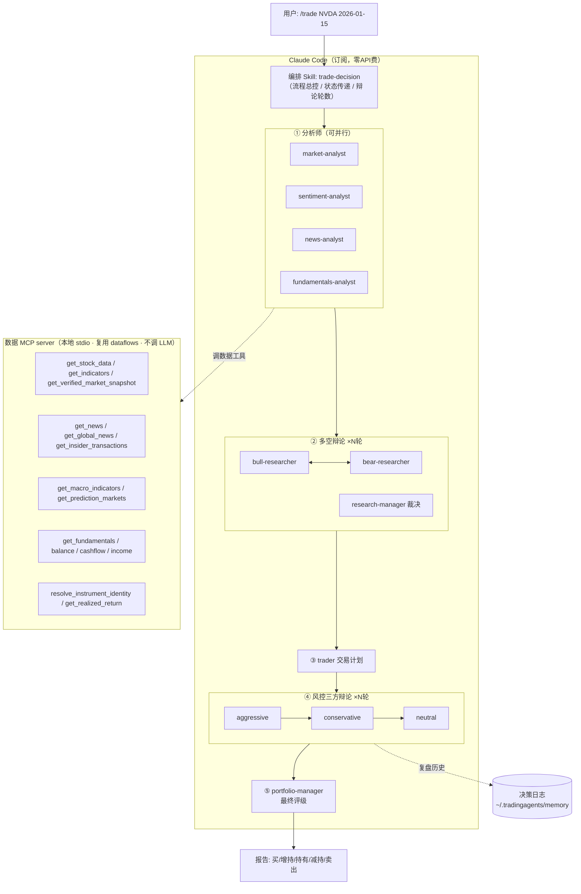

# PLAN：让 Claude Code（订阅驱动）跑完整套 TradingAgents 多智能体流程

> **状态：M1–M5 已实现（2026-06-15）。** 数据 MCP server、12 个角色子代理、
> Workflow 编排、`/trade` 命令、决策日志/复盘均已落地并通过测试（全仓 462 passed，
> ruff 全绿，MCP `✓ Connected`）。用法见 [docs/CLAUDE_CODE.md](docs/CLAUDE_CODE.md)。
> 唯一需用户在**新开的 Claude Code 会话**里完成的是首个实时 `/trade` 运行
> （MCP 在会话启动时加载，需重开会话才会注入这些工具）。
>
> 以下为原始方案记录。
>
> 已确认前提：
> - **运行环境**：Claude Code（本地 CLI/IDE，用 Max 订阅认证，不走 API 计费）。
> - **推理引擎**：全部由 **Claude（订阅）扮演各 agent**，零 LLM API key 花费。
> - **编排方式**：用 **Claude Code Workflow 机制**（确定性脚本，轮数/并行精确可控）。
> - **放置层级**：`.claude/` 放**项目目录**，随仓库走、可提交回滚。`claude mcp add` 用 `--scope project`。
> - **数据 key**：FRED + Alpha Vantage 免费 key 已写入本地 `.env`（已被 .gitignore 忽略，不进 git）。yfinance 仍为默认免 key 主源。

---

## 1. 核心思路（为什么是这个架构）

现状：TradingAgents 内部用厂商 API key 按 token 付费驱动每个 agent（见 [trading_graph.py:82](tradingagents/graph/trading_graph.py#L82) 创建 LLM client）。**只要让它原样运行，就要烧 API 额度。** 订阅不能被普通 Python 当 API endpoint 用。

因此架构翻转，拆成两层：

1. **数据层（Python，几乎零成本）**：把项目现成的数据工具（行情/技术指标/新闻/基本面/宏观/预测市场）暴露成一个**本地 stdio MCP server**。数据源基本免费/免 key，**不调用任何 LLM**。
2. **推理层（Claude 订阅驱动）**：把"分析师 → 多空辩论 → 交易员 → 风控三方辩论 → 组合经理"这条流水线，做成 **Claude Code 的编排 skill + 12 个角色子代理（subagent）**。每个角色的提示词直接从现有 Python prompt 移植，Claude 逐角色扮演。

这样：**全流程在本地 Claude Code 跑通，推理全走订阅，数据获取几乎免费，零 API key 花费。**



---

## 2. 组件设计

### 2.1 数据 MCP server（唯一需要写的 Python）

- 新增 `tradingagents/mcp/data_server.py`，用官方 `mcp` Python SDK 起一个 **stdio** server。
- 启动时 `set_config(DEFAULT_CONFIG)` 初始化 dataflows 配置，然后把现成工具函数包成 MCP tool。复用 [agents/utils/agent_utils.py](tradingagents/agents/utils/agent_utils.py) 里已有的：
  - 行情/技术：`get_stock_data`、`get_indicators`、`get_verified_market_snapshot`
  - 新闻/宏观：`get_news`、`get_global_news`、`get_insider_transactions`、`get_macro_indicators`、`get_prediction_markets`
  - 基本面：`get_fundamentals`、`get_balance_sheet`、`get_cashflow`、`get_income_statement`
  - 身份/复盘：`resolve_instrument_identity`、新增 `get_realized_return(ticker, date)`（复用 [trading_graph.py:224](tradingagents/graph/trading_graph.py#L224) `_fetch_returns` 的 alpha 计算，供复盘用）
- **不含任何 LLM 调用**，只取数据返回。
- 入口脚本：`pyproject.toml` 增 `[project.scripts]` → `tradingagents-data-mcp = "tradingagents.mcp.data_server:main"`，依赖 `mcp` 放进新 extra `[mcp]`。

### 2.2 角色子代理（`.claude/agents/*.md`，提示词移植）

为每个角色建一个 Claude Code 子代理定义（独立上下文 + 系统提示词），提示词从现有 Python 文件**逐字移植**，把 `{变量}` 改成"由编排层在调用时注入的输入"：

| 子代理文件 | 提示词来源 | 可用数据工具 |
|---|---|---|
| `market-analyst.md` | [analysts/market_analyst.py](tradingagents/agents/analysts/market_analyst.py) | get_stock_data / get_indicators / get_verified_market_snapshot |
| `sentiment-analyst.md` | [analysts/sentiment_analyst.py](tradingagents/agents/analysts/sentiment_analyst.py) | get_news |
| `news-analyst.md` | [analysts/news_analyst.py](tradingagents/agents/analysts/news_analyst.py) | get_news / get_global_news / get_insider_transactions / get_macro_indicators / get_prediction_markets |
| `fundamentals-analyst.md` | [analysts/fundamentals_analyst.py](tradingagents/agents/analysts/fundamentals_analyst.py) | get_fundamentals / balance / cashflow / income |
| `bull-researcher.md` | [researchers/bull_researcher.py](tradingagents/agents/researchers/bull_researcher.py) | （读分析师报告，不调工具） |
| `bear-researcher.md` | [researchers/bear_researcher.py](tradingagents/agents/researchers/bear_researcher.py) | 同上 |
| `research-manager.md` | [managers/research_manager.py](tradingagents/agents/managers/research_manager.py) | 同上 |
| `trader.md` | [trader/trader.py](tradingagents/agents/trader/trader.py) | 同上 |
| `risk-aggressive.md` | [risk_mgmt/aggressive_debator.py](tradingagents/agents/risk_mgmt/aggressive_debator.py) | 同上 |
| `risk-conservative.md` | [risk_mgmt/conservative_debator.py](tradingagents/agents/risk_mgmt/conservative_debator.py) | 同上 |
| `risk-neutral.md` | [risk_mgmt/neutral_debator.py](tradingagents/agents/risk_mgmt/neutral_debator.py) | 同上 |
| `portfolio-manager.md` | [managers/portfolio_manager.py](tradingagents/agents/managers/portfolio_manager.py) | 读决策日志做复盘 |

### 2.3 编排 Workflow（`.claude/workflows/trade-decision.js`）

用 Claude Code 的 **Workflow 机制**做确定性编排：一段 JS 脚本用 `agent()` / `parallel()` / `pipeline()` 精确控制角色调用顺序、辩论轮数与并行，比 skill 软编排更稳、可复现。脚本逻辑沿用现有图结构：

1. **解析输入**（`args`）：`ticker`、`trade_date`、可选 `analysts` 子集、`debate_rounds`（默认 1）、`risk_rounds`（默认 1）、`asset_type`（缺省按 ticker 自动判定）。
2. **身份锚定**：先调 `resolve_instrument_identity`，把真实公司身份注入后续所有角色（避免幻觉，对应现有 [trading_graph.py:309](tradingagents/graph/trading_graph.py#L309)）。
3. **① 分析师阶段**：用 `parallel()` 并发跑选中的分析师子代理（`agentType` 指定角色），各自调数据 MCP 工具，产出结构化报告（`schema`）。
4. **② 多空辩论**：JS `for` 循环精确控制 `2×debate_rounds` 次 bull/bear 往返（对应 [conditional_logic.py:52](tradingagents/graph/conditional_logic.py#L52)），逐轮把 `history` 传入下一个 `agent()`；研究经理裁决产出 `investment_plan`。
5. **③ 交易员**：基于上述产出交易计划。
6. **④ 风控三方辩论**：循环控制 aggressive→conservative→neutral 轮转，共 `3×risk_rounds` 次（对应 [conditional_logic.py:63](tradingagents/graph/conditional_logic.py#L63)）。
7. **⑤ 组合经理**：注入历史决策复盘，输出五档评级（Buy/Overweight/Hold/Underweight/Sell）+ 最终决策报告。
8. **落盘**：把完整状态写到 `~/.tradingagents/logs/<ticker>/...`、决策追加到 `~/.tradingagents/memory/trading_memory.md`（沿用现有目录约定）。

> 角色提示词放在 `.claude/agents/*.md`（见 2.2），Workflow 用 `agent(prompt, {agentType: "bull-researcher", schema, ...})` 调起对应子代理并在调用间传递中间结果。各角色用 `schema`（JSON Schema）约束结构化输出，便于脚本可靠地拼装下一步输入。状态全在 JS 脚本里管理，**不改动核心 Python**。

用户触发：一个 slash 命令 `.claude/commands/trade.md`（`/trade NVDA 2026-01-15`）→ 调用 `Workflow({name: "trade-decision", args: {...}})`。

### 2.4 记忆与复盘（保留原特性）

- **决策日志**：每次产出追加到 `trading_memory.md`，组合经理阶段读取同 ticker 历史 + 跨 ticker 教训注入提示词（对应现有 [memory.py](tradingagents/agents/utils/memory.py)）。
- **已实现收益复盘**：新一轮同 ticker 运行时，用 MCP 的 `get_realized_return` 取出上次决策后的真实涨跌与对基准的 alpha，由 Claude 生成一段复盘反思写回日志（推理走订阅，取数走 MCP）。

---

## 3. 文件清单

**新增（推理层，纯配置/JS/Markdown，无需付费）**
- `.claude/workflows/trade-decision.js`（确定性编排脚本，核心）
- `.claude/agents/*.md`（12 个角色，见 2.2）
- `.claude/commands/trade.md`（slash 命令 `/trade <TICKER> <DATE>`）

**新增（数据层，唯一 Python）**
- `tradingagents/mcp/__init__.py`、`tradingagents/mcp/data_server.py`
- `tests/test_data_mcp_server.py`（mock 数据源，验证工具契约）

**修改**
- [pyproject.toml](pyproject.toml)：加 `[mcp]` extra + `tradingagents-data-mcp` 脚本入口。

**不动**
- 整个 `tradingagents/graph/`、`tradingagents/agents/`、`tradingagents/llm_clients/` 核心逻辑保持原样（仍可用作付费 API 模式的备用入口）。数据层只是**复用**其工具函数，不修改它们。

---

## 4. 成本说明（数据 key）

| 数据源 | 是否要 key | 成本 |
|---|---|---|
| yfinance（行情/技术/基本面/新闻默认源） | 免 key | 免费 |
| Polymarket（预测市场） | 免 key | 免费 |
| Reddit / StockTwits（情绪） | 基本免 key | 免费 |
| FRED（宏观） | 免费 key | 免费（注册即得） |
| Alpha Vantage（可选备用源） | 免费 key | 免费额度内 |

→ **数据层本质零成本**；推理层走 Claude 订阅。整套**不需要任何付费 API key**。

---

## 5. 用量与限制提醒

- 一次完整分析 = 12 个角色 + 多轮辩论，会消耗较多 **Claude 订阅用量**（受 Max 套餐的速率/窗口限制约束）。建议：
  - 默认 `debate_rounds=1 / risk_rounds=1`（与项目默认一致），需要更深时再调高。
  - 支持只选部分分析师（如只跑基本面+新闻）来省用量。
  - 把分析师阶段并行化以缩短墙钟时间，但注意可能撞速率限制。

---

## 6. 安装与使用（Claude Code）

1. 安装数据层：`pip install ".[mcp]"`
2. 注册本地 MCP（免费数据 key 通过 env 传入，可选）：
   ```bash
   claude mcp add --transport stdio tradingagents-data \
     --env FRED_API_KEY=... --env ALPHA_VANTAGE_API_KEY=... \
     -- tradingagents-data-mcp
   ```
3. 把 `.claude/`（skills + agents + commands）放进项目（或用户级 `~/.claude/`）。
4. 在 Claude Code 里：`/trade NVDA 2026-01-15`，或直接说"用 trade-decision 分析 NVDA 在 2026-01-15 的决策，只用基本面和新闻分析师"。
5. Claude 会：调数据工具取数 → 逐角色推理与辩论 → 产出五档评级报告，并落盘到 `~/.tradingagents/`。

---

## 7. 里程碑

- **M1 数据 MCP server**：包好工具、`claude mcp add --scope project` 后能在对话里取到行情/新闻/基本面/宏观。
- **M2 角色子代理**：移植 12 个 prompt 为 `.claude/agents/*.md` 子代理，单独可调通。
- **M3 编排 Workflow（核心）**：写 `trade-decision.js`，用 `parallel()`/循环串起分析师→辩论→交易员→风控→PM，产出完整报告。先固定 1 轮辩论跑通，再支持多轮与分析师子集；配 `/trade` slash 命令。
- **M4 记忆与复盘**：决策日志读写 + `get_realized_return` 复盘。
- **M5 打磨**：并行/用量优化、文档（README 增节 + `docs/CLAUDE_CODE.md`）。

---

## 8. 风险与对策

| 风险 | 对策 |
|---|---|
| 订阅用量/速率限制被打满 | 默认低轮数、支持分析师子集；Workflow 默认并发上限已约束 fan-out |
| 角色间状态传递出错 | 各角色用 `schema` 结构化输出，脚本可靠拼装；先用最小流程（1 轮）跑通，字段对齐现有 `agent_states` |
| 移植 prompt 时丢了变量注入 | 严格对照原 Python f-string，逐字段映射 |
| 数据工具依赖全局 config | server 启动即 `set_config`，与 CLI 行为一致 |
| 子代理能否调 MCP 工具 | Claude Code 子代理支持继承/配置工具访问；M2 阶段先验证单个分析师能调通再铺开 |
| Workflow 需显式 opt-in | 通过 `/trade` slash 命令封装调用，对用户透明 |

---

## 9. 决策点（已全部确认）

1. **编排方式** ✅ Claude Code **Workflow 机制**（确定性）。
2. **一期范围** ✅ 按 **M1→M2→M3** 端到端出一份报告；M4、M5 后置。
3. **数据源** ✅ yfinance 为默认主源；FRED + Alpha Vantage 免费 key 已接（写入 `.env`）。
4. **`.claude/` 放置层级** ✅ 放**项目目录**，MCP 用 `--scope project`。

> 决策已齐，可进入实现阶段，从 **M1 数据 MCP server** 开始。
