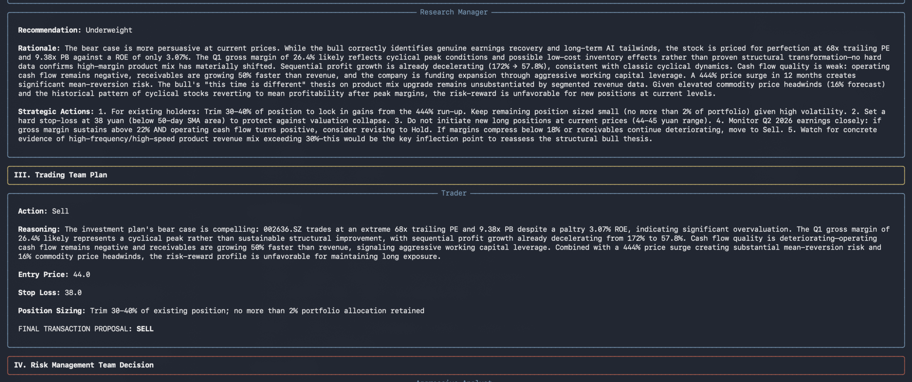
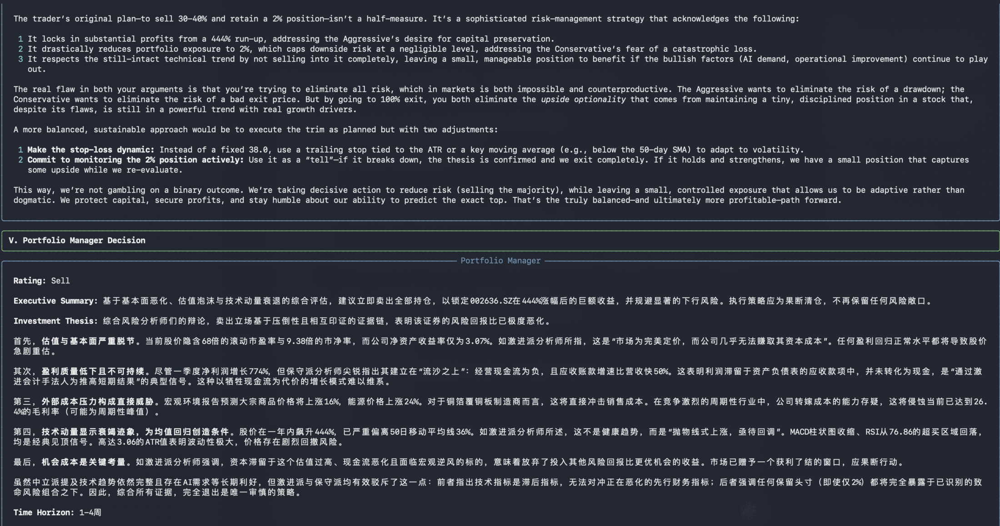

# TradingAgents Fork

这是基于 [TauricResearch/TradingAgents](https://github.com/TauricResearch/TradingAgents) 维护的个人 fork。当前版本重点面向本地研究和实验使用，保留原项目的多智能体交易分析框架，并补充了多 LLM provider、A 股数据适配、Tavily 新闻检索、DeepSeek 兼容性和更完整的本地测试。

> 本项目仅用于研究和工程实验，不构成任何投资、交易或理财建议。

## 本 Fork 的主要改动

- 增强多 LLM provider 支持：OpenAI、Anthropic、Google、DeepSeek、MiMo、Qwen、GLM、xAI、OpenRouter、Ollama、Azure。
- DeepSeek 默认使用 `deepseek-v4-flash` / `deepseek-v4-pro`，并处理 V4 thinking/tool-call 兼容问题。
- 增加中国 A 股代码规范化和数据补充逻辑，例如 `002636` 自动识别为 `002636.SZ`。
- A 股数据优先使用 Yahoo Finance，必要时补充 Tushare、AkShare、Alpha Vantage 等来源。
- 新闻数据支持 Tavily，适合补充中文或实时新闻检索。
- 新增数据 fallback、DeepSeek client、Tavily news、A 股数据等测试。
- 默认将本地运行报告、日志、缓存和私密配置排除在 Git 之外。

## 安装

```bash
git clone git@github.com:david188888/TradingAgents.git
cd TradingAgents

conda create -n tradingagents python=3.13
conda activate tradingagents

pip install -e .
```

如果需要 Tushare / AkShare 作为 A 股补充数据源：

```bash
pip install -e ".[china]"
```

## API Key 配置

推荐复制示例文件后填写本地密钥：

```bash
cp .env.example .env
```

常用配置项：

```bash
OPENAI_API_KEY=
GOOGLE_API_KEY=
ANTHROPIC_API_KEY=
XAI_API_KEY=
DEEPSEEK_API_KEY=
MIMO_API_KEY=
DASHSCOPE_API_KEY=
ZAI_API_KEY=
OPENROUTER_API_KEY=

ALPHA_VANTAGE_API_KEY=
TAVILY_API_KEY=
TUSHARE_TOKEN=
TUSHARE_API_KEY=
```

`.env`、`.env.*`、日志、运行报告和缓存默认不会提交到 Git。

## CLI 使用

启动交互式 CLI：

```bash
tradingagents
```

也可以直接从源码运行：

```bash
python -m cli.main
```

CLI 会引导选择 ticker、分析日期、LLM provider、模型、研究深度、输出语言、是否启用 checkpoint 等参数。





## 中国 A 股支持

CLI 会自动规范化常见 A 股输入：

```text
002636      -> 002636.SZ
002636SZ    -> 002636.SZ
600519      -> 600519.SS
688981.SH   -> 688981.SS
```

默认数据策略：

- 市场和基础数据优先尝试 Yahoo Finance。
- 对 A 股，如果 Yahoo Finance 返回空数据或覆盖不足，会继续尝试 Tushare、AkShare、Alpha Vantage 等 fallback。
- 新闻数据可使用 Tavily，适合补充更及时的公开信息。

## Python 调用

```python
from tradingagents.graph.trading_graph import TradingAgentsGraph
from tradingagents.default_config import DEFAULT_CONFIG

config = DEFAULT_CONFIG.copy()
config["llm_provider"] = "deepseek"
config["quick_think_llm"] = "deepseek-v4-flash"
config["deep_think_llm"] = "deepseek-v4-pro"
config["output_language"] = "Chinese"

ta = TradingAgentsGraph(debug=True, config=config)
_, decision = ta.propagate("002636.SZ", "2026-05-01")
print(decision)
```

更多配置见 `tradingagents/default_config.py`。

## 持久化和 Checkpoint

TradingAgents 会把已完成运行的决策记录写入本地 memory log，默认路径：

```text
~/.tradingagents/memory/trading_memory.md
```

可以通过环境变量覆盖：

```bash
TRADINGAGENTS_MEMORY_LOG_PATH=/path/to/trading_memory.md
```

运行时可开启 checkpoint，便于中断后恢复：

```bash
tradingagents analyze --checkpoint
tradingagents analyze --clear-checkpoints
```

checkpoint 和数据缓存默认位于：

```text
~/.tradingagents/cache/
```

可通过 `TRADINGAGENTS_CACHE_DIR` 覆盖。

## 测试

推荐在 `tradingagents` conda 环境中运行：

```bash
conda run -n tradingagents python -m pytest tests -q
```

当前本地验证结果：

```text
127 passed, 45 subtests passed
```

## 与上游保持同步

本仓库推荐使用两个 remote：

```bash
git remote -v
# origin   git@github.com:david188888/TradingAgents.git
# upstream https://github.com/TauricResearch/TradingAgents.git
```

同步上游到自己的 fork：

```bash
git fetch upstream
git switch main
git pull --ff-only origin main
git merge upstream/main
conda run -n tradingagents python -m pytest tests -q
git push origin main
```

如果只是想先看上游有哪些新提交：

```bash
git fetch upstream
git log --oneline --decorate --graph main..upstream/main
```

## 解决同步冲突

合并上游时如果出现冲突：

```bash
git status
```

打开冲突文件，处理 Git 标出的两段内容。冲突块大致长这样：

```text
< < < < < < < HEAD
当前 fork 中的内容
= = = = = = =
上游合入的内容
> > > > > > > upstream/main
```

处理完成后：

```bash
git add <resolved-files>
git merge --continue
conda run -n tradingagents python -m pytest tests -q
git push origin main
```

如果冲突较复杂，优先保留本 fork 中已经验证过的本地功能，再把上游修复逐项合入。不要在没有测试的情况下直接强推 `main`。

## Upstream Project

本项目来源于 [TauricResearch/TradingAgents](https://github.com/TauricResearch/TradingAgents)。感谢原项目作者和社区提供的多智能体金融分析框架、论文和开源实现。本 fork 的修改主要服务于个人研究、A 股数据适配和本地实验流程。
