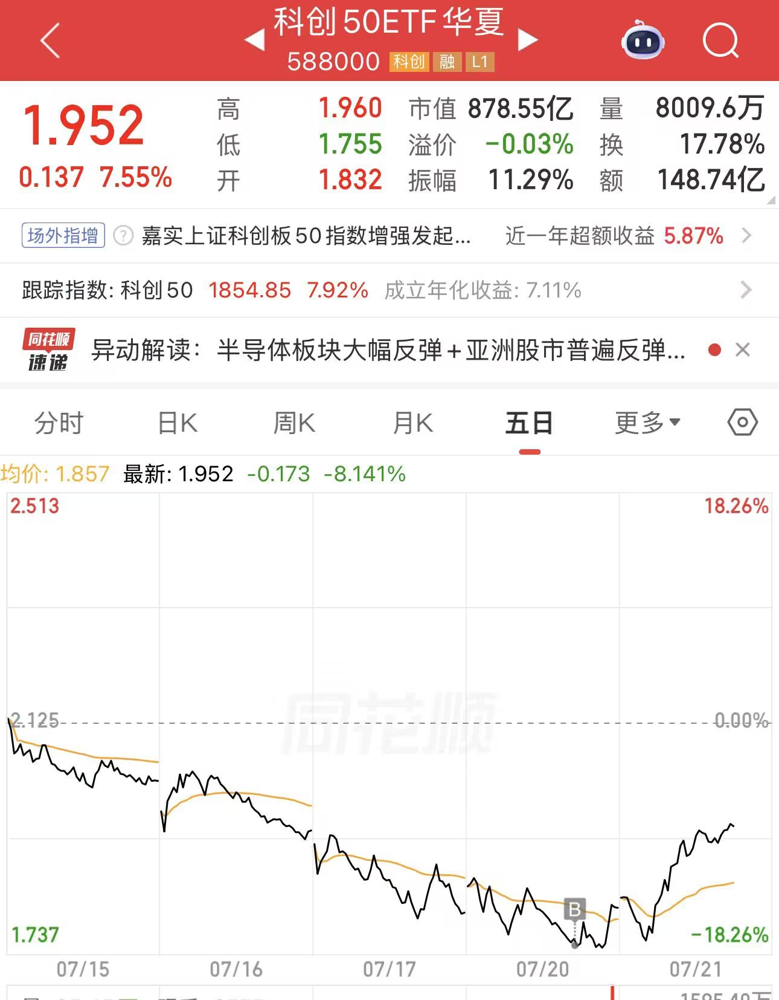
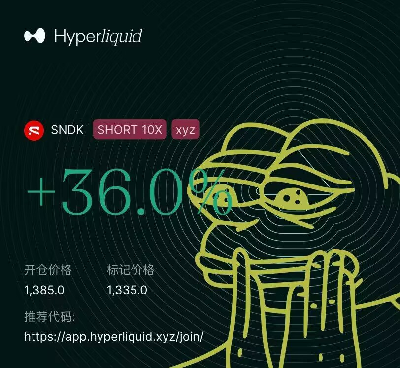
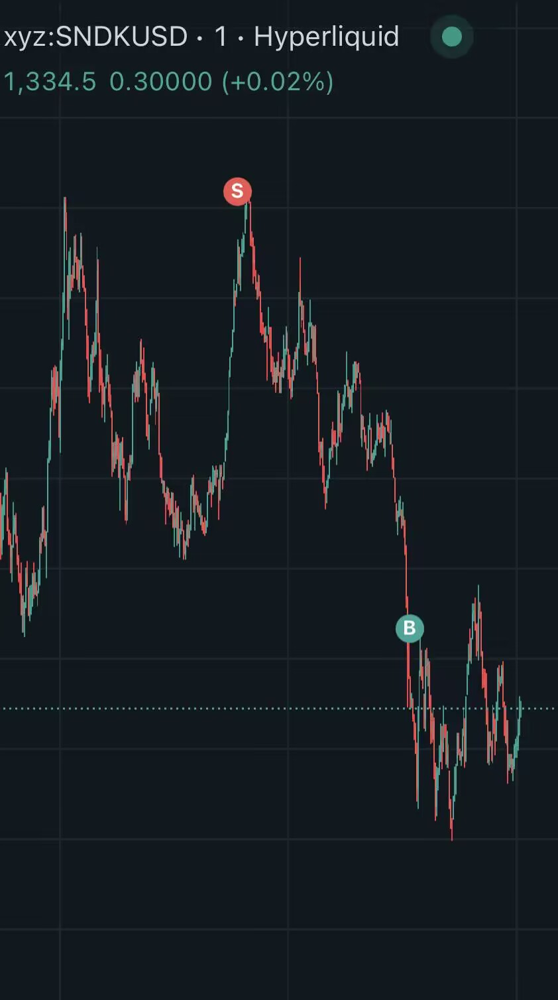

# A股智能仓位管理

把传统的 `Buy / Sell / Hold` 升级为真正面向持仓者的仓位决策：
**加仓、轻度加仓、不动、减仓、退出**。

本项目基于 [TauricResearch/TradingAgents](https://github.com/TauricResearch/TradingAgents)
进行 A 股本地化改造，加入中国市场数据、交易制度、风险约束，以及
“估值—趋势—仓位”三维决策矩阵。

## 核心能力

- A 股代码识别与沪深京市场数据路由
- 东方财富优先、腾讯财经备用的数据层
- A 股指数、政策与市场环境分析
- T+1、100 股买入单位、涨跌停和费用约束
- 结合成本价、持仓比例、可用现金和最大回撤管理仓位
- 多智能体研究与确定性决策矩阵双路径

## 快速安装

```powershell
git clone https://github.com/cjck944084735-dot/a-share-tradingagents.git
Set-Location .\a-share-tradingagents
powershell.exe -NoProfile -ExecutionPolicy Bypass -File .\scripts\install-skill.ps1
```

安装脚本会创建 Python 虚拟环境、安装框架，并把 Skill 复制到当前用户的
Codex Skills 目录。随后在 `framework\.env` 中配置你自己的模型密钥。

使用示例：

```text
使用 $a-share-tradingagents，结合我的成本价 3.65 元、仓位 8%、
最大可接受回撤 10%，分析海油发展应该加仓、减仓还是不动。
```

## 效果展示



<p>
  
  
</p>

效果图仅用于展示分析与交易场景，不代表未来收益，也不构成投资建议。

## 开源说明

本项目是 TradingAgents 的衍生改造版本，保留 Apache License 2.0。
上游项目及本仓库中的商标、平台截图分别归其权利人所有。修改范围与说明见
[NOTICE](NOTICE)。
