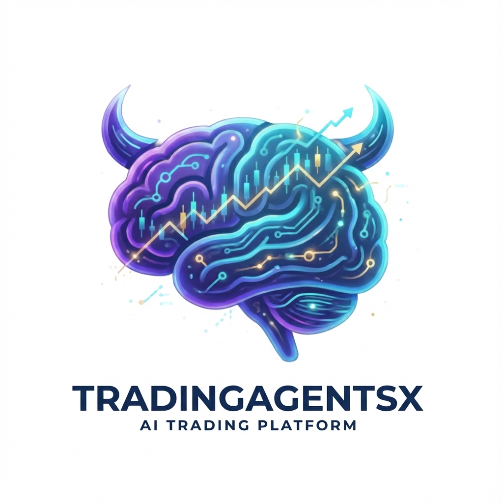

# TradingAgentsX - Multi-Agent Intelligent Trading Analysis System

<div align="center">



**AI Stock Trading Analysis Platform Based on LangGraph, Combining Multiple Professional AI Agents for Collaborative Decision-Making**

[](https://github.com/MarkLo127/TradingAgentsX)
[](https://www.python.org/)
[](https://nextjs.org/)
[](https://fastapi.tiangolo.com/)
[](LICENSE)

[](https://tradingagentsx.up.railway.app)

</div>

---

## 📖 Introduction

**TradingAgentsX** is an advanced multi-agent AI trading analysis system that simulates the operational model of real-world trading firms. Through LangGraph orchestration of multiple specialized AI agents (Analysts, Researchers, Traders, Risk Managers), the system can analyze stock markets from different perspectives and produce high-quality trading decisions through structured debate and collaborative processes.

> 💡 **Tribute to the Original**: This project is based on improvements and extensions of [TauricResearch/TradingAgents](https://github.com/TauricResearch/TradingAgents).

### 🎯 Core Features

| Feature                        | Description                                                                           |
| ------------------------------ | ------------------------------------------------------------------------------------- |
| 🤖 **Multi-Agent Collaboration** | 12 specialized AI agents (Analysts, Researchers, Traders, Risk Managers) work together |
| 🌐 **Multi-Model Support**       | OpenAI, Anthropic, Gemini, Grok, DeepSeek, Qwen and other LLM providers               |
| 🔒 **Google OAuth Login**        | Cloud sync API settings and historical reports, supporting multi-device sync          |
| 📊 **US & Taiwan Stock Support** | Full support for US stocks (Yahoo Finance) and Taiwan stocks (FinMind) data           |
| 🔑 **BYOK Mode**                 | Users bring their own API keys, encrypted frontend storage, ensuring privacy          |
| 🛡️ **Security Protection**       | Rate Limiting, Security Headers, API Key masking                                      |
| 📱 **Responsive Design**         | Supports desktop and mobile browsers                                                  |
| 🐳 **Docker Deployment**         | One-click startup for frontend and backend services                                   |
| 🧠 **Embeddings Model Choice**   | Supports sentence-transformers (local free) or OpenAI embeddings                      |

---

## 🏗️ System Architecture

```
TradingAgentsX/
├── frontend/                   # Next.js Frontend Application
│   ├── app/                    # App Router Pages
│   │   ├── page.tsx            # Home Page
│   │   ├── layout.tsx          # Root Layout
│   │   ├── globals.css         # Global Styles
│   │   ├── analysis/           # Analysis Feature Pages
│   │   ├── history/            # History Reports Page
│   │   ├── auth/               # OAuth Callback
│   │   └── api/                # API Routes (config, auth)
│   ├── components/             # React Components
│   │   ├── AgentFlowDiagram.tsx    # Agent Flow Diagram Component
│   │   ├── PendingTaskRecovery.tsx # Task Recovery Component
│   │   ├── analysis/           # Analysis Related Components
│   │   ├── auth/               # Login Buttons
│   │   ├── layout/             # Header, Footer
│   │   ├── settings/           # API Settings Dialog
│   │   ├── shared/             # Shared Components
│   │   ├── theme/              # Theme Related Components
│   │   └── ui/                 # shadcn/ui Base Components (16)
│   ├── contexts/               # React Context (Auth State)
│   ├── hooks/                  # Custom Hooks
│   └── lib/                    # Utility Functions
│       ├── api.ts              # API Calls
│       ├── api-helpers.ts      # API Helper Functions
│       ├── crypto.ts           # Encryption Utils
│       ├── storage.ts          # Local Storage
│       ├── reports-db.ts       # IndexedDB Report Storage
│       ├── pending-task.ts     # Pending Task Management
│       ├── user-api.ts         # User API
│       ├── types.ts            # TypeScript Type Definitions
│       └── utils.ts            # General Utilities
│
├── backend/                    # FastAPI Backend Service
│   ├── __main__.py             # Application Entry Point
│   └── app/
│       ├── main.py             # FastAPI App (Middleware, Routes)
│       ├── api/                # API Routes
│       │   ├── routes.py       # Analysis API
│       │   ├── auth.py         # Google OAuth
│       │   ├── user.py         # User Data Sync
│       │   └── dependencies.py # Dependency Injection
│       ├── core/               # Core Configuration
│       ├── db/                 # PostgreSQL Database
│       ├── models/             # Pydantic Models
│       └── services/           # Business Logic
│           ├── trading_service.py  # Trading Analysis Service
│           ├── task_manager.py     # Task Manager
│           ├── pdf_generator.py    # PDF Report Generator
│           ├── price_service.py    # Stock Price Data Service
│           ├── download_service.py # Download Service
│           ├── redis_client.py     # Redis Client
│           └── auth_utils.py       # Auth Utilities
│
└── tradingagents/              # Core AI Agent Package
    ├── agents/                 # AI Agent Definitions
    │   ├── analysts/           # Analyst Team
    │   │   ├── market_analyst.py       # Market Analyst
    │   │   ├── news_analyst.py         # News Analyst
    │   │   ├── social_media_analyst.py # Social Media Analyst
    │   │   └── fundamentals_analyst.py # Fundamentals Analyst
    │   ├── researchers/        # Research Team
    │   │   ├── bull_researcher.py      # Bull Researcher
    │   │   └── bear_researcher.py      # Bear Researcher
    │   ├── trader/             # Trader
    │   │   └── trader.py               # Trader Agent
    │   ├── risk_mgmt/          # Risk Management Team
    │   │   ├── aggresive_debator.py    # Aggressive Analyst
    │   │   ├── conservative_debator.py # Conservative Analyst
    │   │   └── neutral_debator.py      # Neutral Analyst
    │   ├── managers/           # Manager Decision Makers
    │   │   ├── research_manager.py     # Research Manager
    │   │   └── risk_manager.py         # Risk Manager
    │   └── utils/              # Agent Utility Functions
    ├── dataflows/              # Data Fetching and Processing
    │   ├── interface.py        # Unified Data Interface
    │   ├── config.py           # Dataflow Configuration
    │   ├── y_finance.py        # Yahoo Finance Data
    │   ├── yfin_utils.py       # Yahoo Finance Utils
    │   ├── alpha_vantage*.py   # Alpha Vantage Series (5)
    │   ├── finmind*.py         # FinMind Taiwan Stock Data (6)
    │   ├── google.py           # Google Search
    │   ├── googlenews_utils.py # Google News Utils
    │   ├── reddit_utils.py     # Reddit Data
    │   ├── openai.py           # OpenAI Embeddings
    │   └── retry_utils.py      # Retry Utils
    ├── graph/                  # LangGraph Workflow
    │   ├── trading_graph.py    # Trading Analysis Graph
    │   ├── setup.py            # Graph Setup
    │   ├── propagation.py      # State Propagation
    │   ├── reflection.py       # Reflection Mechanism
    │   ├── conditional_logic.py    # Conditional Logic
    │   └── signal_processing.py    # Signal Processing
    ├── utils/                  # General Utils
    └── default_config.py       # Default Configuration
```

---

## 🤖 AI Agent Team

### Analyst Team (4 Members)

| Agent                  | Responsibility        | Output                                                |
| ---------------------- | --------------------- | ----------------------------------------------------- |
| Market Analyst         | Technical Analysis    | RSI, MACD, Bollinger Bands, Support/Resistance Levels |
| Social Media Analyst   | Sentiment Assessment  | Reddit/Twitter Sentiment Indicators, Investor Confidence |
| News Analyst           | News Analysis         | Latest News Summaries, Event Impact Assessment        |
| Fundamentals Analyst   | Financial Analysis    | Financial Reports, P/E, P/B, Profitability            |

### Research Team (3 Members)

| Agent            | Responsibility                                   |
| ---------------- | ------------------------------------------------ |
| Bull Researcher  | Bullish Argument, Upside Catalyst Analysis       |
| Bear Researcher  | Bearish Argument, Downside Risk Warnings         |
| Research Manager | Comprehensive Decision from Bull and Bear Views  |

### Trading & Risk Team (5 Members)

| Agent              | Responsibility                               |
| ------------------ | -------------------------------------------- |
| Trader             | Integrates All Reports, Formulates Trade Plan |
| Aggressive Analyst | High-Risk High-Return Strategy Analysis      |
| Conservative Analyst | Stable Conservative Strategy & Risk Control |
| Neutral Analyst    | Neutral Balanced Strategy Assessment         |
| Risk Manager       | Comprehensive Risk Management & Final Advice |

---

## 🚀 Quick Start

### Prerequisites

- **Python** 3.10+
- **Node.js** 18.x+ or **Bun** 1.x+

### Required API Keys

| API                         | Purpose              | Apply URL                                            |
| --------------------------- | -------------------- | ---------------------------------------------------- |
| OpenAI                      | GPT Models           | https://platform.openai.com/api-keys                 |
| Alpha Vantage (Optional)    | US Stock Fundamentals | https://www.alphavantage.co/support/#api-key         |
| FinMind (Optional)          | Taiwan Stock Data    | https://finmindtrade.com/                            |

### Installation Steps

#### 1️⃣ Clone the Project

```bash
git clone https://github.com/MarkLo127/TradingAgentsX.git
cd TradingAgentsX
```

#### 2️⃣ Backend Setup

```bash
# Create virtual environment
conda create -n tradingagents python=3.13
conda activate tradingagents

# Install dependencies
pip install -e .
pip install -r backend/requirements.txt

# Configure environment variables
cp .env.example .env
# Edit .env and fill in API keys

# Start backend
python -m backend
```

Backend Services:

- API: http://localhost:8000
- Swagger Docs: http://localhost:8000/docs

#### 3️⃣ Frontend Setup

```bash
# Install dependencies (run from project root)
bun install --cwd frontend

# Start development server
bun run --cwd frontend dev
```

Frontend Application: http://localhost:3000

---

## 🐳 Docker Deployment

```bash
# Configure environment variables
cp .env.example .env

# Start services
docker compose up -d --build

# View logs
docker compose logs -f

# Stop services
docker compose down -v
```

Service Ports:

- Backend: http://localhost:8000
- Frontend: http://localhost:3000

---

## 🔒 Security Features

### Local Development vs Production Environment

| Feature            | Local Development (localhost) | Production (Railway, etc.)   |
| ------------------ | ----------------------------- | ---------------------------- |
| Google Login       | Optional                      | Recommended                  |
| Auto Data Cleanup  | ❌ No cleanup                 | ✅ Clears when leaving if not logged in |
| PostgreSQL         | Optional                      | Required                     |
| API Settings Storage | Permanently retained        | Cloud sync after login       |
| History Reports Storage | Permanently retained     | Cloud sync after login       |

### Frontend Security

- **API Key Encrypted Storage** - Uses AES-GCM to encrypt sensitive data in localStorage
- **Auto Cleanup (Production Only)** - Automatically clears local data when non-logged-in users leave the page
- **Safari Touch Optimization** - Fixed touch event issues on iOS Safari

### Backend Security

- **Rate Limiting** - 30 requests per minute limit
- **Security Headers** - X-Content-Type-Options, X-Frame-Options, etc.
- **Sensitive Data Masking** - API Keys are automatically masked in logs
- **CORS Configuration** - Restricts cross-origin request sources

### Cloud Sync

- **Google OAuth 2.0** - Secure third-party login
- **JWT Token** - Stateless authentication
- **Cloud Backup** - API settings and history reports sync to server

---

## 📱 User Guide

### 1. Configure API Keys

Click the "Settings" button in the upper right corner and enter your API keys.

### 2. Select Analysis Parameters

- **Market Type**: US Stock / Taiwan Listed / Taiwan OTC
- **Stock Symbol**: e.g., NVDA, 2330
- **Analyst Team**: Select the analysts you need
- **Research Depth**: Shallow (Fast) / Medium / Deep (Detailed)
- **LLM Model**: Quick Think Model + Deep Think Model

### 3. Execute Analysis

Click "Execute Analysis" and wait 1-5 minutes (depending on research depth).

### 4. View Results

- **Trading Decision Summary** - BUY / SELL / HOLD recommendations
- **Stock Price Chart** - Toggle between Line Chart / Candlestick Chart
- **12 Agent Reports** - Click tabs to view detailed analysis

### 5. Save & Download

- **Save Report** - Save to local / cloud
- **Download PDF Report** - Export complete PDF analysis report

### 📄 Sample Report

View a complete PDF analysis report sample:

📥 **[AVGO Broadcom Inc. Analysis Report (2025-12-15)](report/AVGO_Combined_Report_2025-12-15.pdf)**

---

## 🔌 API Documentation

### Health Check

```bash
GET /api/health
```

### Execute Analysis

```bash
POST /api/analyze
Content-Type: application/json

{
  "ticker": "NVDA",
  "market_type": "us",
  "analysis_date": "2024-01-15",
  "research_depth": 2,
  "analysts": ["market", "social", "news", "fundamentals"],
  "quick_think_llm": "gpt-5-mini",
  "deep_think_llm": "claude-sonnet-4-5",
  "quick_think_api_key": "sk-...",
  "deep_think_api_key": "sk-ant-...",
  "embedding_api_key": "sk-...",
  "alpha_vantage_api_key": "..."
}
```

### Query Task Status

```bash
GET /api/task/{task_id}
```

Full Documentation: http://localhost:8000/docs

---

## 🛠️ Tech Stack

### Backend

| Technology           | Purpose                       |
| -------------------- | ----------------------------- |
| FastAPI              | Async Web Framework           |
| LangGraph            | Multi-Agent Workflow Orchestration |
| LangChain            | LLM Application Development   |
| ChromaDB             | Vector Database (Memory System) |
| PostgreSQL           | User Data Storage             |
| SQLAlchemy + asyncpg | Async Database ORM            |
| Pydantic             | Data Validation               |

### Frontend

| Technology   | Purpose                |
| ------------ | ---------------------- |
| Next.js 16   | React Full-Stack Framework |
| TypeScript   | Static Typing          |
| Tailwind CSS | Styling Framework      |
| shadcn/ui    | UI Component Library   |
| Dexie.js     | IndexedDB Wrapper      |
| Recharts     | Data Visualization     |

---

## 📸 Application Screenshots

### Home Page


---

### API Configuration Page


---

### Task Configuration Page


---

### Agent View Selection

**12 Professional Agent Tabs**, click to switch and view different agents' analysis reports:

- **Analyst Team (4)**: Market Analyst, Social Media Analyst, News Analyst, Fundamentals Analyst
- **Research Team (3)**: Bull Researcher, Bear Researcher, Research Manager
- **Trading Team (1)**: Trader
- **Risk Management Team (4)**: Aggressive Analyst, Conservative Analyst, Neutral Analyst, Risk Manager


---

### Stock Price Chart (Candlestick)


---

### Stock Price Chart (Line Chart)


---

### Market Analyst Report


---

### Social Media Analyst Report


---

### News Analyst Report


---

### Fundamentals Analyst Report


---

### Bull Researcher Report


---

### Bear Researcher Report


---

### Research Manager Report


---

### Trader Report


---

### Aggressive Analyst Report


---

### Conservative Analyst Report


---

### Neutral Analyst Report


---

### Risk Manager Report


---

## History Reports (Login Required)


---

## 🙏 Acknowledgements

- [TauricResearch/TradingAgents](https://github.com/TauricResearch/TradingAgents) - Original Project
- [LangChain](https://github.com/langchain-ai/langchain) - LLM Application Framework
- [LangGraph](https://github.com/langchain-ai/langgraph) - Multi-Agent Orchestration
- [FastAPI](https://github.com/tiangolo/fastapi) - Web Framework
- [Next.js](https://github.com/vercel/next.js) - React Framework
- [shadcn/ui](https://github.com/shadcn/ui) - UI Component Library

---

## 📄 License

This project is licensed under the Apache 2.0 License - see the [LICENSE](LICENSE) file for details.
