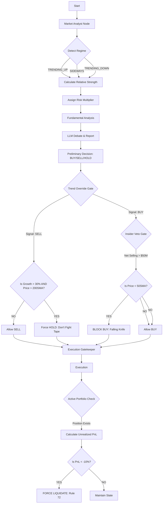

# OPERATIONAL DOCTRINE: THE SURVIVAL-MOMENTUM PROTOCOL

**TO:** All Trading Agents, Analysts, and Portfolio Managers  
**FROM:** System Architect / Risk Control  
**DATE:** January 11, 2026  
**SUBJECT:** OPERATIONAL DOCTRINE: THE SURVIVAL-MOMENTUM PROTOCOL

---

## THE CORE MANDATE

We are not value investors. We are not momentum chasers. **We are Survivalists.**

Our goal is to **capture Alpha during paradigm shifts while guaranteeing survival during regime collapses.** We achieve this by adhering to a rigid hierarchy of logic that prioritizes **Hard Data** over Narrative and **Trend** over Opinion.

---

## I. THE HIERARCHY OF TRUTH

In the event of a conflict between agents or data sources, this hierarchy governs the decision:

1.  **Epistemic Lock (The Frozen Reality):** The data within the `FactLedger` is the start and end of all truth. If the Ledger says price is $150.00, it is $150.00, even if an analyst thinks they "know" a more recent price.
2.  **Hard Code Overrides (The Veto Gates):** Deterministic Python logic (Gatekeeper) overrides all LLM proposals. If Rule 72 (Stop Loss) or the Insider Veto triggers, the LLM's opinion is discarded.
3.  **Mathematical Regime (The Context):** The output of the `RegimeDetector` is the law. If the math says **TRENDING_UP**, the LLM cannot justify "Market Weakness."
4.  **Fundamental Data (The Fuel):** Revenue Growth, FCF Margins, and Insider Activity are static facts in the Ledger.

---

## II. THE MOMENTUM EXCEPTION ("Don't Fight the Tape")

Value traps look cheap; Momentum rockets look expensive. **We do not short innovation.**

### The Rule
Valuation multiples (P/E, P/S) are **irrelevant** if:
1.  The Asset is in a **Confirmed Uptrend** (Price > 200 SMA).
2.  The Asset is in **Hyper-Growth** (Revenue Growth > 30%).
3.  The Market Regime is **Bullish/Momentum**.

### The Consequence
In this state, we **HOLD**. We do not "take profits" because a stock is "too high." We only sell when the Trend breaks or the Growth slows.

---

## III. THE SURVIVAL PRIORITY ("Don't Catch Knives")

When the regime shifts to **VOLATILE** or **TRENDING_DOWN**:

1.  **Valuation Matters Instantly:** 100x P/S is a death sentence in a downtrend.
2.  **Insider Selling is a Siren:** If insiders sell into a downtrend, we exit immediately.

### The Rule
If expected value is negative and the trend is broken, we **liquidate**. We do not "average down." We do not "buy the dip" on broken structural stories.

### Sizing
In **Unknown/Volatile** regimes, position sizing must be reduced to ensure no single failure threatens the portfolio.

---

## IV. THE RELATIVE STRENGTH DOCTRINE

We judge assets not in a vacuum, but against the Tide.

*   If the Market (SPY) is Flat/Choppy and the Asset is Trending Up, this is **Alpha**. We press the advantage.
*   If the Market is Up and the Asset is Flat, this is **Weakness**. We cut the laggard.

---

## VI. THE LEARNING LOOP (Dynamic Parameter Tuning)

We do not just execute; we adapt. The system includes a **Self-Reflection Mechanism** that reviews past performance and tunes internal parameters.

1.  **Reflection:** After every decision, the `Reflector` analyzes the outcome (Returns vs. Logic).
2.  **Tuning:** If the strategy was too slow (lagging) or too fast (whipsawed), the Reflector adjusts core parameters:
    *   `rsi_period`: Lowered for faster reaction in Volatile markets.
    *   `risk_multiplier`: Capped during drawdowns.
    *   `stop_loss_pct`: Tightened if losses exceed projections.
3.  **Persistence:** These "Lessons" are saved to `runtime_config.json` and applied to **All Future Decisions**.

---

## VII. SYSTEM ARCHITECTURE (The Digital Bedrock)

### 1. The Parallel Doctrine ("Fan-Out / Fan-In")
*   **Concept:** Speed is Alpha. We do not wait for News to finish before reading Social Media.
*   **Architecture:** The `Market Analyst` triggers `Social`, `News`, and `Fundamentals` simultaneously. They run in parallel threads.
*   **Safety Protocol:** To prevent "State Contamination" (Race Conditions):
    *   **Subgraphs:** Each analyst runs in an isolated `StateGraph` sandbox. They share NO memory.
    *   **Strict Schemas:** Analysts can only read what they need (`Symbol`, `Date`) and write what they own (`Report`). They CANNOT touch the Portfolio.

### 2. The Risk Star Topology (Parallel Debate)
*   **Concept:** "Round Robin" is dead. We use "Fan-Out".
*   **Architecture:** The Trader broadcasts the plan to `Risky`, `Safe`, and `Neutral` analysts simultaneously.
*   **Synchronization:** A `Risk Sync` node waits for all three to finish before triggering the Judge.
*   **Concurrency Safety:** We use `merge_risk_states` (a reducer) to allow parallel updates to the debate state without race conditions.

### 3. The Epistemic Lock (Frozen Context)
*   **Concept:** Hallucination prevention through data isolation.
*   **Implementation:** Analysts are strictly **FORBIDDEN** from using tools. They receive a read-only snapshot of the `FactLedger`.
*   **Safety:** Every Indicator (SMA, RSI, Regime) is pre-computed in Python. Agents cannot re-calculate or diverge from these values.

### 4. The Institutional Gatekeeper (V2.7 Hardening)
*   **Market Hours:** All trade proposals are blocked outside of NYSE trading hours (9:30 AM - 4:00 PM EST).
*   **Temporal Pulse:** A final price check is performed before execution. If the market has moved >3% since the Ledger was frozen, the trade is aborted to prevent "slippage blindness."
*   **Split Protection:** If price drift exceeds 50%, the system aborts to protect against corporate actions (splits/mergers).

---

## VIII. MENTAL MODELS (The Cognitive Framework)
To prevent "Value Trap" logic in Tech/Platform stocks, the Trader utilizes specific mental models distinct from traditional Value Investing.

### 1. CapEx Distinction (The "Moat" Rule)
*   **Maintenance CapEx:** Spending to keep the lights on (e.g., repairing a factory). This is a **COST**.
*   **Strategic CapEx:** Spending to capture a new platform (e.g., Google building Data Centers for AI). This is **DEFENSE**.
*   **The Rule:** For dominant platforms, massive CapEx during a platform shift is a **BULLISH** signal of durability, not a bearish signal of inefficiency.

### 2. Regulatory Overhang (The "Size" Tax)
*   **Concept:** Big Tech is always under investigation.
*   **The Rule:** Treat Antitrust Risk as a **"Chronic Condition"** (like diabetes). You manage it by reducing position size (Risk Management). You do **NOT** treat it as a "Terminal Disease" (Panic Selling) unless a breakup order is signed and imminent.

---

## V. EXECUTION DISCIPLINE

1.  **Binary Thinking is the Enemy:** Rarely is the answer "Sell 100%" or "Buy 100%." We scale out of risks and scale into strength.
2.  **No Hallucinations:** We do not invent "SG&A explosions" to justify fear. We verify data against the source.
3.  **The Stop Loss:** A Stop Loss is not a suggestion; it is a mechanism of **survival**. It must be respected above all conviction.

---

## SUMMARY

*   We are aggressive when the math supports velocity.
*   We are cowardly when the math signals destruction.
*   We do not have "feelings" about stocks. We have parameters.

**Execute.**

---

# USER MANUAL: LOGIC & RULES

This document details the operational logic of the Survival-Momentum Protocol. It translates the high-level doctrine into specific algorithmic rules, hard-coded overrides, and stress-test scenarios.

This is the "User Manual" for the machine you have built.

## 1. THE RULES (The Logic Engines)
These are the fundamental laws programmed into the `RegimeDetector` and `MarketAnalyst`.

### Rule A: The "Price is Truth" Law
*   **Concept:** Fundamental data (Earnings, P/E) is lagging (past). Price action is leading (future).
*   **The Code Logic:**
    *   **IF** `RegimeDetector` calculates **TRENDING_UP** (based on ADX > 25 + Positive Returns),
    *   **THEN** the system ignores traditional valuation warnings like "Overbought RSI" or "High P/E."
*   **Why:** In a mania, "Overbought" stays overbought for months. Selling early is a failure.

### Rule B: The "Insider Veto" Law
*   **Concept:** Insiders know more than the algorithm.
*   **The Code Logic:**
    *   **IF** Net Insider Activity is **Negative (Selling) > $50M** in the last quarter,
    *   **AND** Stock Price is **Below the 50-day SMA**,
    *   **THEN** Buy signals are **Disabled**.
*   **Why:** Smart money selling into a downtrend is the ultimate "Get Out" signal.

### Rule C: The "Relative Strength" Filter
*   **Concept:** Don't buy a boat that is sinking while the tide is rising.
*   **The Code Logic:**
    *   **IF** SPY (Broad Market) is **TRENDING_UP**,
    *   **BUT** Target Asset is **SIDEWAYS** or **TRENDING_DOWN**,
    *   **THEN** The asset is flagged as **WEAKNESS**.
*   **Action:** The Trader must prefer Leaders (Stocks matching or beating SPY regime) over Laggards.

## 2. THE EXECUTION GATEKEEPER (The Python Veto)
These are the Python functions in `execution_gatekeeper.py` that physically block the LLM from executing a bad decision.

### Override 1: The "Don't Fight the Tape" (The PLTR Fix)
*   **Trigger:** The Analyst LLM tries to **SELL** or **SHORT**.
*   **The Check:**
    1.  Is Price > 200-day Simple Moving Average (SMA)?
    2.  Is Revenue Growth > 30% YoY?
    3.  Is Market Regime **TRENDING_UP** or **BULL**?
*   **The Intervention:** If **ALL TRUE**, the system effectively "slaps the hand" of the Trader.
*   **Result:** Order converted from **SELL** to **HOLD**.
*   **Log Output:** `🛑 TREND OVERRIDE TRIGGERED: Cannot short hyper-growth in uptrend.`

### Override 2: The "Falling Knife" Guard (The Zoom/Peloton Fix)
*   **Trigger:** The Analyst LLM tries to **BUY** the dip.
*   **The Check:**
    1.  Is Price < 200-day SMA? (Downtrend)
    2.  Is Market Regime **VOLATILE** or **TRENDING_DOWN**?
    3.  Is Valuation > 50x P/S?
*   **The Intervention:** If **ALL TRUE**, the system blocks the Buy.
*   **Result:** Order converted from **BUY** to **WAIT**.
*   **Log Output:** `🛑 SAFETY VALVE TRIGGERED: Valuation too high for broken trend.`

## 3. SAMPLE SCENARIOS (Stress Tests)
Here is how the system handles specific market environments compared to a standard "Value" or "Momentum" bot.

### Scenario A: The "Rocket Ship" (e.g., NVIDIA in 2023 / PLTR Now)
*   **The Setup:** Stock is up 200%. P/E ratio is 150x. Everyone on CNBC says it's a bubble.
*   **The Value Investor Bot:** Sells immediately. "Overvalued."
*   **The Human Trader:** Panic sells to lock in profits, then cries as it doubles again.
*   **YOUR SYSTEM:**
    *   **Regime:** Detects **TRENDING_UP** (High Volatility is accepted via Momentum Exception).
    *   **Analyst:** Screams "Valuation Risk!"
    *   **Override:** Checks Growth > 30% + Price > 200SMA.
    *   **Decision:** **HOLD**.
    *   **Outcome:** You ride the bubble until the trend actually breaks.

### Scenario B: The "Tech Crash" (e.g., ZOOM in 2022)
*   **The Setup:** Stock was $500, now $400. P/S is still 80x. Revenue growth slows from 300% to 40%.
*   **The "Dip Buyer" Bot:** Buys. "It's cheap compared to last month!"
*   **YOUR SYSTEM:**
    *   **Regime:** Detects **TRENDING_DOWN** (Price < SMA, ADX High).
    *   **Analyst:** "Fundamentals still look okay, maybe a buy?"
    *   **Override:** Checks Price < 200SMA + Valuation (80x P/S) > Limit.
    *   **Decision:** **SELL / AVOID**.
    *   **Outcome:** You exit at $400 before it goes to $60.

### Scenario C: The "Choppy Market" (e.g., SPY in 2015)
*   **The Setup:** Market is flat. Volatility is low. No clear trend.
*   **The Momentum Bot:** Gets chopped up (Buy high, sell low) repeatedly.
*   **YOUR SYSTEM:**
    *   **Regime:** Detects **SIDEWAYS** or **MEAN_REVERTING**.
    *   **Indicator Selector:** Switches logic. Instead of using breakouts, it uses Bollinger Bands or RSI Mean Reversion.
    *   **Decision:** Buy at Support, Sell at Resistance.
    *   **Outcome:** Capital preservation during noise.

---

## SUMMARY OF DOCTRINE

*   **In Bull Markets:** We trust the Trend. Valuation is ignored.
*   **In Bear Markets:** We trust the Math. Valuation is everything.
*   **In Uncertainty:** We trust Cash.

**This architecture ensures you never miss a bubble, but you never hold the bag when it pops.**

## SYSTEM DECISION FLOW DIAGRAM
The following diagram illustrates the hard-coded logic gates that govern trade execution.

## SCENARIO LOGIC MATRIX
How the system handles specific market conditions:

| Scenario | Market Regime (SPY) | Asset Regime | Insider Action | Hard Gate Triggered | System Decision |
| :--- | :--- | :--- | :--- | :--- | :--- |
| **"The Bubble Riding"** (e.g. NVDA '23) | UPTREND | UPTREND (Price > SMA) | Selling (Profit Taking) | **Trend Override (Anti-Short)** | **HOLD / BUY** (Ignore valuation fears) |
| **"The Falling Knife"** (e.g. ZOOM '22) | DOWNTREND | DOWNTREND (Price < SMA) | Selling (> $50M) | **Insider Veto** | **BLOCK BUY** (Force Wait) |
| **"The Fake Breakout"** (Bear Market Rally) | DOWNTREND | UPTREND (Weak) | Neutral | Relative Strength = 0.8x | **REDUCE SIZE** (Caution) |
| **"The Crash"** (Portfolio Danger) | VOLATILE | VOLATILE | N/A | **Rule 72 (Stop Loss)** | **LIQUIDATE** (PnL < -10%) |
| **"The Boring Chop"** (Accumulation) | SIDEWAYS | SIDEWAYS | Buying | None | **Trade Range** (Buy Support) |

### SCENARIO VISUALIZATION

```mermaid
graph TD
    %% Define Scenarios
    subgraph "Scenario A: The Bubble (PLTR/NVDA)"
    A1[Market: UP] --> A2[Asset: UP]
    A2 --> A3{Valuation High?}
    A3 -- YES --> A4[Analyst: SELL]
    A4 --> A5{Rules Check}
    A5 -- Growth > 30% --> A6[OVERRIDE: FORCE HOLD]
    end

    subgraph "Scenario B: The Falling Knife (ZOOM)"
    B1[Market: DOWN] --> B2[Asset: DOWN]
    B2 --> B3{Insider Action?}
    B3 -- Net Selling > $50M --> B4[VETO: BLOCK BUY]
    end

    subgraph "Scenario C: The Crash (Survival)"
    C1[Active Position] --> C2{Check PnL}
    C2 -- Loss > -10% --> C3[STOP LOSS TRIGGERED]
    C3 --> C4[LIQUIDATE IMMEDIATE]
    end
    
    style A6 fill:#4caf50,stroke:#333,stroke-width:2px
    style B4 fill:#f44336,stroke:#333,stroke-width:2px
    style C4 fill:#f44336,stroke:#333,stroke-width:2px
```

### Scenario Logic Breakdown

*   **Scenario A (The Momentum Exception):**
    *   **The Conflict:** The Analyst sees a high P/E ratio and screams "Sell!".
    *   **The Resolution:** The Hard Gate checks Growth > 30%. Since this is true, it overrides the "Sell" signal to a HOLD, preventing you from exiting a winner too early.

*   **Scenario B (The Insider Veto):**
    *   **The Conflict:** The price has dropped, and the Analyst thinks it's a "value buy."
    *   **The Resolution:** The Hard Gate checks Net Insider Flow. Seeing >$50M in selling during a downtrend, it activates the VETO, blocking the Buy order to prevent catching a falling knife.

*   **Scenario C (The Stop Loss):**
    *   **The Conflict:** A position is bleeding, but the Analyst (Bull) hopes for a rebound.
    *   **The Resolution:** The State Monitor sees Unrealized PnL < -10%. It bypasses the Analyst entirely and issues a forced LIQUIDATE command to preserve capital.