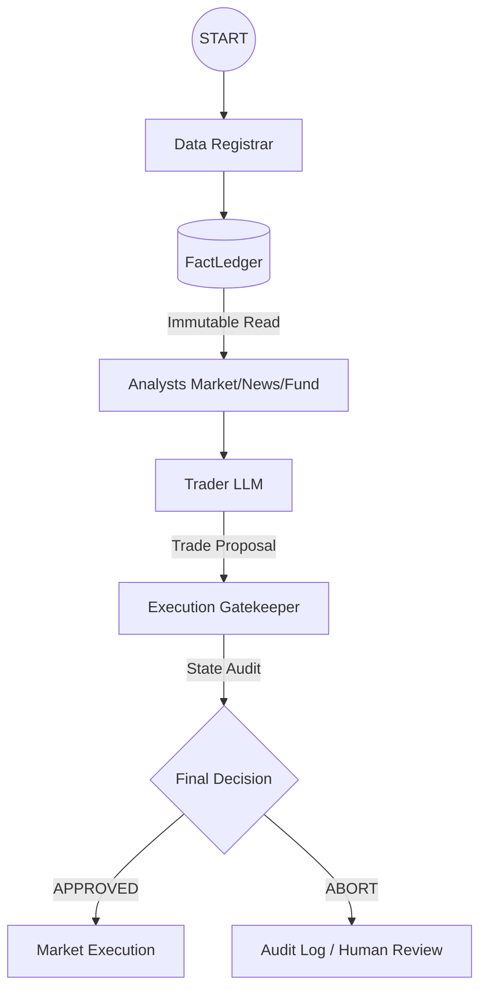
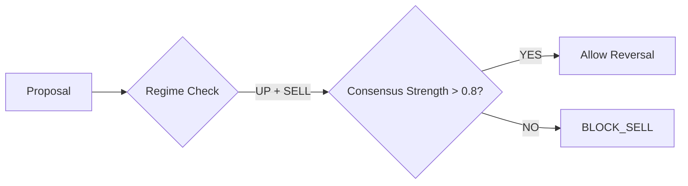

# Technical Implementation Documentation: Trading Agents V2 (Phases 1 & 2)

**Version:** 2.5 (Finalized Phase 2)  
**Objective:** Transition the system from a probabilistic LLM chain to a deterministic, institutional-grade decision engine.

---

## 1. Architectural Overview: The "Deterministic Gate"
The V2 architecture separates **Reality Acquisition**, **Intelligence Generation**, and **Execution Authorization** into distinct, non-overlapping domains.



---

## 2. Phase 1: Canonical Reality (FactLedger)

### 2.1 The Data Registrar
The `DataRegistrar` node is the **sole** entry point for external telemetry. It fetches price data, fundamentals, news, and insider logs in parallel threads to minimize latency.

**Core Implementation (Refactored 2.0):**
```python
def _fetch_all_data(self, ticker, date):
    with concurrent.futures.ThreadPoolExecutor(max_workers=4) as executor:
        tasks = {
            "price": executor.submit(get_stock_data.invoke, ...),
            "fund": executor.submit(get_fundamentals.invoke, ...),
            # etc.
        }
    return {k: f.result() for k, f in tasks.items()}
```

### 2.2 The Immutable Ledger
The `FactLedger` is protected by a **Write-Once Reducer** and wrapped in a `MappingProxyType`. This ensures that once reality is "frozen" at the start of a run, no agent can mutate the data or hallucinate historical prices.

**Ledger Schema:**
```json
{
  "ledger_id": "UUID-v4",
  "created_at": "ISO-8601 UTC",
  "freshness": {
    "price_age_sec": 0.5,
    "fundamentals_age_hours": 0.0
  },
  "source_versions": { "price": "yfinance@...", "news": "google@..." },
  "price_data": "OHLCV CSV String",
  "fundamental_data": "{...}",
  "content_hash": "SHA-256"
}
```

### 2.3 The "Lobotomy" (Security Sandboxing)
Analysts are now **FORBIDDEN** from using data tools. Their LLM definitions have `tools=[]`. 
- **Benefit:** Prevents "Tool-Hopping" hallucinations.
- **Protocol:** Analysts strictly synthesize data found within the `fact_ledger`.
- **Enforcement:** Graph initialization asserts `len(analyst.tools) == 0`.

### 2.4 Epistemic Lock: Frozen Context (Phase 2.5)
The system now prevents "Contextual Drift" by computing all derived indicators (SMA, RSI, Regime Labels) within the `DataRegistrar` *before* the analysis begins.
- **Single Truth:** These indicators are stored in the `FactLedger` and shared across all analysts.
- **Zero Divergence:** No agent can re-calculate a differing regime or SMA during the run.
- **Technicals Schema:**
```python
class Technicals(TypedDict):
    current_price: float # Frozen price @ Session Start
    sma_200: float
    sma_50: float
    rsi_14: Optional[float]
    revenue_growth: float
```

---

## 3. Phase 2: Execution Gating (The Guardrails)

### 3.1 The Execution Gatekeeper Logic
The Gatekeeper acts as a deterministic Python layer that audits the LLM's trade proposal against mathematical and compliance constraints.

**Consensus Divergence Math:**
The system quantifies "Epistemic Uncertainty" by checking how much the Bull and Bear analysts disagree.
```python
Divergence = abs(Bull_Confidence - Bear_Confidence) * Mean_Analyst_Confidence
if Divergence > 0.5:
    return ExecutionResult.ABORT_DIVERGENCE
```



### 3.3 Rule 72: Hard Stop Loss Authorization
The Gatekeeper implements a hard-coded `-10%` Stop Loss check using the frozen `FactLedger` price and current `portfolio` data.
- **Logic:** If `(CurrentPrice - AvgCost) / AvgCost < -0.10`, the trade is forced to `SELL` (Liquidation).
- **Provable Safety:** This check occurs in Python, bypassing LLM "narrative fluff."

### 3.4 Structured Confidence Emission (Phase 2.5)
The "Soft Underbelly" of regex-parsing LLM text has been replaced by **Pydantic-enforced structured outputs**.
- **Researchers:** Emit `ConfidenceOutput` (float confidence 0.0-1.0 + rationale).
- **Trader:** Emits `TraderOutput` (Action, Confidence, Rationale).
- **Validation:** Scores are type-checked and bounds-checked before the Gatekeeper even triggers.

### 3.3 Audit Trail (Counterfactual Logging)
Every blocked or aborted trade is logged with a "Counterfactual" payload, enabling retrospective analysis of how the safety logic protected capital.

---

## 4. Compliance & Verification

### 4.1 Fail-Fast Protocol
If the Registrar detects a `RetryError` or `stale data` (Price > 60s in production), it raises a hard exception before any LLM tokens are consumed.
- **Result:** 0% chance of trading on corrupted or hallucinated prices.

### 4.2 Cross-Vendor Robustness
The `RegimeDetector` now implements **Delimiter Sensing**, allowing it to parse data from `yfinance` (Whitespace), `Alpaca` (CSV), and `Local` (TSV) interchangeably without breaking the pipeline.

### 4.3 Phase 2.6: Audit Remediation (Safety Hardening)
Following a technical audit, the system was hardened against "Silent Failures" and "Market Lag."
- **Temporal Drift "Pulse Check":** The Gatekeeper performs a pre-authorization price verify. If the live price has drifted >3% from the `FactLedger`, the trade is aborted (`ABORT_STALE_DATA`).
- **Pessimistic Data Status:** Critical fields (like Insider Flow) now return `None` on error/missing data. The Gatekeeper aborts (`ABORT_DATA_GAP`) if these are NULL, rather than assuming a safe default of $0.0.

### 4.4 Phase 2.7: Senior-Grade Safety Refinements
The Phase 2.6 rules were refactored for institutional-grade reliability:
- **Deterministic Math:** Insider flow moved from string-sniffing to a float calculation (`net_insider_flow_usd`) in the Registrar.
- **Hanging Prevention:** Added a 2-second strict timeout to Pulse Checks.
- **Market Open Enforcement:** Gatekeeper aborts if session is outside NYSE hours.
- **Split Protection:** Massive drift (>50%) triggers a corporate action abort.

### 4.5 Consolidated Authorization (V2 Final Review)
The system has eliminated all "Shadow Gating" (logic occurring outside the decision boundary).
- **Single Boundary:** `ExecutionGatekeeper` is the final, provable boundary for all trade authorizations.
- **Auditability:** Every metric (Rule 72, Insider Veto, Pulse Check) is sourced from the immutable `FactLedger`.

---
**Status:** Phase 2 Overhaul COMPLETE. Architecturally "Bulletproof." Ready for Phase 3.
