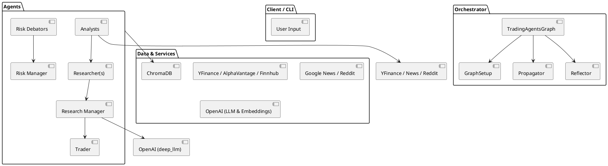

# SPEC-1-TradingAgents-Codebase-Review

## Background

A careful review was performed of the `tradingAgents` project provided in the uploaded ZIP. The codebase implements a multi-agent trading research framework that composes specialized analyst, researcher, risk-manager and trader components into a directed-graph execution pipeline built on top of `langgraph` and `langchain` (OpenAI connectors are used). The purpose is research and analysis (not financial advice) and the system designs an opinionated, debatable research process combining news, social sentiment, fundamentals, and technical analysis for investment recommendations.

## Files & repository layout (high level)

Key top-level entries:

* `README.md` — long project README with architecture overview, CLI screenshots, and examples.
* `main.py` — example runner that constructs a graph using `DEFAULT_CONFIG` and the `TradingAgentsGraph` abstraction.
* `tradingagents/` — main package with subpackages:

  * `agents/` — agent factories and utilities (analysts, researchers, risk_mgmt, managers, trader, utils)
  * `dataflows/` — vendor adapters (yfinance, alpha_vantage, google news, openai backends, reddit utils, etc.)
  * `graph/` — the orchestration pieces built on `langgraph` (setup, conditional logic, propagation, reflection, trading_graph)
  * `default_config.py` — default configuration and vendor selections
* `docs/` — `InitAnalysis.md` and `Prompts.md` containing higher-level analysis and prompt templates.
* `requirements.txt` / `pyproject.toml` — dependency lists (langchain-openai, langgraph, chromadb, yfinance, etc.)

## High-level architecture & execution model

1. **Graph-First Orchestration**: The core runtime is a stateful directed graph implemented with `langgraph`. The graph contains *tool nodes* (agents, data tools, wrappers) and *message states* which pass agent outputs forward. There are clear `START` / `END` states and per-node routing decisions.

2. **Agents-as-ToolNodes**: Agents are implemented as factory functions that accept an LLM (ChatOpenAI wrappers are used) and return functions that operate on the shared `state` dictionary. These are wired into `ToolNode`s in `GraphSetup`.

3. **Two-Tier LLM Strategy**: The code distinguishes a `quick_think_llm` for fast, less expensive calls and a `deep_think_llm` for longer, more contemplative tasks (e.g., judge/reflector). Configurable through `DEFAULT_CONFIG`.

4. **Specialized Agent Roles**:

   * Analysts: `market`, `news`, `social_media`, `fundamentals` — collect & synthesize different modalities.
   * Researchers: `bull` and `bear` researchers that debate investment theses.
   * Risk Debators: `aggressive`, `conservative`, `neutral` — produce risk-framed arguments.
   * Managers: `research_manager` (coordinates debate/judge flow) and `risk_manager` (integrates risk decisions).
   * Trader: a `trader` node that translates recommendations into actions/instructions.

5. **Dataflow Layer**: `tradingagents/dataflows` contains vendor adapters and wrappers: yfinance, alpha_vantage, Google/GoogleNews scraping utilities, Reddit scrapers, an OpenAI-based news summarizer, and several helpers for indicators. The design allows swapping vendors via configuration.

6. **Memory / Long-Term Storage**: `agents/utils/memory.py` implements `FinancialSituationMemory` backed by `chromadb` and OpenAI embeddings. Memories can be queried to retrieve past situations and recommendations.

7. **Reflection & Propagation**: There are distinct components that manage state propagation across nodes (`Propagator`), reflection for learning from outcomes (`Reflector`), and signal processing for derived signals (`SignalProcessor`). These are orchestrated by `TradingAgentsGraph`.

8. **Prompt Templates**: A large number of prompt templates and instructions are baked into manager and agent node implementations (docs/Prompts.md contains many of them). The system depends heavily on prompting to shape agent behavior.

## Data flow (simplified)

1. Input (ticker + trade_date + config) -> graph `START`.
2. Analyst nodes call dataflow adapters to fetch: OHLC history (yfinance/alpha_vantage), indicators, Reddit posts, news articles, macro data.
3. Each analyst returns a report string placed into `state` (e.g., `market_report`, `news_report`, `sentiment_report`, `fundamentals_report`).
4. Researcher agents (bull/bear) read these reports and start a debate sequence coordinated by `research_manager` — repeated message passing through the graph with conditional branching.
5. Risk debators augment the debate with risk framing; `research_manager` uses `judge` logic to decide whether to continue debate or finalize.
6. `invest_judge` / `invest_manager` produce a recommendation and a trader plan; `trader` node converts that into final actions.
7. `Reflector` runs post-hoc analyses and stores reflections/memories in `chromadb`.

## Integrations & External Dependencies

* **LLM**: `langchain_openai.ChatOpenAI` is used (wrapper for OpenAI). The code also contains references to different model names (e.g., `gpt-4o-mini`). The `DEFAULT_CONFIG` keeps model names configurable.
* **langgraph**: Graph orchestration is built on `langgraph` and its `ToolNode`, `StateGraph` primitives.
* **Data vendors**: `yfinance`, `alpha_vantage` (adapter), `finnhub` wrappers (present in requirements), Google News scrapers, Reddit (`praw`) utilities, local offline adapters for reproducible runs.
* **Vector DB**: `chromadb` for memory; embeddings are fetched via the OpenAI client (abstracted in `memory.py`) — uses `text-embedding-3-small` or `nomic-embed-text` depending on backend.
* **Misc**: `stockstats` for indicators, `pandas`, `backtrader` listed as dependency (not deeply wired in core flow but present), `questionary` & CLI tools.

## Observability, Telemetry & Logging

* There is **no centralized telemetry or metrics system** in the codebase (no Prometheus, no Sentry, and no logging imports were found). Internal state is tracked in Python structures (`TradingAgentsGraph.log_states_dict`) and the final state is serializable to JSON.
* Short-term print/console oriented flows are used (CLI screenshots showing progress). This implies limited production-grade observability and minimal error/tracing capabilities.

## Security & Secrets

* The project relies on environment variables (an `.env.example` is present). Secrets are expected to be loaded via `dotenv` in `main.py`.
* Several vendor adapters will require API keys (Alpha Vantage, Finnhub, OpenAI, etc.). There is no central secrets manager integration or explicit advice for safely rotating keys.

## Design patterns & code organization

* **Graph / Node pattern**: Orchestration is expressed as ToolNode nodes; nodes operate on a shared mutable `state` dict. This is an event/state propagation pattern.
* **Adapter pattern**: The `dataflows` directory acts as vendor adapters with a unified interface (`get_YFin_data_online`, `get_stock`, `get_news`, etc.). This enables vendor swapping through `DEFAULT_CONFIG`.
* **Factory functions**: Agents are provided through `create_*` functions that accept an LLM and return node behavior; this makes injection of different LLM wrappers straightforward.
* **Strategy / Debate**: The debate mechanism between bull/bear researchers plus judge is implemented as a state machine using Graph conditional transitions.
* **Memory as a service**: Memory is encapsulated in `FinancialSituationMemory` with query & add methods, following a simple repository pattern.

## Strengths & Good choices

* Clear separation between **data adapters**, **agent logic**, and **orchestration** (graph) — makes the codebase understandable and swappable.
* Two-LLM tiering for cost/performance tradeoffs is pragmatic.
* Use of `chromadb` + embeddings to record and retrieve prior situations is a sensible approach for agent memory and long-term learning.
* `langgraph` + `langchain` give a native architectural fit for agentic message-passing workflows.
* Extensive prompt engineering (templates + docs) already present.

## Risks, gaps & weaknesses (observations)

1. **Observability & Logging**: No structured logging or metrics. Hard to debug runs in production or trace LLM costs and latencies.
2. **Error handling & retries**: Vendor adapters appear to be synchronous and may lack robust retry/backoff logic for network/API failures.
3. **Testing**: There is little evidence of unit or integration tests for critical components (no tests besides `test.py` placeholder).
4. **Concurrency & throughput**: The design uses synchronous LLM calls and blocking data fetches — scaling to many tickers or parallel research runs will be slow.
5. **Secrets management**: Keys fetched from `.env` — no mention of vault integration or per-environment configurations.
6. **Vector DB persistence**: `chromadb` client is created without persistent configuration. Depending on how chroma is set up, memory may be ephemeral. Also the embedding provider selection is hard-coded per `backend_url`.
7. **Resource usage & cost controls**: No built-in quota or estimation of LLM tokens, cost accounting, or budgets per run.
8. **Tight coupling to `langgraph`**: Heavy use of `langgraph` primitives makes migration to another orchestrator non-trivial.
9. **Missing telemetry for LLM calls**: No per-prompt logging of response latency, token usage, or errors.
10. **Limited type enforcement**: Project mixes typed dicts with untyped state dict usage which can lead to runtime errors.

## Concrete recommendations (quick wins)

### Short-term (low-effort, high-impact)

* Add structured logging (Python `logging`) at entrypoints: agent invocations, external vendor calls, and LLM call wrappers. Log context (ticker, date, node name).
* Add simple metrics counters (e.g., via Prometheus client or expose a `/metrics` endpoint) for counts of LLM calls, failures, vendor call latencies.
* Centralize LLM invocation through a single wrapper that records token usage, latency, and catches common API errors — makes adding retries and fallback models easier.
* Implement retry/backoff for external HTTP/API calls using `tenacity` or `httpx` with retry.
* Persist chromadb collection to disk or configure a persistent deployment so memories survive across runs.
* Add basic unit tests for `dataflows` adapters (mock vendor responses) and `agents`’ deterministic pieces.

### Medium-term

* Introduce asynchronous execution (async/await) and batch operations when requesting market data for multiple tickers.
* Add a plugin-style adapter registry for vendor integrations so new providers can be registered without touching internal imports.
* Introduce a pluggable telemetry backend with traces for each graph run (OpenTelemetry) and LLM spans.
* Add a configuration profile system for environments (dev/staging/prod) and secret management guidance (Vault, AWS Secrets Manager, or similar).
* Improve type coverage with `mypy` and stricter typed data models for the shared `state` (pydantic models could help).

### Refactors & larger changes

* Decouple orchestration from `langgraph` with an internal thin interface, so other orchestrators could be used in future.
* Abstract vector DB usage behind an interface with multiple implementations (Chroma, Pinecone, etc.) and configuration-driven provider selection.
* Add a cost-control and LLM budgeter that estimates tokens and optionally refuses expensive calls beyond configured budgets.
* Create end-to-end integration/infrastructure tests that run a short scenario with mocked LLMs to validate the graph transitions and state outputs.

## Suggested file-by-file highlights (non-exhaustive)

* `tradingagents/graph/setup.py` — central wiring that constructs `ToolNode`s; good place to centralize LLM wrapper.
* `tradingagents/agents/*` — agent factories: prefer to make these pure functions that only transform inputs and call an injected `llm_api` helper. Avoid reading global config inside the node body.
* `tradingagents/dataflows/*` — vendor adapters: add standardized error classes, timeouts and retry.
* `tradingagents/agents/utils/memory.py` — ensure Chroma collection initialization accepts persistence directory and does not create ephemeral in-memory collections silently.
* `tradingagents/graph/trading_graph.py` — the Graph runtime; add hooks for metrics, logging and structured state snapshots.

## PlantUML: Simplified component diagram

