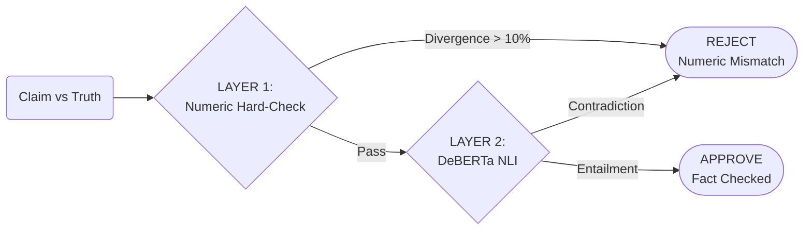
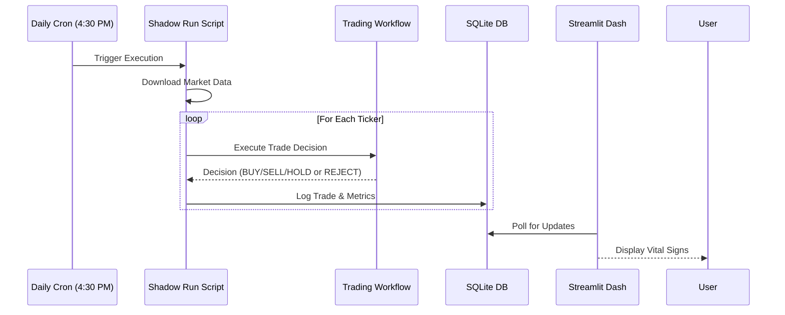
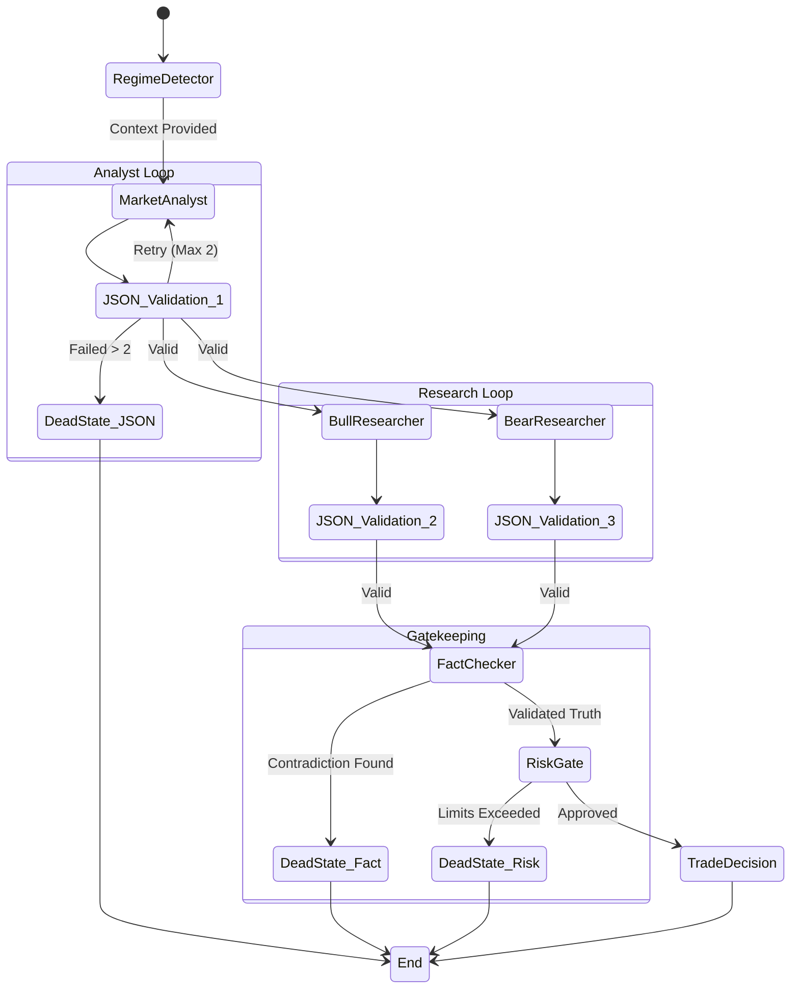

# TRADING AGENTS: SYSTEM ARCHITECTURE & FLOWS

## 🏗️ HIGH-LEVEL SYSTEM OVERVIEW

The **TradingAgents** system is a risk-managed, LLM-driven trading engine designed to execute trades based on validated truth, not hallucinations. It connects hierarchical LLM agents with deterministic safety gates to ensure that every trade is architecturally sound, factually correct, and risk-compliant.

---

## 🔄 1. DATA FLOW PIPELINE

This diagram illustrates how raw market data is transformed, anonymized, and fed into the analysis engine.

```mermaid
graph TD
    subgraph Input_Layer
        RawData[Raw Market Data<br/>(yfinance)] -->|OHLCV| Anonymizer[Ticker Anonymizer<br/>(SHA-256 Hash)]
        Anonymizer -->|ASSET_245| Normalizer[Price Normalizer<br/>(Base-100 Index)]
    end

    subgraph Analysis_Layer
        Normalizer -->|Normalized Series| Regime[Regime Detector<br/>(ADX, Volatility, Hurst)]
        
        Regime -->|Regime: VOLATILE| SignalEngine[Signal Engine]
        Normalizer -->|Context| SignalEngine
        
        SignalEngine -->|Prompts| Analyst[Market Analyst<br/>(GPT-4o-mini)]
        Analyst -->|Findings| Bull[Bull Researcher]
        Analyst -->|Findings| Bear[Bear Researcher]
    end

    subgraph Decision_Layer
        Bull -->|Arguments| Integration[Integration Workflow]
        Bear -->|Arguments| Integration
    end
```

---

## 🚦 2. DECISION LOGIC & SAFETY GATES (THE 3-GATE SYSTEM)

This is the core "Shadow Run" workflow. It enforces the "Survival by Gatekeeping" philosophy.

```mermaid
graph TD
    Start([Start Workflow]) --> Gate1{GATE 1:<br/>JSON Compliance}
    
    Gate1 -- Invalid JSON --> Retry[Retry Loop<br/>(Max 2)]
    Retry -- Still Invalid --> DeadState[DEAD STATE<br/>Action: HOLD]
    Gate1 -- Valid JSON --> Gate2{GATE 2:<br/>Hybrid Fact Check}
    
    Gate2 -- Contradiction --> DeadState
    Gate2 -- Validated --> Logic[Trade Logic<br/>(Bull vs Bear)]
    
    Logic --> Proposal[Trade Proposal]
    Proposal --> Gate3{GATE 3:<br/>Risk Gate}
    
    Gate3 -- Risk Violation --> DeadState
    Gate3 -- Approved --> Sizing[Position Sizing<br/>(ATR Based)]
    
    Sizing --> Execution([Final Valid Order])
    DeadState --> Log[Log Rejection]
    Execution --> Log
```

---

## 🧠 3. HYBRID VALIDATION PROTOCOL (THE BRAKES)

The detailed flow of the Fact Checker (Gate 2), which prevents the system from acting on hallucinations.



---

## 📉 4. REGIME DETECTION LOGIC

How the system decides whether to even attempt a trade (preventing "Falling Knives").

```mermaid
graph TD
    Input[Price Series] --> Calc1[Calculate Volatility]
    Input --> Calc2[Calculate ADX]
    Input --> Calc3[Calculate Returns]
    
    Calc1 & Calc2 & Calc3 --> Classifier{Regime Classifier}
    
    Classifier -- "Vol > 40%" --> Volatile[VOLATILE<br/>(Danger Zone)]
    Classifier -- "ADX > 25 & Ret > 0" --> Bull[TRENDING_UP]
    Classifier -- "ADX > 25 & Ret < 0" --> Bear[TRENDING_DOWN]
    Classifier -- "ADX < 20" --> Sideways[SIDEWAYS]
    
    Volatile --> Action1[Block Buys<br/>Reduce Size]
    Bear --> Action2[Block Buys]
    Bull --> Action3[Allow Longs]
```

---

## 🧩 COMPONENT DESCRIPTIONS

### 1. Ticker Anonymizer
*   **Purpose:** Blinds LLMs to the asset identity to prevent "time travel" lookup of historical prices.
*   **Mechanism:** Maps `AAPL` → `ASSET_245` using a seeded hash. Maps prices to a Base-100 index.
*   **Status:** ✅ Production Ready

### 2. Regime Detector
*   **Purpose:** Provides mathematical context (not "vibes") to trading signals.
*   **Metric:** Uses Annualized Volatility and ADX (Average Directional Index).
*   **Status:** ✅ Verified (Caught NVDA 2022 Crash)

### 3. Hierarchical Agents
*   **Analyst:** Technical analysis of the normalized chart.
*   **Bull/Bear Researchers:** Generate adversarial arguments for the trade.
*   **Status:** ✅ Integrated (GPT-4o-mini)

### 4. Safety Gates
*   **Gate 1 (Format):** Ensures LLMs speak valid JSON.
*   **Gate 2 (Truth):** Hybrid validation (Math + Semantics) to catch lies (e.g., "500% growth").
*   **Gate 3 (Risk):** Portfolio heat and drawdown limits.
*   **Status:** ✅ **Brakes Fixed (Phase 8)**

---

## 🤖 5. AGENTIC WORKFLOW ORCHESTRATION

This sequence diagram details the internal conversation and validation flow between the orchestration engine and the specific agent personas.

```mermaid
sequenceDiagram
    participant Orch as Orchestrator
    participant Analyst as Market Analyst<br/>(Technical)
    participant Bull as Bull Researcher<br/>(Adversarial)
    participant Bear as Bear Researcher<br/>(Adversarial)
    participant JSON as JSON Gate<br/>(Retry Loop)

    Note over Orch: Step 1: Technical Analysis
    Orch->>Analyst: Prompt: Analyze Market Data (OHLCV + Indicators)
    Analyst-->>JSON: Output JSON Analysis
    
    rect rgb(29, 29, 32)
        Note left of JSON: Gate 1: Analysis Validation
        JSON->>JSON: Validate Schema (AnalystOutput)
        alt Invalid
            JSON-->>Analyst: Retry with Error Msg
        else Valid
            JSON-->>Orch: Validated Findings
        end
    end

    Note over Orch: Step 2: Adversarial Debate
    par Parallel Execution
        Orch->>Bull: Prompt: Construct Bull Case based on Findings
        Orch->>Bear: Prompt: Construct Bear Case based on Findings
    end

    Bull-->>JSON: Output Bull Arguments
    Bear-->>JSON: Output Bear Arguments
    
    rect rgb(29, 29, 32)
        Note left of JSON: Gate 1: Research Validation
        JSON->>JSON: Validate Schema (ResearcherOutput)
        JSON-->>Orch: Validated Arguments
    end

    Note over Orch: Step 3: Synthesis
    Orch->>Orch: Combine Arguments -> Send to Fact Checker (Gate 2)
```



---

## 🚀 DEPLOYMENT ARCHITECTURE (SHADOW RUN)



---

## �️ 6. AGENT STATE GRAPH (TOPOLOGY)

This state diagram represents the exact topology used in the implementation, ensuring deterministic transitions and handling of "Dead States" to prevent graph crashes.



---

## �📂 7. PROJECT STRUCTURE

```text
TradingAgents/
├── dashboard/                  # Monitoring Dashboard
│   └── shadow_run_monitor.py   # Streamlit Vital Signs Monitor
├── scripts/                    # Execution Scripts
│   ├── shadow_run_daily.py     # Daily Cron Job (Shadow Run)
│   └── anonymize_dataset.py    # Batch Anonymizer
├── tests/                      # Validation Suites
│   ├── ignition_tests.py       # Phase 7: Hallucination & Crash Tests
│   ├── torture_test_2022.py    # Phase 6: Bear Market Backtest
│   └── test_*.py               # Unit Tests
├── tradingagents/              # Core Logic Package
│   ├── engines/                # Mathematical Engines
│   │   ├── regime_detector.py  # Trend/Vol Logic
│   │   └── ...
│   ├── risk/                   # Safety Gates
│   │   └── deterministic_risk_gate.py
│   ├── validation/             # Truth Gates
│   │   └── semantic_fact_checker.py
│   ├── workflows/              # Orchestration
│   │   └── integrated_workflow.py
│   ├── agents/                 # LLM Personas
│   └── utils/                  # Helpers
│       ├── anonymizer.py
│       └── json_retry.py
├── data/                       # Local Storage
│   └── shadow_run.db           # SQLite Trade Log
└── logs/                       # Execution Logs
```
