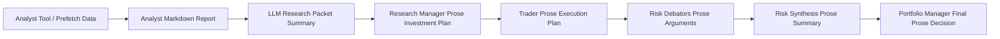
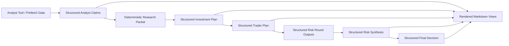

# 017 Structured Contracts and Raw Context Experiment

## Goal

Reduce downstream hallucination and avoid unnecessary critical aborts by replacing free-form inter-node handoffs with explicit structured contracts, while keeping the current summary-first scanner packet as the default context path.

This plan has two linked tracks:

1. Introduce structured contracts between analyst, manager, trader, and risk nodes.
2. Add an experiment toggle, `include_raw_context`, that preserves summary-first as default and optionally appends tightly filtered ticker-scoped raw scanner evidence for A/B accuracy comparison.

Companion docs:

- [018 Agent Handoff Matrix](/Users/Ahmet/Repo/TradingAgents/docs/agent/plans/018-agent-handoff-matrix.md)
- [019 Structured Contracts Implementation Checklist](/Users/Ahmet/Repo/TradingAgents/docs/agent/plans/019-structured-contracts-implementation-checklist.md)

## Current Graph Risk Surface

The main issue is not only analyst prompts. The larger problem is that verified upstream outputs get re-written as free text multiple times before the final decision.

### What "prose re-write drift" means

One node produces plain text, then the next node reads that text and produces new plain text instead of consuming structured facts.

Typical failure modes:

- a number is rounded, dropped, or changed
- a date is restated incorrectly
- a source citation disappears
- a caveat becomes a stronger claim
- a valid claim is over-generalized into strategy language
- a downstream node attributes a claim to the wrong upstream source

In other words, the graph can hallucinate even when the first node was grounded, because later nodes are paraphrasing prose rather than referencing validated claim objects.

### Current drift chain



The dangerous edges are the prose-to-prose handoffs:

- analyst report -> research packet summary
- research packet summary -> research manager plan
- research manager plan -> trader plan
- trader plan -> risk debate
- risk debate -> risk synthesis
- risk synthesis -> portfolio manager decision

### Desired chain



Here, markdown remains a human-readable artifact, but structured payloads are the machine-truth handoff between nodes.

Highest-risk boundaries:

1. Analyst reports -> `research_packet_summary`
2. `research_packet_summary` -> research manager
3. Research manager free-text `investment_plan` -> trader
4. Trader free-text proposal -> round 1 risk debators
5. Round 1/2 free-text debate -> `risk_synthesis`
6. `risk_synthesis` + debate history -> portfolio manager

This creates a drift chain:

`verified source/tool output -> prose report -> prose summary -> prose plan -> prose rebuttal -> prose synthesis -> prose final decision`

Every prose-to-prose rewrite is a hallucination surface.

## Design Principle

The canonical payload between nodes should be structured data. Markdown remains a rendered view for logs, reports, and UI.

For each major node:

- One structured output field is canonical
- One rendered markdown/text field is optional presentation
- Downstream nodes consume the structured field, not the rendered text

## Target Contracts

### 1. Analyst Contracts

Add structured canonical outputs:

- `market_report_structured`
- `fundamentals_report_structured`
- `sentiment_report_structured`
- `news_report_structured` already started and should become the model

Each analyst contract should include:

- `ticker`
- `as_of_date`
- `claims[]`
- `summary_table[]`
- `critical_abort`
- `contract_version`

Each `claims[]` entry should include:

- `claim_id`
- `claim`
- `category`
- `metric`
- `value`
- `unit`
- `date`
- `source`
- `source_type`
- `confidence`
- `evidence_id` or `tool_origin`

### 2. Research Packet Contract

Replace LLM-generated packet compression as the canonical handoff with:

- `research_packet_structured`

This should be built deterministically from analyst structured outputs plus scanner ground truth.

It should contain:

- `ticker`
- `trade_date`
- `scanner_ground_truth`
- `analyst_claims_by_domain`
- `high_confidence_claim_ids`
- `conflicts[]`
- `critical_abort_flags[]`

Rendered `research_packet_summary` can remain as a derived artifact for observability, but it should no longer be the canonical input to downstream reasoning.

### 3. Research Manager Contract

Replace free-form canonical output with:

- `investment_plan_structured`

Fields:

- `recommendation`
- `top_bull_claim_ids[]`
- `top_bear_claim_ids[]`
- `winning_claim_ids[]`
- `rejected_claim_ids[]`
- `rationale`
- `strategic_actions[]`
- `key_risks[]`
- `contract_version`

The research manager should not introduce new facts. It should only select, compare, and weigh upstream claims.

### 4. Trader Contract

Replace free-form canonical output with:

- `trader_plan_structured`

Fields:

- `action`
- `entry_range`
- `stop_loss`
- `take_profit`
- `position_size`
- `time_horizon`
- `catalyst_dates[]`
- `supporting_claim_ids[]`
- `risk_controls[]`
- `contract_version`

Validation requirements:

- stop-loss and take-profit numeric bounds
- catalyst dates must come from scanner ground-truth or validated analyst/tool records
- no new dates without provenance

### 5. Risk Debate Contracts

Replace free-form canonical round outputs with:

- `risk_r1_aggressive_structured`
- `risk_r1_conservative_structured`
- `risk_r1_neutral_structured`
- `risk_r2_aggressive_structured`
- `risk_r2_conservative_structured`
- `risk_r2_neutral_structured`

Fields:

- `stance`
- `supports[]`
- `challenges[]`
- `risk_factors[]`
- `linked_claim_ids[]`
- `confidence`
- `contract_version`

Debators should argue over structured claims and structured trader parameters, not over prose restatements.

### 6. Risk Synthesis Contract

Add:

- `risk_synthesis_structured`

Fields:

- `consensus_risks[]`
- `material_disagreements[]`
- `highest_conviction_risks[]`
- `net_risk_bias`
- `linked_claim_ids[]`
- `contract_version`

### 7. Portfolio Manager Contract

Add:

- `final_trade_decision_structured`

Fields:

- `rating`
- `action`
- `execution`
- `risk_controls`
- `investment_thesis`
- `supporting_claim_ids[]`
- `contract_version`

## Nodes That Should Stop Being Canonical

These are useful as rendered artifacts, but should stop being primary machine inputs:

1. `research_packet_summary`
2. `investment_debate_state.history`
3. `risk_debate_state.history`
4. `investment_plan` free text
5. `trader_investment_plan` free text
6. `final_trade_decision` free text

These fields can remain temporarily for compatibility and reporting, but downstream logic should migrate off them.

## Likely Unnecessary or Redundant Logic To Remove Later

### A. LLM summary as canonical packet

Current summary-first packet compression is good for token control, but using LLM-compressed text as the only downstream truth is unnecessary once structured packet building exists.

Future direction:

- keep summary rendering
- remove summary as canonical reasoning input

### B. Macro regime fallback by string sniffing

The market analyst currently infers `macro_regime_report` from free-text report content when prefetch is not used cleanly.

Future direction:

- promote macro regime to structured output
- remove heuristic text fallback

### C. Debate history as raw canonical context

Long free-text debate histories should not be the default context for later nodes once structured round outputs exist.

Future direction:

- keep them for logs only
- drive manager decisions off structured summaries and linked claim IDs

## Rollout Phases

### Phase 1: Formalize Analyst Contracts

Implement structured outputs for:

- market analyst
- fundamentals analyst
- social media analyst

Match the news analyst pattern:

- LLM returns JSON
- validate contract shape
- store structured payload
- render markdown separately

### Phase 2: Deterministic Research Packet Builder

Introduce:

- `research_packet_structured`

This builder should:

- use scanner ground truth directly
- aggregate analyst claims deterministically
- surface conflicts deterministically
- avoid LLM summarization as a required step

### Phase 3: Structured Research Manager and Trader

Research manager consumes `research_packet_structured` and outputs `investment_plan_structured`.

Trader consumes `investment_plan_structured` and scanner ground truth and outputs `trader_plan_structured`.

### Phase 4: Structured Risk Debate and Synthesis

Round debators consume:

- structured research packet
- structured trader plan

Risk synthesis consumes structured round outputs.

### Phase 5: Structured Portfolio Manager

Portfolio manager consumes:

- `research_packet_structured`
- `trader_plan_structured`
- `risk_synthesis_structured`

Rendered markdown remains derived only.

## Clean Implementation Plan: `include_raw_context`

### Goal

Add an experiment toggle, `include_raw_context`, that preserves the current summary-first handoff as the default and optionally appends ticker-scoped filtered raw evidence to analyst prompts for A/B accuracy comparison.

### Product Contract

- Default mode remains summary-first only.
- `scanner_context_packet` stays the canonical compact Phase 2 packet.
- Raw scanner reports are never appended directly.
- When `include_raw_context=True`, append a second optional section built only from filtered ticker-scoped raw evidence.
- If no filtered raw evidence remains after filtering, omit the section entirely.

### State / Config

Add `include_raw_context: bool = False` to:

- runtime config
- run params / request model
- any engine entrypoint state that prepares analyst inputs
- run metadata persistence for auditability

Keep scope narrow:

- analyst prompt construction should read this flag
- downstream debate / PM nodes should not depend on it

### Data Contract

Keep:

- `scanner_context_packet`: summary-first compact packet

Add:

- `optional_filtered_raw_context: str = ""`

Section shape when present:

```md
## Optional Filtered Raw Context (Ticker-Scoped)
### Smart Money Raw Evidence
...
### Factor Alignment Raw Evidence
...
### Drift Raw Evidence
...
### Sector Raw Evidence
...
```

### Filtering Rules

Implement explicit per-report handling instead of generic raw dumps.

#### `smart_money_report`

- extract ticker-specific rows first
- optionally include sector-adjacent rows
- hard cap by lines/chars

#### `factor_alignment_report`

- keep only ticker factor rows plus 1-2 regime lines
- hard cap

#### `drift_opportunities_report`

- keep only ticker lines or nearest relevant rows
- hard cap

#### `sector_performance_report`

- keep ticker sector plus one related spillover sector
- hard cap

#### `market_movers_report`

- optional, top 1-2 lines only if clearly relevant
- otherwise skip

#### `geopolitical_report`

- usually skip
- include only if a ticker-linked keyword hit exists and cap tightly

### Engine Work

In `langgraph_engine.py`:

- add `_build_optional_filtered_raw_context(scan_state, ticker) -> str`
- source only from raw `*_report` fields
- reuse existing filtering utilities where they fit
- add bounded helper functions for section caps and empty suppression

During per-ticker packet preparation:

- always build `scanner_context_packet`
- conditionally build `optional_filtered_raw_context` only when `include_raw_context=True`

### Analyst Wiring

Update only analyst prompt builders, not the packet contract itself.

Append optional raw section in:

- `market_analyst.py`
- `fundamentals_analyst.py`
- `social_media_analyst.py`
- `news_analyst.py` if the experiment should stay consistent across all analysts

Prompt order:

1. summary-first scanner packet
2. optional filtered raw section
3. analyst-specific prefetched context

### CLI / API / Metadata

Expose:

- CLI: `--include-raw-context`
- API/request field: `include_raw_context`

Persist:

- `include_raw_context`
- `scanner_context_packet_chars`
- `optional_filtered_raw_context_chars`
- per-analyst final prompt chars when available

### Testing

#### Unit Tests

- flag off -> no optional raw context built or appended
- flag on + relevant raw present -> optional filtered raw context included
- flag on + filtered raw empty -> section omitted
- caps enforced
- no unfiltered raw block appended

#### Prompt Wiring Tests

- summary-only baseline when flag off
- summary + optional raw block when flag on

#### Benchmark Regression

- same fixture, flag off vs on
- prompt delta deterministic
- optional raw section bounded

#### Artifact-Backed Tests

- use existing 2026-04-02 runs when available
- skip cleanly when artifacts are missing

### A/B Accuracy Harness

Build a small experiment runner with fixed:

- ticker set
- date
- model
- config

Variants:

- A: `include_raw_context=False`
- B: `include_raw_context=True`

Capture:

- analyst reports
- final decision outputs
- rationale fields
- prompt size
- runtime

### Scoring Rubric

Score each report on:

- factual grounding
- ticker specificity
- catalyst coverage
- risk coverage
- contradiction / hallucination rate
- decision usefulness

Use 0-2 or 0-3 per dimension and keep it auditable.

### Decision Gate

Keep `include_raw_context=False` as default unless:

- B improves rubric score by a predefined threshold or reduces critical omissions
- and B stays within prompt-size and runtime ceilings

Otherwise:

- keep summary-first default
- retain raw toggle only for targeted diagnostics

## Recommended Work Split

Use `gpt-5.3-codex` workers only.

### Agent 1: Contract and State Plumbing

- add structured state fields
- add contract versions
- add deterministic packet builder skeleton

### Agent 2: Analyst Contract Migration

- market analyst JSON contract
- fundamentals analyst JSON contract
- sentiment analyst JSON contract
- validators and renderers

### Agent 3: Manager / Trader / Risk Contract Migration

- research manager structured plan
- trader structured plan
- risk round structured outputs
- risk synthesis structured output

### Agent 4: Raw Context Experiment

- `include_raw_context` flag plumbing
- filtered raw builder
- analyst prompt wiring
- benchmark harness and tests

## Immediate Next Steps

1. Fix state ownership bugs where downstream nodes use the wrong upstream field.
2. Add `*_structured` state for market, fundamentals, and sentiment.
3. Build `research_packet_structured` deterministically.
4. Move research manager and trader off free-text canonical inputs.
5. Add `include_raw_context` as a narrow prompt-level experiment, not a new canonical packet source.
