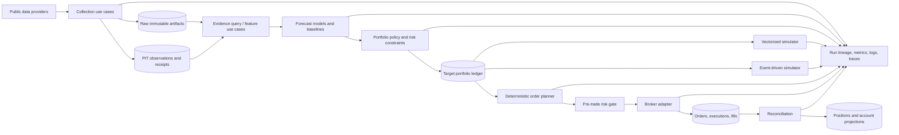

# TradingAgents Future Platform Architecture and Delivery Plan

Status: proposed architecture and migration plan
Date: 2026-08-05
Scope: research data, forecasting, portfolio construction, backtesting, paper execution,
broker adapters, operations, and future open-source distribution

This document is deliberately a plan, not a request to turn on trading. It does not alter the
frozen Global Event V2 protocol, enable formal decisions, or authorize real-money execution.

## Executive decision

Evolve the current repository into a **modular monolith with hexagonal boundaries**, a shared
domain model, and replaceable adapters. Keep the collector, outcome-blind decision worker, and
price-only marker worker as separate runtime processes, but make them thin application shells
around the same core. Add an execution
process only after the backtest/paper system has passed explicit reproducibility, reconciliation,
and safety gates.

The central output of research must be a `TargetPortfolio`, not a broker order. A deterministic
order planner converts that target, an account snapshot, an execution policy, and the selected
broker's declared capabilities into reviewable `OrderIntent` objects. LLMs may produce structured
forecasts and explanations; they must never call brokers directly.

Use two simulation engines behind one portfolio/accounting contract:

1. a fast vectorized evaluator for broad research sweeps; and
2. a deterministic event-driven simulator for fill-level, live-parity validation.

Postgres remains the operational control plane and append-only ledger. Immutable raw payloads,
curated Parquet datasets, and run artifacts belong in object storage. DuckDB provides cheap local
replay and analysis. Add a durable database outbox before considering Kafka or another distributed
event bus.

This shape borrows the strongest proven ideas from:

- [NautilusTrader](https://nautilustrader.io/docs/latest/concepts/), which shares an event model,
  cache, portfolio, risk, and execution abstractions between simulation and live trading;
- [QuantConnect LEAN](https://www.lean.io/), whose event-driven engine exposes replaceable data,
  brokerage, fill, fee, slippage, portfolio, and risk models;
- [Microsoft Qlib](https://github.com/microsoft/qlib), which separates forecasts, strategy,
  execution, point-in-time data, and experiment recording;
- [OpenBB's provider architecture](https://docs.openbb.co/platform/developer_guide), which keeps a
  lightweight core and independently discoverable data providers; and
- [VectorBT](https://vectorbt.dev/api/portfolio/base/), which demonstrates the value of a fast
  signal/portfolio path for high-volume experimentation.

We should adopt the concepts, not import these systems as foundational dependencies.

## What we are building toward

The platform should make all of these workflows first-class:

- Collect a small, high-information set of broad public-sentiment and global-news observations.
- Preserve exactly what was known, when it was published, and when our system first observed it.
- Reproduce any forecast or portfolio decision from immutable inputs, code, protocol, model,
  prompt, settings, and random-seed identifiers.
- Evaluate global events against a fixed asset universe without querying issuer-specific feeds.
- Compare deterministic baselines and LLM strategies under identical information and cost rules.
- Construct and evaluate a portfolio, not a disconnected collection of ticker predictions.
- Run the same portfolio, accounting, constraints, and order-planning logic in backtest, paper,
  shadow, and—only after approval—live modes.
- Add a new news source, model, data store, simulator, or broker without editing the domain core.
- Support Robinhood, Alpaca, Interactive Brokers, and a future official Fidelity API through
  capability-aware adapters.
- Offer a clean Python SDK, CLI, optional API, and later UI without duplicating business logic.
- Open-source the reusable framework while keeping credentials, licensed raw data, production
  state, and private deployment overlays out of the public repository.

## Current repository audit

### Assets worth preserving

The current V2 work already establishes important foundations:

- `research_protocol.py` freezes the universe, horizons, strategies, build identifiers, and
  content hashes.
- `global_research.py` represents global events, per-asset forecast distributions, evidence, and
  provenance.
- Media observations and fetch receipts are append-only and point-in-time aware.
- The portfolio evaluator includes transaction costs, constraints, statistical controls, PBO,
  deflated Sharpe, block bootstrap, and Newey-West adjustments.
- Collector, decision, and marker runtimes are independently deployable and have distinct
  least-privilege database roles.
- The present suite has hundreds of tests and provides a safe compatibility net for migration.

These are not prototypes to discard. They are the seam around which to use a strangler migration.

### Structural gaps

The audit found several boundaries that are currently implicit or crossed:

- `paper_trading.py`, `media_store.py`, `poller.py`, `portfolio_backtest.py`, `media_sources.py`,
  `backtest.py`, and `trading_graph.py` each combine multiple responsibilities.
- Runtime DDL, repositories, service logic, scheduling, and CLI code coexist in the same modules.
- SQLite and Postgres schema behavior is duplicated in application code rather than versioned
  migrations.
- Environment variables are read throughout the implementation and mutable global dictionaries
  are used as configuration.
- Plain dictionaries cross many subsystem boundaries; validation is inconsistent.
- Data vendors use a static imported registry. Adding a provider requires modifying central code.
- Market-price loading and some helper functions are imported from backtest modules by paper and
  formal-experiment paths, reversing the desired dependency direction.
- Formal experiment and paper logic depend on each other, creating a cycle that is only partially
  hidden by lazy imports.
- Collection, clustering, coverage, audit, scheduling, and CLI concerns are mixed in the poller.
- Paper storage combines calendar logic, schema creation, ledger behavior, scheduling, and
  application orchestration.
- There is no canonical broker execution state machine or reconciliation contract.
- The code has an Apache-2.0 license, but lacks the surrounding public-project security,
  governance, contribution, release, and supply-chain documents needed for a robust open source
  project.

The danger is not merely large files. It is that backtesting, paper trading, and future live
execution can silently diverge because their semantics are expressed in different orchestration
code.

## Architectural principles

1. **Point-in-time is part of every query.** `AsOf` cannot be an optional convention.
2. **The protocol is not runtime configuration.** Economic hypotheses and evaluation rules are
   frozen artifacts; operational knobs and secrets are separate.
3. **Domain objects do not import databases, networks, frameworks, CLIs, or environment state.**
4. **Application services depend on ports; adapters depend inward.**
5. **Portfolio targets are portable; broker orders are not.**
6. **Capabilities are negotiated, never guessed.** Unsupported broker behavior fails closed.
7. **Simulation and live execution share accounting and order semantics.**
8. **Append first, derive later.** Raw facts and decisions are immutable; projections are
   rebuildable.
9. **Every side effect is idempotent and auditable.**
10. **Simple deployment wins until load proves otherwise.** Modules now; services later.
11. **Plugins are explicit and allowlisted in production.** Installation alone is not authority.
12. **LLM outputs are untrusted inputs.** Parse, validate, constrain, and retain them.

## Target system flow



The same forecast and portfolio policy can feed both simulators and the order planner. The
deployment mode changes adapters, clocks, and permissions—not the economic decision code.

## Proposed repository shape

Start with one installable distribution so interfaces can stabilize without a packaging migration:

```text
tradingagents/
  domain/
    ids.py
    time.py
    instruments.py
    evidence.py
    market.py
    forecasts.py
    portfolios.py
    orders.py
    experiments.py
    events.py
    errors.py
  ports/
    data.py
    evidence.py
    features.py
    models.py
    portfolio.py
    broker.py
    repositories.py
    artifacts.py
    clock.py
    calendar.py
    event_bus.py
    telemetry.py
  application/
    collection/
    research/
    allocation/
    simulation/
    execution/
    evaluation/
    experiments/
  engine/
    events.py
    clocks.py
    accounting.py
    portfolio.py
    risk.py
    fills.py
    vectorized.py
  adapters/
    data/
    llm/
    storage/
    brokers/
    observability/
  plugins/
  config/
  cli/
  api/
  apps/
    collector/
    research_worker/
    executor/
    api/
  compat/
configs/
deploy/
docs/
  architecture/
  adapters/
  protocols/
  operations/
  decisions/
examples/
migrations/
protocols/
schemas/
  domain/v1/
  events/v1/
tests/
  unit/
  contract/
  property/
  replay/
  integration/
  e2e/
  leakage/
  security/
```

Only after these contracts are stable and third-party adoption justifies it should distribution
split into packages such as `tradingagents-core`, `tradingagents-research`,
`tradingagents-backtest`, and `tradingagents-adapter-*`.

### Dependency rule

```text
domain <- ports <- application <- adapters/apps
                 ^
                 |
               engine
```

- `domain` is pure Python plus lightweight validation/value-object dependencies.
- `ports` contains interfaces and transport-neutral request/result contracts.
- `application` implements use cases and transaction boundaries.
- `engine` supplies deterministic portfolio, accounting, risk, and simulation logic through ports.
- `adapters` translate external systems into canonical contracts.
- `apps` compose settings, adapters, and use cases into deployable processes.
- `compat` preserves the current import and CLI surface while consumers migrate.

CI should enforce this dependency direction with import-lint rules.

## Canonical contracts

Low-volume commands, decisions, and events should be validated Pydantic models with exported
[JSON Schema](https://github.com/json-schema-org/json-schema-spec/blob/main/specs/jsonschema-core.md).
High-volume bars, features, and matrices should use typed [Apache Arrow](https://arrow.apache.org/docs/python/index.html)
schemas rather than one Pydantic object per row.

Every durable record carries:

- `schema_version`;
- a stable or content-derived identifier;
- `created_at` plus relevant domain times;
- `producer`, code/build ID, and configuration/protocol IDs;
- provenance references to upstream artifacts or observations; and
- correlation, causation, and run identifiers where applicable.

### Identity and time

- `InstrumentId`: asset class, venue, local symbol, quote currency, and optional FIGI/ISIN; ticker
  aliases are time-varying mappings, not identity.
- `Money` and `Price`: decimal amount plus currency; no binary floats for broker/account ledgers.
- `Quantity`: decimal units plus instrument.
- `Horizon` and `TimeRange`: explicit inclusive/exclusive semantics.
- `AsOf`: the decision cutoff plus calendar, timezone, and data-vintage policy.
- `SourceId`, `ArtifactId`, `RunId`, `ProtocolId`, `StrategyId`, and `AccountId`: distinct opaque
  identifiers, never interchangeable strings.

### Bitemporal data model

At minimum preserve:

- `effective_at`: when the represented fact became true in the source domain;
- `published_at`: when the publisher says it released the item;
- `observed_at`: when this system could first access it;
- `ingested_at`: when this system committed it; and
- `decision_cutoff`: the maximum availability time admissible for a decision.

Revisions create new versions. They never overwrite the earlier vintage. Point-in-time joins must
select the latest version with `observed_at <= decision_cutoff`, mirroring the guarantees described
by [Feast's point-in-time joins](https://docs.feast.dev/getting-started/concepts/point-in-time-joins).

### Data and evidence

- `ObservationEnvelope`: provider, provider item ID, raw artifact hash, all time axes, collection
  request, parser version, and normalized payload reference.
- `EvidenceItem`: source class, title/body/summary, language, geography, entities, topics, URLs,
  engagement signals, quality flags, and provenance.
- `EvidenceAssociation`: event/entity/instrument relationship plus method, confidence, and reason.
- `FetchReceipt`: request fingerprint, provider cursor, response metadata, cost/rate-limit metadata,
  coverage interval, item hashes, success/failure, and retry lineage.
- `CoverageReport`: expected versus observed windows, gaps, source health, and novelty/duplication.
- `MarketBar`: raw and adjusted values, source vintage, session, and corporate-action reference.
- `CorporateAction`: split, dividend, symbol change, merger, spin-off, or delisting with effective and
  known-at times.
- `FeatureValue` or Arrow feature table: feature definition hash, entity key, event time, available
  time, and value.

### Research and portfolio

- `EvidenceBundle`: the exact point-in-time evidence supplied to a model.
- `EventHypothesis`: a normalized global-event claim with uncertainty and supporting/opposing
  evidence.
- `ForecastDistribution`: expected return, uncertainty, probability/direction, horizon, and
  calibration metadata—not just a label.
- `ForecastBundle`: asset forecasts, event thesis, abstentions, source references, model invocation,
  and validation status.
- `ModelInvocation`: provider/model/version, parameters, prompt and tool-schema hashes, input/output
  artifact IDs, token usage, latency, retry history, and parse/repair status.
- `UniverseSnapshot`: exactly which instruments were eligible and why, at the cutoff.
- `PortfolioState`: cash, positions, pending orders, accrued costs, and valuation vintage.
- `ConstraintSet`: leverage, concentration, turnover, liquidity, sector/country/factor, and restricted
  instrument limits.
- `TargetPortfolio`: desired weights or quantities, cash target, effective time, horizon, strategy,
  forecast references, constraints, and allocation diagnostics.
- `RiskSnapshot`: ex-ante exposure, volatility, drawdown state, liquidity, and stress metrics.

### Execution and reconciliation

- `BrokerCapabilities`: instruments, order types, time-in-force, fractional units, sessions,
  shorting, options, preview, streaming, idempotency, replace/cancel, and confirmation workflow.
- `AccountSnapshot`: broker timestamp, cash/buying power, positions, open orders, restrictions, and
  snapshot hash.
- `ExecutionPolicy`: how targets become orders, including rebalance window, max participation,
  limit offsets, price staleness, retries, and session rules.
- `OrderIntent`: immutable desired action before broker translation.
- `OrderPreview`: broker warnings, estimated buying-power effect, fees, and any required confirmation.
- `Order`: broker-native request plus the canonical intent and idempotency key.
- `ExecutionReport`: canonical state transition with broker sequence/time and raw artifact reference.
- `Fill`: execution price, quantity, fees, liquidity/session metadata, and correction/bust linkage.
- `ReconciliationReport`: differences among target, local ledger, and broker truth, with severity and
  remediation status.

The state machine should cover pending submission, submitted, acknowledged/new, partially filled,
filled, pending cancel, canceled, rejected, expired, replaced, corrected, and busted states. That
is materially closer to real broker/FIX behavior than a `submitted`/`filled` boolean; the
[FIX order-state reference](https://www.fixtrading.org/wp-content/uploads/download-manager-files/Order-State-Changes.pdf)
is the baseline.

### Experiments and promotion

- `ProtocolSpec`: frozen hypotheses, universe, timing, admissible data, strategies, metrics, and
  stopping/promotion rules.
- `ExperimentSpec`: protocol plus explicit implementation/model/data versions and seeds.
- `RunManifest`: resolved redacted settings, dependency lock hash, git revision, environment,
  input dataset/artifact IDs, clock, seed, start/end, and parent run.
- `ArtifactRef`: content hash, media type, schema, URI, size, and retention class.
- `MetricSeries`: name, estimator, confidence interval, segment, and sample count.
- `PromotionDecision`: preregistered gates, evidence, reviewer, decision, and immutable audit trail.

## Core ports

The concrete signatures will evolve, but the direction should be stable:

```python
class EvidenceProvider(Protocol):
    def descriptor(self) -> ProviderDescriptor: ...
    async def collect(
        self, request: CollectionRequest, cursor: ProviderCursor | None
    ) -> FetchBatch[EvidenceItem]: ...

class PointInTimeEvidenceRepository(Protocol):
    def query(self, request: EvidenceQuery, as_of: AsOf) -> EvidenceBundle: ...

class ForecastModel(Protocol):
    def forecast(self, context: ForecastContext) -> ForecastBundle: ...

class PortfolioPolicy(Protocol):
    def allocate(
        self,
        forecasts: ForecastBundle,
        state: PortfolioState,
        risk: RiskSnapshot,
        constraints: ConstraintSet,
    ) -> TargetPortfolio: ...

class Broker(Protocol):
    def capabilities(self) -> BrokerCapabilities: ...
    async def account_snapshot(self) -> AccountSnapshot: ...
    async def preview(self, intents: list[OrderIntent]) -> list[OrderPreview]: ...
    async def submit(self, orders: list[Order]) -> list[ExecutionReport]: ...
    async def cancel(self, broker_order_id: str) -> ExecutionReport: ...
    async def execution_reports(self, cursor: BrokerCursor | None) -> ExecutionBatch: ...

class Simulator(Protocol):
    def run(self, spec: SimulationSpec) -> SimulationResult: ...
```

Use asynchronous interfaces only where I/O concurrency matters. Domain, portfolio, accounting,
risk, and deterministic simulation logic should remain synchronous and easy to test.

## Provider and plugin system

Provider discovery should use Python's standard
[entry-point mechanism](https://packaging.python.org/en/latest/guides/creating-and-discovering-plugins/).
Define separate groups such as:

```text
tradingagents.data_providers
tradingagents.model_providers
tradingagents.brokers
tradingagents.artifact_stores
tradingagents.telemetry
```

Each plugin exposes a descriptor with its API version, package/version, required configuration,
data license/redistribution classification, capabilities, schemas, rate-limit semantics, and
health-check method.

Production startup must load only plugins present in an explicit allowlist with pinned versions
and validate their contracts before accepting work. A useful local plugin being installed is not
sufficient authority to execute it in production.

Compatibility policy:

- Semantic-version the public SDK and plugin API independently.
- Keep the previous plugin contract for at least one deprecation window.
- Validate provider output before persistence.
- Maintain one shared adapter contract test suite.
- Record plugin distribution and version in every fetch/run receipt.
- Permit provider-specific metadata in a namespaced extension map, without letting it replace
  canonical required fields.

## Broad-news collection and information-gain policy

The collector's purpose is not exhaustive fire-hosing and not issuer monitoring. It should spend a
small daily request budget on broad topics whose observations can update beliefs about several
assets, sectors, countries, or risk factors at once.

Represent collection policy explicitly:

- `CollectionObjective`: global public sentiment, macro/geopolitical developments, technology and
  model launches, regulation/policy, conflict, elections, commodities/energy, supply chains,
  climate/disaster, and systemic market narratives.
- `QueryTemplate`: broad terms and provider-specific syntax, with prohibited issuer/ticker-targeted
  patterns.
- `QuerySchedule`: allowed windows, daily/request/cost budgets, locale/language mix, and rotation
  rules.
- `SamplingFrame`: provider, geography, language, source class, and ranking mode used to obtain a
  result set.
- `QueryDecision`: why a query was selected before its results were seen.
- `MarginalValueReport`: new clusters, new entities/geographies, contradiction, source diversity,
  novelty, redundancy, cost, and downstream forecast sensitivity.

A small core query set should be preregistered for comparability. A separate exploration allowance
may rotate among broad topic families based only on lagged coverage/novelty metrics—not on future
returns or knowledge of the day's price move. Query changes create a new collection-policy version
and must never rewrite prior sampling frames.

Maximize **marginal information**, not engagement volume:

1. Deduplicate exact and near-duplicate syndication before scoring coverage.
2. Cluster claims/events across sources and retain both corroboration and contradiction.
3. Prefer source, geographic, language, and viewpoint diversity over the tenth copy of one story.
4. Track the incremental clusters/entities/source classes added by each query.
5. Down-rank queries with persistently high redundancy and no incremental coverage.
6. Reserve budget for non-English/region-specific sources and measure translation/model bias.
7. Preserve provider ranking and request metadata so selection bias can be studied.
8. Compare query policies prospectively under equal cost budgets before promotion.

Do not use price outcomes to choose tomorrow's query unless that adaptive strategy is a separately
preregistered experiment with its own untouched evaluation period. Otherwise the collection policy
itself becomes a hidden optimized trading strategy.

The system should publish a daily coverage report even when no forecast is produced: queries run,
cost, unique observations, event clusters, source/region/language distribution, missing windows,
duplication, and reasons for any skipped query. This distinguishes “no important event” from “the
collector failed.”

## Portfolio construction as a first-class layer

Forecasting and portfolio construction must be separately testable. A strong event forecast can
still make a poor portfolio if uncertainty, covariance, liquidity, overlap, costs, or current
positions are ignored.

The standard allocation pipeline should be:

```text
validated forecast distributions
-> calibration and uncertainty discount
-> common factor/exposure mapping
-> expected return and covariance estimates
-> constrained optimizer or deterministic baseline
-> turnover/cost-aware target
-> stress and sensitivity report
-> target portfolio ledger
```

Maintain multiple preregistered portfolio policies behind one port:

- cash/no-trade and current-portfolio baselines;
- equal weight and volatility-scaled baselines;
- deterministic score-to-weight mapping;
- constrained mean-variance with shrinkage and uncertainty penalties;
- risk-budget/factor-aware allocation; and
- robust/scenario allocation for event uncertainty.

Every policy emits allocation diagnostics: binding constraints, expected turnover/cost, forecast
contribution, factor/sector/country exposures, marginal risk, sensitivity to each input, and reasons
for abstention. Optimizer failure must not silently fall back to a different economic policy; it
either returns a typed failure or invokes a named, logged fallback that was specified in the
protocol.

Avoid a single estimated covariance matrix as unquestioned truth. Compare shrinkage, rolling,
factor, and stressed/scenario estimates out of sample. Freeze estimation windows and treatment of
missing/new/delisted instruments. Promotion evidence must separate forecast quality, allocation
quality, and simulated execution quality so improvements cannot be credited to the wrong layer.

## Storage and event architecture

### Operational Postgres

Postgres should own:

- provider cursors and collection jobs;
- normalized observations and their temporal indexes;
- target portfolios and execution ledgers;
- orders, reports, fills, account projections, and reconciliation;
- experiment/run metadata and promotion decisions;
- outbox events and consumer checkpoints; and
- authorization and operational control state if an API is later added.

Tables containing facts, decisions, executions, and run manifests remain append-only. Mutable read
models are rebuildable projections with explicit version columns.

Replace embedded runtime DDL with versioned SQL or Alembic migrations. App roles must not own
schemas or migrations. Migration tests run against both supported local SQLite behavior (where
still retained) and production Postgres.

### Artifact and analytical plane

An S3-compatible object store should own encrypted, immutable:

- raw HTTP/MCP/provider payloads;
- prompt, response, and parsed-output artifacts;
- curated versioned Parquet partitions;
- simulation outputs, plots, reports, and manifests; and
- export bundles used for reproducibility.

Artifacts use content hashes and never rely on a mutable path as identity. Curated columnar data
uses [Parquet](https://arrow.apache.org/docs/python/parquet.html); local analysis and replay use
[DuckDB's direct Parquet queries](https://duckdb.org/docs/current/guides/file_formats/query_parquet)
with predicate and projection pushdown.

### Durable events and lineage

Write business state and an outbox event in the same database transaction. A publisher delivers
events to in-process handlers initially; a durable external bus can replace the transport later
without changing event contracts.

Use a [CloudEvents](https://github.com/cloudevents/spec/blob/main/cloudevents/spec.md)-compatible
envelope (`id`, `source`, `specversion`, `type`, time, data schema, subject) and add correlation,
causation, run, schema, and trace IDs. Idempotency is based on event/command identity, not delivery
count.

Represent collection, feature, forecast, allocation, simulation, and execution work in an
[OpenLineage](https://github.com/OpenLineage/OpenLineage/blob/main/spec/OpenLineage.md)-like
job/run/dataset model. An optional [MLflow tracking](https://mlflow.org/docs/latest/tracking)
adapter may mirror params, metrics, artifacts, datasets, and traces, but the platform's append-only
run ledger remains the source of truth.

Do not add Kafka, Redis streams, Kubernetes, or a workflow orchestrator until measured throughput,
availability, or coordination needs exceed the Postgres outbox and current workers.

## Backtesting and live-parity design

### One strategy, two simulation speeds

The fast engine consumes dated target weights, prices, and a simplified cost model. It is for
screening many ideas and sensitivity ranges. It must never be the final evidence for live
promotion.

The event engine processes clocks, market data, corporate actions, target updates, order intents,
broker acknowledgements, fills, fees, and valuations in deterministic sequence. It supports
latency, price staleness, partial fills, rejects, cancel/replace, session rules, borrow/short
constraints, and broker capability differences.

Both engines share:

- universe snapshots and calendars;
- target-portfolio semantics;
- accounting identities;
- corporate-action transformations;
- fee/slippage interfaces;
- risk and constraint definitions; and
- metrics and run manifests.

Differential tests must show that simple fully filled, zero-latency scenarios produce equivalent
positions, cash, turnover, and returns in both engines.

### Leakage controls

Every experiment must enforce:

- explicit decision cutoffs and point-in-time queries;
- known-at timestamps for revisions, constituent membership, listings/delistings, and corporate
  actions;
- signal formation strictly before the execution price window;
- frozen universe snapshots, including instruments that later disappeared;
- raw versus adjusted price separation, with adjustment factors available only when known;
- training, validation, calibration, and test partitions separated by time;
- purged and embargoed validation where label horizons overlap;
- rolling/walk-forward parameter fitting, never full-sample fitting;
- model/prompt selection counted as multiple trials;
- baselines and alternatives evaluated on identical observations and price vintages;
- cached external responses addressed by input and time, not silently refreshed;
- abstentions, parse failures, timeouts, and missing data retained rather than filtered away;
- experiment stop and promotion rules fixed before formal evaluation; and
- untouched final holdout and, later, prospective shadow results.

Automated leakage canaries should inject future rows, revisions, and future constituent knowledge
and prove that past evidence, signals, and orders are bit-for-bit unchanged. Query plans should be
auditable: each output records the maximum `observed_at` and the source-vintage hashes it consumed.

Statistical evaluation retains the existing PBO and deflated-Sharpe controls. The underlying
motivation is formalized in the research on
[probability of backtest overfitting](https://papers.ssrn.com/sol3/Papers.cfm?abstract_id=2326253)
and the [deflated Sharpe ratio](https://www.davidhbailey.com/dhbpapers/deflated-sharpe.pdf).

### Reproduction bundle

`ta reproduce RUN_ID` should retrieve or verify:

- the protocol and experiment specs;
- git revision and dependency lock;
- resolved redacted settings and plugin versions;
- input observation and artifact hashes;
- prompt/tool schemas and model metadata;
- random seeds and deterministic engine version;
- outputs, metrics, logs, and environment metadata; and
- a manifest signature/checksum.

If an external model cannot reproduce a completion, the exact original response remains an
immutable input artifact so downstream parsing, allocation, and simulation can still be replayed.

## Configuration and application composition

Replace mutable global dictionaries and scattered environment reads with frozen typed settings
using [Pydantic Settings](https://pydantic.dev/docs/validation/dev/concepts/pydantic_settings/).

Precedence should be:

```text
safe defaults < named profile file < CLI arguments < environment < secret reference
```

Resolve settings exactly once in each app composition root. Pass explicit configuration into use
cases/adapters. Save a redacted resolved-settings manifest for each run.

Separate these namespaces:

- `protocol`: frozen economic and evaluation decisions;
- `providers`: endpoints, rate limits, polling policies, and plugin selection;
- `models`: provider/model parameters and structured-output versions;
- `storage`: database/artifact-store configuration;
- `runtime`: worker concurrency, retries, timeouts, and schedules;
- `execution`: account, broker, order, and risk policies; and
- `telemetry`: metrics, traces, logs, and alert destinations.

Secrets are references resolved at the boundary and never serialized into manifests, logs, errors,
or model prompts.

## Broker strategy

### Universal rule

The core must not pretend every broker is equivalent. `BrokerCapabilities` is read at startup and
before planning. The planner either selects a supported execution policy or stops with a structured
capability error. Broker warnings and mandatory confirmations are preserved.

Execution maturity progresses separately per adapter:

```text
not installed -> configured -> authenticated -> read-only -> preview -> paper
              -> shadow-live -> human-approved live -> constrained automatic live
```

No adapter may skip a maturity stage merely because its API exposes order placement.

### Robinhood

Robinhood now documents an official Agentic Trading/Trading MCP endpoint and a dedicated agentic
account. Its tools include portfolio, position, tax-lot, quote, order, review, placement, and
cancellation workflows. See the official
[Agentic Trading overview](https://robinhood.com/us/en/support/articles/agentic-trading-overview/)
and [agent tool list](https://robinhood.com/us/en/support/articles/trading-with-your-agent/).

Implement it through a standard MCP/OAuth client, starting read-only, then review/preview, then
explicitly approved equity orders. Follow MCP authorization requirements: OAuth 2.1 resource
binding, PKCE, token audience validation, secure token storage, and no token passthrough, as
specified by the [MCP authorization standard](https://modelcontextprotocol.io/specification/2025-06-18/basic/authorization).

Robinhood's documented equity order support currently does not include market-on-open,
market-on-close, or bracket orders. See its official
[equity order-type documentation](https://robinhood.com/us/en/support/articles/360001213963/).
Therefore the frozen V2 next-official-open return mark is a research measurement, not automatically
an executable Robinhood order rule. Before any live trial, preregister a separate executable policy
such as a bounded limit order after the open and evaluate that policy in the event simulator.

### Fidelity

Do not use screen scraping, browser automation, reverse-engineered mobile endpoints, or unofficial
SDKs. Current official retail materials expose an advanced trading UI, while Fidelity's API and
Wealthscape material is oriented toward institutional/custody integrations. Keep a capability-
disabled `fidelity` adapter descriptor so the architecture is ready, but implement trading only
after obtaining documented official access and terms. Fidelity's public
[Trader+ announcement](https://newsroom.fidelity.com/pressreleases/fidelity-investments--introduces-fidelity-trader----powerful-advanced-trading-platform/s/a4f5cc08-fd1c-44dc-93df-41ca7e18e991)
should not be treated as a retail API commitment.

### Alpaca and Interactive Brokers

Alpaca is the best first external execution adapter because it has explicit API-first paper/live
environments and separate paper credentials, documented in its
[Trading API](https://docs.alpaca.markets/us/docs/trading-api) and
[paper authentication guide](https://docs.alpaca.markets/us/v1.1/docs/authentication-1).

Interactive Brokers is a later adapter for broader market capability. Its official
[Web API](https://www.interactivebrokers.com/campus/ibkr-api-page/web-api-trading/) and
[TWS API](https://www.interactivebrokers.com/campus/ibkr-api-page/twsapi-doc/) are supported paths.
The canonical adapter must surface reply/confirmation workflows rather than auto-accept them;
[IBKR documents order reply messages](https://www.interactivebrokers.com/docs/web-api/trading/orders/order-reply-messages)
that may require explicit confirmation.

### Recommended adapter order

1. Improve `PaperBroker` until it obeys the full execution-report state machine.
2. Add `AlpacaBroker` in paper-only mode and run adapter contract/reconciliation tests.
3. Add Robinhood read-only account/market-data access, then preview/review mode.
4. Add Robinhood explicitly approved live equities only after policy and operational gates.
5. Add IBKR paper based on actual market/universe need.
6. Enable Fidelity only if an official, contractually permitted API becomes available.

Options, margin, short selling, crypto, extended hours, and multi-currency settlement are separate
capabilities and separate risk projects. Do not inherit them accidentally from a broker API.

## Order planning, risk, and live safety

The order planner is pure and deterministic:

```text
TargetPortfolio
+ AccountSnapshot
+ BrokerCapabilities
+ ExecutionPolicy
+ MarketSnapshot
= OrderPlan (intents, suppressed changes, warnings, expected exposures)
```

Pre-trade controls must include:

- global execution disabled by default;
- explicit environment/account allowlists and an unmistakable paper/live mode;
- account and strategy kill switches;
- max order notional, daily notional, position, concentration, turnover, leverage, and loss limits;
- price staleness and limit-price collars;
- duplicate/idempotency protection;
- restricted-instrument and session checks;
- buying-power and unsettled-cash checks;
- a human approval stage for initial live operation;
- model/prompt/protocol allowlists for any execution-producing run; and
- fail-closed behavior on missing market data, capability mismatch, reconciliation drift, stale
  account state, or telemetry outage.

Post-trade reconciliation compares broker truth with the local order/fill ledger and target.
Unexplained cash, position, order, or fill differences block new orders. A later automatic live
mode must be bounded by small notional, limited symbols, limited sessions, and a reviewed rollback
plan.

## Threat model and model governance

Public news, social content, provider metadata, broker messages, and plugin output are untrusted.
External text can contain direct or indirect instructions designed to influence an agent. OWASP's
[prompt-injection guidance](https://genai.owasp.org/llmrisk/llm01-prompt-injection/) explicitly
notes that retrieved websites/files can manipulate critical decisions and recommends least
privilege, external-content segregation, validation, adversarial testing, and human approval for
high-risk actions.

Required trust boundaries:

- Render external evidence as delimited data with source labels; never concatenate it as system or
  developer instructions.
- Give research models no filesystem, shell, secret-store, database-write, notification, or broker
  tools. Data retrieval is performed by application code and bounded read ports.
- Validate output only against an allowlisted schema, universe, horizons, rating ranges, and finite
  numerical limits. Treat prose as explanation, never authority.
- Run deterministic portfolio, risk, order, and authorization checks outside the model.
- Keep system prompts free of credentials and authorization logic; prompts are observable inputs,
  not security controls.
- Sanitize rendered reports and logs so model/provider output cannot inject HTML, terminal escape
  codes, log fields, or commands.
- Restrict network egress per process. The collector need not reach broker endpoints, and the
  executor need not reach arbitrary news URLs or LLM endpoints.
- Sign/verify webhook messages and broker callbacks where supported; enforce nonce/timestamp replay
  limits.
- Encrypt secrets and tokens at rest, rotate them, scope them to one app/account/environment, and
  maintain access/audit logs.
- Adversarially test malicious headlines, Unicode/hidden text, poisoned artifacts, malformed tool
  output, data exfiltration requests, and resource-exhaustion payloads.

Use the [NIST Generative AI Profile](https://www.nist.gov/publications/artificial-intelligence-risk-management-framework-generative-artificial-intelligence)
as the governance checklist: identify model/data/system risks, measure them with defined tests,
manage them with owners and controls, and document changes across the lifecycle.

Model governance requires a versioned model card/registry entry for each allowed build: intended
role, prohibited role, provider/model ID, known cutoff if available, parameters, supported schemas,
cost/latency limits, evaluation results, prompt-injection tests, calibration, failure modes, and
approval status. Provider aliases such as “latest” are resolved to recorded concrete identifiers
where the provider exposes them. Model or prompt upgrades run the full shadow/replay suite and are
new strategy trials for statistical purposes.

Because model providers can change serving behavior without a code change, exact completion replay
and economic reproducibility are different guarantees. Preserve the original completion to replay
downstream logic; also run prospective stability tests across repeated completions and report
decision disagreement, forecast dispersion, parse failure, and cost.

Operational algorithm changes need change control: linked code review, test evidence, risk owner,
rollout mode, rollback, and post-deployment monitoring. FINRA's official
[algorithmic trading guidance](https://www.finra.org/rules-guidance/key-topics/algorithmic-trading)
emphasizes development controls, pre-production testing, validation, supervision, and review after
deployment. Even where those rules do not directly apply to this personal research setup, they are
a sensible engineering floor for anything that can place orders.

## Observability and operations

Use [OpenTelemetry](https://opentelemetry.io/docs/specs/otel/overview/) for traces, metrics, and
structured-log correlation. Adopt semantic attributes for run, protocol, provider, model, broker,
account pseudonym, instrument, artifact, and order IDs. Record model token usage and latency using
the emerging [GenAI semantic conventions](https://github.com/open-telemetry/semantic-conventions/blob/main/docs/gen-ai/gen-ai-metrics.md)
where practical.

Minimum service objectives and alerts:

- collection freshness and point-in-time coverage by source;
- provider error, retry, rate-limit, item novelty, and duplicate rates;
- parse/validation/abstention rates by model build;
- forecast and allocation job latency/failure;
- target generation freshness;
- order preview/reject/fill/cancel latency and rates;
- reconciliation drift and stale account state;
- database/outbox lag, artifact failures, and disk/object-store growth;
- API/model/data cost per run and per accepted observation; and
- formal protocol gate progress without repeatedly inspecting outcomes.

Alerts should describe actionable symptoms and name an owner/runbook; Prometheus recommends
keeping alerting simple and symptom-oriented in its
[alerting practices](https://prometheus.io/docs/practices/alerting/). The present deployments need a
real alert destination before they can be called fully robust.

Every scheduled process needs a heartbeat, last-success timestamp, durable job ID, retry budget,
dead-letter path, manual replay command, and runbook. Backfill and replay must be separate commands
from current-time collection so operators cannot silently mutate the live watermark.

Define and test recovery objectives before live execution. At minimum: encrypted Postgres backups
with point-in-time recovery, object-store versioning/retention, restore drills into an isolated
environment, documented RPO/RTO per dataset, and an export of broker/order reconciliation state
that does not depend on one cloud provider. Backups are not proven until a restore and checksum
comparison succeeds.

Cost is an architectural signal. Maintain hard daily/monthly budgets and soft alerts for provider
requests, LLM input/output tokens, database/storage, object retrieval, and broker market-data fees.
Attribute spend to collection policy, provider, experiment, and run. Record useful yield—unique
events, coverage, valid forecasts, and promoted evidence—next to dollars so “cheap” redundant data
and expensive low-value prompts can be removed rationally.

Retention is class-based: permanent protocol/run/execution manifests; long-lived normalized facts
and permitted raw evidence; shorter-lived debug logs and duplicate payloads; legally/contractually
required deletion where applicable. A retention job emits receipts and never deletes an artifact
still referenced by a retained run, execution, legal hold, or audit record.

## CLI, SDK, API, and user experience

Consolidate scripts behind a composable `ta` CLI while retaining current aliases during migration:

```text
ta collect run|backfill|audit
ta experiment run|status|compare|promote
ta backtest run|compare|reproduce
ta paper run|status|reconcile
ta execute plan|preview|approve|cancel|status
ta broker list|capabilities|verify
ta plugins list|doctor
ta data coverage|lineage|audit
ta reproduce RUN_ID
```

The Python SDK calls application use cases, not CLI functions. A later FastAPI service wraps the
same use cases and publishes generated OpenAPI schemas. A UI is a client of that API. None of these
surfaces should contain portfolio, backtest, or order-planning logic.

## Testing and quality gates

### Test layers

- **Unit:** pure domain, portfolio, accounting, risk, planning, and time rules.
- **Contract:** every provider, repository, artifact store, model, simulator, and broker passes a
  shared suite.
- **Property:** cash/position conservation, no negative fills, monotonic cumulative fill quantity,
  idempotency, state-machine validity, and accounting identities.
- **Golden/replay:** recorded provider and broker fixtures; no live network calls in normal CI.
- **Differential:** vectorized versus event engine on equivalent simple scenarios.
- **Leakage:** future-row, future-revision, constituent, adjustment, and label-overlap canaries.
- **Migration:** upgrade and rollback/forward-repair behavior on SQLite and Postgres fixtures.
- **Fault/chaos:** timeout, duplicate, out-of-order event, partial failure, rate limit, stale cursor,
  and process restart.
- **Integration:** local Postgres/object store plus provider/broker sandboxes.
- **E2E:** evidence cutoff through target, simulation, paper order, fill, and reconciliation.
- **Security:** secret scanning, authorization, dependency and image scans, log redaction, replay and
  webhook verification.
- **Performance:** bounded memory and runtime for a defined universe/history and collection load.

### Definition of done for a new adapter

An adapter is not complete until it has:

- a descriptor and capability declaration;
- typed configuration and secret handling;
- schema translation and validation;
- idempotency, retry, pagination/cursor, and rate-limit behavior;
- recorded golden fixtures and the shared contract suite;
- observability and cost/usage reporting;
- terms/license and redistribution classification;
- failure-mode documentation and runbook; and
- sandbox or replay E2E coverage.

### CI/release gates

- Ruff, type checking, unit/contract/property tests, and import-boundary checks.
- Reproducible locked dependency resolution across supported Python versions.
- Migration and Postgres integration tests.
- Secret scan, dependency scan, SBOM, container scan, and pinned CI actions.
- Deterministic build artifacts and signed release provenance.
- Compatibility tests for the current and prior public plugin API.

## Open-source and product boundary

The repository already uses Apache-2.0. Preserve the upstream license and notices, identify
material modifications, and verify dependency and dataset licenses.

### Safe public surface

Open-source:

- domain contracts, ports, engines, application use cases, and public adapters;
- migrations and schema specifications;
- synthetic/small redistributable fixtures;
- experiment protocol templates and reproducibility tooling;
- deployment examples that contain no account identifiers or secrets; and
- architecture, adapter, security, and operations documentation.

Keep private or separately distributed:

- credentials, OAuth tokens, account IDs, private endpoint names, and production configuration;
- raw provider corpora whose terms do not allow redistribution;
- production database snapshots, prompt/response data with sensitive content, and broker artifacts;
- proprietary datasets/models and private deployment overlays; and
- unpublished formal outcomes before their preregistered reporting gate.

For restricted news/social data, publish schemas, collection methodology, hashes, permitted derived
features, URLs/IDs where terms allow, and synthetic fixtures—not a copied corpus by default.

### Project hardening

Before a serious public release add:

- `SECURITY.md`, `CONTRIBUTING.md`, `CODE_OF_CONDUCT.md`, `GOVERNANCE.md`, `CITATION.cff`, and a
  `NOTICE`/attribution review;
- ADRs, threat model, support/version policy, release process, and compatibility promises;
- history-wide secret scan and removal/rotation of any exposed credentials;
- branch protection, required review, dependency automation, and pinned CI actions;
- SBOMs, signed artifacts, and provenance aligned with [SLSA](https://slsa.dev/spec/v1.2/);
- an [OpenSSF Scorecard](https://openssf.org/scorecard/) baseline and tracked remediation; and
- examples that default to offline/replay or paper mode.

Open source and hosted financial products are separate risk decisions. If the system is offered as
a multi-user or paid service that provides automated personalized portfolio advice, obtain counsel
before launch; the SEC has specifically discussed robo-adviser disclosure, suitability, compliance,
and registration concerns in its
[robo-adviser guidance](https://www.sec.gov/investment/2017-02-robo-advisers). A disclaimer alone
does not settle that classification.

## Phased migration plan

This is dependency-ordered rather than calendar-ordered. Each gate is binary; incomplete work stays
in the current phase.

### Critical implementation audit and accepted adjustments

Three independent audits compared this plan with the actual repository before Phase 1 work began.
Their shared conclusion was that the north-star design is useful and scalable, but attempting the
whole directory/package plan at once would be impractical. The implementation therefore uses these
ratchets:

- No empty package forest. A boundary is added only with an exercised contract, compatibility
  conversion, and parity test.
- Phase 1 is split into 1A canonical target seam, 1B typed settings/composition roots, and 1C
  orchestration extraction.
- Phase 2 is split into 2A migrations/repositories, 2B temporal revisions and immutable price
  inputs, and 2C artifact storage.
- Plugin entry points, S3/Parquet/DuckDB, the outbox, distributed telemetry, external brokers, and
  API/UI work are deferred until an immediate workflow proves the need.
- Initial composition roots remain under `tradingagents/apps/` so the current setuptools package
  discovery includes them.
- The platform promises common accounting, order, and event semantics between simulation and live
  operation—not identical live fills. Broker reports remain authoritative.
- Production migrations are forward-only, paired with backup/restore or repair procedures; runtime
  role grants are verified for every new object.

The audit also identified prerequisites that were understated in the original phase text:

- A true replay does not yet exist: the formal decision path still calls a current LLM and mutable
  price provider instead of consuming only stored artifacts.
- All formal strategies do not yet share one immutable return-vector artifact; repeated vendor
  reads can observe different revisions.
- Evidence revisions are incomplete because base post text is keyed by source/external ID while
  later observations preserve only selected metadata.
- Current build identity omits some decision-affecting code, dependency-lock state, and dirty-tree
  state.
- Coverage can be satisfied without proving all expected query-policy slots ran.
- Postgres migrations, triggers, and least-privilege grants need real Postgres CI coverage.

Those are correctness work, not reasons to add more infrastructure. After the target seam, explicit
`AsOf` evidence and immutable evidence/price versioning are higher priority than plugins or broker
features.

Phase 1A began with the long-only V2 target seam. It introduces strict versioned time, instrument,
forecast-estimate, constraint, and target contracts; an explicit legacy optimizer adapter; exact
legacy serialization; and recursive import-boundary tests. Formal target construction runs a
fail-closed dual-path parity check, while persistence remains byte/canonically compatible with the
existing paper payload. Quantity, short, leverage, and broker-order semantics remain deferred.

### Phase 0 — Stabilize and baseline the current V2 system

Deliverables:

- Commit and tag the current V2 implementation as a reproducible baseline.
- Configure an actionable alert destination and validate the alert route.
- Run a clean end-to-end replay from PIT observations through paper target/decision storage while
  formal production decisions remain disabled.
- Capture schema, role grants, deployment revisions, test results, and a redacted configuration
  manifest.
- Write ADRs for modular monolith, target-portfolio boundary, bitemporal data, Postgres/outbox, and
  two-engine simulation.

Gate:

- Clean replay is reproducible; no future-dated evidence enters a past decision; cloud roles remain
  least privilege; alerts are received; the full current suite is green.

### Phase 1 — Establish boundaries without changing behavior

Deliverables:

- Add `domain`, `ports`, `application`, `adapters`, `config`, and `compat` skeletons.
- Introduce typed/frozen settings resolved only in process composition roots.
- Add typed IDs, `AsOf`, time ranges, Money/Quantity, evidence, forecast, target-portfolio, and run
  manifest contracts.
- Export JSON Schemas and add schema-version rules.
- Add import-boundary checks and compatibility facades for old imports/CLI commands.
- Split CLI/scheduler concerns from `poller.py` and `paper_trading.py` without changing outcomes.

Gate:

- Existing CLIs and database behavior pass unchanged golden tests; domain imports no adapter;
  applications contain no direct environment reads.

### Phase 2 — Make persistence explicit and point-in-time complete

Deliverables:

- Move all runtime DDL into versioned migrations.
- Implement observation, evidence, target, paper ledger, experiment, and artifact repositories.
- Add all canonical times and revision/vintage behavior.
- Add content-addressed local artifact storage, then S3-compatible storage.
- Add Parquet/Arrow curated datasets and DuckDB replay.
- Add the transactional outbox and idempotent consumers.
- Backfill old records with documented provenance/unknown-time flags rather than invented precision.

Gate:

- A new database builds solely through migrations; old data migrates; PIT leakage canaries pass;
  artifact checksums verify; replay produces identical targets.

### Phase 3 — Generalize provider and model adapters

Deliverables:

- Define plugin descriptors, entry-point groups, allowlists, and compatibility policy.
- Build shared data-provider/model-provider contract suites.
- Migrate broad Google News, X topic search, Polymarket, price, macro, and existing LLM clients one
  at a time behind ports.
- Standardize receipts, cursor semantics, coverage, raw artifacts, cost, rate limits, and retries.
- Preserve the deliberate broad/global query policy and its query-budget controls as configuration
  plus protocol artifacts.

Gate:

- No central registry edit is required to add an external provider; every production plugin is
  pinned/allowlisted; old and new paths produce equivalent normalized evidence on golden fixtures.

### Phase 4 — Separate research, forecasting, allocation, and evaluation

Deliverables:

- Extract collection, evidence query, event clustering, forecasting, baselines, portfolio policy,
  constraints, and evaluation into independent application use cases.
- Replace cross-boundary dictionaries with canonical contracts.
- Remove the formal-experiment/paper cycle and backtest-to-runtime imports.
- Make LLM and non-LLM forecasters implement the same forecast port.
- Make portfolio construction consume forecast distributions and uncertainty, not agent prose.
- Retain prompt, response, validation, and abstention artifacts.

Gate:

- Deterministic baselines run with no LLM dependency; each stage replays independently from stored
  artifacts; paper and formal flows consume the same `TargetPortfolio` contract.

### Phase 5 — Unify simulation and execution semantics

Deliverables:

- Extract accounting, positions, cash, valuation, constraints, fees, corporate actions, and metrics
  into the shared engine.
- Wrap the current fast portfolio backtest as the vectorized simulator.
- Implement the deterministic event simulator and canonical order state machine.
- Add price/fee/slippage/latency/fill model ports and session/calendar handling.
- Add purged/embargoed walk-forward evaluation and untouched holdout support.
- Add differential, property, replay, and leakage tests.

Gate:

- Engines agree on canonical scenarios; event replay is deterministic; corporate actions and
  delistings pass fixtures; no live-promotion report can use only the fast engine.

### Phase 6 — Build the experiment and observability control plane

Deliverables:

- Implement protocol/experiment/run manifests, artifact lineage, promotion gates, and reproduction
  bundles.
- Add `ta experiment`, `ta data`, and `ta reproduce` commands.
- Instrument OpenTelemetry and service/run metrics.
- Add cost attribution and actionable alerting/runbooks.
- Optionally mirror runs to MLflow through an adapter.

Gate:

- A reviewer can reproduce a selected run from its ID, trace every output to source artifacts, and
  see why a promotion gate passed or failed; operator drills prove alert and replay paths.

### Phase 7 — Broker SDK and paper integration

Deliverables:

- Implement `BrokerCapabilities`, `OrderPlanner`, execution policy, pre-trade risk, idempotency,
  execution reports, and reconciliation.
- Upgrade `PaperBroker` to the canonical state machine.
- Implement Alpaca paper, then Robinhood read-only and preview adapters.
- Add sandbox contract/E2E suites, encrypted credential handling, kill switches, and approval
  workflow.
- Add a capability-disabled Fidelity descriptor and document the official-access gate.

Gate:

- Repeated submission cannot duplicate an order; restart/out-of-order/partial-fill tests pass;
  broker versus local reconciliation reaches zero unexplained drift; no credentials reach logs,
  artifacts, or LLMs.

### Phase 8 — Prospective shadow and constrained live trial

This phase requires a separate explicit decision; it is not authorized by this plan.

Deliverables:

- Freeze an executable protocol distinct from research return marks.
- Run prospective shadow orders and compare planned versus actually executable prices/fills.
- Complete legal/account/terms review, incident drills, operator approval, and rollback plan.
- If approved, use one broker, long equities only, tiny notional, narrow allowlist, bounded sessions,
  human approval, and automatic kill switches.

Gate:

- Prospective evidence satisfies preregistered risk/performance/operational thresholds; zero
  unresolved reconciliation or security incidents; named owner explicitly approves live scope.

### Phase 9 — Public platform release

Deliverables:

- Complete public/private data and deployment split.
- Add governance, security, contribution, support, citation, and compatibility documents.
- Finish license/attribution and dataset-terms audit.
- Add SBOM, signing, release provenance, Scorecard remediation, and safe examples.
- Publish a plugin author guide, adapter test kit, architecture docs, and migration notes.

Gate:

- Clean-room clone installs, runs offline examples, reproduces a synthetic experiment, and passes
  the security/release checklist without private infrastructure or credentials.

### Phase 10 — Scale only from evidence

Potential future changes—separate package distributions, external message bus, worker autoscaling,
multi-tenant API, feature store, workflow orchestrator, and richer UI—require measured demand and a
new ADR. The core contracts above make those changes possible without requiring them now.

## Workstream map and parallelism

After Phase 0 and the initial Phase 1 contracts, work can proceed in bounded tracks:

- **Core contracts/config:** owns domain, ports, schemas, settings, and compatibility policy.
- **Data/storage:** owns migrations, PIT repositories, artifacts, Arrow/Parquet, and outbox.
- **Research/simulation:** owns forecast/allocation use cases and both simulation engines.
- **Execution/operations:** owns broker SDK, order/risk/reconciliation, telemetry, and runbooks.
- **Open source/release:** owns documentation, licensing, security, governance, and supply chain.

Shared files and contract changes need one owner and an ADR. Adapter work may parallelize once the
contract suite is stable. Do not parallelize multiple rewrites of the same god module.

## Priority backlog

### Must do now

1. Finish Phase 0: actionable alerts and one clean replay while decisions stay disabled.
2. Record the five foundational ADRs.
3. Introduce `AsOf`, stable IDs, `TargetPortfolio`, `RunManifest`, and typed frozen settings.
4. Move schema ownership out of runtime modules.
5. Break the circular formal/paper dependency with application ports.

### Must do before more strategy research

1. Complete canonical temporal/vintage semantics and leakage canaries.
2. Separate experiment protocol from runtime/model configuration.
3. Add immutable model/prompt/input/output artifacts and run manifests.
4. Make baselines and LLM forecasts use the same interface and evidence bundle.
5. Make fast simulation reproducible from stored targets and price vintages.

### Must do before any external broker order

1. Event-driven accounting/fill simulator and canonical order state machine.
2. Capability-aware order planner and pre-trade risk gate.
3. Paper broker contract suite and reconciliation.
4. Encrypted broker auth, least privilege, human approval, and kill switches.
5. Prospective shadow protocol and explicit user authorization.

### Can wait

- Microservices, Kafka, Kubernetes, multi-region operation, and multi-tenancy.
- Separate PyPI packages for every adapter.
- A feature-store dependency, MLflow dependency, or workflow-orchestrator dependency.
- Options, shorts, margin, crypto execution, tax optimization, and multi-currency settlement.
- Fidelity trading until an official supported retail/partner API is available.
- A polished UI before the CLI/SDK and contracts are stable.

## Explicit non-goals

- No big-bang rewrite.
- No direct LLM-to-broker tool path.
- No unofficial broker APIs, credential replay, or screen scraping.
- No automatic discovery/execution of arbitrary installed plugins in production.
- No single universal dataframe as the cross-system contract.
- No hidden mutation of frozen protocols or retrospective outcome-dependent tuning.
- No raw licensed-data dump in the public repository.
- No claim that paper fills prove live executability.
- No real-money execution enabled by architectural refactoring.

## Architecture acceptance test

The redesign is successful when the following scenario works without special cases:

1. A provider plugin collects a broad global topic under a fixed query budget.
2. The raw response and normalized observations are persisted with complete temporal provenance.
3. An `AsOf` query produces the same evidence bundle on every replay.
4. A baseline and an LLM model independently produce validated forecast distributions.
5. A portfolio policy emits a constrained target portfolio.
6. The fast and event simulators evaluate that target using the same price vintage and accounting
   definitions.
7. A paper broker receives deterministic order intents, emits partial fills, and reconciles to the
   local ledger after a process restart.
8. A reviewer reproduces the run from one ID and traces every metric to inputs and code.
9. Replacing the paper broker with Alpaca paper or Robinhood preview changes only composition and
   broker-specific execution output, not research or portfolio code.
10. The public repository runs this flow with synthetic fixtures and no secrets or private data.

That is the durable definition of “future-forward”: not the number of modules, but whether each
new data source, model, strategy, storage system, simulator, broker, interface, and deployment mode
plugs into explicit contracts without forking the truth.
