# General Flow - Analysis Nodes

## Tổng quan

Khi user chọn analysts (`market`, `social`, `news`, `fundamentals`), graph chạy tuần tự từng node. Mỗi node gọi LLM + tools, loop cho đến khi không còn tool_calls, rồi chuyển sang node tiếp theo.

**CLI entry:** `tradingagents analyze` -> `run_analysis()` -> `get_user_selections()` -> `TradingAgentsGraph()` -> `graph.stream()` -> `publish_to_notion()`

### Color Legend

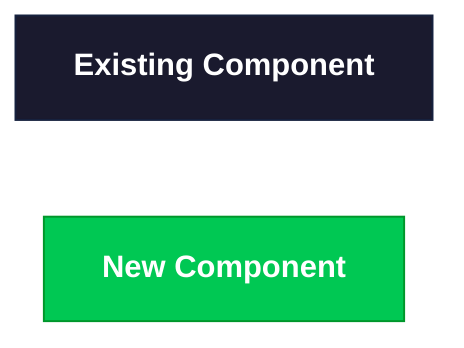

> Hiện tại **tất cả** components đều là **existing** (đen đậm). Khi thêm component mới, đổi class sang `new` (xanh lá).

---

## 0. Full Pipeline: CLI → Graph → Notion

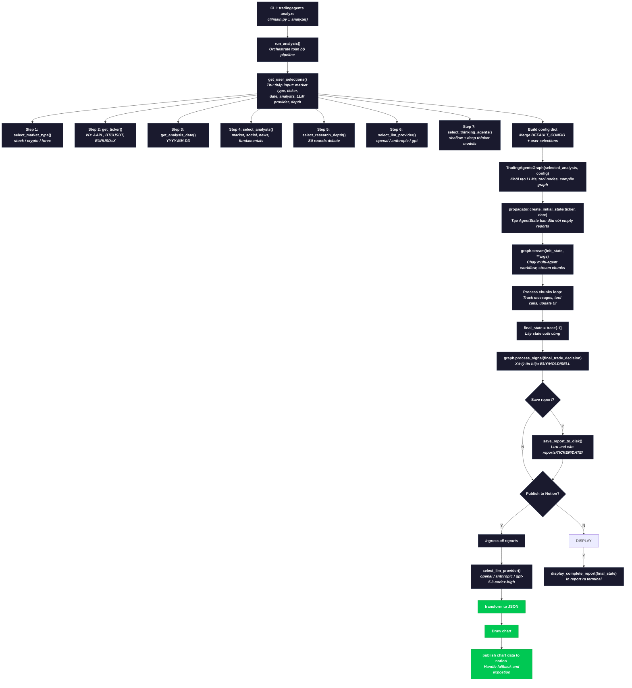

---

## 0.1 CLI User Selections Detail

```mermaid
flowchart LR
    subgraph CLI ["cli/main.py :: get_user_selections()"]
        direction TB
        M["select_market_type()"]:::existing --> T["get_ticker()"]:::existing
        T --> D["get_analysis_date()"]:::existing
        D --> A["select_analysts()"]:::existing
        A --> R["select_research_depth()"]:::existing
        R --> P["select_llm_provider()"]:::existing
        P --> TH["select_thinking_agents()"]:::existing
        TH --> EF["ask_anthropic_effort()<br/><i>Chỉ khi provider = anthropic</i>"]:::existing
        EF --> KL["ask_kline_config()<br/><i>Chỉ khi market = crypto</i>"]:::existing
    end

    subgraph Config ["Config Assembly"]
        KL --> CFG["DEFAULT_CONFIG.copy()"]:::existing
        CFG --> |"merge"| FINAL["Final config dict"]:::existing
    end

    FINAL --> GRAPH["TradingAgentsGraph(analysts, config)"]:::existing

    classDef existing fill:#1a1a2e,stroke:#16213e,color:#fff,font-weight:bold
    classDef new fill:#00C853,stroke:#00962b,color:#fff,font-weight:bold
```

| Step | Hàm | Mô tả |
|------|------|-------|
| 1 | `select_market_type()` | Chọn stock, crypto, hoặc forex |
| 2 | `get_ticker()` | Nhập ticker (AAPL, BTCUSDT, EURUSD=X) |
| 3 | `get_analysis_date()` | Nhập ngày phân tích, default = hôm nay |
| 4 | `select_analysts()` | Chọn analysts: market, social, news, fundamentals |
| 5 | `select_research_depth()` | Chọn số rounds debate (Bull vs Bear) |
| 6 | `select_llm_provider()` | Chọn openai hoặc anthropic |
| 7 | `select_thinking_agents()` | Chọn model cho shallow + deep thinking |
| 8 | `ask_anthropic_effort()` | Chỉ Anthropic: config effort level |
| 9 | `ask_kline_config()` | Chỉ crypto: interval + date range cho Binance klines |

---

## 0.2 Graph Initialization

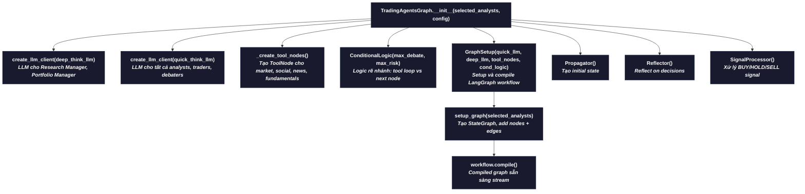

---

## 1. Flow tổng thể (Graph Execution)

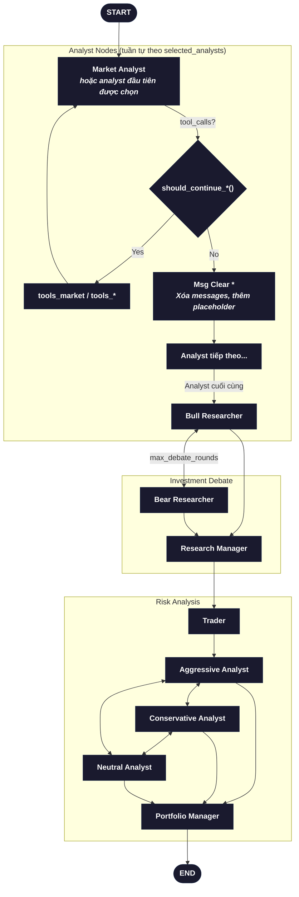

---

## 2. Market Analyst Node

**Parent function:** `create_market_analyst(llm)` -> `market_analyst_node(state)`
**Conditional:** `should_continue_market()` -> `tools_market` hoặc `Msg Clear Market`
**Output key:** `market_report`

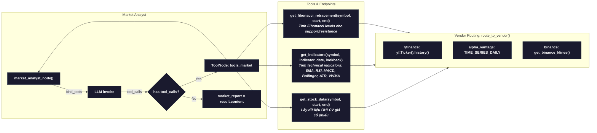

| Tool | Hàm | Mô tả |
|------|------|-------|
| `get_stock_data` | `core_stock_tools.py:get_stock_data()` | Lấy OHLCV qua `route_to_vendor()`. Primary: yfinance, fallback: alpha_vantage, binance |
| `get_indicators` | `technical_indicators_tools.py:get_indicators()` | Tính SMA/RSI/MACD/Bollinger/ATR/VWMA qua vendor routing |
| `get_fibonacci_retracement` | `core_stock_tools.py:get_fibonacci_retracement()` | Tính Fibonacci retracement levels (0, 0.236, 0.382, 0.5, 0.618, 1.0) |

---

## 3. Social Analyst Node

**Parent function:** `create_social_media_analyst(llm)` -> `social_media_analyst_node(state)`
**Conditional:** `should_continue_social()` -> `tools_social` hoặc `Msg Clear Social`
**Output key:** `sentiment_report`

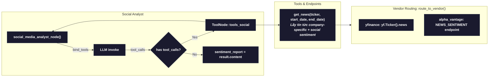

| Tool | Hàm | Mô tả |
|------|------|-------|
| `get_news` | `news_data_tools.py:get_news()` | Lấy tin company-specific qua `route_to_vendor()`. Phân tích sentiment từ social media |

---

## 4. News Analyst Node

**Parent function:** `create_news_analyst(llm)` -> `news_analyst_node(state)`
**Conditional:** `should_continue_news()` -> `tools_news` hoặc `Msg Clear News`
**Output key:** `news_report`

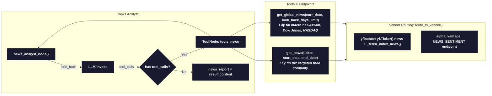

| Tool | Hàm | Mô tả |
|------|------|-------|
| `get_news` | `news_data_tools.py:get_news()` | Lấy tin tức targeted theo ticker qua vendor routing |
| `get_global_news` | `news_data_tools.py:get_global_news()` | Lấy tin macro từ indices (^GSPC, ^DJI, ^IXIC), deduplicate |

---

## 5. Fundamentals Analyst Node

**Parent function:** `create_fundamentals_analyst(llm)` -> `fundamentals_analyst_node(state)`
**Conditional:** `should_continue_fundamentals()` -> `tools_fundamentals` hoặc `Msg Clear Fundamentals`
**Output key:** `fundamentals_report`

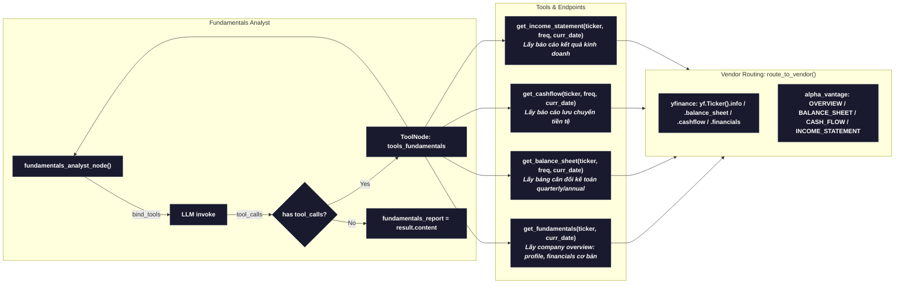

| Tool | Hàm | Mô tả |
|------|------|-------|
| `get_fundamentals` | `fundamental_data_tools.py:get_fundamentals()` | Lấy company overview, profile, basic financials |
| `get_balance_sheet` | `fundamental_data_tools.py:get_balance_sheet()` | Lấy balance sheet quarterly hoặc annual |
| `get_cashflow` | `fundamental_data_tools.py:get_cashflow()` | Lấy cash flow statement quarterly hoặc annual |
| `get_income_statement` | `fundamental_data_tools.py:get_income_statement()` | Lấy income statement quarterly hoặc annual |

---

## 6. Vendor Routing

Tất cả tool calls đều đi qua `route_to_vendor()` tại `dataflows/interface.py`.

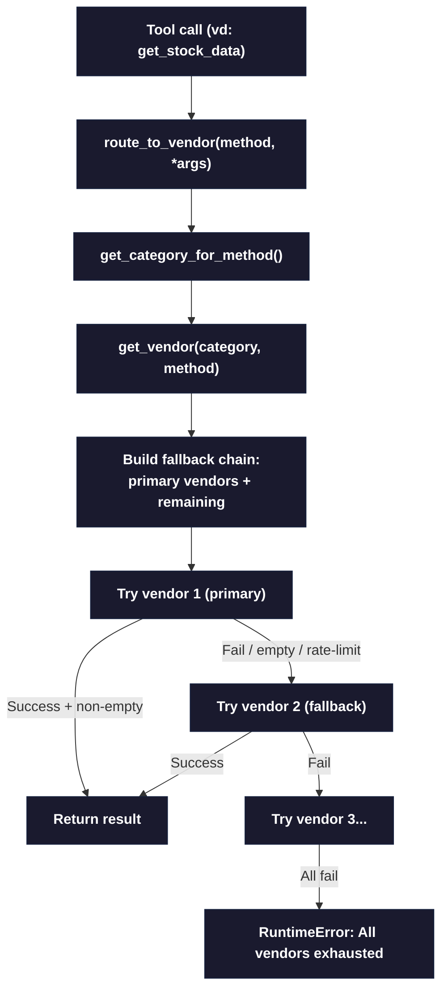

**Vendor mặc định theo category:**

| Category | Primary | Fallback |
|----------|---------|----------|
| `core_stock_apis` | yfinance | alpha_vantage, binance |
| `technical_indicators` | yfinance | alpha_vantage, binance |
| `fundamental_data` | yfinance | alpha_vantage |
| `news_data` | yfinance | alpha_vantage |

---

## 7. Conditional Logic

Mỗi analyst node có 1 hàm conditional tại `graph/conditional_logic.py`:

| Hàm | Logic |
|-----|-------|
| `should_continue_market(state)` | Nếu `last_message.tool_calls` -> `tools_market`, ngược lại -> `Msg Clear Market` |
| `should_continue_social(state)` | Nếu `last_message.tool_calls` -> `tools_social`, ngược lại -> `Msg Clear Social` |
| `should_continue_news(state)` | Nếu `last_message.tool_calls` -> `tools_news`, ngược lại -> `Msg Clear News` |
| `should_continue_fundamentals(state)` | Nếu `last_message.tool_calls` -> `tools_fundamentals`, ngược lại -> `Msg Clear Fundamentals` |

---

## 8. Notion Export Flow

**File:** `cli/notion_publisher.py`
**Trigger:** User chọn "Y" khi CLI hỏi "Publish to Notion?"
**Requires:** `NOTION_API_KEY` + `NOTION_PARENT_PAGE_ID` trong `.env`

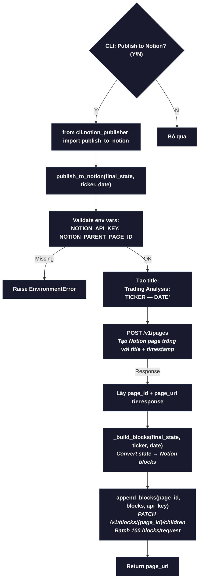

### Notion Page Structure (_build_blocks)

```mermaid
flowchart TD
    BS["_build_blocks(final_state)"]:::existing

    BS --> S1["<b>I. Analyst Team Reports</b>"]:::existing
    S1 --> S1A["Market Analyst → market_report"]:::existing
    S1 --> S1B["Social Analyst → sentiment_report"]:::existing
    S1 --> S1C["News Analyst → news_report"]:::existing
    S1 --> S1D["Fundamentals Analyst → fundamentals_report"]:::existing

    BS --> S2["<b>II. Research Team Decision</b>"]:::existing
    S2 --> S2A["Bull Researcher → bull_history"]:::existing
    S2 --> S2B["Bear Researcher → bear_history"]:::existing
    S2 --> S2C["Research Manager → judge_decision"]:::existing

    BS --> S3["<b>III. Trading Team Plan</b>"]:::existing
    S3 --> S3A["Trader → trader_investment_plan"]:::existing

    BS --> S4["<b>IV. Risk Management Team</b>"]:::existing
    S4 --> S4A["Aggressive Analyst → aggressive_history"]:::existing
    S4 --> S4B["Conservative Analyst → conservative_history"]:::existing
    S4 --> S4C["Neutral Analyst → neutral_history"]:::existing

    BS --> S5["<b>V. Portfolio Manager Decision</b>"]:::existing
    S5 --> S5A["Portfolio Manager → judge_decision"]:::existing

    BS --> S6["<b>VI. Investment Plan</b>"]:::existing
    BS --> S7["<b>VII. Final Trade Decision</b>"]:::existing

    classDef existing fill:#1a1a2e,stroke:#16213e,color:#fff,font-weight:bold
    classDef new fill:#00C853,stroke:#00962b,color:#fff,font-weight:bold
```

### Notion API Endpoints

| Hàm | HTTP Method | Endpoint | Mô tả |
|-----|-------------|----------|-------|
| `publish_to_notion()` | `POST` | `/v1/pages` | Tạo page mới dưới parent page |
| `_append_blocks()` | `PATCH` | `/v1/blocks/{page_id}/children` | Thêm blocks vào page, tối đa 100/request |

### Notion Block Helpers

| Hàm | Mô tả |
|-----|-------|
| `_heading2(text)` | Tạo heading_2 block cho section title |
| `_heading3(text)` | Tạo heading_3 block cho agent name |
| `_paragraph(text)` | Tạo paragraph block |
| `_divider()` | Tạo divider block giữa các sections |
| `_text_to_blocks(text)` | Split text dài thành nhiều paragraph blocks |
| `_chunks(text, 1900)` | Cắt text thành chunks ≤1900 chars (Notion limit 2000) |

---

## 9. Key Files

| File | Vai trò |
|------|---------|
| `cli/main.py` | CLI entry point: `analyze()`, `run_analysis()`, `get_user_selections()` |
| `cli/notion_publisher.py` | Notion export: `publish_to_notion()`, `_build_blocks()` |
| `cli/models.py` | Enum definitions: `AnalystType`, etc. |
| `cli/stats_handler.py` | Callback handler tracking LLM/tool call stats |
| `tradingagents/default_config.py` | Default config dict cho graph |
| `graph/setup.py` | Dựng graph, nối edges giữa các nodes |
| `graph/conditional_logic.py` | Quyết định loop tool hay chuyển node tiếp |
| `graph/trading_graph.py` | `TradingAgentsGraph` class, compile graph |
| `graph/propagation.py` | `Propagator`: tạo initial state, graph args |
| `agents/analysts/market_analyst.py` | Market node: OHLCV + indicators + Fibonacci |
| `agents/analysts/social_media_analyst.py` | Social node: sentiment + company news |
| `agents/analysts/news_analyst.py` | News node: targeted + global macro news |
| `agents/analysts/fundamentals_analyst.py` | Fundamentals node: financials + balance sheet |
| `agents/utils/agent_utils.py` | Re-export tất cả tools, helper functions |
| `dataflows/interface.py` | Vendor routing: yfinance -> alpha_vantage -> binance |
