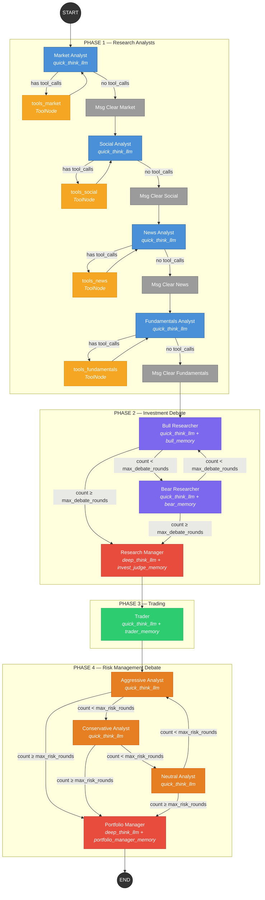

# TradingAgents LangGraph — Node & Edge Diagram

```mermaid
graph TD
    START((START))

    %% ── PHASE 1: ANALYST CHAIN ──────────────────────────
    subgraph Phase1["PHASE 1 — Research Analysts"]
        direction TB

        MA["Market Analyst<br/><i>quick_think_llm</i>"]
        TM["tools_market<br/><i>ToolNode</i>"]
        CM["Msg Clear Market"]

        SA["Social Analyst<br/><i>quick_think_llm</i>"]
        TS["tools_social<br/><i>ToolNode</i>"]
        CS["Msg Clear Social"]

        NA["News Analyst<br/><i>quick_think_llm</i>"]
        TN["tools_news<br/><i>ToolNode</i>"]
        CN["Msg Clear News"]

        FA["Fundamentals Analyst<br/><i>quick_think_llm</i>"]
        TF["tools_fundamentals<br/><i>ToolNode</i>"]
        CF["Msg Clear Fundamentals"]
    end

    %% ── PHASE 2: INVESTMENT DEBATE ──────────────────────
    subgraph Phase2["PHASE 2 — Investment Debate"]
        direction TB
        BULL["Bull Researcher<br/><i>quick_think_llm + bull_memory</i>"]
        BEAR["Bear Researcher<br/><i>quick_think_llm + bear_memory</i>"]
        RM["Research Manager<br/><i>deep_think_llm + invest_judge_memory</i>"]
    end

    %% ── PHASE 3: TRADING ────────────────────────────────
    subgraph Phase3["PHASE 3 — Trading"]
        TRADER["Trader<br/><i>quick_think_llm + trader_memory</i>"]
    end

    %% ── PHASE 4: RISK MANAGEMENT ────────────────────────
    subgraph Phase4["PHASE 4 — Risk Management Debate"]
        direction TB
        AGG["Aggressive Analyst<br/><i>quick_think_llm</i>"]
        CON["Conservative Analyst<br/><i>quick_think_llm</i>"]
        NEU["Neutral Analyst<br/><i>quick_think_llm</i>"]
        PM["Portfolio Manager<br/><i>deep_think_llm + portfolio_manager_memory</i>"]
    end

    ENDN((END))

    %% ── EDGES ───────────────────────────────────────────

    %% Phase 1: sequential analyst chain
    START --> MA

    MA -- "has tool_calls" --> TM
    TM --> MA
    MA -- "no tool_calls" --> CM
    CM --> SA

    SA -- "has tool_calls" --> TS
    TS --> SA
    SA -- "no tool_calls" --> CS
    CS --> NA

    NA -- "has tool_calls" --> TN
    TN --> NA
    NA -- "no tool_calls" --> CN
    CN --> FA

    FA -- "has tool_calls" --> TF
    TF --> FA
    FA -- "no tool_calls" --> CF
    CF --> BULL

    %% Phase 2: bull-bear debate loop
    BULL -- "count < max_debate_rounds" --> BEAR
    BEAR -- "count < max_debate_rounds" --> BULL
    BULL -- "count ≥ max_debate_rounds" --> RM
    BEAR -- "count ≥ max_debate_rounds" --> RM

    %% Phase 2 → 3
    RM --> TRADER

    %% Phase 3 → 4
    TRADER --> AGG

    %% Phase 4: risk debate loop (Aggressive → Conservative → Neutral → Aggressive …)
    AGG -- "count < max_risk_rounds" --> CON
    CON -- "count < max_risk_rounds" --> NEU
    NEU -- "count < max_risk_rounds" --> AGG

    AGG -- "count ≥ max_risk_rounds" --> PM
    CON -- "count ≥ max_risk_rounds" --> PM
    NEU -- "count ≥ max_risk_rounds" --> PM

    PM --> ENDN

    %% ── STYLES ──────────────────────────────────────────
    classDef analyst fill:#4A90D9,stroke:#2C5F8A,color:#fff
    classDef tool fill:#F5A623,stroke:#D48806,color:#fff
    classDef clear fill:#9B9B9B,stroke:#6B6B6B,color:#fff
    classDef researcher fill:#7B68EE,stroke:#5B48CE,color:#fff
    classDef manager fill:#E74C3C,stroke:#C0392B,color:#fff
    classDef trader fill:#2ECC71,stroke:#27AE60,color:#fff
    classDef risk fill:#E67E22,stroke:#D35400,color:#fff
    classDef terminal fill:#333,stroke:#111,color:#fff

    class MA,SA,NA,FA analyst
    class TM,TS,TN,TF tool
    class CM,CS,CN,CF clear
    class BULL,BEAR researcher
    class RM,PM manager
    class TRADER trader
    class AGG,CON,NEU risk
    class START,ENDN terminal
```
