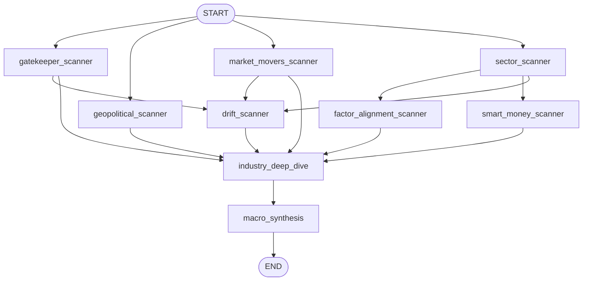
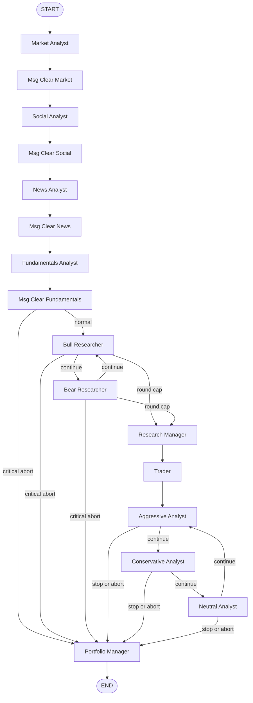
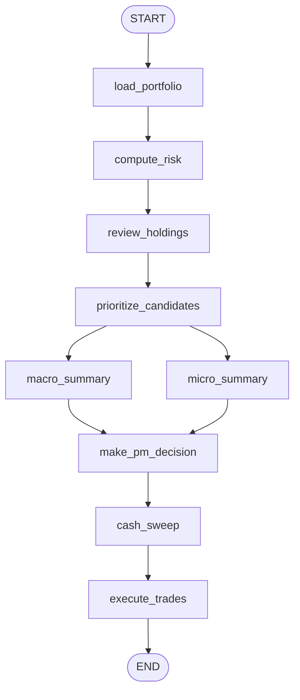
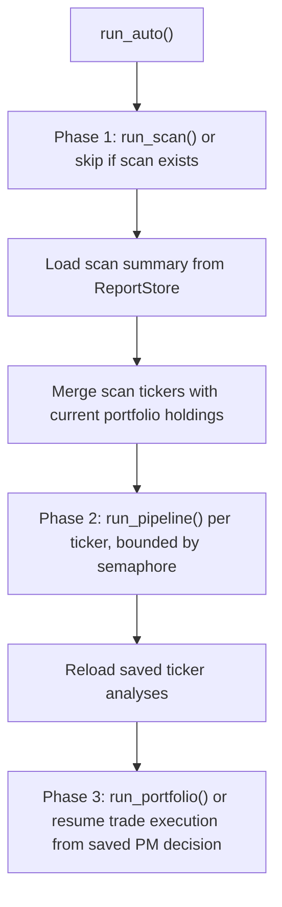

# Graph Execution Reference

This document is the code-derived runtime reference for the current TradingAgents graphs.
It focuses on what actually executes:

- which node runs when
- which agents are pure LLM nodes vs Python closure nodes
- which tools are prefetched, called inline, or not used
- what state each node reads and writes

Source of truth:

- `tradingagents/graph/scanner_graph.py`
- `tradingagents/graph/scanner_setup.py`
- `tradingagents/graph/trading_graph.py`
- `tradingagents/graph/setup.py`
- `tradingagents/graph/conditional_logic.py`
- `tradingagents/graph/portfolio_graph.py`
- `tradingagents/graph/portfolio_setup.py`
- `agent_os/backend/services/langgraph_engine.py`

## Execution Primitives

The runtime currently uses four distinct execution patterns. Most older docs only describe one.

| Pattern | Where it happens | What it means |
| --- | --- | --- |
| Prefetch before LLM call | `market_analyst`, `news_analyst`, `social_media_analyst`, `fundamentals_analyst` | Python calls selected tools up front via `prefetch_tools_parallel()` and injects the results into prompt context. |
| Inline tool loop inside the node | scanner agents, `market_analyst`, `fundamentals_analyst`, `holding_reviewer` | The node binds tools and resolves them internally through `run_tool_loop()`; no separate LangGraph tool node is required at runtime. |
| Pure reasoning node | debate agents, risk agents, `macro_synthesis`, `macro_summary`, `micro_summary`, `pm_decision` | The node only calls the LLM with prompt context and does not bind tools. |
| Plain Python closure node | `load_portfolio`, `compute_risk`, `prioritize_candidates`, `cash_sweep`, `execute_trades` | No LLM call. These nodes manipulate state directly in Python. |

## 1. Scanner Graph

`ScannerGraph` is a fixed graph with one deterministic topology.

### Scanner Node Reference

| Node | Tier | Trigger | Tools / integrations | Reads from state | Writes to state |
| --- | --- | --- | --- | --- | --- |
| `gatekeeper_scanner` | quick | always from `START` | `get_gatekeeper_universe` via `run_tool_loop()` | `scan_date`, `messages` | `gatekeeper_universe_report`, `messages`, `sender` |
| `geopolitical_scanner` | quick | always from `START` | `get_topic_news` via `run_tool_loop()` | `scan_date`, `messages` | `geopolitical_report`, `messages`, `sender` |
| `market_movers_scanner` | quick | always from `START` | `get_market_indices` via `run_tool_loop()` | `scan_date`, `messages` | `market_movers_report`, `messages`, `sender` |
| `sector_scanner` | quick | always from `START` | `get_sector_performance` via `run_tool_loop()` | `scan_date`, `messages` | `sector_performance_report`, `messages`, `sender` |
| `factor_alignment_scanner` | quick | after `sector_scanner` | `get_topic_news`, `get_earnings_calendar` via `run_tool_loop()` | `scan_date`, `sector_performance_report`, `messages` | `factor_alignment_report`, `messages`, `sender` |
| `smart_money_scanner` | quick | after `sector_scanner` | `get_insider_buying_stocks`, `get_unusual_volume_stocks`, `get_breakout_accumulation_stocks` via `run_tool_loop()` | `scan_date`, `sector_performance_report`, `messages` | `smart_money_report`, `messages`, `sender` |
| `drift_scanner` | quick | after `sector_scanner` and `market_movers_scanner` and `gatekeeper_scanner` | `get_gap_candidates`, `get_topic_news`, `get_earnings_calendar` via `run_tool_loop()` | `scan_date`, `gatekeeper_universe_report`, `market_movers_report`, `sector_performance_report`, `messages` | `drift_opportunities_report`, `messages`, `sender` |
| `industry_deep_dive` | mid | waits for all phase-1 predecessors | `get_industry_performance`, `get_topic_news` via `run_tool_loop()` | phase-1 reports, `messages` | `industry_deep_dive_report`, `messages`, `sender` |
| `macro_synthesis` | deep | after `industry_deep_dive` | no tools; deterministic ranking from `_build_candidate_rankings()` before LLM call | all prior scanner reports, `messages` | `macro_scan_summary`, `messages`, `sender` |

### Scanner Tool Surface

| Tool | Backing layer |
| --- | --- |
| `get_gatekeeper_universe` | `route_to_vendor("get_gatekeeper_universe")` |
| `get_market_indices` | `route_to_vendor("get_market_indices")` |
| `get_sector_performance` | `route_to_vendor("get_sector_performance")` |
| `get_topic_news` | `route_to_vendor("get_topic_news")` |
| `get_earnings_calendar` | `route_to_vendor("get_earnings_calendar")` |
| `get_gap_candidates` | `route_to_vendor("get_gap_candidates")` |
| `get_industry_performance` | `route_to_vendor("get_industry_performance")` |
| `get_insider_buying_stocks` | Finviz screener helper in `scanner_tools.py` |
| `get_unusual_volume_stocks` | Finviz screener helper in `scanner_tools.py` |
| `get_breakout_accumulation_stocks` | Finviz screener helper in `scanner_tools.py` |

### Scanner Runtime Notes

- `macro_synthesis` is a pure reasoning node. It does not call tools.
- Candidate ranking is partly deterministic before the final LLM call. `_build_candidate_rankings()` scores tickers from prior reports and restricts them to names that appeared in the gatekeeper report.
- `run_scan()` in `LangGraphEngine` streams LangGraph events, captures the root `on_chain_end` output, then saves `.md` artifacts plus parsed `macro_scan_summary` JSON.

## 2. Per-Ticker Trading Graph

`TradingAgentsGraph` is the per-ticker deep-dive graph used by pipeline and auto runs.

The current runtime is sequential through the analyst stage, not parallel.

### Important Runtime Nuance: legacy `tools_*` nodes

`GraphSetup` still compiles `tools_market`, `tools_social`, `tools_news`, and `tools_fundamentals` ToolNode nodes.
However, the current analyst implementations already prefetch or execute their tools inside the analyst node itself.
That means:

- `market_analyst` resolves `get_indicators` inside `run_tool_loop()`
- `fundamentals_analyst` resolves raw statement tools inside `run_tool_loop()`
- `news_analyst` and `social_media_analyst` use prefetched data and do not emit tool calls

So in the current code path, the analyst stage usually exits each analyst directly to its `Msg Clear *` node and the compiled `tools_*` graph nodes are effectively dormant.

### Pipeline Node Reference

| Node | Tier | Pattern | Tools / integrations | Reads from state | Writes to state |
| --- | --- | --- | --- | --- | --- |
| `Market Analyst` | quick | prefetch + inline tool loop | Prefetches `get_macro_regime` and `get_stock_data`; can iteratively call `get_indicators` via `run_tool_loop()` | `company_of_interest`, `trade_date`, `messages` | `market_report`, `macro_regime_report`, `messages` |
| `Msg Clear Market` | n/a | Python helper | `create_msg_delete()` clears message history and inserts placeholder | `messages` | `messages` |
| `Social Analyst` | quick | prefetch + pure LLM | Prefetches `get_news`; no bound tools after prefetch | `company_of_interest`, `trade_date`, `messages` | `sentiment_report`, `messages` |
| `Msg Clear Social` | n/a | Python helper | `create_msg_delete()` | `messages` | `messages` |
| `News Analyst` | quick | prefetch + pure LLM | Prefetches `get_news` and `get_global_news`; no bound tools after prefetch | `company_of_interest`, `trade_date`, `messages` | `news_report`, `messages` |
| `Msg Clear News` | n/a | Python helper | `create_msg_delete()` | `messages` | `messages` |
| `Fundamentals Analyst` | quick | prefetch + inline tool loop | Prefetches `get_ttm_analysis`, `get_fundamentals`, `get_peer_comparison`, `get_sector_relative`; can iteratively call `get_balance_sheet`, `get_cashflow`, `get_income_statement` via `run_tool_loop()` | `company_of_interest`, `trade_date`, `messages` | `fundamentals_report`, `messages` |
| `Msg Clear Fundamentals` | n/a | Python helper | `create_msg_delete()` | `messages` | `messages` |
| `Bull Researcher` | mid | pure LLM + memory | `bull_memory.get_memories()` | analyst reports, debate state | `investment_debate_state` |
| `Bear Researcher` | mid | pure LLM + memory | `bear_memory.get_memories()` | analyst reports, debate state | `investment_debate_state` |
| `Research Manager` | deep | pure LLM + memory | `invest_judge_memory.get_memories()` | analyst reports, macro regime, debate history | `investment_plan`, `investment_debate_state` |
| `Trader` | mid | pure LLM + memory | `trader_memory.get_memories()` | analyst reports, `investment_plan` | `trader_investment_plan`, `messages`, `sender` |
| `Aggressive Analyst` | quick | pure LLM | no tools | analyst reports, trader plan, risk debate state | `risk_debate_state` |
| `Conservative Analyst` | quick | pure LLM | no tools | analyst reports, trader plan, risk debate state | `risk_debate_state` |
| `Neutral Analyst` | quick | pure LLM | no tools | analyst reports, trader plan, risk debate state | `risk_debate_state` |
| `Portfolio Manager` | deep | pure LLM + memory | `portfolio_manager_memory.get_memories()` | analyst reports, macro regime, trader plan, risk debate state | `final_trade_decision`, `risk_debate_state` |

### Pipeline Routing Rules

| Decision point | Rule |
| --- | --- |
| After each analyst | `GraphSetup._should_short_circuit_to_portfolio_manager()` jumps directly to `Portfolio Manager` if `market_report` or `fundamentals_report` contains `[CRITICAL ABORT]`. |
| Debate loop | `ConditionalLogic.should_continue_debate()` alternates bull/bear until `count >= 2 * max_debate_rounds`, then routes to `Research Manager`. |
| Risk loop | `ConditionalLogic.should_continue_risk_analysis()` rotates aggressive -> conservative -> neutral until `count >= 3 * max_risk_discuss_rounds`, then routes to `Portfolio Manager`. |
| Critical abort during debate or risk | Both conditional functions also short-circuit to `Portfolio Manager`. |

### Pipeline Tool Surface

| Tool | Used by | Backing layer |
| --- | --- | --- |
| `get_stock_data` | Market Analyst prefetch | `route_to_vendor("get_stock_data")` |
| `get_macro_regime` | Market Analyst prefetch | derived macro regime helper |
| `get_indicators` | Market Analyst inline loop | `route_to_vendor("get_indicators")` |
| `get_news` | Social Analyst prefetch, News Analyst prefetch | `route_to_vendor("get_news")` |
| `get_global_news` | News Analyst prefetch | `route_to_vendor("get_global_news")` |
| `get_ttm_analysis` | Fundamentals Analyst prefetch | derived helper using routed financial statements |
| `get_fundamentals` | Fundamentals Analyst prefetch | `route_to_vendor("get_fundamentals")` |
| `get_peer_comparison` | Fundamentals Analyst prefetch | derived comparison helper |
| `get_sector_relative` | Fundamentals Analyst prefetch | derived comparison helper |
| `get_balance_sheet` | Fundamentals Analyst inline loop | `route_to_vendor("get_balance_sheet")` |
| `get_cashflow` | Fundamentals Analyst inline loop | `route_to_vendor("get_cashflow")` |
| `get_income_statement` | Fundamentals Analyst inline loop | `route_to_vendor("get_income_statement")` |

### Pipeline Runtime Notes

- `run_pipeline()` in `LangGraphEngine` builds initial state through `Propagator.create_initial_state()`, streams events, captures the root final state, and persists analysis JSON plus markdown checkpoints.
- `TradingAgentsGraph` exposes `debate_graph` and `risk_graph` subgraphs for reruns from checkpoints.

## 3. Portfolio Graph

`PortfolioGraph` mixes plain Python workflow steps with four LLM nodes.

### Portfolio Node Reference

| Node | Tier | Pattern | Tools / integrations | Reads from state | Writes to state |
| --- | --- | --- | --- | --- | --- |
| `load_portfolio` | n/a | Python closure | `PortfolioRepository.get_portfolio_with_holdings()` | `portfolio_id`, `prices` | `portfolio_data`, `sender` |
| `compute_risk` | n/a | Python closure | `compute_portfolio_risk()` | `portfolio_data`, `prices`, `scan_summary` | `risk_metrics`, `sender` |
| `review_holdings` | mid | inline tool loop | `get_stock_data`, `get_news` via `run_tool_loop()` | `portfolio_data`, `analysis_date`, `messages` | `holding_reviews`, `messages`, `sender` |
| `prioritize_candidates` | n/a | Python closure | `_completed_scan_candidates()`, `build_selection_memory()`, `prioritize_candidates()` | `portfolio_data`, `scan_summary`, `ticker_analyses`, `prices` | `prioritized_candidates`, `sender` |
| `macro_summary` | mid | pure LLM + memory | `MacroMemory.build_macro_context()` and `record_macro_state()` | `scan_summary`, `analysis_date`, `messages` | `macro_brief`, `macro_memory_context`, `messages`, `sender` |
| `micro_summary` | mid | pure LLM + memory | `ReflexionMemory.build_context()` | `holding_reviews`, `prioritized_candidates`, `ticker_analyses`, `analysis_date`, `messages` | `micro_brief`, `micro_memory_context`, `messages`, `sender` |
| `make_pm_decision` | deep | pure LLM with structured output | `llm.with_structured_output(PMDecisionSchema)` with raw fallback | `macro_brief`, `micro_brief`, `portfolio_data`, `analysis_date`, `messages` | `pm_decision`, `messages`, `sender` |
| `cash_sweep` | n/a | Python closure | adds automatic SGOV buy when cash exceeds threshold | `portfolio_data`, `pm_decision`, `prices` | `pm_decision`, `cash_sweep`, `sender` |
| `execute_trades` | n/a | Python closure | `TradeExecutor.execute_decisions()` | `portfolio_id`, `analysis_date`, `prices`, `pm_decision` | `execution_result`, `sender` |

### Portfolio Runtime Notes

- `run_portfolio()` in `LangGraphEngine` loads scan summary and completed ticker analyses before building initial state.
- Only ticker analyses with a completed deep-dive decision are passed into the portfolio graph.
- `make_pm_decision` is the main portfolio LLM judge. `cash_sweep` is a deterministic post-processing step after that decision, not an LLM agent.

## 4. Auto Orchestration

`auto` is not a LangGraph graph. It is imperative orchestration in `LangGraphEngine.run_auto()`.

### Auto Rules

- `run_auto()` uses `create_report_store(run_id=root_run_id)` for all phases.
- If a scan already exists and `force` is false, phase 1 is skipped.
- Phase 2 is concurrent but bounded by `max_concurrent_pipelines`.
- If a ticker pipeline finishes without a completed deep-dive decision, that ticker is excluded from portfolio selection.
- If failed tickers exist and `continue_on_ticker_failure` is false, auto raises before phase 3.
- If a saved PM decision exists, auto can resume directly into trade execution instead of re-running the full portfolio graph.

## 5. Observability Mapping

The docs above describe logical node execution. AgentOS event streaming adds another layer:

- `LangGraphEngine._map_langgraph_event()` converts LangGraph `on_chat_model_*`, `on_tool_*`, and root chain events into frontend event types.
- Inline tool loops still emit tool start/end events because tool invocation happens through LangChain tool bindings inside the node.
- Plain Python closure nodes such as `load_portfolio` or `cash_sweep` do not produce LLM/tool events unless the engine emits a system log around them.

## 6. Maintenance Checklist

When graph behavior changes, verify in this order:

1. topology in `tradingagents/graph/*setup.py`
2. node implementation in `tradingagents/agents/**`
3. routing logic in `tradingagents/graph/conditional_logic.py`
4. orchestration in `agent_os/backend/services/langgraph_engine.py`
5. then update this document and the shorter overview docs
