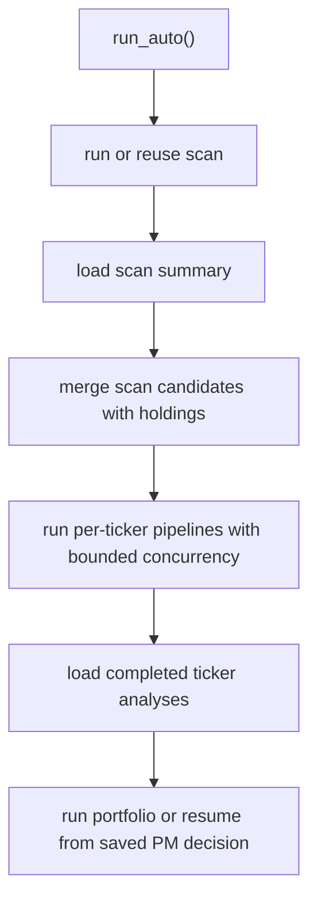

<!-- Last verified: 2026-03-31 -->

# Graph Flows

This is the shortest current overview of the runtime topology.
For exact node behavior, tool usage, and state writes, use [`graph_execution_reference.md`](./graph_execution_reference.md).

## Scanner

- Phase 1 fan-out: `gatekeeper_scanner`, `geopolitical_scanner`, `market_movers_scanner`, `sector_scanner`
- Bounded follow-ons: `factor_alignment_scanner`, `smart_money_scanner`, `drift_scanner`
- Fan-in synthesis path: `industry_deep_dive -> macro_synthesis`

## Per-Ticker Trading Pipeline

- Analysts run sequentially in the compiled graph.
- Debate alternates bull and bear until `max_debate_rounds`.
- Risk rotates aggressive, conservative, and neutral until `max_risk_discuss_rounds`.
- Critical aborts can short-circuit directly to `Portfolio Manager`.

## Portfolio

- `load_portfolio`, `compute_risk`, `prioritize_candidates`, `cash_sweep`, and `execute_trades` are Python closure nodes.
- `review_holdings` is the only portfolio node with inline tool usage.
- `macro_summary` and `micro_summary` run in parallel and fan in to `make_pm_decision`.

## Auto

`auto` is imperative orchestration in `agent_os/backend/services/langgraph_engine.py`, not its own LangGraph DAG.

## Runtime Notes

- The root identifier is always `run_id`.
- All run-scoped artifacts live under `reports/daily/{date}/{run_id}/`.
- Background tasks execute runs; WebSocket streams cached and persisted events for the same run.
