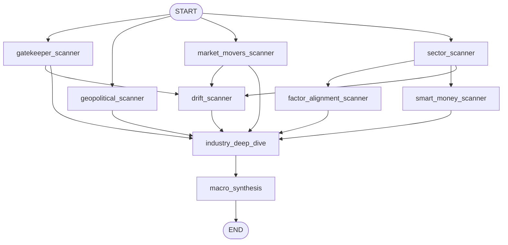
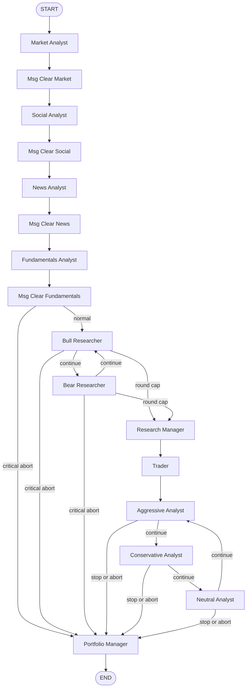
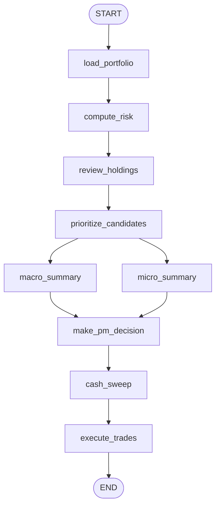

# TradingAgents Graph Flows

This is the short overview of the current graph topology.
For the node-by-node runtime reference, tool surface, and orchestration details, see [graph_execution_reference.md](./graph_execution_reference.md).

## Scanner

- Phase 1 fan-out: `gatekeeper_scanner`, `geopolitical_scanner`, `market_movers_scanner`, `sector_scanner`
- Phase 1 follow-ons: `factor_alignment_scanner`, `smart_money_scanner`, `drift_scanner`
- Phase 2 fan-in: `industry_deep_dive`
- Phase 3 final synthesis: `macro_synthesis`

## Per-Ticker Pipeline

- Analysts run sequentially in the compiled graph.
- Critical abort in `market_report` or `fundamentals_report` can jump directly to `Portfolio Manager`.
- Debate loop alternates bull/bear until `max_debate_rounds`.
- Risk loop rotates aggressive/conservative/neutral until `max_risk_discuss_rounds`.

## Portfolio

- `load_portfolio`, `compute_risk`, `prioritize_candidates`, `cash_sweep`, and `execute_trades` are Python closure nodes.
- `review_holdings`, `macro_summary`, `micro_summary`, and `make_pm_decision` are LLM nodes.

## Auto

`auto` is imperative orchestration in `agent_os/backend/services/langgraph_engine.py`, not its own LangGraph DAG:

1. run or skip scan
2. load scan summary
3. merge scan tickers with holdings
4. run per-ticker pipelines concurrently
5. run portfolio phase or resume execution from saved PM decision
