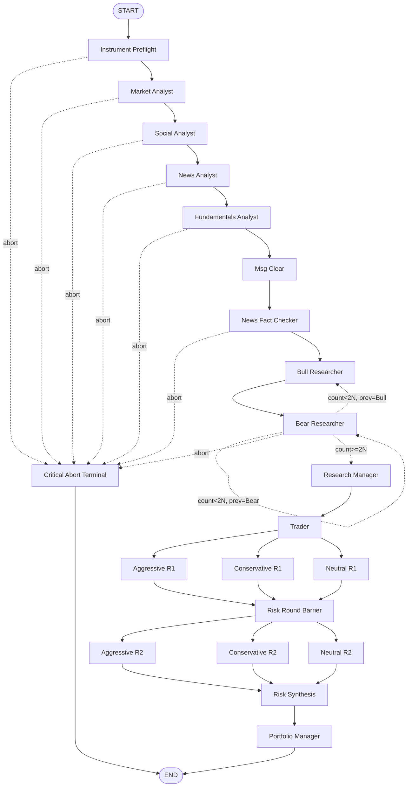
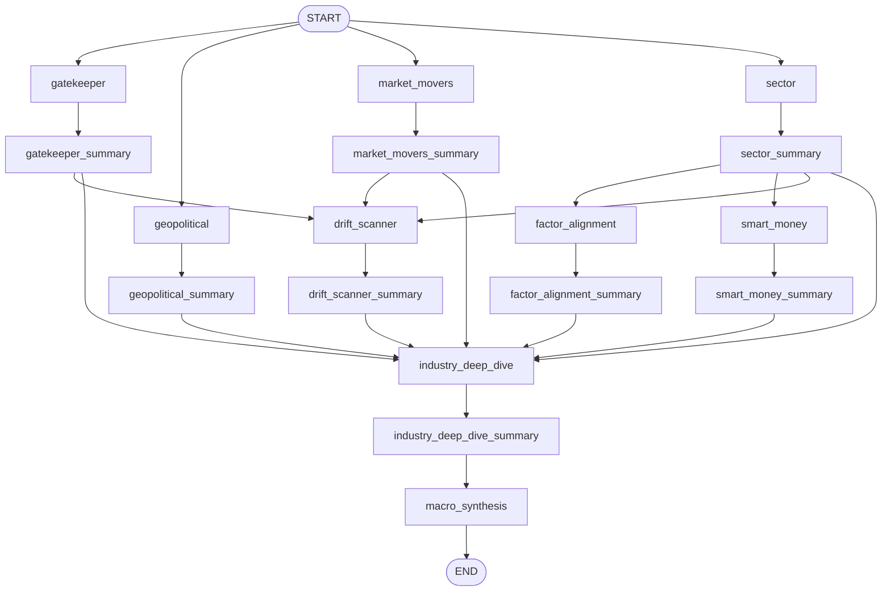
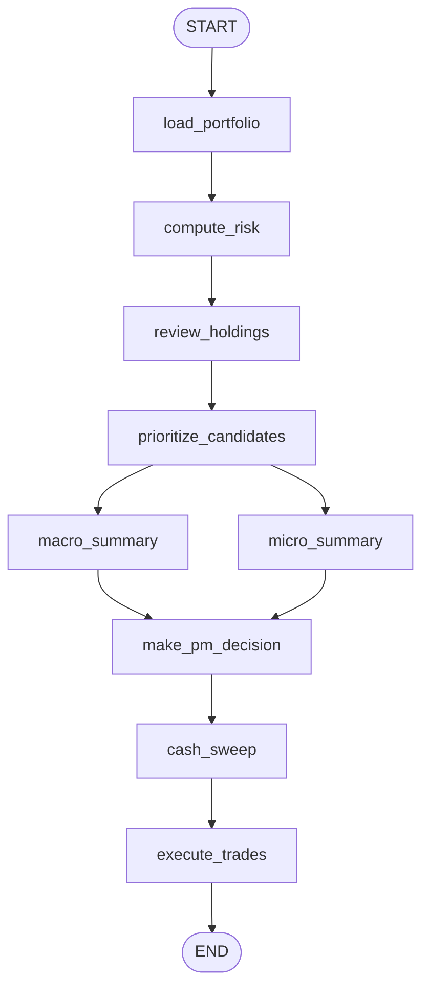

# TradingAgents — LangGraph Implementation Reference

> **Scope**: Complete behavioral specification of the three LangGraph `StateGraph`
> instances defined under `tradingagents/graph/` — the **Trading Graph**,
> the **Scanner Graph**, and the **Portfolio Graph** — including every node,
> edge, conditional router, controller, tool binding, fallback path, and
> terminal state. The goal is that an engineer can trace any input from
> entry to a finish state, understand each decision point, and predict
> system behavior under failure.

---

## 1. LangGraph Structure

The repository defines **three distinct `StateGraph` instances**, each owned
by its own builder and each operating on its own typed state schema.
All three are compiled with `MemorySaver()` so that intermediate checkpoints
are persisted for UI resumption.

| Graph | Builder | State Schema | Compiler |
|---|---|---|---|
| Trading | `tradingagents/graph/setup.py::GraphSetup.setup_graph()` | `AgentState` (extends `MessagesState`) | `MemorySaver()` |
| Scanner | `tradingagents/graph/scanner_setup.py` (used by `ScannerGraph`) | `ScannerState` | `MemorySaver()` |
| Portfolio | `tradingagents/graph/portfolio_setup.py::build_portfolio_graph()` | `PortfolioManagerState` | `MemorySaver()` |

In addition there are **partial sub-graphs** built dynamically for
re-runs from a checkpoint:

* `build_debate_subgraph(...)` — starts at **Bull Researcher** (skips analysts).
* `build_risk_subgraph(...)` — starts at the parallel **R1** risk debators.
* `setup_graph_from(start_node)` — generic scanner partial graph; uses
  `SCANNER_PREDECESSORS` adjacency and `get_scanner_descendants(start_node)`
  to compute the reachable subgraph.

### 1.1 Trading Graph (`AgentState`)

**Entry**: `Instrument Preflight`
**Finish**: `END` (LangGraph sentinel)

```
Instrument Preflight
        │
        ├─ critical-abort? ──► Critical Abort Terminal ──► END
        ▼
Market Analyst   (sequential)
        │
        ├─ critical-abort? ──► Critical Abort Terminal ──► END
        ▼
Social Analyst
        │
        ├─ critical-abort? ──► Critical Abort Terminal ──► END
        ▼
News Analyst
        │
        ├─ critical-abort? ──► Critical Abort Terminal ──► END
        ▼
Fundamentals Analyst
        │
        ├─ critical-abort? ──► Critical Abort Terminal ──► END
        ▼
Msg Clear (deterministic)
        ▼
News Fact Checker (validation)
        ▼
Bull Researcher ◄────────────┐
        ▼                    │
Bear Researcher ─────────────┤  loop while count < max_debate_rounds
        ▼                    │
   conditional ──────────────┘
        ▼ (loop ends)
Research Manager
        ▼
Trader
        ▼
   ┌────────────────┬───────────────┬───────────────┐
   ▼                ▼               ▼               │
Aggressive R1   Conservative R1   Neutral R1        │  parallel fan-out
   └────────────────┼───────────────┘               │
                    ▼                               │
            Risk Round Barrier                      │
                    ▼                               │
   ┌────────────────┬───────────────┬───────────────┘
   ▼                ▼               ▼
Aggressive R2   Conservative R2   Neutral R2          parallel fan-out
   └────────────────┼───────────────┘
                    ▼
            Risk Synthesis
                    ▼
            Portfolio Manager
                    ▼
                  END
```

**`AgentState` (key fields, see `agent_states.py`)**

* Identity / context: `run_id`, `company_of_interest`, `trade_date`,
  `instrument_kind`, `instrument_key`.
* Reports (free-form text): `market_report`, `sentiment_report`,
  `news_report`, `fundamentals_report`,
  `investment_plan`, `trader_investment_plan`, `final_trade_decision`.
* Structured variants (Pydantic JSON strings): `market_report_structured`,
  `news_report_structured`, `fundamentals_report_structured`,
  `risk_synthesis_structured`.
* Debate state: `investment_debate_state` (`InvestDebateState` —
  `bull_history`, `bear_history`, `history`, `current_response`,
  `judge_decision`, `count`).
* Risk parallel: `risk_r1_aggressive`, `risk_r1_conservative`,
  `risk_r1_neutral`, `risk_r2_*`, plus legacy `risk_debate_state`
  rebuilt by Risk Synthesis for backward compatibility.
* Terminal flags: `analysis_status` (`completed` | `aborted`),
  `terminal_action` (`SELL` | `AVOID` | …),
  `sender` (last node identifier).

### 1.2 Scanner Graph (`ScannerState`)

**Entry**: `START` fans out to four Phase-1a nodes simultaneously.
**Finish**: `END` after `macro_synthesis`.

```
Phase 1a (parallel): gatekeeper, geopolitical, market_movers, sector
   │  each → its own *_summarizer (deterministic LLM-free unless evidence)
   ▼
Phase 1b: factor_alignment, smart_money    (depend on sector_summary)
   │  → factor_alignment_summarizer, smart_money_summarizer
   ▼
Phase 1c: drift_scanner                    (depends on
                                             sector_summary +
                                             market_movers_summary +
                                             gatekeeper_summary)
   │  → drift_scanner_summarizer
   ▼
Phase 2: industry_deep_dive                (fan-in from all Phase-1
                                             summaries)
   │  → industry_deep_dive_summarizer
   ▼
Phase 3: macro_synthesis
   ▼
  END
```

`ScannerState` uses a custom `_last_value` reducer per field to merge
parallel writes — the **last non-empty value wins** when concurrent
nodes write the same key.

`SCANNER_PREDECESSORS` (declared in `scanner_setup.py`) is the canonical
adjacency map; it is the only source of truth for which Phase-1 outputs
each downstream node depends on. `get_scanner_descendants(start_node)` is
used for partial reruns.

### 1.3 Portfolio Graph (`PortfolioManagerState`)

**Entry**: `load_portfolio`
**Finish**: `END` after `execute_trades`.

```
load_portfolio          (deterministic)
        ▼
compute_risk            (deterministic)
        ▼
review_holdings         (LLM + tools: holding_reviewer)
        ▼
prioritize_candidates   (deterministic)
        ▼
   ┌─────────────────┐
   ▼                 ▼
macro_summary   micro_summary       (parallel LLM, no tools)
   └────────┬────────┘
            ▼
      make_pm_decision  (LLM with structured Pydantic output)
            ▼
      cash_sweep        (deterministic in-place mutation)
            ▼
      execute_trades    (deterministic — repository write)
            ▼
           END
```

`PortfolioManagerState` carries: `analysis_date`, `portfolio_data` (JSON
string), `holding_reviews` (JSON), `prioritized_candidates` (JSON),
`scan_summary`, `macro_brief`, `micro_brief`, `macro_memory_context`,
`micro_memory_context`, `ticker_analyses`, `pm_decision`, `sender`.

---

## 2. Execution Flow

### 2.1 Trading Graph — End-to-End

1. **Entry** (`TradingAgentsGraph.propagate(...)`):
   `Propagator.create_initial_state()` builds the initial `AgentState`
   with empty reports, `count=0`, fresh `InvestDebateState` /
   `RiskDebateState`, and graph args `recursion_limit=100`,
   `stream_mode="values"`.
2. **Instrument Preflight** validates `instrument_key`. On failure it
   sets a `[CRITICAL ABORT]`-prefixed report and routes to the
   **Critical Abort Terminal**.
3. **Sequential analysts** — Market → Social → News → Fundamentals.
   After each analyst the conditional checks the just-written report
   for the `[CRITICAL ABORT]` prefix; if present, the graph routes to
   **Critical Abort Terminal**.
4. **Msg Clear** deterministically wipes the LangChain `messages`
   buffer to prevent leakage of analyst tool-call traces into the
   debate.
5. **News Fact Checker** validates the structured news payload against
   persisted `NewsEvidenceStore` records. It can re-trigger a critical
   abort or sanitize the payload.
6. **Debate loop**: Bull → Bear → conditional. The conditional reads
   `investment_debate_state.count`, `current_response`, and
   `max_debate_rounds`; routes to **Bull**, **Bear**, **Critical Abort
   Terminal**, or **Research Manager**.
7. **Research Manager** synthesizes the debate into an
   `investment_plan` and `Buy/Sell/Hold` verdict (with deterministic
   fallback on timeout).
8. **Trader** translates the plan into a concrete trade plan, applying
   a hard guardrail (raises `RuntimeError`) if upstream is empty or if
   entry-price drift exceeds the configured threshold.
9. **Risk parallel R1** — three debators write `risk_r1_aggressive`,
   `risk_r1_conservative`, `risk_r1_neutral` simultaneously.
10. **Risk Round Barrier** — no-op synchronization that gates R2 on
    R1 completion (returns `{"sender": "risk_round_barrier"}`).
11. **Risk parallel R2** — the same three debators read all three R1
    responses and write `risk_r2_*`.
12. **Risk Synthesis** — fan-in node. Builds `risk_debate_state` from
    R1+R2 transcripts, produces `risk_synthesis_structured`.
    Hard-fails on any invoke error (no fallback).
13. **Portfolio Manager** — produces the final
    `Buy/Overweight/Hold/Underweight/Sell` rating and `final_trade_decision`.
14. **END**.

### 2.2 Scanner Graph — End-to-End

`ScannerGraph` wraps each scanner-node call in a semaphore so the
Phase-1a fan-out is bounded. Each scanner agent first calls
`check_and_load_report` (idempotency); if a previous valid report
exists for `(run_id, scan_date, agent)`, it is loaded from disk and
the LLM is skipped. Otherwise the agent invokes its tool loop and
the resulting report is saved via `save_node_report`.

Each scanner has a paired `*_summarizer` node. The summarizer:

* Returns `[NO_EVIDENCE]` deterministically if the upstream report is
  empty, degraded, or already tagged `[NO_EVIDENCE]`.
* Hard-fails with `RuntimeError` if the upstream report key is
  missing entirely or the LLM returns empty content.

After `macro_synthesis` the graph terminates. `macro_synthesis` itself
**hard-fails** on invoke error — there is no scanner fallback path.

### 2.3 Portfolio Graph — End-to-End

`load_portfolio` and `compute_risk` are pure-Python closures that
read the portfolio repo and compute exposure metrics into
`portfolio_data`. `review_holdings` (the only tool-using LLM node)
reviews each open position and emits `holding_reviews` JSON.
`prioritize_candidates` deterministically merges the scanner output
with prior deep-dive analyses to produce `prioritized_candidates`.

`macro_summary` and `micro_summary` run in parallel — neither uses
tools, both inject memory (`MacroMemory`, `ReflexionMemory`) and
compress upstream payloads into clinical 1-page briefs.

`make_pm_decision` is the only structured-output node: it uses
`llm.with_structured_output(PMDecisionSchema)` with a fallback to
plain LLM + `extract_json`. It produces a `PMDecisionSchema` JSON
covering `macro_regime`, `sells`, `buys`, `holds`, `cash_reserve_pct`,
and a `forensic_report`.

`cash_sweep` mutates `pm_decision` **in-place**, appending a
synthetic SGOV buy when free cash exceeds the configured target.
`execute_trades` writes the decision to the portfolio store.

---

## 3. Agent Decision Logic

### 3.1 Trading Graph Agents

| Agent | Role | Reads from `AgentState` | Writes to `AgentState` | Routing decision |
|---|---|---|---|---|
| Instrument Preflight | Validate `instrument_key`, classify kind | `instrument_key`, `company_of_interest` | `instrument_kind`, possibly `[CRITICAL ABORT]` report | Conditional → Critical Abort Terminal or Market Analyst |
| Market Analyst | Technical/regime analysis | `instrument_key`, `trade_date` | `market_report`, `market_report_structured` | Conditional on `[CRITICAL ABORT]` |
| Social Analyst | Sentiment | `instrument_key`, `trade_date` | `sentiment_report` | Conditional on `[CRITICAL ABORT]` |
| News Analyst | News digest with structured claims | `instrument_key`, `trade_date` | `news_report`, `news_report_structured` | Conditional on `[CRITICAL ABORT]` |
| Fundamentals Analyst | TTM + historical financials | `instrument_key`, `trade_date` | `fundamentals_report`, `fundamentals_report_structured` | Conditional on `[CRITICAL ABORT]` |
| Msg Clear | Wipe `messages` buffer | `messages` | `messages` (cleared) | Static → News Fact Checker |
| News Fact Checker | Validate `news_report_structured` against evidence store | `news_report_structured`, run-id evidence records | `news_report*`, possibly `[CRITICAL ABORT]` | Conditional on `[CRITICAL ABORT]` else → Bull |
| Bull Researcher | Build CLAIMS/SIGNAL block (anonymized inputs) | reports, `investment_debate_state` | `investment_debate_state.bull_history`, `current_response`, `count++` | None (next is Bear via conditional) |
| Bear Researcher | Build COUNTERPOINT/REBUTTAL/SIGNAL | reports, `investment_debate_state` | `investment_debate_state.bear_history`, `current_response` | Conditional → Bull / Bear / Research Manager / Abort |
| Research Manager | Synthesize debate, emit verdict | `investment_debate_state`, all reports | `investment_plan`, `investment_debate_state.judge_decision` | Static → Trader |
| Trader | Translate plan into trade plan | `investment_plan`, market_report | `trader_investment_plan` | Static → R1 fan-out |
| Aggressive/Conservative/Neutral R1 | Round-1 risk arguments | `trader_investment_plan` | `risk_r1_*` | Static → Risk Round Barrier |
| Risk Round Barrier | Synchronize R1 → R2 | (none meaningful) | `sender="risk_round_barrier"` | Static → R2 fan-out |
| Aggressive/Conservative/Neutral R2 | Round-2 rebuttals reading all R1 | `risk_r1_*` | `risk_r2_*` | Static → Risk Synthesis |
| Risk Synthesis | Fan-in, build legacy `risk_debate_state` + structured | `risk_r1_*`, `risk_r2_*` | `risk_synthesis_structured`, `risk_debate_state` | Static → Portfolio Manager |
| Portfolio Manager | Final rating | structured risk + reports | `final_trade_decision`, `analysis_status="completed"` | Static → END |
| Critical Abort Terminal | Compose abort verdict | reports with abort prefix | `final_trade_decision`, `terminal_action`, `analysis_status="aborted"` | Static → END |

### 3.2 Conditional Router Logic

#### `should_continue_debate` (`conditional_logic.py`)

```python
if state["investment_debate_state"]["current_response"].startswith(CRITICAL_ABORT_PREFIX):
    return CRITICAL_ABORT_NODE
if state["investment_debate_state"]["count"] >= 2 * max_debate_rounds:
    return "Research Manager"
if state["investment_debate_state"]["current_response"].startswith("Bull"):
    return "Bear Researcher"
return "Bull Researcher"
```

* `count` increments by **1 per researcher invocation** (so two per
  full round). The exit threshold is `2 * max_debate_rounds`.
* `current_response` is the most recent transcript chunk; its prefix
  drives bull/bear alternation.

#### `should_continue_risk_analysis` (legacy)

Defined but **not used** in the parallel risk flow. Listed here as an
implementation note (see §9).

#### `ScannerConditionalLogic._report_is_valid`

Defined in `scanner_conditional_logic.py` but **not wired into
`scanner_graph.py`**. Scanner branching is instead controlled by the
deterministic adjacency in `SCANNER_PREDECESSORS` plus
`check_and_load_report` idempotency.

### 3.3 Scanner Agents

| Agent | Tools | Output key | Idempotent? | Tool-result required? |
|---|---|---|---|---|
| Gatekeeper | `get_macro_regime`, `get_global_news` | `gatekeeper_report` | yes | yes |
| Geopolitical | `get_geopolitical_events`, `get_global_news` | `geopolitical_report` | yes | yes |
| Market Movers | `get_market_movers`, `get_stock_data` | `market_movers_report` | yes | yes |
| Sector | `get_sector_performance`, `get_sector_etfs` | `sector_report` | yes | yes |
| Factor Alignment | `get_factor_data` | `factor_alignment_report` | yes | yes |
| Smart Money | `get_smart_money_filings` | `smart_money_report` | yes | yes |
| Drift Scanner | `get_price_history`, `get_news` | `drift_scanner_report` | yes | yes |
| Industry Deep Dive | sector-specific tool packs | `industry_deep_dive_report` | yes | yes |
| Macro Synthesis | (none — pure LLM) | `scan_summary` | no | n/a |

Every scanner summarizer produces a corresponding `*_summary` field
that downstream phases (and the portfolio graph) consume.

### 3.4 Portfolio Agents

* **`holding_reviewer`** — Tools `[get_stock_data, get_news]`. For each
  holding, treats prior deep-dive analysis as the authoritative thesis
  and uses tools as an *update layer*. Outputs JSON:
  `{ticker: {recommendation: HOLD|SELL, confidence, rationale, key_risks}}`.
* **`macro_summary_agent`** — No tools. Sentinel-aware: if `scan_summary`
  is missing or only contains `{"error"}`, returns
  `"NO DATA AVAILABLE - ABORT MACRO"` immediately. Otherwise compresses
  scan data plus past macro regime memory into a structured brief
  (`MACRO REGIME / KEY NUMBERS / TOP 3 THEMES / MACRO-ALIGNED TICKERS /
  REGIME MEMORY NOTE`). Persists the regime call back to `MacroMemory`
  with best-effort VIX extraction.
* **`micro_summary_agent`** — No tools. Builds a per-ticker table and
  injects per-ticker `ReflexionMemory` snippets. Output sections:
  `HOLDINGS TABLE`, `CANDIDATES TABLE`, `RED FLAGS`, `GREEN FLAGS`.
  Compacts long deep-dive blobs via `_compact_text_block` (head + tail
  with marker).
* **`pm_decision_agent`** — No tools. Primary path:
  `llm.with_structured_output(PMDecisionSchema)`. Fallback path: plain
  LLM + `extract_json`. Reads the `macro_brief` sentinel; on
  `"NO DATA AVAILABLE"` it overrides the brief with explicit
  conservative-posture guidance ("hold existing positions and avoid new
  buys unless micro thesis is very strong"). Refuses to recommend new
  buys for tickers without a candidate deep-dive context entry.

---

## 4. Tool Usage

### 4.1 Tool Binding Matrix (Trading Graph)

| Agent | Binding mode | Tools |
|---|---|---|
| Market Analyst | Prefetch via `prefetch_tools_parallel`; no `bind_tools` loop | `get_macro_regime`, `get_stock_data`, regime-specific indicator pack |
| Social Analyst | Prefetch | `get_reddit_sentiment` (or equivalent) |
| News Analyst | Prefetch only (no tool binding) | `get_news`, `get_global_news` |
| Fundamentals Analyst | Prefetch + `bind_tools` + `run_tool_loop` | `get_balance_sheet`, `get_cashflow`, `get_income_statement` (iterative) |
| Bull / Bear Researchers | None | — |
| Research Manager | None | — |
| Trader | None | — |
| Risk debators (R1/R2) | None | — |
| Risk Synthesis | None | — |
| Portfolio Manager | None | — |

### 4.2 Tool Binding Matrix (Scanner Graph)

Each scanner uses **inline tool execution** via `run_tool_loop()` with
`require_tool_result=True`. The runner enforces:

* `MAX_TOOL_ROUNDS = 5`
* `MIN_REPORT_LENGTH = 2000`
* `MAX_NUDGES = 2` (will inject reminders to use tools when the model
  emits a short text-only response)
* `TOOL_EXECUTION_TIMEOUT = 60s` per tool call

If the loop terminates without any tool result and `require_tool_result`
is set, the runner raises with payload prefix `[INSUFFICIENT_EVIDENCE]`,
which the scanner agent converts into a `[NO_EVIDENCE]` report.

### 4.3 Tool Binding Matrix (Portfolio Graph)

Only `holding_reviewer` binds tools — `[get_stock_data, get_news]`,
again via `run_tool_loop`.

---

## 5. Tool Failure Behavior

The codebase treats tool/LLM failures with **three distinct contracts**,
chosen per-node:

1. **Hard fail (raise `RuntimeError`)** — scanner `macro_synthesis`,
   `risk_synthesis`, scanner summarizers when upstream is missing,
   `trader` on empty upstream or excessive entry-price drift.
2. **Critical abort marker** (`[CRITICAL ABORT]` prefix) — analysts and
   news fact checker tag their report and rely on the conditional router
   to redirect to **Critical Abort Terminal**.
3. **Deterministic fallback report** — Market Analyst (timeout
   fallback markdown), Bull/Bear (timeout fallback with `[LOW]`
   confidence), Research Manager (`build_research_manager_fallback`),
   Trader (fallback plan on timeout/empty content), Portfolio Manager
   (derives action from `risk_synthesis_structured` if LLM returns
   empty).

### 5.1 Per-failure routing

| Failure | Where | Result |
|---|---|---|
| Instrument key invalid | Instrument Preflight | `[CRITICAL ABORT]` report → Critical Abort Terminal → END |
| Market analyst LLM timeout | Market Analyst | Fallback markdown — flow continues |
| News analyst JSON validation fails twice | News Analyst | `[CRITICAL ABORT]` report → terminal |
| News fact-check finds no records | News Fact Checker | `[CRITICAL ABORT]` (configurable) |
| Fundamentals empty TTM after retries | Fundamentals Analyst | `[CRITICAL ABORT]` |
| Bull/Bear timeout | Researchers | Fallback transcript with `[LOW]` confidence — debate continues |
| Trader entry drift > threshold | Trader | `RuntimeError` propagates — graph crash (intentional, per CLAUDE.md "hard-crash" rule) |
| Risk synthesis invoke error | Risk Synthesis | `RuntimeError` propagates |
| PM invoke timeout | Portfolio Manager | Derives action from structured risk synthesis |
| Scanner tool returns empty | Scanner agent | `[NO_EVIDENCE]` report; downstream summarizer skips LLM |
| `macro_synthesis` invoke error | Scanner | `RuntimeError` propagates — scanner cannot proceed |
| `pm_decision` structured-output error | Portfolio | Falls back to plain LLM + `extract_json` |
| Macro summary scan data only `{"error"}` | macro_summary_agent | Returns `NO DATA AVAILABLE - ABORT MACRO` sentinel; PM applies conservative-posture override |

### 5.2 The `[CRITICAL ABORT]` contract

Defined in `tradingagents/agents/utils/critical_abort.py`:

* `CRITICAL_ABORT_PREFIX = "[CRITICAL ABORT]"`.
* `report_has_critical_abort(report_text)` — substring/prefix check.
* `state_has_critical_abort(state)` — checks all known report fields.
* `extract_abort_report(state)` — returns the first abort-tagged
  report for terminal composition.
* All trading-graph analysts AND the news fact checker are wired
  through conditionals that call `state_has_critical_abort`. The
  router target `CRITICAL_ABORT_NODE` resolves to the **Critical Abort
  Terminal** node.

### 5.3 The `[INSUFFICIENT_EVIDENCE]` contract

Raised inside `run_tool_loop` when `require_tool_result=True` and no
tool result was captured before exit. Scanner agents catch this and
emit a `[NO_EVIDENCE]`-tagged report so that summarizers can skip the
LLM and downstream phases see a truthful empty signal rather than a
fabricated narrative.

---

## 6. Helper and Controller Nodes

| Node | Type | Behavior |
|---|---|---|
| Instrument Preflight | Deterministic Python | Validates `instrument_key`, sets `instrument_kind`. May write `[CRITICAL ABORT]` |
| Msg Clear | Deterministic Python | Empties `messages` to prevent tool-trace leakage into debate |
| News Fact Checker | LLM-free validator | Sanitizes claims against `NewsEvidenceStore` records; can re-tag `[CRITICAL ABORT]` |
| Risk Round Barrier | No-op | Synchronization-only; ensures all R1 writes complete before R2 fan-out |
| Risk Synthesis | LLM | Fan-in; rebuilds legacy `risk_debate_state` for backward compatibility with PM Manager |
| Critical Abort Terminal | Deterministic | Sets `terminal_action`, builds `final_trade_decision`, writes `analysis_status="aborted"`, `sender=CRITICAL_ABORT_NODE` |
| Cash Sweep | Deterministic Python | In-place mutation of `pm_decision` JSON to add SGOV buy when cash > target |
| Execute Trades | Deterministic Python | Writes the final decision to the portfolio repository |
| Conditional routers | Pure functions | `should_continue_debate`, plus per-analyst `state_has_critical_abort` checks |

`ScannerConditionalLogic` (`_report_is_valid`) is defined but appears
**unused** by the live scanner graph (see §9).

---

## 7. All Possible Paths

Below: every reachable terminal state and the conditions that drive it.

### 7.1 Trading Graph

**P1 — Happy path**

```
Instrument Preflight → Market → Social → News → Fundamentals →
Msg Clear → News Fact Checker → (Bull → Bear)×N → Research Manager →
Trader → R1×3 → Risk Round Barrier → R2×3 → Risk Synthesis →
Portfolio Manager → END
```

* Trigger: every analyst produces a non-abort report; news fact
  checker passes; trader entry-drift ≤ threshold; no exceptions.
* Final state: `analysis_status="completed"`, `final_trade_decision`
  is the PM rating.

**P2 — Preflight abort**

```
Instrument Preflight → [CRITICAL ABORT] → Critical Abort Terminal → END
```

* Trigger: invalid `instrument_key` or unrecognised kind.

**P3 — Analyst abort (one of four variants)**

```
... → {Market | Social | News | Fundamentals} → [CRITICAL ABORT] →
Critical Abort Terminal → END
```

* Trigger: tool prefetch failures, news JSON retry exhaustion,
  fundamentals empty TTM, etc.

**P4 — News fact-check abort**

```
... → News Fact Checker → [CRITICAL ABORT] → Critical Abort Terminal → END
```

* Trigger: zero matching evidence records OR sanitization removes all
  claims.

**P5 — Debate-driven abort**

```
... → Bull/Bear → current_response startswith [CRITICAL ABORT] →
Critical Abort Terminal → END
```

* Trigger: a researcher fallback emits an explicit abort prefix
  (rare; reserved for catastrophic context corruption).

**P6 — Trader hard fail**

```
... → Trader → RuntimeError (graph crash)
```

* Trigger: empty `investment_plan` or entry-price drift > threshold.
  Per CLAUDE.md, this is intentional — leaves a clean checkpoint for
  UI resumption.

**P7 — Risk Synthesis hard fail**

```
... → Risk Synthesis → RuntimeError (graph crash)
```

* Trigger: any LLM invoke error during fan-in.

### 7.2 Scanner Graph

**S1 — Full happy path**

```
[gatekeeper, geopolitical, market_movers, sector] (parallel)
→ summaries → [factor_alignment, smart_money] →
drift_scanner → industry_deep_dive → macro_synthesis → END
```

**S2 — Idempotent skip path**

* Any scanner whose `(run_id, scan_date, agent)` report already exists
  on disk skips its LLM call and proceeds with the cached report. Flow
  topology unchanged.

**S3 — `[NO_EVIDENCE]` path**

* A scanner whose tool loop yields no tool result emits a tagged
  empty report; the corresponding summarizer skips the LLM and
  forwards `[NO_EVIDENCE]`. Downstream phases observe the empty
  signal but the graph still terminates at `END` via macro_synthesis.

**S4 — Macro synthesis hard fail**

```
... → macro_synthesis → RuntimeError (graph crash)
```

### 7.3 Portfolio Graph

**Q1 — Full happy path**

```
load_portfolio → compute_risk → review_holdings →
prioritize_candidates → [macro_summary || micro_summary] →
make_pm_decision → cash_sweep → execute_trades → END
```

**Q2 — `NO DATA AVAILABLE` macro path**

* `scan_summary` missing or only `{"error"}` → `macro_summary_agent`
  returns `NO DATA AVAILABLE - ABORT MACRO` sentinel.
* `make_pm_decision` substitutes a conservative-posture brief and
  produces a decision biased toward holds + avoiding new buys. Flow
  topology unchanged; no abort.

**Q3 — `make_pm_decision` schema fail**

* `with_structured_output(...)` fails → caught → falls back to plain
  LLM + `extract_json`. Returned `pm_decision` may be raw LLM text if
  JSON extraction also fails. Flow continues to `cash_sweep`.

**Q4 — Cash-sweep injects SGOV**

* When free cash > configured target, `cash_sweep` mutates
  `pm_decision` JSON in place to append a synthetic SGOV buy.

---

## 8. Visualization

> Mermaid renderings of all three graphs. Conditional edges are dashed;
> fan-out/fan-in is shown explicitly.

### 8.1 Trading Graph



### 8.2 Scanner Graph



### 8.3 Portfolio Graph



### 8.4 Sub-graphs for partial reruns

* `build_debate_subgraph(...)` — entry node `Bull Researcher`; reuses
  the rest of the trading-graph topology from §8.1 onwards.
* `build_risk_subgraph(...)` — entry fans out to the three R1
  debators directly.
* `setup_graph_from(start_node)` — scanner partial graph computed via
  `get_scanner_descendants(start_node)`; topology is the §8.2 subset
  reachable from the chosen entry.

---

## 9. Implementation Notes

The following observations are based on a static read of the code. They
are documented here as engineering hazards, not as defects to fix in
this document.

1. **`ScannerConditionalLogic._report_is_valid` appears unused.**
   Defined in `scanner_conditional_logic.py` but no `add_conditional_edges`
   call in `scanner_graph.py` references it. Branching is currently
   driven by static `SCANNER_PREDECESSORS` adjacency + `check_and_load_report`.
2. **`should_continue_risk_analysis` is legacy.** The new parallel
   risk debate uses fan-out + barrier + fan-in instead of this
   conditional. The function still exists in `conditional_logic.py`.
3. **`risk_synthesis` rebuilds `risk_debate_state` solely for backward
   compatibility** with the Portfolio Manager prompt. New code should
   prefer `risk_synthesis_structured`.
4. **`cash_sweep` mutates `pm_decision` in place.** Downstream
   consumers that diff or hash `pm_decision` must read it *after*
   cash sweep, not after `make_pm_decision`.
5. **`macro_synthesis` and `risk_synthesis` have no fallback.** They
   raise `RuntimeError` on any invoke error. This is intentional per
   the CLAUDE.md "hard-crash" rule — the checkpoint stays clean for
   UI resumption — but means that a flaky LLM endpoint can crash the
   pipeline mid-run.
6. **Trader entry-drift guardrail crashes the graph.** If the live
   price drifts more than `entry_drift_threshold` (default 20%) from
   the planned entry, Trader raises `RuntimeError`. This is by design,
   to refuse stale plans, but is invisible to the conditional router.
7. **News Fact Checker is non-optional.** Even when the news report
   is empty, it runs and may emit a `[CRITICAL ABORT]`. There is no
   bypass flag.
8. **Critical-abort detection is string-prefix based.** A future
   refactor to a structured signal would remove the risk of false
   positives from analyst content that legitimately mentions the
   prefix.
9. **`_last_value` reducer keeps the last non-empty write.** If two
   parallel scanner nodes both legitimately write the same key, the
   ordering is non-deterministic; the codebase relies on the fact that
   the per-key writers are disjoint.
10. **Macro-summary sentinel is text-based.** `pm_decision_agent`
    detects the `"NO DATA AVAILABLE"` substring inside `macro_brief`
    and replaces the brief with conservative guidance. Any rewording
    of the sentinel must be coordinated across both agents.
11. **`PortfolioManager` derives action from structured risk on empty
    LLM**, not from the legacy `risk_debate_state`. Old code paths
    that reconstruct `risk_debate_state` are still required for prompt
    formatting but not for fallback.
12. **`run_tool_loop` nudges short responses up to 2 times** before
    accepting a text-only answer or raising `[INSUFFICIENT_EVIDENCE]`.
    Increasing `MIN_REPORT_LENGTH` without raising `MAX_NUDGES` will
    trip this short-circuit on legitimate concise scanner outputs.
13. **Idempotency depends on `(run_id, scan_date, agent)`.** Re-runs
    keep the original root `run_id` (per CLAUDE.md), so cached
    scanner reports survive partial reruns. Partial reruns that
    intend to refresh a scanner must clear its on-disk report
    explicitly.
14. **Anonymization in researchers prevents training-data bias.**
    Bull/Bear receive a redacted view of the analyst reports — any
    new analyst that emits ticker-revealing fields needs to extend
    the anonymization map, otherwise the bias guard is silently
    bypassed.
15. **`pm_decision` JSON shape is the system-of-record output.**
    Cash sweep, execute_trades, and the AgentOS UI all consume
    it; the Pydantic schema (`PMDecisionSchema`) is therefore the
    only safe contract for downstream consumers.

---

---

## 10. Memory Subsystem

The repository implements **four distinct memory stores**, each with its
own backend and access pattern. They are not conflated — each is owned
by a specific layer of the stack.

### 10.1 Storage backends

| Memory | Module | Backend (primary) | Backend (fallback) | Schema location |
|---|---|---|---|---|
| `ReflexionMemory` | `tradingagents/memory/reflexion.py` | MongoDB collection `reflexion` (db `tradingagents`) | Local JSON at `reports/reflexion.json` | `reflexion` collection — indexed on `(ticker, decision_date desc)` and `created_at` |
| `MacroMemory` | `tradingagents/memory/macro_memory.py` | MongoDB collection `macro_memory` | Local JSON at `reports/macro_memory.json` | indexed on `regime_date desc`, `created_at` |
| `NewsEvidenceStore` | `tradingagents/memory/news_evidence.py` | **SQLite** at `reports/news_evidence.sqlite3` (`PRAGMA journal_mode = WAL`) | n/a — SQLite is the canonical store | tables `news_articles`, `news_run_articles`; index `idx_news_run_articles_lookup` |
| `FinancialSituationMemory` (research-debate context) | `tradingagents/memory/...` (loaded via `TradingAgentsGraph`) | embedding-backed retriever | n/a | per-agent (bull, bear, research_manager, trader, risk_manager) |
| Run report files | `tradingagents/report_paths.py` + `report_store.py` | **flat-file disk** under `reports/daily/<date>/<run_id>/<scope>/` | n/a | one markdown file per agent + `run_log.jsonl` + `run_events.jsonl` + `run_meta.json` |

> **Failover semantics.** `ReflexionMemory` and `MacroMemory` silently
> degrade to local JSON when MongoDB connect/insert fails — `_init_*`
> catches **all** exceptions and logs a warning. Query performance and
> indexing are degraded but the API contract is unchanged.
> `NewsEvidenceStore` has no fallback: SQLite is always available
> locally.

### 10.2 What each memory stores

* **`ReflexionMemory` — per-ticker decision log**
  ```
  ticker, decision_date, decision (BUY/SELL/HOLD/SKIP),
  rationale, confidence, source, run_id,
  outcome { evaluation_date, price_at_decision,
            price_at_evaluation, price_change_pct, correct },
  created_at
  ```
  Outcomes are filled later via `record_outcome(...)`, enabling agents
  to learn from prior calls. `build_context(ticker, limit=3)` returns a
  multi-line plain-text summary for prompt injection.

* **`MacroMemory` — market-wide regime log**
  ```
  regime_date, vix_level, macro_call (risk-on|risk-off|neutral|transition),
  sector_thesis, key_themes[], run_id, outcome { regime_confirmed, ... },
  created_at
  ```
  `build_macro_context(limit=3)` produces the past-regime block injected
  into `macro_summary_agent` and (via state) seen by `pm_decision_agent`.

* **`NewsEvidenceStore` — provenance for news claims**
  Two SQLite tables:
  * `news_articles` — content-addressed by `article_id = sha1(source|title|url|published_at)[:16]`
    with `first_seen_at` / `last_seen_at` upsert behavior.
  * `news_run_articles` — links a `(run_id, ticker, trade_date,
    section_label, ordinal)` reference to an `article_id`. This is the
    table the **News Fact Checker** queries to validate claims; if a
    claim cites a source/evidence_id not in this table for the active
    run, sanitization removes it.

* **`FinancialSituationMemory` (per-agent retriever)**
  Constructed in `TradingAgentsGraph.__init__()` for each of:
  `bull_memory`, `bear_memory`, `trader_memory`, `invest_judge_memory`,
  `risk_manager_memory`. Loaded on demand by the corresponding agent
  factory and used as a few-shot context source for
  `Bull/Bear/Research Manager/Trader/Risk Synthesis` prompts.

* **Run report files — single source of truth for inter-graph IO**
  ```
  reports/daily/<analysis_date>/<run_id>/
      run_meta.json
      run_events.jsonl       # streamed graph events
      run_log.jsonl          # rolled-up summary
      market/                # scanner reports + summaries
        gatekeeper_universe_report.md, gatekeeper_summary.md, ...
        macro_scan_summary.md, macro_scan_summary.json
        scanner_graph_facts.json
      <TICKER>/              # per-ticker trading graph reports
        complete_report.md, report (raw), run_log.jsonl
      portfolio/             # PM run
        run_log.jsonl
  ```
  Idempotency is keyed on `(run_id, scan_date, agent)` — see
  `report_store.py::create_report_store(run_id=...)` and
  `check_and_load_report` / `save_node_report`.

### 10.3 Per-agent memory access

| Agent | Reads | Writes | Bound LLM tools |
|---|---|---|---|
| Instrument Preflight | — | — | none |
| Market Analyst | run reports (idempotency) | report file, `run_log.jsonl` | prefetch only (no `bind_tools`) |
| Social Analyst | run reports | report file | prefetch only |
| News Analyst | run reports | report file, `news_run_articles` (via `NewsEvidenceStore.ingest_prefetched_sections`) | prefetch only |
| News Fact Checker | `NewsEvidenceStore.fetch_records(run_id, ticker, trade_date)` | sanitized `news_report*` | none |
| Fundamentals Analyst | run reports | report file | `bind_tools` + `run_tool_loop` |
| Bull Researcher | `bull_memory.get_memories(...)`, debate state | debate state (`bull_history`, `current_response`) | none |
| Bear Researcher | `bear_memory.get_memories(...)`, debate state | debate state (`bear_history`, `current_response`) | none |
| Research Manager | `invest_judge_memory.get_memories(...)`, full debate | `investment_plan`, `judge_decision` | none |
| Trader | `trader_memory.get_memories(...)` | `trader_investment_plan` | none |
| Risk debators (R1/R2) | upstream R1 outputs (R2 only) | `risk_r1_*` / `risk_r2_*` | none |
| Risk Synthesis | `risk_manager_memory.get_memories(...)` | `risk_synthesis_structured`, legacy `risk_debate_state` | none |
| Portfolio Manager (trading graph) | structured risk synthesis | `final_trade_decision` | none |
| Critical Abort Terminal | abort-tagged report | `final_trade_decision`, `terminal_action`, `analysis_status` | none |
| Scanner agents | run reports (idempotency) | report files | `run_tool_loop`, `require_tool_result=True` |
| Scanner summarizers | upstream scanner report file | summary file | none |
| `macro_synthesis` | all phase-1/2 summaries | `scan_summary.{md,json}`, `scanner_graph_facts.json` | none |
| `load_portfolio` (portfolio graph) | portfolio repo (PostgreSQL) | `portfolio_data` JSON in state | none |
| `compute_risk` | `portfolio_data` | risk metrics in state | none |
| `holding_reviewer` | `ticker_analyses` (deep-dive snapshots) | `holding_reviews` JSON | `[get_stock_data, get_news]` via `run_tool_loop` |
| `prioritize_candidates` | `scan_summary`, `ticker_analyses` | `prioritized_candidates` JSON | none |
| `macro_summary_agent` | `scan_summary`, `MacroMemory.build_macro_context(limit=3)` | `macro_brief`, `MacroMemory.record_macro_state(...)` | none |
| `micro_summary_agent` | `holding_reviews`, `prioritized_candidates`, `ticker_analyses`, `ReflexionMemory.build_context(ticker, limit=2)` | `micro_brief`, `micro_memory_context` | none |
| `pm_decision_agent` | `macro_brief`, `micro_brief`, `prioritized_candidates`, `portfolio_data` | `pm_decision` (PMDecisionSchema JSON) | none (`with_structured_output`) |
| `cash_sweep` | `pm_decision`, `portfolio_data` | mutated `pm_decision` (in place) | none |
| `execute_trades` | `pm_decision` | portfolio repo (PostgreSQL writes) | none |

### 10.4 LLM tier per agent (graph-build wiring)

`TradingAgentsGraph.__init__()` constructs three normalized chat clients
— `deep_think`, `mid_think`, `quick_think` — driven by
`default_config.py`. Each agent factory receives the tier appropriate
to its workload.

| Tier | Used by |
|---|---|
| `deep_think` (slowest, highest reasoning) | Research Manager, Trader (synth path), Risk Synthesis, Portfolio Manager (trading graph), `macro_synthesis`, `pm_decision_agent`, `macro_summary_agent` |
| `mid_think` | Bull/Bear Researchers, Risk debators (Aggressive/Conservative/Neutral, R1+R2), `micro_summary_agent`, `holding_reviewer` |
| `quick_think` | Analysts (Market/Social/News/Fundamentals), all scanner phase-1 agents |

The exact mapping is recoverable from the constructor calls inside
`tradingagents/graph/setup.py` and `portfolio_setup.py`.

---

## 11. Performance Review — Bottlenecks

The following observations are derived from the run logs of
`reports/daily/2026-04-24/01KQ05XQ07FCBTNSEFJN6EZCNY` (see §12). The
patterns are structural and apply to any run of comparable shape.

### 11.1 Wall-clock vs LLM-cumulative time

| Scope | Wall-clock proxy | LLM-cumulative duration | LLM calls |
|---|---|---|---|
| Total run | **2 304.5 s (≈ 38.4 min)** | 5 132 s | 64 |
| Scanner (`market/`) | — | 727.4 s | 25 |
| Trading graph — AMD | — | 1 879.0 s | 18 |
| Trading graph — INTC | — | 1 874.3 s | 18 |
| Portfolio | — | 652.5 s | 3 |

**Inference**: parallelism saves roughly 55 % of cumulative LLM time
(38 min wall vs 86 min cumulative). The win comes from (a) Phase-1a
scanner fan-out, (b) AMD and INTC trading graphs running in parallel,
(c) R1/R2 risk debators in parallel, (d) macro_summary || micro_summary.

### 11.2 Top latency hotspots (single calls)

| Rank | Node | Model | Duration | Tokens (in/out) |
|---|---|---|---|---|
| 1 | **Portfolio `pm_decision_agent`** | kimi-k2 | **493.2 s** | 0/0 *(unreported)* |
| 2 | **Research Manager** (per ticker) | kimi-k2 | 454.1 s | 2 800 / 10 935 |
| 3 | Market Analyst tool loop (per ticker) | glm-4.7 | 336.6 s | 10 090 / 6 882 |
| 4 | Trading-graph PM Manager (per ticker) | kimi-k2 | 101.5 s | 3 904 / 3 702 |
| 5 | Risk Synthesis (per ticker) | qwen-3.6 | 75.7 s | 6 674 / 4 130 |

The same kimi-k2 endpoint dominates the long tail across **three
distinct nodes** (Research Manager, trading-graph PM, portfolio PM).
That single vendor is the largest source of latency variance.

### 11.3 Structural bottlenecks

1. **`pm_decision_agent` is a single long-running synchronous call.**
   It runs on `deep_think` with `with_structured_output(PMDecisionSchema)`
   and is not parallelizable. Almost 500 s for a 2-position portfolio
   is the choke point of the entire pipeline.
2. **Research Manager is the per-ticker choke point.** ~7.5 min per
   ticker, on the critical path between Bull/Bear and Trader. Cannot
   be parallelized within a ticker.
3. **Market Analyst single tool loop > 5 min.** The analyst makes
   one giant LLM call after pre-fetching all tools; the model spends
   most of that time *thinking*, not waiting on vendors (vendor calls
   total < 30 s across the whole scanner).
4. **Per-ticker fan-out is bounded by the slowest ticker.** AMD and
   INTC took 1 879 s and 1 874 s respectively. Trading-graph wall time
   is `max(per-ticker)`, not `sum`, but a single slow ticker stalls
   the portfolio phase.
5. **Token throughput is not the limit.** Total tokens for the run
   are ~330 k in / ~210 k out across 64 calls — well below modern
   provider rate limits. Latency is per-request reasoning time.
6. **Vendor / tool calls are negligible.** Aggregate vendor time is
   ~25 s across 18 calls in the scanner and ~1 s per ticker for
   fundamentals. yfinance and finnhub are not the bottleneck.
7. **Observability gap on the slowest call.** The 493 s
   `pm_decision_agent` call recorded `tokens_in=0, tokens_out=0` —
   instrumentation appears to drop counters when the structured-output
   path is taken. This makes it impossible to attribute the latency
   between context length and output length without further telemetry.
8. **Research Manager output is ~11 k tokens in a single call.** That
   alone is several minutes at typical reasoning-mode TPS. Compressing
   the Research Manager template would directly cut the trading-graph
   wall time.
9. **Cache miss inside the tool loop.** `run_tool_loop` issues a fresh
   LLM call per nudge round. For analysts that nudge twice before
   committing, this multiplies the round count.

### 11.4 Recommendations (out of scope, listed for completeness)

* Add a hard timeout + retry on `pm_decision_agent`'s structured path,
  with the existing fallback to plain LLM as the cheap path.
* Compress Research Manager output schema — the 10 k-token verdicts
  exceed what downstream nodes consume.
* Consider streaming the kimi-k2 calls so the dashboard can render
  partial output instead of blocking for 8 minutes.
* Record `tokens_in/out` for `with_structured_output` paths.

---

## 12. Editorial Review — Run `01KQ05XQ07FCBTNSEFJN6EZCNY` (2026-04-24)

This section is a forensic read of a single completed run located at
`reports/daily/2026-04-24/01KQ05XQ07FCBTNSEFJN6EZCNY/`. It is
descriptive of *that run only*; do not generalize without further
samples.

### 12.1 Run metadata

* `run_meta.json`: `type=auto`, `status=completed`,
  `created_at=1777048935.43` → `completed_at=1777051240.04`,
  **wall time ≈ 38 min 25 s**.
* Tenant `tenant_001`, `portfolio_id=baacb7eb-…`, `max_tickers=2`,
  `force=false`, `continue_on_ticker_failure=false`,
  `include_portfolio_holdings=false`.
* Two tickers analyzed: **AMD**, **INTC** (selected by the scanner,
  not the holdings list).

### 12.2 Scanner phase

* Phase-1 ran cleanly: gatekeeper, geopolitical, market_movers,
  sector + factor_alignment + smart_money + drift_scanner all produced
  full reports + summaries.
* Industry deep-dive and `macro_scan_summary.json` produced
  **AMD** and **INTC** as the top high-conviction overlap candidates,
  both `priority_score=6.0`. The scanner correctly tagged both as
  Technology, both with the same "Golden Overlap / Deep-value
  turnaround" thesis pair.
* Scanner LLM models: gpt-4.1-mini (14 calls), glm-4.7 (8), qwen3.6 (2),
  kimi-k2 (1). Healthy diversity — provider failure of any single model
  would not stall the scanner.

### 12.3 Per-ticker trading graphs (AMD + INTC)

* Both tickers reached `Overweight` ratings with detailed entry,
  stop, target, and sizing logic.
* AMD: entry $305.33, target $366.40 (+20 %), hard stop $274.80
  (-10 %), 30 % initial allocation guidance, time horizon 4–8 weeks.
* INTC: entry $66.78, target $73.46 (+10 %), hard stop $63.44 (-5 %),
  2 % account-risk cap with 0.40× leverage multiplier.
* Both Research Manager outputs explicitly cite Q4-2025 / Q1-2026
  fundamentals and price-volume evidence with exact numbers — the
  prompt's "no superlatives, exact values" constraint is being
  enforced.
* Risk debate ran the full R1+R2 pattern with no critical abort.
  Round-2 Conservative responses are visibly shorter than round-1
  (445 / 529 output tokens vs 2 348 / 2 709 in round 1), suggesting
  the rolling-summary pattern is working as intended.

### 12.4 Portfolio phase — material findings

The portfolio phase exposes **four distinct issues** of varying
severity:

1. **Empty portfolio yet PM proposes ~$87 k of buys.**
   `portfolio_data` arrived as `{"cash": 0.0, "n_positions": 0,
   "total_value": null}`. The PM nonetheless proposes:
   * `BUY AMD 246 shares @ $305.33` ≈ **$75 110**
   * `BUY INTC 187 shares @ $66.78` ≈ **$12 488**
   * Total notional ≈ **$87 598** against `cash=0`.
   * `cash_reserve_pct=80.0` is also internally inconsistent —
     deploying $87 k while reserving 80 % of zero cash is meaningless.

   This indicates either (a) `load_portfolio` returned a stub
   (`total_value=null` is the smoking gun) or (b) `compute_risk` /
   `pm_decision_agent` ignored the cash constraint silently. Either
   way the cash-sweep node did not catch the impossibility.

2. **`micro_summary_agent` lost INTC's rating.**
   The "Per-Ticker Data" block shows `AMD ... rating:Overweight` but
   `INTC` with no rating. The cause is `_extract_rating()`'s regex
   `rating\s*:\s*([A-Za-z -]+)` versus the INTC final_trade_decision
   text `**1. Rating**\n**Overweight**` — the rating value is on the
   *next line*, not after a colon, so the regex misses it. AMD's
   text uses `**1. Rating: Overweight**` which matches. The micro
   brief silently passed the gap to the PM.

3. **`pm_decision_agent` output is malformed JSON.**
   The captured `response` contains percent signs rendered as `\nc`
   (`"15\nc * 50\nc = 7.5\nc"`, `"Cash 80\nc"`, etc.). This is a
   token-encoding / streaming artifact from the kimi-k2 endpoint;
   the parser still extracted the structure because the JSON braces
   and field names are intact, but the rationale strings are
   garbled. The structured-output Pydantic path apparently coerced
   the malformed strings through, leaving downstream consumers
   reading "30%" as "30\nc".

4. **PM call took 493 s with `tokens_in=0, tokens_out=0`.**
   Largest single bottleneck of the run. Token counts are missing
   because the call went through `with_structured_output(...)`,
   which the current logger does not unwrap. Combined with finding
   (3), this single call is both the slowest and the least
   observable in the entire pipeline.

### 12.5 Memory interactions (this run)

* `MacroMemory` was hit: the `macro_summary_agent` prompt embeds
  *one* prior regime entry from 2026-04-24 (same date — likely a
  prior run). The `regime_date` matched the current run's date,
  so the historical context is actually a self-reference. The
  prompt successfully injected it, but a same-day duplicate offers
  no learning signal.
* `ReflexionMemory` was empty for both tickers — the per-ticker
  memory rendered as `"No prior decisions recorded for AMD."` /
  `"No prior decisions recorded for INTC."`. The micro brief
  carried that string into the table verbatim.
* `NewsEvidenceStore` (SQLite) was used: INTC's research plan
  cites `Evidence ID: art_957e9b9245533e6e` for the Q1-2026
  revenue beat headline, confirming the fact-check / provenance
  loop is functioning end-to-end.
* No `outcome` records are populated yet — the feedback loop
  (`record_outcome`) is wired but apparently not triggered by this
  daily-run pipeline.

### 12.6 Net assessment

Strengths:

* End-to-end pipeline ran to completion in 38 min for 2 tickers.
* Scanner produced consistent, evidence-backed candidate
  prioritization.
* Trading graphs produced rich, audit-ready Overweight verdicts
  with exact entry/stop/target levels.
* News provenance via SQLite worked — evidence IDs flowed all the
  way into the per-ticker research plans.

Gaps revealed by this run:

* Cash-availability integrity check is missing between
  `load_portfolio` and `pm_decision_agent`. PM is willing to spend
  cash that doesn't exist.
* Rating extraction regex in `micro_summary_agent._extract_rating`
  is brittle to markdown variations.
* PM structured output is unobservable (no token counts) and was
  garbled by the kimi-k2 endpoint.
* Same-day `MacroMemory` self-reference adds noise without signal.
* Reflexion outcomes never get recorded by the auto-pipeline, so
  the per-ticker memory is permanently empty unless something
  external calls `record_outcome`.

These are the items most likely to bite next time — none of them
crashed the run, all of them silently degraded its output quality.

---

*Generated from a static read of `tradingagents/graph/`,
`tradingagents/agents/`, `tradingagents/portfolio/`, and
`tradingagents/memory/`, plus the run logs of
`reports/daily/2026-04-24/01KQ05XQ07FCBTNSEFJN6EZCNY/`. Behavior
descriptions reflect the source as of branch
`fix/portfolio-data-propagation` (HEAD `1dea423`).*
