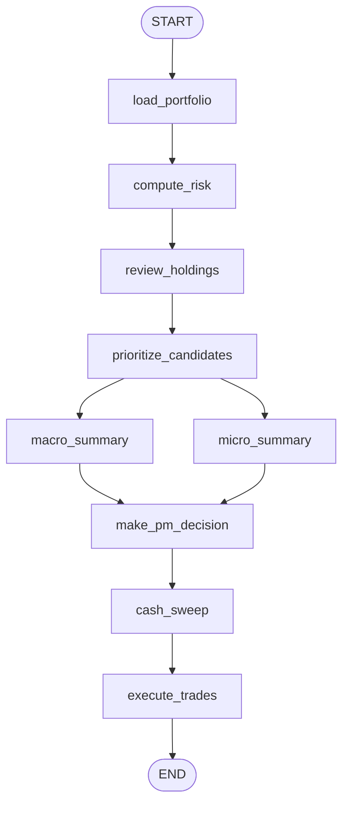

<!-- Last verified: 2026-03-31 -->

# Portfolio Manager Overview

This document describes the current portfolio architecture as implemented in the repo.
Use this as the entry point for portfolio-related code and docs.

## Scope

The portfolio system is responsible for:

- loading transactional portfolio state from PostgreSQL
- computing deterministic risk metrics
- reviewing existing holdings
- ranking new scanner candidates
- building macro and micro summary briefs
- producing a structured PM decision
- applying deterministic post-processing and executing trades
- persisting portfolio artifacts inside the shared run-scoped report layout

## Current Architecture

### Database Access

The current implementation uses direct PostgreSQL access through `psycopg2` via `SUPABASE_CONNECTION_STRING`.

- No ORM is used.
- `SupabaseClient` is the low-level CRUD client.
- `PortfolioRepository` is the business-logic facade over `SupabaseClient` plus `ReportStore`.
- SQL migrations live in `tradingagents/portfolio/migrations/`.

### Report and Run Artifacts

Portfolio artifacts are run-scoped and live under:

```text
reports/daily/{date}/{run_id}/
  portfolio/report/
  run_meta.json
  run_events.jsonl
```

Use `create_report_store(run_id=...)` for writes. Writes without `run_id` fail fast.

## Portfolio Workflow



### Node Roles

| Node | Type | Purpose |
| --- | --- | --- |
| `load_portfolio` | Python | Load portfolio + holdings via `PortfolioRepository` |
| `compute_risk` | Python | Compute deterministic risk metrics from holdings and prices |
| `review_holdings` | LLM + inline tools | Review existing positions using `get_stock_data` and `get_news` |
| `prioritize_candidates` | Python | Rank completed scanner candidates and apply selection memory |
| `macro_summary` | LLM + memory | Build regime-level brief using `MacroMemory` |
| `micro_summary` | LLM + memory | Build per-ticker brief using `ReflexionMemory` |
| `make_pm_decision` | LLM | Produce structured BUY/SELL/HOLD decision |
| `cash_sweep` | Python | Apply deterministic SGOV cash sweep logic when configured |
| `execute_trades` | Python | Execute decisions and persist trades/snapshots |

## Inputs

The portfolio flow depends on:

- `portfolio_id`
- `analysis_date`
- current `prices`
- `scan_summary`
- `ticker_analyses` from completed per-ticker deep dives

Only tickers with completed deep-dive output are passed through to candidate prioritization.

## Memory Use

- `macro_summary` uses `MacroMemory` to inject regime-level historical context and persist the current regime summary.
- `micro_summary` uses `ReflexionMemory` to inject per-ticker historical context.
- `prioritize_candidates` can load negative screening lessons from the selection lesson store and use them during ranking.

## Guardrails

Portfolio decisions are constrained by configuration-driven limits:

- max positions
- max position percentage
- max sector percentage
- minimum cash percentage

These limits inform both ranking/execution logic and the PM decision prompt.

## Where to Look in Code

- `tradingagents/graph/portfolio_graph.py`
- `tradingagents/graph/portfolio_setup.py`
- `tradingagents/portfolio/portfolio_states.py`
- `tradingagents/portfolio/repository.py`
- `tradingagents/portfolio/supabase_client.py`
- `tradingagents/portfolio/report_store.py`
- `tradingagents/portfolio/trade_executor.py`
- `tradingagents/portfolio/risk_evaluator.py`
- `tradingagents/portfolio/candidate_prioritizer.py`
- `tradingagents/agents/portfolio/holding_reviewer.py`
- `tradingagents/agents/portfolio/macro_summary_agent.py`
- `tradingagents/agents/portfolio/micro_summary_agent.py`
- `tradingagents/agents/portfolio/pm_decision_agent.py`

## Related Docs

- [`02_data_models.md`](./02_data_models.md)
- [`03_database_schema.md`](./03_database_schema.md)
- [`04_repository_api.md`](./04_repository_api.md)
- [`../graph_execution_reference.md`](../graph_execution_reference.md)
