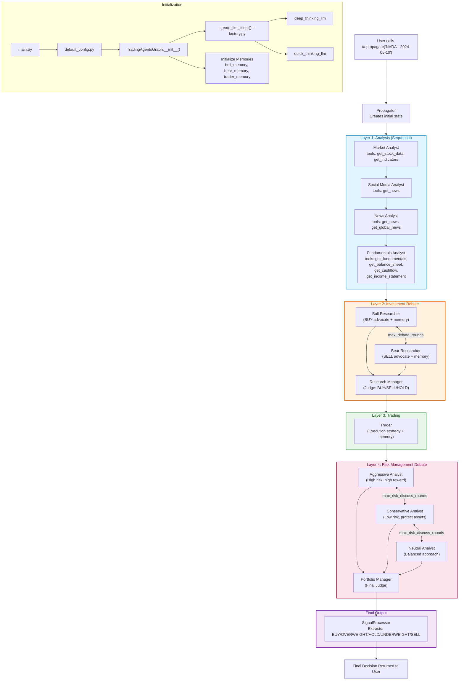
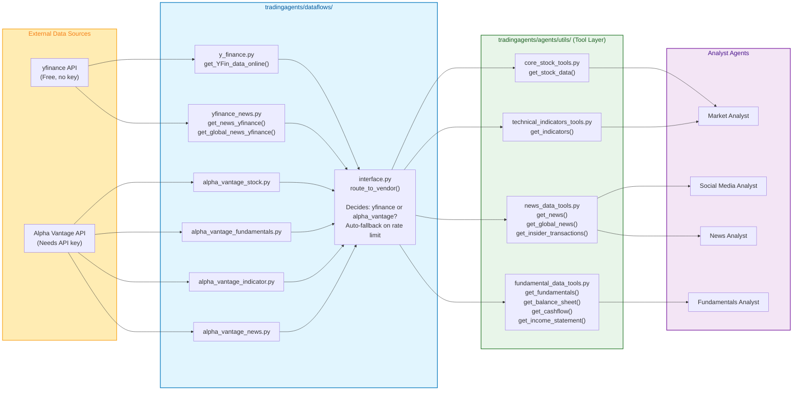
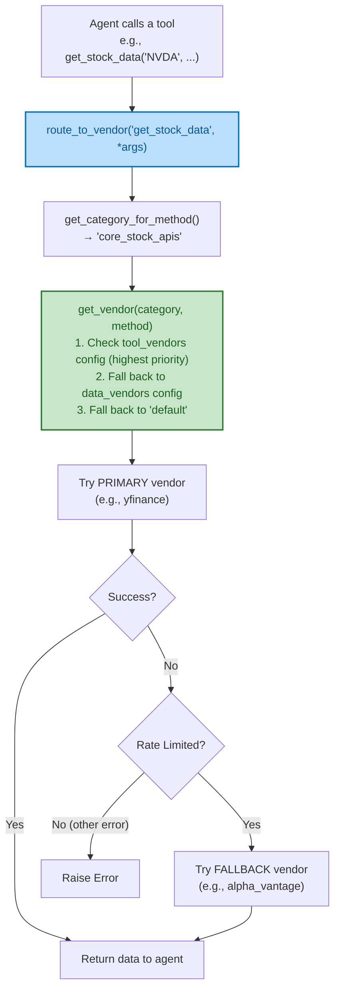
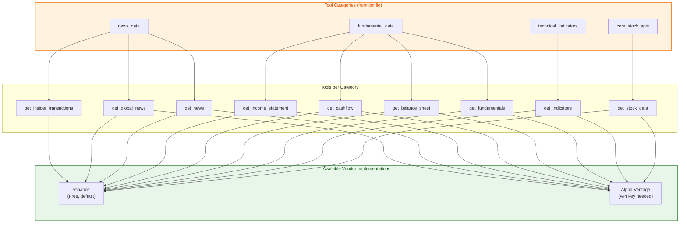
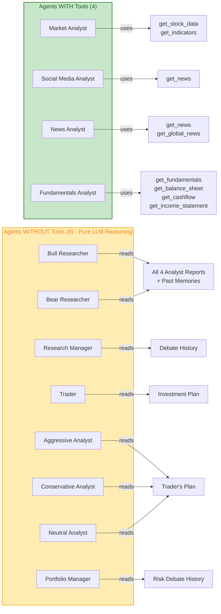
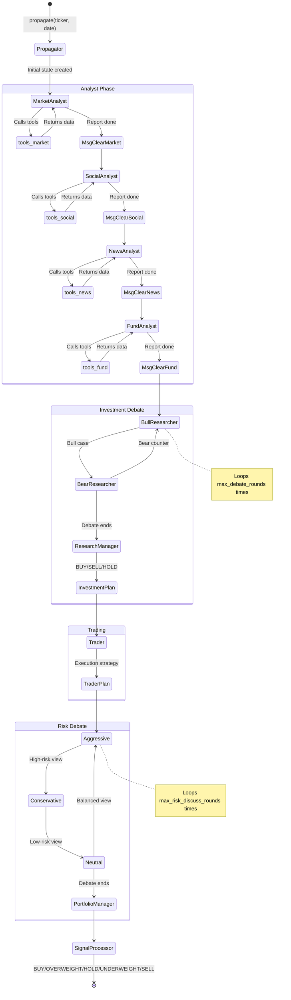
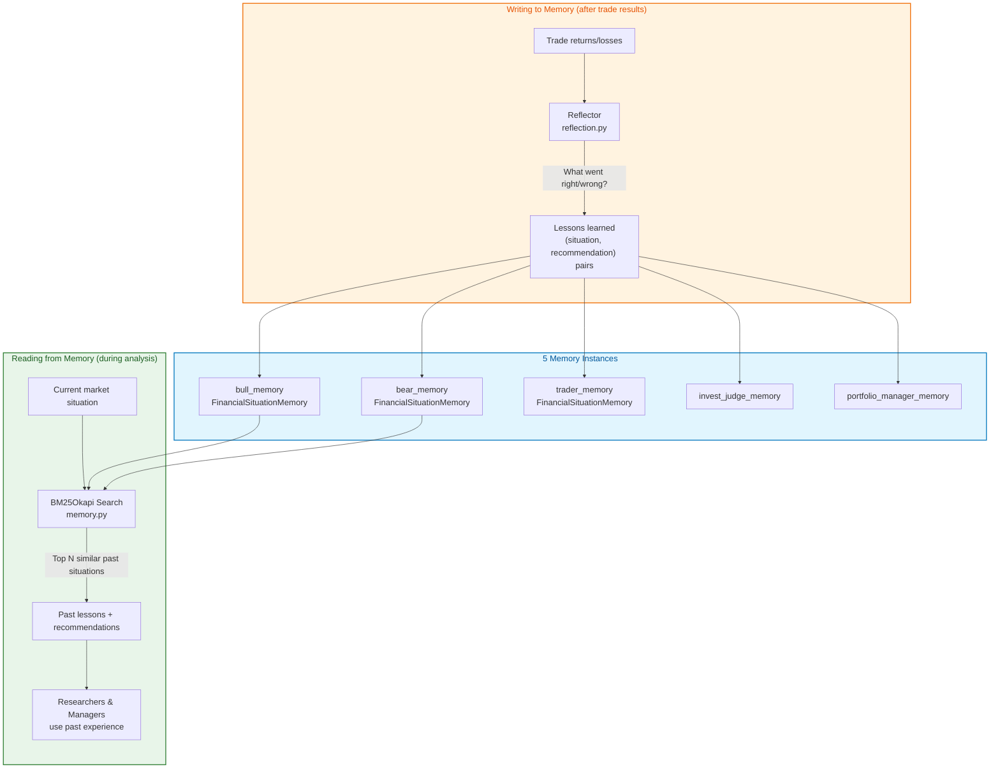
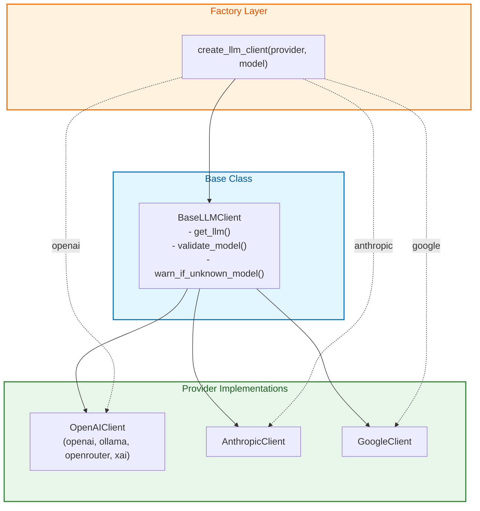
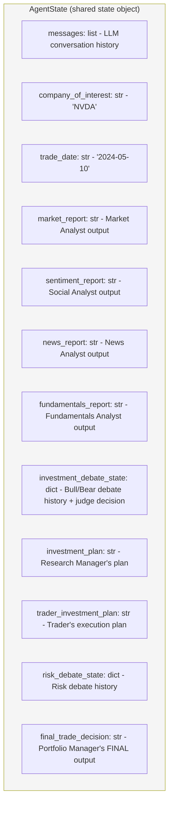

# TradingAgents Architecture Overview

> **Purpose:** Reference document mapping the current TradingAgents architecture.
> **Status:** Informational (no changes proposed here)
> **Related:** [RFC_AUTORESEARCH_INTRADAY.md](./RFC_AUTORESEARCH_INTRADAY.md)
>
> This document is submitted as context for the auto-research RFC. It captures
> the current architecture to ground the proposal in existing code.

## Overview

TradingAgents is a **multi-agent LLM system** that analyzes stocks using 12 AI agents organized in 4 layers:
1. **Analysis Layer** - 4 analysts gather data using tools
2. **Investment Debate Layer** - Bull vs Bear researchers debate, judge decides
3. **Trading Layer** - Trader creates execution plan
4. **Risk Management Layer** - 3 risk analysts debate, portfolio manager makes final call

---

## Complete System Flow (High Level)



---

## Data Flow: From APIs to Agent Reports



---

## interface.py - The Router (Detailed)



---

## Tool Categories & Vendor Mapping



---

## Agent Detail: Who Has What Tools



---

## LangGraph Execution Flow (Detailed)



---

## Memory System (BM25 Similarity Search)



---

## LLM Client Architecture



---

## Complete File Structure

```
TradingAgents/
├── main.py                                    # Entry point
├── tradingagents/
│   ├── default_config.py                      # All default settings
│   │
│   ├── agents/
│   │   ├── analysts/
│   │   │   ├── market_analyst.py              # Tools: get_stock_data, get_indicators
│   │   │   ├── social_media_analyst.py        # Tools: get_news
│   │   │   ├── news_analyst.py                # Tools: get_news, get_global_news
│   │   │   └── fundamentals_analyst.py        # Tools: get_fundamentals, balance_sheet, cashflow, income
│   │   │
│   │   ├── researchers/
│   │   │   ├── bull_researcher.py             # BUY advocate (with memory)
│   │   │   └── bear_researcher.py             # SELL advocate (with memory)
│   │   │
│   │   ├── managers/
│   │   │   ├── research_manager.py            # Judge for Bull/Bear debate
│   │   │   └── portfolio_manager.py           # Judge for Risk debate (FINAL decision)
│   │   │
│   │   ├── trader/
│   │   │   └── trader.py                      # Execution strategy
│   │   │
│   │   ├── risk_mgmt/
│   │   │   ├── aggressive_debator.py          # High risk advocate
│   │   │   ├── conservative_debator.py        # Low risk advocate
│   │   │   └── neutral_debator.py             # Balanced advocate
│   │   │
│   │   └── utils/
│   │       ├── agent_states.py                # State definitions (AgentState)
│   │       ├── agent_utils.py                 # Helper utilities
│   │       ├── memory.py                      # BM25-based memory system
│   │       ├── core_stock_tools.py            # Tool: get_stock_data
│   │       ├── technical_indicators_tools.py  # Tool: get_indicators
│   │       ├── fundamental_data_tools.py      # Tools: fundamentals, balance sheet, etc.
│   │       └── news_data_tools.py             # Tools: news, global_news, insider_transactions
│   │
│   ├── graph/
│   │   ├── trading_graph.py                   # Main orchestrator class
│   │   ├── setup.py                           # LangGraph node/edge definitions
│   │   ├── conditional_logic.py               # Flow control (debate rounds, routing)
│   │   ├── propagation.py                     # State initialization
│   │   ├── reflection.py                      # Post-trade learning
│   │   └── signal_processing.py               # Extract final BUY/SELL/HOLD signal
│   │
│   ├── dataflows/
│   │   ├── interface.py                       # THE ROUTER: routes tools to vendors
│   │   ├── config.py                          # Data config getter/setter
│   │   ├── utils.py                           # Utility functions
│   │   ├── y_finance.py                       # yfinance data fetching
│   │   ├── yfinance_news.py                   # yfinance news fetching
│   │   ├── alpha_vantage_stock.py             # Alpha Vantage stock data
│   │   ├── alpha_vantage_fundamentals.py      # Alpha Vantage financials
│   │   ├── alpha_vantage_indicator.py         # Alpha Vantage indicators
│   │   ├── alpha_vantage_news.py              # Alpha Vantage news
│   │   ├── alpha_vantage_common.py            # Shared AV utilities
│   │   └── stockstats_utils.py                # Technical indicator calculations
│   │
│   └── llm_clients/
│       ├── factory.py                         # create_llm_client() factory function
│       ├── base_client.py                     # BaseLLMClient abstract class
│       ├── openai_client.py                   # OpenAI/Ollama/xAI/OpenRouter
│       ├── anthropic_client.py                # Anthropic Claude
│       ├── google_client.py                   # Google Gemini
│       ├── validators.py                      # Model name validation
│       └── model_catalog.py                   # Known model lists
```

---

## State Object: What Data Flows Between Agents


