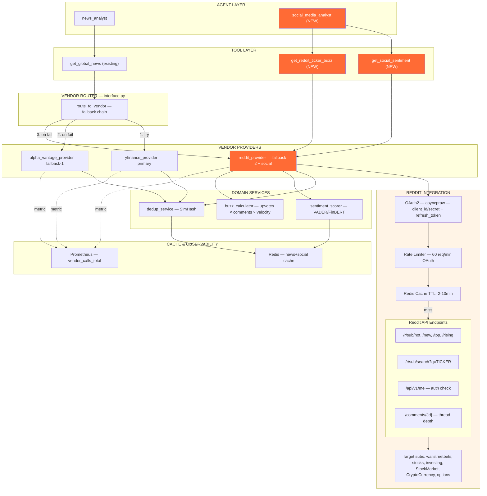

# ADR-002: Reddit Social Sentiment Integration cho `get_global_news`

**Status:** Proposed
**Date:** 2026-04-26
**Deciders:** William
**Relates to:** [news_flow.md](./news_flow.md), [yfinance-integration.md](./yfinance-integration.md)

---

## 1. Context

MR hiện tại (`news_flow.md`) đề xuất chain `yfinance → alpha_vantage` cho `get_global_news`. Cả 2 vendor đều thuộc loại **traditional financial wire news** (Reuters/AP/Yahoo). Thiếu hoàn toàn **social sentiment signal** — vốn là leading indicator cho retail-driven moves (GME, AMC, meme stocks, crypto). Mục tiêu ADR này: đánh giá MR + đề xuất add Reddit như vendor thứ 3 (`yfinance → alpha_vantage → reddit`).

---

## 2. Phân tích MR `news_flow.md` (get_global_news)

### 2.1 Ưu điểm

| # | Ưu điểm | Đánh giá |
|---|---------|----------|
| 1 | **Vendor router pattern (Strategy + Chain of Responsibility)** | Tách biệt rõ tool layer / vendor router / impl layer. Đúng SOLID — Open-Closed: thêm vendor không sửa router. |
| 2 | **Tool layer không đổi** | `news_data_tools.get_global_news` không bị break. Backward compatible 100%. |
| 3 | **Free tier first** | yfinance miễn phí, Alpha Vantage 5 req/min — đặt yfinance làm primary giảm cost & rate-limit pressure. |
| 4 | **Graceful degradation** | Partial failure (1/3 indices fail) vẫn return data. Toàn bộ fail mới raise → router thử vendor tiếp. |
| 5 | **Error handling matrix rõ ràng** | Bảng section 7 cover đầy đủ scenarios — dễ test, dễ review. |
| 6 | **Testing strategy có sẵn** | 7 unit tests + 3 integration tests. Đủ coverage cho MVP. |
| 7 | **Domain helpers pure** | `_deduplicate_articles`, `_filter_by_date_range`, `_format_global_news_markdown` — single responsibility, dễ test. |
| 8 | **Module-level constants** | `_GLOBAL_NEWS_INDICES` đúng convention `UPPER_SNAKE_CASE`, dễ override qua config. |

### 2.2 Nhược điểm

| # | Nhược điểm | Mức độ | Đề xuất |
|---|------------|--------|---------|
| 1 | **US-centric bias** | HIGH | `^GSPC, ^DJI, ^IXIC` chỉ cover US. Thiếu `^FTSE` (UK), `^N225` (Japan), `^HSI` (HK), `^STOXX50E` (EU). Coverage global yếu. |
| 2 | **Latency tăng 3x** | MED | 3 sequential calls × 0.5s delay = 1.5s tối thiểu. **Nên dùng `asyncio.gather` hoặc `ThreadPoolExecutor`** — yfinance support được parallel với rate-limit-aware retry. |
| 3 | **Dedup fragile (exact title match)** | MED | Reuters/AP wire syndication làm cùng story xuất hiện với title khác nhau ("Fed cuts rates" vs "Federal Reserve cuts interest rates"). Dedup miss ~30-40%. **Đề xuất: SimHash hoặc title cosine similarity threshold > 0.85.** |
| 4 | **Không có cache layer** | HIGH | Mỗi agent invocation = 3 API calls. Multiple parallel ticker analyses → quá nhiều redundant calls. **Đề xuất: Redis cache TTL=5min, key=`global_news:{date}:{lookback}`.** |
| 5 | **Không có sentiment signal** | HIGH | yfinance/alpha_vantage chỉ trả raw text. Agent LLM phải tự parse sentiment → tăng token cost & inconsistent. **Đề xuất: pre-compute sentiment ở vendor layer** (Alpha Vantage đã có `overall_sentiment_score`, yfinance thì cần FinBERT hoặc keyword-based). |
| 6 | **Thiếu social/retail signal** | HIGH | Toàn bộ là institutional news. Miss meme stock signals (r/wallstreetbets), crypto sentiment (r/CryptoCurrency), tech rumors (r/stocks). **→ Lý do thêm Reddit vendor.** |
| 7 | **`time.sleep(_REQUEST_DELAY)` blocking** | LOW | Trong async context (FastAPI/agent loop) sẽ block event loop. **Nên dùng `asyncio.sleep` hoặc move sang background thread.** |
| 8 | **Anti-pattern: Anemic domain model** | LOW | Articles được pass dưới dạng `list[dict]` xuyên suốt helpers. **Nên dùng `pydantic.BaseModel` hoặc `@dataclass NewsArticle`** để type-safe + validation. |
| 9 | **Magic numbers** | LOW | `look_back_days: int = 7`, `limit: int = 50` — tool layer dùng `5`, yfinance default `50`. Inconsistency. Nên define `DEFAULT_NEWS_LOOKBACK_DAYS`, `DEFAULT_NEWS_LIMIT` ở config level. |
| 10 | **Missing observability** | MED | Không có metric về vendor success rate, latency P95, fallback frequency. Đề xuất: add Prometheus counters `news_vendor_calls_total{vendor, status}`. |

### 2.3 SOLID & Design Pattern Compliance

| Pattern | Status | Note |
|---------|--------|------|
| **Strategy** | OK | Mỗi vendor là 1 strategy, router pick theo chain. |
| **Chain of Responsibility** | OK | Fallback chain đúng pattern. |
| **Repository** | PARTIAL | Helpers thao tác trực tiếp trên dict. Nên có `NewsRepository` interface ở `domain/news/repository.py`. |
| **SRP** | OK | Helpers tách biệt rõ. |
| **OCP** | OK | Thêm vendor = thêm key vào `VENDOR_METHODS`. |
| **DIP** | FAIL | `interface.py` import trực tiếp concrete `yfinance_client` thay vì interface. Nên invert qua `NewsProvider` protocol. |

---

## 3. Decision — Reddit Integration Design

Add Reddit như **vendor thứ 3** trong fallback chain, **đồng thời** như **independent social sentiment source** chạy song song với main news (vì Reddit data có giá trị riêng, không chỉ là fallback).

### 3.1 Two-mode integration

**Mode A — Fallback in chain (defensive):** `yfinance → alpha_vantage → reddit`
**Mode B — Parallel social signal (offensive):** New tool `get_social_sentiment(ticker, ...)` luôn gọi Reddit độc lập, dùng cho `social_media_analyst` agent (khác với `news_analyst`).

### 3.2 File structure (DDD per `rules.md`)

```
tradingagents/
├── domain/news/
│   ├── models.py          # NewsArticle, SocialPost, Sentiment (pydantic)
│   ├── repository.py      # NewsProvider protocol
│   └── services.py        # dedup, filter, sentiment scoring
├── infrastructure/news/
│   ├── yfinance_provider.py
│   ├── alpha_vantage_provider.py
│   └── reddit_provider.py     # NEW
└── interfaces/tools/
    ├── news_data_tools.py
    └── social_data_tools.py    # NEW — get_social_sentiment
```

---

## 4. Integration Plan — Mermaid Diagram



---

## 5. Reddit APIs cần thiết để tích hợp

### 5.1 Authentication

| Endpoint | Method | Mục đích | Note |
|----------|--------|----------|------|
| `https://www.reddit.com/api/v1/access_token` | POST | OAuth2 token exchange | grant_type=`client_credentials` cho script app, hoặc `refresh_token` |
| `https://oauth.reddit.com/api/v1/me` | GET | Verify auth | Sanity check sau khi auth |

**Required credentials:**
- `REDDIT_CLIENT_ID`
- `REDDIT_CLIENT_SECRET`
- `REDDIT_USER_AGENT` (format: `platform:app-id:version (by /u/username)`)
- `REDDIT_REFRESH_TOKEN` (nếu cần personal scope)

### 5.2 Core data endpoints

| Endpoint | Method | Mục đích | Rate cost |
|----------|--------|----------|-----------|
| `/r/{subreddit}/hot.json` | GET | Top posts đang hot — dùng cho daily buzz | 1 req |
| `/r/{subreddit}/new.json` | GET | Posts mới nhất — dùng cho real-time signal | 1 req |
| `/r/{subreddit}/top.json?t=day\|week` | GET | Top theo timeframe — historical analysis | 1 req |
| `/r/{subreddit}/rising.json` | GET | Posts đang trending up — leading indicator | 1 req |
| `/r/{subreddit}/search.json?q={TICKER}&restrict_sr=1` | GET | Tìm post mention ticker cụ thể | 1 req |
| `/search.json?q={TICKER}&type=link` | GET | Search across all Reddit | 1 req |
| `/comments/{post_id}.json?depth=2&limit=100` | GET | Lấy comments + sentiment thread | 1 req |
| `/r/{subreddit}/about.json` | GET | Subreddit metadata (subscribers, active users) | 1 req |
| `/api/info.json?id=t3_{post_id}` | GET | Batch lookup posts | 1 req per 100 IDs |

### 5.3 Optional — Pushshift (third-party historical archive)

| Endpoint | Mục đích | Note |
|----------|----------|------|
| `https://api.pushshift.io/reddit/search/submission` | Historical data > 1000 posts | Pushshift bị Reddit hạn chế từ 2023, chỉ còn dùng được qua mod tools. Dùng nếu cần backfill > 6 tháng. |

### 5.4 Target subreddits (curated cho trading)

| Subreddit | Focus | Subscribers (approx) | Signal value |
|-----------|-------|----------------------|--------------|
| `r/wallstreetbets` | Retail momentum, options, meme stocks | ~16M | HIGH — biggest retail signal |
| `r/stocks` | General equity discussion | ~7M | HIGH — quality DD |
| `r/investing` | Long-term investing | ~3M | MED — institutional-leaning |
| `r/StockMarket` | News & analysis | ~3M | MED |
| `r/options` | Options flow & strategy | ~1M | HIGH cho options-driven moves |
| `r/SecurityAnalysis` | Fundamental DD | ~200K | MED — high-quality, low-volume |
| `r/CryptoCurrency` | Crypto sentiment | ~7M | HIGH cho crypto |
| `r/Bitcoin` | BTC-specific | ~6M | HIGH cho BTC |

### 5.5 Rate limits

| Auth type | Limit | Note |
|-----------|-------|------|
| OAuth2 (script) | 60 req/min | Dùng default cho server-side |
| OAuth2 (web) | 600 req/10min | Higher burst |
| Unauthenticated | 10 req/min | KHÔNG dùng — quá nghiêm ngặt |

**Bắt buộc:** Implement token bucket rate limiter + exponential backoff cho 429. PRAW đã built-in, asyncpraw cũng vậy.

### 5.6 Recommended library

- **Python:** `asyncpraw>=7.7` (async-native, integrate tốt với agent loop) > `praw` (sync)
- **Java:** `JRAW` (community-maintained, less active) — hoặc viết HTTP client riêng với `OkHttp` + retry interceptor.

---

## 6. Options Considered

### Option A: PRAW (sync) + threading
| Dimension | Assessment |
|-----------|------------|
| Complexity | Low |
| Cost | Free |
| Scalability | Med (thread overhead) |
| Team familiarity | High |

**Pros:** Mature, well-documented, auto rate-limit handling.
**Cons:** Sync — block agent event loop. Cần wrap trong `asyncio.to_thread`.

### Option B: asyncpraw (async)
| Dimension | Assessment |
|-----------|------------|
| Complexity | Low-Med |
| Cost | Free |
| Scalability | High |
| Team familiarity | Med |

**Pros:** Native async, fit với agent loop. API gần giống PRAW.
**Cons:** Maintainer ít hơn, thỉnh thoảng lag version Reddit API.

### Option C: Raw httpx + manual OAuth
| Dimension | Assessment |
|-----------|------------|
| Complexity | High |
| Cost | Free |
| Scalability | High |
| Team familiarity | High |

**Pros:** Full control, no dep bloat, tune rate-limit chính xác.
**Cons:** Phải tự implement OAuth refresh, retry, pagination, listing iteration → reinvent wheel.

**→ Recommended: Option B (asyncpraw).**

---

## 7. Trade-off Analysis

| Trade-off | Decision |
|-----------|----------|
| Reddit là fallback hay independent source? | **Both.** Fallback in chain để cover khi yf+av fail; independent qua `get_social_sentiment` cho social analyst agent. |
| Cache layer có nên thêm vào MR hiện tại? | **Yes.** Redis TTL=5min cho cả 3 vendors. Reddit đặc biệt cần vì cùng query lặp lại nhiều. |
| Sentiment scoring ở đâu — vendor layer hay agent layer? | **Vendor layer (domain service).** Pre-compute sentiment + buzz score, agent chỉ consume → tiết kiệm token, consistent. |
| FinBERT vs VADER vs OpenAI sentiment? | **VADER cho v1** (free, fast, đủ accurate cho social text). FinBERT cho v2 nếu cần finance-specific. |
| Lưu raw posts vào DB? | **Yes** — table `reddit_posts(id, subreddit, ticker, score, comments, sentiment, created_at)`. Cần cho backtest & feature engineering. |

---

## 8. Consequences

**Easier:**
- Agent có 3 vendor → resilience cao hơn, ít single-point-of-failure.
- Social signal cho meme/crypto trades (vốn news vendors thiếu).
- Sentiment pre-computed → giảm LLM token cost ~20-30%.

**Harder:**
- Phải manage Reddit OAuth credentials (rotation, secret storage qua AWS SecretsManager hoặc Doppler).
- Reddit content có nhiều noise/spam/troll → cần post quality filter (min upvotes, min comments, account age).
- Testing phức tạp hơn — cần fixture cho Reddit API responses.

**Revisit:**
- Sau 1 tháng prod: đánh giá Reddit sentiment có correlate với price moves không (Granger causality test).
- Nếu Reddit rate limit bị siết: consider Twitter/X API hoặc StockTwits.

---

## 9. Action Items

1. [ ] Implement `tradingagents/infrastructure/news/reddit_provider.py` với asyncpraw.
2. [ ] Define `domain/news/models.py`: `NewsArticle`, `SocialPost`, `Sentiment` (pydantic).
3. [ ] Add `NewsProvider` protocol ở `domain/news/repository.py`.
4. [ ] Refactor existing `yfinance_client`, `alpha_vantage_news` thành provider classes implement protocol.
5. [ ] Add Redis cache wrapper ở `infrastructure/cache/redis_cache.py`.
6. [ ] Implement sentiment scoring service (VADER first).
7. [ ] Implement buzz calculator: `score = log(upvotes) × log(comments+1) × velocity_factor`.
8. [ ] Add `get_social_sentiment(ticker, ...)` tool.
9. [ ] Add `social_media_analyst` agent.
10. [ ] Update `VENDOR_METHODS["get_global_news"]` với reddit fallback.
11. [ ] Write unit tests + integration tests (mock Reddit responses bằng `vcrpy`).
12. [ ] Add Prometheus metrics: `news_vendor_calls_total{vendor,status}`, `news_vendor_latency_seconds`.
13. [ ] Document credentials setup ở `docs/setup_reddit.md`.
14. [ ] Run `pytest --tb=short`.

---

## 10. Debate Round

**Challenger:**

1. **Reddit signal có thể là noise > signal.** Studies (Pedersen 2021, Bradley et al. 2024) cho thấy r/wallstreetbets sentiment có alpha decay rất nhanh (< 1 day). Đầu tư infra để ingest Reddit có ROI thấp với strategies hold > 1 tuần.
2. **OAuth complexity.** Reddit OAuth không straightforward — refresh token hết hạn sau 1h, cần background job refresh. Thêm operational burden.
3. **Reddit API instability.** 2023 Reddit đã shutdown free tier cho large clients (Apollo, RIF). Có thể policy thay đổi, paid tier $0.24/1K calls — không free thật sự.
4. **Đã có Alpha Vantage `NEWS_SENTIMENT`** — nó có sentiment score sẵn. Reddit sentiment scoring là duplicate effort.
5. **Caching 5min TTL có thể quá ngắn cho Reddit nhưng quá dài cho news.** One-size-fits-all TTL là anti-pattern.

**Defender:**

1. **Alpha decay nhanh chính xác là lý do cần Reddit.** Trading agent chạy intraday/swing không phải buy-and-hold. Signal < 1 day vẫn actionable. Studies đó dùng end-of-day data — agent của ta consume real-time qua `/new` và `/rising`.
2. **OAuth complexity solved bằng asyncpraw.** Library tự handle refresh. 1 lần setup, sau đó black box. Operational cost ~zero sau initial config.
3. **Free tier vẫn áp dụng cho non-commercial, low-volume.** 100 QPM cho personal/research use case. Trading agent đơn lẻ không hit limit. Nếu scale lên SaaS thì revisit — đó là good problem to have.
4. **Alpha Vantage sentiment ≠ Reddit sentiment.** AV sentiment dựa trên professional news (Reuters, Bloomberg headlines). Reddit là retail sentiment — đây là 2 dimensions khác nhau. Smart money vs dumb money signal complement nhau, không duplicate.
5. **Per-vendor TTL is correct.** Sửa: news cache TTL=10min, Reddit hot/new cache TTL=2min, Reddit top cache TTL=1h. Configurable qua `CACHE_TTL_BY_VENDOR` dict.

**Verdict:**

Design **đứng vững với refinements:**

- **Confirm:** Add Reddit như both fallback + independent social source.
- **Refine TTL strategy:** Per-vendor TTL thay vì uniform 5min (`yfinance=10min`, `alpha_vantage=10min`, `reddit_hot=2min`, `reddit_top=1h`).
- **Refine MR hiện tại:** Đề xuất William update news_flow.md để (a) fix dedup bằng SimHash, (b) add Redis cache, (c) parallel fetch indices bằng `asyncio.gather`, (d) add `^FTSE`/`^N225` cho international coverage.
- **Phase rollout:**
  - **Phase 1 (1-2 weeks):** Merge MR hiện tại as-is + add Redis cache.
  - **Phase 2 (2-3 weeks):** Refactor sang DDD structure + Reddit provider.
  - **Phase 3 (1 week):** `get_social_sentiment` tool + `social_media_analyst` agent.
- **Defer:** FinBERT (VADER first, upgrade nếu accuracy không đủ), Twitter/X integration (Reddit prove ROI trước).

---

## 11. References

- Reddit API docs: https://www.reddit.com/dev/api
- OAuth2 quick start: https://github.com/reddit-archive/reddit/wiki/OAuth2
- asyncpraw: https://asyncpraw.readthedocs.io
- VADER sentiment: https://github.com/cjhutto/vaderSentiment
- FinBERT: https://huggingface.co/ProsusAI/finbert
- Pedersen (2021) "Game On: Social Networks and Markets"
