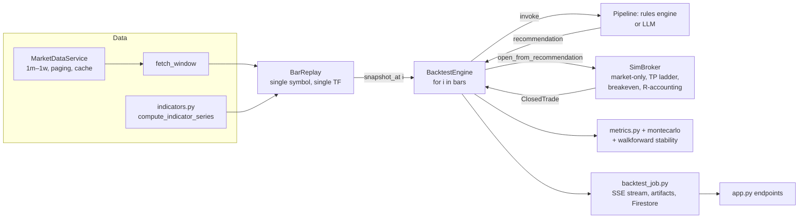
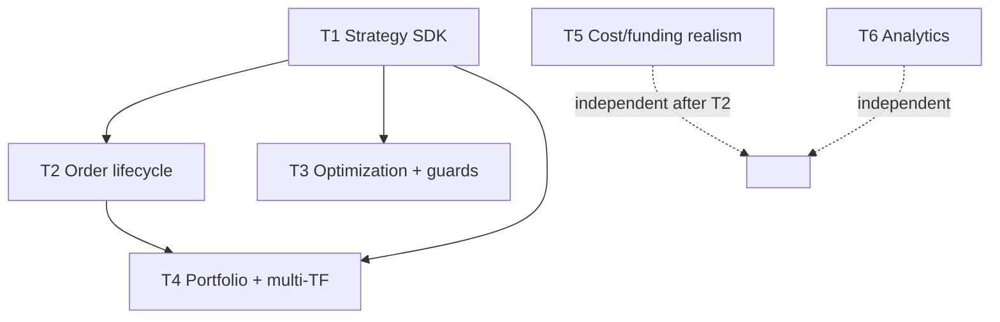

# 06 — High-Level Design (Evolve-in-Place)

Deliverable 7 (HLD half; LLD is [07_lld.md](07_lld.md)). How to evolve `tradingagents/pro/backtest` into an institutional-grade engine **incrementally, behind the existing UI/tests/deploy**, driven by the research evidence ([02](02_pattern_report.md), [03](03_institutional_best_practices.md)) and the gap analysis ([05](05_gap_analysis.md)).

## Design principles (invariants every track must preserve)

1. **Determinism.** Same inputs → byte-identical results. The current engine is a deterministic `for i in range(bars)` loop; every addition stays deterministic (seeded RNG only, no wall-clock in logic).
2. **No look-ahead, structurally.** `BarReplay.snapshot_at(i)` exposes bars ≤ i only; fills happen at i+1. Every new feature (multi-TF, portfolio, optimization) inherits this or is rejected in review.
3. **Honesty-first metrics.** Full decision density, no downsampling; artifacts stay full-fidelity; provenance labels (`indicator_mode`, sizing, now `strategy_id`+params) travel with every result.
4. **Additive, not rewrite.** Each track ships behind the existing endpoints and passes the existing suite before the next. The `SimBroker`/`BarReplay`/`BacktestEngine` classes are extended, not replaced.
5. **The risk engine's gates are hard.** Per the KB's central lesson (every blow-up was a risk-management failure), risk caps remain un-overridable by any strategy or LLM.

## Current architecture



## Target architecture (changed components highlighted)

```mermaid
flowchart LR
  subgraph Data
    MDS[MarketDataService] --> FW[fetch_window]
    IND[indicators.py]
  end
  FW --> MBR[**PortfolioReplay**<br/>k-way multi-symbol +<br/>multi-TF merge]:::new
  IND --> MBR
  MBR -->|context: bars, HTF views,<br/>indicators, positions, account| STRAT[**Strategy SDK**<br/>protocol + registry<br/>rules engine = first citizen]:::new
  STRAT -->|order intents| SB[SimBroker++<br/>**pending-order book**:<br/>limit/stop-entry/bracket/<br/>OCO/trailing + **pyramiding**]:::new
  SB -->|fills, ClosedTrade| ENG[BacktestEngine++<br/>portfolio loop +<br/>**capital allocator**]:::new
  RISK[**Risk engine**<br/>heat cap, vol-target,<br/>correlation cap]:::new --> ENG
  ENG --> MET[metrics++ <br/>**Omega/MAR/Ulcer/rolling**]:::new
  OPT[**Optimizer**<br/>grid/random/bayesian +<br/>walk-forward FITTING]:::new -.drives many runs.-> ENG
  VAL[**Validation**<br/>purged CV, deflated Sharpe,<br/>PBO]:::new --> OPT
  ENG --> JOB[backtest_job++<br/>orders artifact,<br/>per-symbol equity]:::new
  JOB --> API[app.py++<br/>strategy_id/params/symbols[]<br/>+ optimization jobs]:::new
  classDef new fill:#2d4,stroke:#093,color:#000
```

## The six evolution tracks

Each track cites the evidence that justifies it and the constraint ([05](05_gap_analysis.md)) it closes. Build order is the gap-analysis priority.

### T1 — Strategy SDK & registry (constraint C6; the keystone)
**Why:** [03](03_institutional_best_practices.md) meta-finding — entry logic is idiosyncratic, so it must be *pluggable*; and optimization/portfolio have nothing to act on without a strategy unit. Every surveyed production framework (Backtrader/Nautilus/LEAN) has a subclass strategy API; we have none.
**What:** a `Strategy` protocol (`on_start / on_bar(ctx) → order intents / on_fill / on_stop`) + a registry; the existing deterministic rules engine (`signals.evaluate_refs` + gates) becomes the first registered strategy, `rules_v1`. Parameters are *declared* (name, type, range) so the optimizer can enumerate them. Detailed in [10_strategy_sdk.md](10_strategy_sdk.md).
**Preserves:** the pipeline path stays; the SDK is an alternative producer of recommendations/orders behind the same engine loop.

### T2 — Order lifecycle / pending-order book (constraint C2)
**Why:** the *only* real TradingView gap ([05](05_gap_analysis.md) §A); unlocks the two best-documented KB packages — trend-following needs channel/stop-entry + pyramiding, momentum needs breakout entries ([02](02_pattern_report.md)). Today `SimBroker` fills market-only at next-bar open and **ignores the ticket's `entry_price`**.
**What:** a pending-order book on `SimBroker` — order kinds `market / limit / stop_entry / stop_limit`, states `NEW→WORKING→FILLED|CANCELLED|EXPIRED`, plus brackets (entry+stop+TP as one OCO group) and **pyramiding** (scale-in on winners, stop trails the aggregate). Intrabar fill rules extend the existing conservative touch policy (stop-before-TP pessimism preserved).
**Preserves:** market-order path unchanged; existing TP-ladder + breakeven logic becomes one bracket type.

### T3 — Optimization + validation guards (constraint C6; the place we can lead)
**Why:** field-wide hole ([05](05_gap_analysis.md)) — only PyBroker has bootstrap CIs; *nobody* has purged CV / deflated Sharpe / PBO. Our honesty culture + the KB's negative-evidence lesson make this our differentiator.
**What:** a parameter-space spec over declared strategy params; grid + random + optional Bayesian search; **walk-forward that actually fits** (extending the stability-only `walkforward.py`); and the guard suite — purged/embargoed K-fold CV, deflated Sharpe ratio, and probability of backtest overfitting (PBO). Runs as its own job type (many child backtests). Methodology in [12_validation_methodology.md](12_validation_methodology.md).
**Preserves:** every child run is an ordinary deterministic backtest; the optimizer only orchestrates + aggregates.

### T4 — Portfolio layer + multi-timeframe (constraint C1)
**Why:** the CTA package's correlation/exposure caps and fund-level vol-targeting ([02](02_pattern_report.md) pattern: Donchian+correlation-filter lift 8.2; [03](03_institutional_best_practices.md) BP4/institutional). Today `BarReplay` hard-rejects >1 timeframe and jobs are single-symbol.
**What:** `PortfolioReplay` — a k-way timestamp merge over multiple single-symbol `BarReplay`s (and lower→higher TF aggregation, available only after HTF-bar close, look-ahead-safe); a capital allocator; a portfolio-heat cap and correlation-exposure cap in the risk engine. The strategy context gains HTF views and cross-symbol state.
**Preserves:** single-symbol single-TF remains the degenerate case (one replay, one TF); the existing `max_gross_exposure_pct` generalizes to the portfolio cap.

### T5 — Cost & financing realism (constraint C5)
**Why:** medium-severity but improves *every* result's credibility; the flat-2bps slippage is our weakest realism link ([05](05_gap_analysis.md)); market makers earn the spread, so honest cost modeling is non-negotiable for credible relative-value/HFT-adjacent tests.
**What:** per-asset spread model, a square-root market-impact term (participation-scaled), and perpetual-swap funding accrual (Delta/Binance) for crypto; optional margin/liquidation checks. All parameterized and provenance-labeled.
**Preserves:** the existing `SlippageModel`/`CommissionModel`/`LiquidityModel` interfaces gain implementations; the flat model stays as the default/simple option.

### T6 — Analytics additions (independent, additive)
**Why:** QuantStats is the analytics reference and gave a concrete porting list ([04](04_framework_comparison.md)); MAR/Ulcer/Omega/rolling metrics are standard institutional reporting we lack.
**What:** add Omega, MAR, Ulcer Index & UPI, tail ratio, gain-to-pain, CVaR/expected-shortfall, and rolling Sharpe/Sortino/vol to `metrics.py`/`report.py`. Wire the regime classifier into strategy context (decision: keep rule-based vs learned — deferred to [13_roadmap.md](13_roadmap.md) P5).
**Preserves:** purely additive to the report; existing metrics unchanged.

## Explicit non-goals (with rationale)

- **Tick/sub-minute data (C3).** Gated on paid microstructure feeds (docs/DATA_SOURCES.md); the bar engine's fill model is honest at 1m. Revisit only if a feed is purchased.
- **Distributed/multi-node execution (C4).** The optimizer parallelizes trivially with a process pool per trial (T3); true distribution is premature. GIL relief comes from process-pooling optimization runs, not from rewriting the engine.
- **Live-execution parity.** The live path is a separate, safety-gated subsystem; the backtester's job is faithful simulation, not order routing.
- **Reproducing retail orthodoxy as defaults.** Per [01](01_trader_statistics.md) §7, we support fixed-% risk / MA filters as *options*, never as baked-in "everyone does this" defaults.

## Dependency graph & sequencing



T1 is the keystone (unblocks T2/T3/T4). T5 and T6 are independent and can land any time after their light prerequisites. Full effort estimates and risk in [13_roadmap.md](13_roadmap.md) / [14_backlog.md](14_backlog.md).
