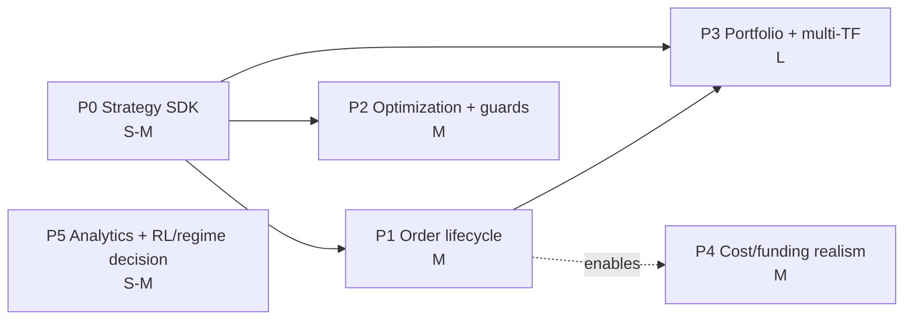

# 13 — Implementation Roadmap

Deliverable 13. Phased plan to build the six architecture tracks ([06_hld.md](06_hld.md)) as separate implementation sessions. Each phase: goal, scope, effort, dependencies, risk, and the **evidence** that justifies it.

**Effort labels are planning estimates, not commitments.** S = small (~1–3 focused sessions), M = medium (~3–6), L = large (~6–10), where a "session" is one focused build-test-gate-commit cycle like the feature work already in this repo's history. Person-day ranges assume one engineer working the way this codebase has been built (test-first, gated, deployed per feature).

## Sequencing (dependency-ordered)

## P0 — Strategy SDK & registry  (Track T1)

- **Goal:** a pluggable, parameter-declaring strategy unit; rules engine becomes `rules_v1`, LLM pipeline becomes `pipeline_llm`.
- **Scope:** `strategy.py` (protocol, context, order-intent, ParamSpace), `registry.py`, refactor rules path behind the interface, `BacktestEngine.strategy` branch, `strategy_id`/`strategy_params` in the run record ([08](08_data_schema.md)), `GET /api/backtest/strategies` + frontend strategy picker.
- **Effort:** **S–M** (~5–9 person-days). Mostly refactor-behind-an-interface of code that already exists and is tested.
- **Dependencies:** none — build first.
- **Risk (2/3):** the refactor must reproduce current `test_pro_strategy_quality.py` outcomes bit-for-bit; risk is regression, mitigated by that suite as a guard.
- **Evidence:** [03](03_institutional_best_practices.md) meta-finding (entry logic must be pluggable); [05](05_gap_analysis.md) keystone (unblocks P2/P3).
- **Impact:** high — unlocks everything downstream; low user-visible change on its own.

## P1 — Order lifecycle / pending-order book  (Track T2)

- **Goal:** limit/stop-entry/stop-limit orders, brackets (OCO), trailing stops, pyramiding; honor the ticket's `entry_price`.
- **Scope:** `PendingOrder`/`BracketSpec`/`TrailingSpec` on `SimBroker`; `submit`/`cancel`/`_match_pending`; extend `_manage` fill rules preserving stop-before-TP pessimism; `orders.json` artifact; UI order-type controls.
- **Effort:** **M** (~6–10 person-days).
- **Dependencies:** P0 (strategies emit order intents).
- **Risk (3/3):** intrabar fill correctness is the subtlest part of any backtester — gap-through fills, OCO cancellation races, trailing-stop ratchet. Highest look-ahead-leak risk. Mitigate with the [12](12_validation_methodology.md) checklist + exhaustive per-order-kind fill tests.
- **Evidence:** [05](05_gap_analysis.md) — the *only* real TradingView gap; [02](02_pattern_report.md) — trend + momentum packages need channel/stop-entry + pyramiding.
- **Impact:** high + highly user-visible (closes the TradingView gap the operator feels daily).

## P2 — Optimization + validation guards  (Track T3)

- **Goal:** grid/random/(optional bayesian) search + walk-forward fitting, with purged CV, deflated Sharpe, and PBO as first-class, enforced outputs.
- **Scope:** `optimize.py`, `validation.py`, extend `walkforward.py`; optimization job type + records ([08](08_data_schema.md)); `POST /api/backtest/optimize` + progress SSE + UI; process-pool trials ([11](11_performance_recommendations.md) R1–R3).
- **Effort:** **M** (~6–10 person-days), + the perf work (R1–R4) if optimization is slow on the target instance.
- **Dependencies:** P0 (needs declared ParamSpace); pairs with the [12](12_validation_methodology.md) standard.
- **Risk (2/3):** correctness of the guards (purge/embargo overlap, DSR/PBO math) — mitigate against textbook worked examples. Compute cost on a 1-vCPU box (see [11](11_performance_recommendations.md) R4).
- **Evidence:** [05](05_gap_analysis.md) field-wide hole → our chance to **lead**; [03](03_institutional_best_practices.md) — every KB blow-up was a validation/risk failure; KB methodology authority (López de Prado).
- **Impact:** high — the differentiator vs every surveyed framework.

## P3 — Portfolio layer + multi-timeframe  (Track T4)

- **Goal:** multi-symbol runs with capital allocation, portfolio-heat + correlation-exposure caps, and look-ahead-safe higher-TF views.
- **Scope:** `portfolio.py` (`PortfolioReplay` k-way merge, allocator), risk-engine extension of `max_gross_exposure_pct` to a portfolio cap + correlation cap, `symbols[]`/`timeframes[]` request + per-symbol equity artifact, UI multi-symbol picker.
- **Effort:** **L** (~8–14 person-days). The biggest lift — new replay topology, allocator, and cross-symbol risk.
- **Dependencies:** P0 + P1 (portfolio drives strategies that emit orders).
- **Risk (3/3):** multi-TF look-ahead (HTF bar visible only after close) and merge determinism are subtle; the allocator interacts with the order lifecycle. Mitigate with the [12](12_validation_methodology.md) HTF checklist and the single-symbol degenerate case as a regression anchor.
- **Evidence:** [02](02_pattern_report.md) — Donchian+correlation-filter (lift 8.2) and the CTA package; [03](03_institutional_best_practices.md) BP4 (portfolio caps matter as much as per-trade risk).
- **Impact:** high — enables the whole systematic-CTA class of strategies; largest scope.

## P4 — Cost & financing realism  (Track T5)

- **Goal:** spread + square-root market impact + perp funding accrual; optional margin/liquidation.
- **Scope:** `SpreadModel`/`ImpactModel`/`FundingModel` in `costs.py`; `cost_profile` request field; cost provenance + per-trade `funding_paid`/`impact_bps` in artifacts.
- **Effort:** **M** (~5–8 person-days).
- **Dependencies:** independent after P1 (cleanest once fills go through the order book).
- **Risk (2/3):** funding series as-of safety ([12](12_validation_methodology.md) Part 1 #3); calibrating impact `k` honestly (label it a modeling assumption, not a measured constant).
- **Evidence:** [05](05_gap_analysis.md) — flat-2bps is our weakest realism link; [03](03_institutional_best_practices.md) institutional (market makers earn the spread → credible tests must model it).
- **Impact:** medium — improves credibility of every result, especially relative-value/crypto.

## P5 — Analytics additions + RL/regime wiring decision  (Track T6)

- **Goal:** Omega/MAR/Ulcer/UPI/tail-ratio/gain-to-pain/CVaR/rolling metrics; decide whether to wire the regime classifier into strategy context and whether to retire or integrate the unwired Q-learning prototype.
- **Scope:** additive fields in `metrics.py`/`report.py` + `rolling.json` artifact + UI cards; a written decision on regime/RL (integrate vs park).
- **Effort:** **S–M** (~4–7 person-days); the analytics are additive and low-risk, the RL/regime decision is analysis.
- **Dependencies:** none (analytics); regime-context wiring benefits from P0's StrategyContext.
- **Risk (1/3):** low — additive, None-safe, fixture-tested.
- **Evidence:** [04](04_framework_comparison.md) QuantStats porting list; [03](03_institutional_best_practices.md) BP5 (demonstrate tail behavior, not just mean return).
- **Impact:** medium — reporting parity + a clear decision on the two experimental subsystems.

## Cross-phase invariants (every phase)

Determinism, no look-ahead ([12](12_validation_methodology.md) checklist), full-fidelity artifacts, hard risk gates, and the test-first → gate → commit → deploy → verify cycle this repo already follows. Each phase ends behind the existing endpoints with the full backend + frontend suites green.

## Suggested first three sessions

1. **P0.1:** `strategy.py` + `registry.py` + `rules_v1` wrapper, with the regression guard against current strategy-quality tests.
2. **P0.2:** engine `strategy` branch + `strategy_id`/params in the record + `/strategies` endpoint + UI picker; deploy + prod-verify a `rules_v1` run matches a current deterministic run.
3. **P1.1:** pending-order book skeleton (limit + stop-entry) with per-kind fill tests, market path unchanged.

Effort, dependencies, and risk per story are itemized in [14_backlog.md](14_backlog.md).
