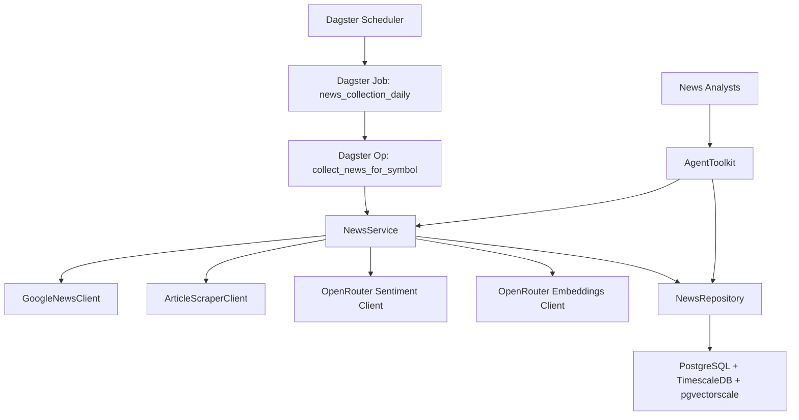

# News Domain Technical Design

## Overview

This document details the technical design for completing the final 5% of the News domain implementation. The existing infrastructure is 95% complete with Google News collection, article scraping, and basic storage implemented. The remaining work focuses on **Dagster-orchestrated scheduled execution**, **LLM-powered sentiment analysis**, and **vector embeddings** using OpenRouter as the unified LLM provider.

## Architecture Overview

### Component Relationships



### Data Flow Architecture

1. **Scheduled Collection Flow (Dagster)**
   ```
   Dagster Schedule → Dagster Job → Dagster Op (per symbol)
   → NewsService.update_company_news()
   → GoogleNewsClient (RSS) → ArticleScraperClient (content)
   → OpenRouter (sentiment + embeddings)
   → NewsRepository.upsert_batch() → PostgreSQL
   ```

2. **Agent Query Flow (RAG)**
   ```
   News Analyst → AgentToolkit → NewsService.find_similar_news()
   → NewsRepository.find_similar_articles()
   → pgvectorscale vector similarity (cosine distance)
   → Return ranked results with sentiment
   ```

### Key Design Principles

- **Leverage Existing 95%**: Build on proven GoogleNewsClient and ArticleScraperClient infrastructure
- **OpenRouter Unified**: Single API for both sentiment analysis and embeddings
- **Best-Effort Processing**: LLM failures don't block article storage
- **Vector-Enhanced Search**: Semantic similarity for News Analysts via RAG
- **Dagster Orchestration**: Fault-tolerant scheduling with built-in monitoring and alerting
- **Layered Architecture**: Entity → Repository → Service → Dagster Op → Dagster Job

## Domain Model

### Enhanced NewsArticle Dataclass

The existing `NewsArticle` dataclass requires enhancements for LLM sentiment and vector support:

```python
from dataclasses import dataclass, field
from datetime import date
from typing import Optional, List

@dataclass
class NewsArticle:
    """Represents a news article with sentiment and embeddings."""

    # Existing fields (95% complete)
    headline: str
    url: str  # Unique identifier for deduplication
    source: str  # "Google News", "Finnhub", etc.
    published_date: date

    # Optional existing fields
    summary: Optional[str] = None
    entities: List[str] = field(default_factory=list)
    author: Optional[str] = None
    category: Optional[str] = None

    # Enhanced fields (final 5% - LLM sentiment)
    sentiment_score: Optional[float] = None  # -1.0 to 1.0
    sentiment_confidence: Optional[float] = None  # 0.0 to 1.0
    sentiment_label: Optional[str] = None  # "positive", "negative", "neutral"

    # Enhanced fields (final 5% - vector embeddings)
    title_embedding: Optional[List[float]] = None  # 1536 dimensions
    content_embedding: Optional[List[float]] = None  # 1536 dimensions

    def to_entity(self, symbol: Optional[str] = None) -> NewsArticleEntity:
        """Convert NewsArticle dataclass to NewsArticleEntity SQLAlchemy model."""
        return NewsArticleEntity(
            headline=self.headline,
            url=self.url,
            source=self.source,
            published_date=self.published_date,
            summary=self.summary,
            entities=self.entities if self.entities else None,
            sentiment_score=self.sentiment_score,
            sentiment_confidence=self.sentiment_confidence,
            sentiment_label=self.sentiment_label,
            author=self.author,
            category=self.category,
            symbol=symbol,
            title_embedding=self.title_embedding,
            content_embedding=self.content_embedding,
        )

    @staticmethod
    def from_entity(entity: NewsArticleEntity) -> 'NewsArticle':
        """Convert NewsArticleEntity SQLAlchemy model to NewsArticle dataclass."""
        return NewsArticle(
            headline=entity.headline,
            url=entity.url,
            source=entity.source,
            published_date=entity.published_date,
            summary=entity.summary,
            entities=entity.entities or [],
            sentiment_score=entity.sentiment_score,
            sentiment_confidence=entity.sentiment_confidence,
            sentiment_label=entity.sentiment_label,
            author=entity.author,
            category=entity.category,
            title_embedding=entity.title_embedding,
            content_embedding=entity.content_embedding,
        )

    def has_reliable_sentiment(self) -> bool:
        """Check if sentiment analysis is reliable (confidence >= 0.6)."""
        return bool(
            self.sentiment_score is not None
            and self.sentiment_confidence is not None
            and self.sentiment_confidence >= 0.6
        )
```

### NewsArticleEntity SQLAlchemy Model

The existing SQLAlchemy model already has vector embedding columns. We need to add sentiment fields:

```python
from sqlalchemy import Float, String, Text, DateTime, Date, JSON, Index, func
from sqlalchemy.dialects.postgresql import UUID as PG_UUID
from sqlalchemy.orm import Mapped, mapped_column
from pgvector.sqlalchemy import Vector
import uuid
from datetime import datetime, date

class NewsArticleEntity(Base):
    """SQLAlchemy model for news articles with vector embedding support."""

    __tablename__ = "news_articles"
    __table_args__ = (
        Index("idx_symbol_date", "symbol", "published_date"),
        Index("idx_published_date", "published_date"),
        Index("idx_url_unique", "url", unique=True),
        # Vector index for pgvectorscale similarity search
        Index("idx_title_embedding_vector", "title_embedding", postgresql_using="ivfflat"),
    )

    # Primary key
    id: Mapped[uuid.UUID] = mapped_column(PG_UUID(as_uuid=True), primary_key=True, default=uuid7)

    # Core article fields
    headline: Mapped[str] = mapped_column(Text, nullable=False)
    url: Mapped[str] = mapped_column(Text, nullable=False, unique=True)
    source: Mapped[str] = mapped_column(String(100), nullable=False)
    published_date: Mapped[date] = mapped_column(Date, nullable=False, index=True)

    # Optional fields
    summary: Mapped[Optional[str]] = mapped_column(Text, nullable=True)
    entities: Mapped[Optional[List[str]]] = mapped_column(JSON, nullable=True)
    author: Mapped[Optional[str]] = mapped_column(String(255), nullable=True)
    category: Mapped[Optional[str]] = mapped_column(String(100), nullable=True)
    symbol: Mapped[Optional[str]] = mapped_column(String(20), index=True, nullable=True)

    # LLM sentiment fields (NEW)
    sentiment_score: Mapped[Optional[float]] = mapped_column(Float, nullable=True)
    sentiment_confidence: Mapped[Optional[float]] = mapped_column(Float, nullable=True)
    sentiment_label: Mapped[Optional[str]] = mapped_column(String(20), nullable=True)

    # Vector embeddings (EXISTING - already in 95% complete infrastructure)
    title_embedding: Mapped[Optional[List[float]]] = mapped_column(Vector(1536), nullable=True)
    content_embedding: Mapped[Optional[List[float]]] = mapped_column(Vector(1536), nullable=True)

    # Audit timestamps
    created_at: Mapped[datetime] = mapped_column(DateTime, server_default=func.now())
    updated_at: Mapped[datetime] = mapped_column(DateTime, server_default=func.now(), onupdate=func.now())
```

## Data Access Layer

### NewsRepository Enhancements

Add RAG-powered vector similarity search methods to the existing repository:

```python
class NewsRepository:
    """Repository for news articles with vector similarity search."""

    def __init__(self, database_manager: DatabaseManager):
        self.db_manager = database_manager

    # ... existing methods (list, get, upsert, delete, list_by_date_range, upsert_batch) ...

    async def find_similar_articles(
        self,
        embedding: List[float],
        limit: int = 10,
        threshold: float = 0.7,
        symbol: Optional[str] = None
    ) -> List[NewsArticle]:
        """
        Find articles similar to given embedding using pgvectorscale cosine distance.

        Args:
            embedding: Query embedding vector (1536 dimensions)
            limit: Maximum number of results to return
            threshold: Minimum similarity score (0.0-1.0)
            symbol: Optional symbol filter

        Returns:
            List of NewsArticle objects ranked by similarity
        """
        async with self.db_manager.get_session() as session:
            # Cosine similarity: 1 - cosine_distance
            # pgvectorscale operator: <=> for cosine distance
            query = select(
                NewsArticleEntity,
                (1 - NewsArticleEntity.title_embedding.cosine_distance(embedding)).label('similarity')
            ).filter(
                NewsArticleEntity.title_embedding.is_not(None)
            )

            # Optional symbol filter
            if symbol:
                query = query.filter(NewsArticleEntity.symbol == symbol)

            # Filter by similarity threshold and order by similarity desc
            query = query.filter(
                (1 - NewsArticleEntity.title_embedding.cosine_distance(embedding)) >= threshold
            ).order_by(
                NewsArticleEntity.title_embedding.cosine_distance(embedding)
            ).limit(limit)

            result = await session.execute(query)
            rows = result.all()

            # Convert to NewsArticle dataclass
            articles = [NewsArticle.from_entity(row[0]) for row in rows]

            logger.info(f"Found {len(articles)} similar articles (threshold={threshold})")
            return articles

    async def batch_update_embeddings(
        self,
        article_embeddings: List[Tuple[uuid.UUID, List[float], List[float]]]
    ) -> int:
        """
        Efficiently batch update embeddings for multiple articles.

        Args:
            article_embeddings: List of (article_id, title_embedding, content_embedding) tuples

        Returns:
            Number of articles updated
        """
        if not article_embeddings:
            return 0

        async with self.db_manager.get_session() as session:
            # Use bulk update with PostgreSQL
            stmt = update(NewsArticleEntity).where(
                NewsArticleEntity.id == bindparam('article_id')
            ).values(
                title_embedding=bindparam('title_emb'),
                content_embedding=bindparam('content_emb'),
                updated_at=func.now()
            )

            # Prepare batch data
            batch_data = [
                {
                    'article_id': article_id,
                    'title_emb': title_emb,
                    'content_emb': content_emb
                }
                for article_id, title_emb, content_emb in article_embeddings
            ]

            await session.execute(stmt, batch_data)

            logger.info(f"Batch updated embeddings for {len(article_embeddings)} articles")
            return len(article_embeddings)
```

## Service Layer

### OpenRouter LLM Clients

#### Sentiment Analysis Client

```python
from typing import Optional, Dict, Any
import aiohttp
import asyncio
from tradingagents.config import TradingAgentsConfig

@dataclass
class SentimentResult:
    """Result from sentiment analysis."""
    score: float  # -1.0 to 1.0
    confidence: float  # 0.0 to 1.0
    label: str  # "positive", "negative", "neutral"
    reasoning: str

class OpenRouterSentimentClient:
    """Client for sentiment analysis via OpenRouter."""

    def __init__(self, config: TradingAgentsConfig):
        self.api_key = config.openrouter_api_key
        self.model = config.quick_think_llm  # claude-3.5-haiku
        self.base_url = "https://openrouter.ai/api/v1/chat/completions"

    async def analyze_sentiment(
        self,
        title: str,
        content: str
    ) -> SentimentResult:
        """
        Analyze sentiment of news article using OpenRouter LLM.

        Args:
            title: Article headline
            content: Article content/summary

        Returns:
            SentimentResult with score, confidence, label, and reasoning
        """
        try:
            prompt = self._build_sentiment_prompt(title, content)
            response = await self._call_openrouter(prompt)
            return self._parse_sentiment_response(response)

        except Exception as e:
            logger.warning(f"OpenRouter sentiment analysis failed: {e}, using keyword fallback")
            return self._fallback_sentiment(title, content)

    def _build_sentiment_prompt(self, title: str, content: str) -> str:
        """Build structured prompt for sentiment analysis."""
        return f"""Analyze the financial sentiment of this news article.

Title: {title}
Content: {content[:1000]}...

Provide sentiment analysis as JSON:
{{
    "score": <float between -1.0 (very negative) and 1.0 (very positive)>,
    "confidence": <float between 0.0 and 1.0>,
    "label": "<positive|negative|neutral>",
    "reasoning": "<brief 1-2 sentence explanation>"
}}

Focus on financial market implications."""

    async def _call_openrouter(self, prompt: str) -> Dict[str, Any]:
        """Call OpenRouter API with retry logic."""
        headers = {
            "Authorization": f"Bearer {self.api_key}",
            "Content-Type": "application/json"
        }

        payload = {
            "model": self.model,
            "messages": [{"role": "user", "content": prompt}],
            "response_format": {"type": "json_object"}
        }

        async with aiohttp.ClientSession() as session:
            for attempt in range(3):  # Retry up to 3 times
                try:
                    async with session.post(
                        self.base_url,
                        headers=headers,
                        json=payload,
                        timeout=aiohttp.ClientTimeout(total=30)
                    ) as response:
                        response.raise_for_status()
                        data = await response.json()
                        return json.loads(data['choices'][0]['message']['content'])

                except (aiohttp.ClientError, asyncio.TimeoutError) as e:
                    if attempt == 2:  # Last attempt
                        raise
                    await asyncio.sleep(2 ** attempt)  # Exponential backoff

    def _parse_sentiment_response(self, response: Dict[str, Any]) -> SentimentResult:
        """Parse OpenRouter JSON response into SentimentResult."""
        return SentimentResult(
            score=float(response['score']),
            confidence=float(response['confidence']),
            label=response['label'],
            reasoning=response.get('reasoning', '')
        )

    def _fallback_sentiment(self, title: str, content: str) -> SentimentResult:
        """Keyword-based fallback sentiment analysis."""
        text = f"{title} {content}".lower()

        positive_keywords = ['gain', 'up', 'rise', 'growth', 'profit', 'beat', 'success']
        negative_keywords = ['loss', 'down', 'fall', 'decline', 'miss', 'failure', 'concern']

        pos_count = sum(1 for keyword in positive_keywords if keyword in text)
        neg_count = sum(1 for keyword in negative_keywords if keyword in text)

        if pos_count > neg_count:
            return SentimentResult(score=0.3, confidence=0.5, label="positive", reasoning="Keyword-based fallback")
        elif neg_count > pos_count:
            return SentimentResult(score=-0.3, confidence=0.5, label="negative", reasoning="Keyword-based fallback")
        else:
            return SentimentResult(score=0.0, confidence=0.5, label="neutral", reasoning="Keyword-based fallback")
```

#### Embeddings Client

```python
class OpenRouterEmbeddingsClient:
    """Client for generating embeddings via OpenRouter."""

    def __init__(self, config: TradingAgentsConfig):
        self.api_key = config.openrouter_api_key
        self.model = "openai/text-embedding-ada-002"  # Via OpenRouter
        self.base_url = "https://openrouter.ai/api/v1/embeddings"

    async def generate_embeddings(self, texts: List[str]) -> List[List[float]]:
        """
        Generate embeddings for multiple texts.

        Args:
            texts: List of text strings to embed

        Returns:
            List of 1536-dimensional embedding vectors
        """
        if not texts:
            return []

        try:
            # Preprocess texts
            processed_texts = [self._preprocess_text(text) for text in texts]

            headers = {
                "Authorization": f"Bearer {self.api_key}",
                "Content-Type": "application/json"
            }

            payload = {
                "model": self.model,
                "input": processed_texts
            }

            async with aiohttp.ClientSession() as session:
                async with session.post(
                    self.base_url,
                    headers=headers,
                    json=payload,
                    timeout=aiohttp.ClientTimeout(total=60)
                ) as response:
                    response.raise_for_status()
                    data = await response.json()

                    # Extract embeddings
                    embeddings = [item['embedding'] for item in data['data']]

                    # Validate dimensions
                    for i, emb in enumerate(embeddings):
                        if len(emb) != 1536:
                            raise ValueError(f"Invalid embedding dimension at index {i}: {len(emb)}")

                    return embeddings

        except Exception as e:
            logger.error(f"Embeddings generation failed: {e}, using zero vectors")
            # Return zero vectors as fallback
            return [[0.0] * 1536 for _ in texts]

    async def generate_article_embeddings(
        self,
        article: NewsArticle
    ) -> Tuple[List[float], List[float]]:
        """
        Generate embeddings for article title and content.

        Args:
            article: NewsArticle to generate embeddings for

        Returns:
            Tuple of (title_embedding, content_embedding)
        """
        texts = []

        if article.headline:
            texts.append(article.headline)

        if article.summary:
            # Combine title and summary for comprehensive content embedding
            combined = f"{article.headline} {article.summary}"
            texts.append(combined)

        if not texts:
            return [0.0] * 1536, [0.0] * 1536

        embeddings = await self.generate_embeddings(texts)

        title_embedding = embeddings[0] if len(embeddings) > 0 else [0.0] * 1536
        content_embedding = embeddings[1] if len(embeddings) > 1 else [0.0] * 1536

        return title_embedding, content_embedding

    def _preprocess_text(self, text: str) -> str:
        """Preprocess text for optimal embedding generation."""
        # Remove extra whitespace
        cleaned = " ".join(text.split())
        # Limit to 8000 characters (OpenAI embedding limit)
        return cleaned[:8000]
```

### Enhanced NewsService

Integrate LLM clients into the existing NewsService:

```python
class NewsService:
    """Service for news data, sentiment analysis, and vector embeddings."""

    def __init__(
        self,
        google_client: GoogleNewsClient,
        repository: NewsRepository,
        article_scraper: ArticleScraperClient,
        sentiment_client: OpenRouterSentimentClient,
        embeddings_client: OpenRouterEmbeddingsClient,
    ):
        self.google_client = google_client
        self.repository = repository
        self.article_scraper = article_scraper
        self.sentiment_client = sentiment_client
        self.embeddings_client = embeddings_client

    async def update_company_news(self, symbol: str) -> NewsUpdateResult:
        """
        Update company news with full LLM enrichment pipeline.

        Flow:
        1. Fetch RSS feed from Google News
        2. Scrape article content
        3. Generate LLM sentiment analysis
        4. Generate vector embeddings
        5. Store in PostgreSQL with embeddings

        Args:
            symbol: Stock ticker symbol

        Returns:
            NewsUpdateResult with statistics
        """
        try:
            logger.info(f"Updating company news for {symbol}")

            # 1. Get RSS feed data
            google_articles = self.google_client.get_company_news(symbol)

            if not google_articles:
                logger.warning(f"No articles found for {symbol}")
                return NewsUpdateResult(
                    status="completed",
                    articles_found=0,
                    articles_scraped=0,
                    articles_failed=0,
                    symbol=symbol,
                )

            # 2. Scrape article content
            scraped_articles = await self._scrape_articles(google_articles)

            # 3. Enrich with LLM sentiment and embeddings
            enriched_articles = await self._enrich_articles(scraped_articles)

            # 4. Store in repository
            stored_articles = await self.repository.upsert_batch(enriched_articles, symbol)

            logger.info(f"Completed news update for {symbol}: {len(stored_articles)} articles stored")

            return NewsUpdateResult(
                status="completed",
                articles_found=len(google_articles),
                articles_scraped=len(scraped_articles),
                articles_failed=len(google_articles) - len(scraped_articles),
                symbol=symbol,
            )

        except Exception as e:
            logger.error(f"Error updating company news for {symbol}: {e}")
            raise

    async def _scrape_articles(
        self,
        google_articles: List[GoogleNewsArticle]
    ) -> List[NewsArticle]:
        """Scrape content for Google News RSS articles."""
        scraped = []

        for article in google_articles:
            if not article.link:
                continue

            scrape_result = self.article_scraper.scrape_article(article.link)

            if scrape_result.status in ["SUCCESS", "ARCHIVE_SUCCESS"]:
                news_article = NewsArticle(
                    headline=scrape_result.title or article.title,
                    url=article.link,
                    source=article.source,
                    published_date=date.fromisoformat(
                        scrape_result.publish_date or article.published.strftime("%Y-%m-%d")
                    ),
                    summary=scrape_result.content,
                    author=scrape_result.author,
                )
                scraped.append(news_article)

        return scraped

    async def _enrich_articles(
        self,
        articles: List[NewsArticle]
    ) -> List[NewsArticle]:
        """Enrich articles with LLM sentiment and vector embeddings."""
        enriched = []

        for article in articles:
            try:
                # Generate sentiment
                sentiment_result = await self.sentiment_client.analyze_sentiment(
                    article.headline,
                    article.summary or ""
                )

                article.sentiment_score = sentiment_result.score
                article.sentiment_confidence = sentiment_result.confidence
                article.sentiment_label = sentiment_result.label

                # Generate embeddings
                title_emb, content_emb = await self.embeddings_client.generate_article_embeddings(article)
                article.title_embedding = title_emb
                article.content_embedding = content_emb

                enriched.append(article)

            except Exception as e:
                logger.warning(f"Failed to enrich article {article.url}: {e}, storing without enrichment")
                enriched.append(article)

        return enriched

    async def find_similar_news(
        self,
        query_text: str,
        symbol: Optional[str] = None,
        limit: int = 5
    ) -> List[NewsArticle]:
        """
        Find news articles similar to query text using RAG vector search.

        Args:
            query_text: Text to search for similar articles
            symbol: Optional symbol filter
            limit: Maximum number of results

        Returns:
            List of similar NewsArticle objects
        """
        # Generate embedding for query text
        query_embeddings = await self.embeddings_client.generate_embeddings([query_text])
        query_embedding = query_embeddings[0]

        # Search for similar articles
        similar_articles = await self.repository.find_similar_articles(
            embedding=query_embedding,
            limit=limit,
            threshold=0.7,
            symbol=symbol
        )

        return similar_articles
```

## Dagster Orchestration Layer

### Directory Structure

```
tradingagents/data/
├── __init__.py
├── jobs/
│   ├── __init__.py
│   └── news_collection.py
├── ops/
│   ├── __init__.py
│   └── news_ops.py
├── schedules/
│   ├── __init__.py
│   └── news_schedules.py
└── sensors/
    ├── __init__.py
    └── news_sensors.py
```

### Dagster Ops (Operations)

```python
# tradingagents/data/ops/news_ops.py
from dagster import op, OpExecutionContext, Out, Output, DagsterEventType
from tradingagents.domains.news.news_service import NewsService
from tradingagents.config import TradingAgentsConfig
from tradingagents.lib.database import DatabaseManager

@op(
    required_resource_keys={"database_manager"},
    out=Out(dict),
    tags={"kind": "news", "domain": "news"},
)
def collect_news_for_symbol(context: OpExecutionContext, symbol: str) -> dict:
    """
    Collect and process news for a single stock symbol.

    Args:
        symbol: Stock ticker symbol

    Returns:
        Dictionary with collection statistics
    """
    context.log.info(f"Starting news collection for {symbol}")

    try:
        # Build NewsService with dependencies
        config = TradingAgentsConfig.from_env()
        db_manager = context.resources.database_manager
        news_service = NewsService.build(db_manager, config)

        # Execute news update
        result = await news_service.update_company_news(symbol)

        context.log.info(
            f"Completed news collection for {symbol}: "
            f"{result.articles_found} found, {result.articles_scraped} scraped"
        )

        return {
            "symbol": symbol,
            "articles_found": result.articles_found,
            "articles_scraped": result.articles_scraped,
            "articles_failed": result.articles_failed,
            "status": result.status,
        }

    except Exception as e:
        context.log.error(f"News collection failed for {symbol}: {e}")
        raise
```

### Dagster Jobs

```python
# tradingagents/data/jobs/news_collection.py
from dagster import job, DynamicOut, DynamicOutput, OpExecutionContext, op
from tradingagents.data.ops.news_ops import collect_news_for_symbol

@op(out=DynamicOut())
def get_symbols_to_collect(context: OpExecutionContext) -> Generator[DynamicOutput, None, None]:
    """
    Get list of symbols to collect news for.

    Yields:
        DynamicOutput for each symbol
    """
    # This could be loaded from Dagster config, database, or external source
    symbols = context.op_config.get("symbols", ["AAPL", "GOOGL", "MSFT", "TSLA"])

    context.log.info(f"Collecting news for {len(symbols)} symbols: {symbols}")

    for symbol in symbols:
        yield DynamicOutput(symbol, mapping_key=symbol)

@job(
    tags={"dagster/priority": "high", "domain": "news"},
)
def news_collection_daily():
    """
    Daily news collection job for all configured symbols.

    Workflow:
    1. Get symbols to collect
    2. Fan out: collect news for each symbol in parallel
    3. Aggregate results
    """
    get_symbols_to_collect().map(collect_news_for_symbol)
```

### Dagster Schedules

```python
# tradingagents/data/schedules/news_schedules.py
from dagster import schedule, ScheduleEvaluationContext, RunRequest
from tradingagents.data.jobs.news_collection import news_collection_daily

@schedule(
    job=news_collection_daily,
    cron_schedule="0 6 * * *",  # Daily at 6 AM UTC
    execution_timezone="UTC",
)
def news_collection_daily_schedule(context: ScheduleEvaluationContext):
    """
    Schedule for daily news collection at 6 AM UTC.

    Returns:
        RunRequest with job configuration
    """
    return RunRequest(
        run_key=f"news_collection_{context.scheduled_execution_time.isoformat()}",
        run_config={
            "ops": {
                "get_symbols_to_collect": {
                    "config": {
                        "symbols": ["AAPL", "GOOGL", "MSFT", "TSLA", "AMZN", "META", "NVDA"]
                    }
                }
            }
        },
        tags={
            "scheduled_time": context.scheduled_execution_time.isoformat(),
            "job_type": "news_collection",
        },
    )
```

### Dagster Sensors (Failure Alerting)

```python
# tradingagents/data/sensors/news_sensors.py
from dagster import sensor, SensorEvaluationContext, DagsterEventType, RunFailureSensorContext
from dagster import run_failure_sensor

@run_failure_sensor(
    name="news_collection_failure_sensor",
    monitored_jobs=[news_collection_daily],
)
def news_collection_failure_alert(context: RunFailureSensorContext):
    """
    Alert when news collection job fails.

    This could send notifications via Slack, PagerDuty, email, etc.
    """
    context.log.error(
        f"News collection job failed!\n"
        f"Run ID: {context.dagster_run.run_id}\n"
        f"Failure info: {context.failure_event.event_specific_data}"
    )

    # TODO: Implement alerting (Slack, PagerDuty, email)
    # send_slack_alert(...)
```

## Database Schema Changes

### Migration Script (Alembic)

```python
# alembic/versions/20250111_add_sentiment_fields.py
"""Add sentiment fields to news_articles

Revision ID: add_sentiment_fields
Revises: previous_revision
Create Date: 2025-01-11

"""
from alembic import op
import sqlalchemy as sa

# revision identifiers
revision = 'add_sentiment_fields'
down_revision = 'previous_revision'
branch_labels = None
depends_on = None

def upgrade():
    # Add sentiment analysis fields
    op.add_column('news_articles', sa.Column('sentiment_confidence', sa.Float(), nullable=True))
    op.add_column('news_articles', sa.Column('sentiment_label', sa.String(20), nullable=True))

    # Vector columns already exist from 95% complete infrastructure:
    # - title_embedding vector(1536)
    # - content_embedding vector(1536)
    # - sentiment_score float

    # Add index on sentiment_label for filtering
    op.create_index('idx_news_sentiment_label', 'news_articles', ['sentiment_label'])

def downgrade():
    op.drop_index('idx_news_sentiment_label', table_name='news_articles')
    op.drop_column('news_articles', 'sentiment_label')
    op.drop_column('news_articles', 'sentiment_confidence')
```

## Testing Strategy

### Unit Tests (Mock Boundaries)

```python
# tests/domains/news/test_news_service_llm.py
import pytest
from unittest.mock import AsyncMock
from tradingagents.domains.news.news_service import NewsService
from tradingagents.domains.news.openrouter_sentiment_client import SentimentResult

@pytest.fixture
def mock_sentiment_client():
    return AsyncMock()

@pytest.fixture
def mock_embeddings_client():
    return AsyncMock()

async def test_enrich_articles_handles_llm_failures_gracefully(
    mock_sentiment_client,
    mock_embeddings_client
):
    """Test that LLM failures don't block article storage."""
    # Mock sentiment failure
    mock_sentiment_client.analyze_sentiment.side_effect = Exception("API Error")

    # Mock embeddings success
    mock_embeddings_client.generate_article_embeddings.return_value = (
        [0.1] * 1536, [0.2] * 1536
    )

    service = NewsService(
        google_client=AsyncMock(),
        repository=AsyncMock(),
        article_scraper=AsyncMock(),
        sentiment_client=mock_sentiment_client,
        embeddings_client=mock_embeddings_client,
    )

    articles = [create_test_article()]
    enriched = await service._enrich_articles(articles)

    # Article should still be returned even though sentiment failed
    assert len(enriched) == 1
    assert enriched[0].url == articles[0].url
```

### Integration Tests (Real Database)

```python
# tests/domains/news/integration/test_news_workflow.py
import pytest
from tradingagents.lib.database import create_test_database_manager
from tradingagents.domains.news.news_service import NewsService

@pytest.mark.asyncio
async def test_complete_news_pipeline_end_to_end(test_db_manager):
    """Test complete pipeline: RSS → Scrape → LLM → Vector → Store."""
    config = TradingAgentsConfig.from_test_env()
    service = NewsService.build(test_db_manager, config)

    # Execute full pipeline
    result = await service.update_company_news("AAPL")

    # Verify results
    assert result.status == "completed"
    assert result.articles_scraped > 0

    # Verify database storage
    articles = await service.repository.list_by_date_range(
        symbol="AAPL",
        start_date=date.today(),
        end_date=date.today()
    )

    assert len(articles) > 0

    # Verify LLM enrichment
    for article in articles:
        assert article.sentiment_score is not None
        assert article.title_embedding is not None
        assert len(article.title_embedding) == 1536
```

### Dagster Tests

```python
# tests/data/jobs/test_news_collection.py
from dagster import build_op_context
from tradingagents.data.ops.news_ops import collect_news_for_symbol

def test_collect_news_for_symbol_op():
    """Test Dagster op for news collection."""
    context = build_op_context(
        resources={"database_manager": mock_database_manager}
    )

    result = collect_news_for_symbol(context, "AAPL")

    assert result["symbol"] == "AAPL"
    assert result["status"] == "completed"
    assert result["articles_found"] >= 0
```

## Performance Optimization

### Query Performance Targets

- **News retrieval**: < 2 seconds for 30-day lookback
- **Vector similarity search**: < 1 second for top-10 results
- **Batch insertion**: < 5 seconds for 50 articles

### Optimization Strategies

1. **Vector Indexes**: Use pgvectorscale IVFFlat indexes for similarity search
2. **Batch Operations**: Use `executemany()` for bulk inserts and updates
3. **Connection Pooling**: Configure asyncpg connection pool (min=5, max=20)
4. **Async Operations**: All I/O operations are async (HTTP, database)
5. **Caching**: Dagster asset materialization for computed aggregates

## Monitoring and Observability

### Dagster UI Monitoring

- **Job runs**: View execution history and status
- **Asset lineage**: Track data dependencies
- **Performance metrics**: Execution time, success rate
- **Logs**: Structured logging with context

### Custom Metrics

```python
from dagster import Output, MetadataValue

def collect_news_for_symbol(context, symbol):
    # ... collection logic ...

    yield Output(
        result,
        metadata={
            "articles_found": MetadataValue.int(result["articles_found"]),
            "articles_scraped": MetadataValue.int(result["articles_scraped"]),
            "success_rate": MetadataValue.float(
                result["articles_scraped"] / result["articles_found"]
            ),
            "execution_time": MetadataValue.float(execution_time_seconds),
        }
    )
```

## Error Handling and Resilience

### LLM Failure Strategies

1. **Sentiment Analysis Failures**: Fall back to keyword-based sentiment
2. **Embedding Failures**: Use zero vectors, log for manual review
3. **API Rate Limits**: Exponential backoff with jitter
4. **Timeout Handling**: 30s timeout for sentiment, 60s for embeddings

### Dagster Retry Policies

```python
from dagster import RetryPolicy

@op(
    retry_policy=RetryPolicy(
        max_retries=3,
        delay=10,  # seconds
        backoff=BackoffPolicy.EXPONENTIAL,
    )
)
def collect_news_for_symbol(context, symbol):
    # ... implementation ...
```

## Success Criteria

✅ **Layered Architecture**: Entity → Repository → Service → Dagster Op → Dagster Job
✅ **LLM Sentiment**: OpenRouter structured sentiment with confidence and fallback
✅ **Vector RAG**: pgvectorscale semantic search operational with <1s query time
✅ **Dagster Orchestration**: Daily automated collection via Dagster schedules
✅ **Test Coverage**: >85% maintained with pytest-vcr for HTTP mocking
✅ **Performance**: Query < 2s, vector search < 1s, batch insert < 5s
✅ **Error Resilience**: Graceful fallbacks for all LLM and API failures
✅ **Monitoring**: Dagster UI provides complete observability and alerting

## Timeline

**Phase 1**: Entity + Migration (2-3h)
**Phase 2**: Repository RAG methods (2-3h)
**Phase 3**: LLM Clients (4-5h)
**Phase 4**: Service Enhancement (2-3h)
**Phase 5**: Dagster Orchestration (3-4h)
**Phase 6**: Testing & Documentation (2-3h)

**Total: 15-20 hours with AI assistance**
