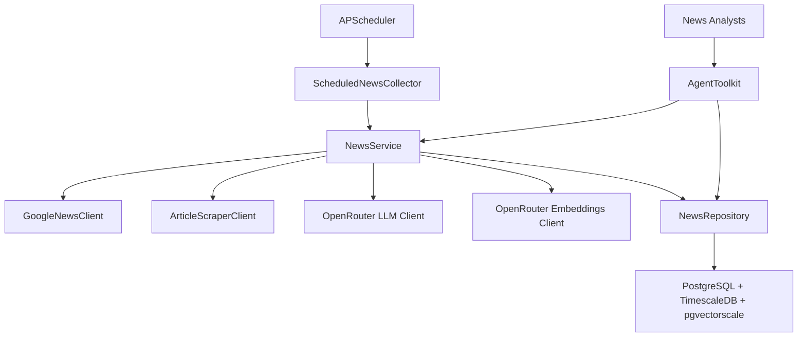

# News Domain Technical Design

## Overview

This document details the technical design for completing the final 5% of the News domain implementation. The existing infrastructure is 95% complete with Google News collection, article scraping, and basic storage implemented. The remaining work focuses on **scheduled execution**, **LLM-powered sentiment analysis**, and **vector embeddings** using OpenRouter as the unified LLM provider.

## Architecture Overview

### Component Relationships



### Data Flow Architecture

1. **Scheduled Collection Flow**
   ```
   APScheduler → ScheduledNewsCollector → NewsService.update_company_news()
   → GoogleNewsClient → ArticleScraperClient → OpenRouter (sentiment + embeddings)
   → NewsRepository.upsert_batch() → PostgreSQL
   ```

2. **Agent Query Flow**
   ```
   News Analyst → AgentToolkit → NewsService.find_relevant_articles()
   → NewsRepository (semantic search) → pgvectorscale vector similarity
   ```

### Key Design Principles

- **Leverage Existing 95%**: Build on proven GoogleNewsClient and ArticleScraperClient infrastructure
- **OpenRouter Unified**: Single API for both sentiment analysis and embeddings
- **Best-Effort Processing**: LLM failures don't block article storage
- **Vector-Enhanced Search**: Semantic similarity for News Analysts
- **Fault-Tolerant Scheduling**: Robust error handling and monitoring

## Domain Model

### Enhanced NewsArticle Entity

The existing `NewsArticle` entity requires enhancements for structured sentiment and vector support:

```python
from typing import Optional, Dict, Any, List
from pydantic import BaseModel, Field, validator
import datetime

class SentimentScore(BaseModel):
    """Structured sentiment analysis result"""
    sentiment: Literal["positive", "negative", "neutral"]
    confidence: float = Field(ge=0.0, le=1.0)
    reasoning: str
    
    @validator('confidence')
    def validate_confidence(cls, v):
        if v < 0.5:
            raise ValueError("Confidence must be >= 0.5 for reliable sentiment")
        return v

class NewsArticle(BaseModel):
    """Enhanced NewsArticle entity with sentiment and vector support"""
    # Existing fields (95% complete)
    headline: str
    url: str = Field(..., regex=r'^https?://')
    source: str
    published_date: datetime.datetime
    summary: Optional[str] = None
    entities: List[str] = Field(default_factory=list)
    author: Optional[str] = None
    category: Optional[str] = None
    
    # Enhanced fields (final 5%)
    sentiment_score: Optional[SentimentScore] = None
    title_embedding: Optional[List[float]] = Field(None, min_items=1536, max_items=1536)
    content_embedding: Optional[List[float]] = Field(None, min_items=1536, max_items=1536)
    
    # Metadata
    created_at: datetime.datetime = Field(default_factory=datetime.datetime.now)
    updated_at: datetime.datetime = Field(default_factory=datetime.datetime.now)
    
    @validator('content_embedding', 'title_embedding')
    def validate_embeddings(cls, v):
        if v and len(v) != 1536:
            raise ValueError("Embeddings must be 1536 dimensions for OpenRouter compatibility")
        return v
        
    def has_reliable_sentiment(self) -> bool:
        """Check if sentiment analysis is reliable (confidence >= 0.5)"""
        return bool(self.sentiment_score and self.sentiment_score.confidence >= 0.5)
        
    def to_record(self) -> Dict[str, Any]:
        """Convert to database record format"""
        record = self.dict()
        # Convert sentiment to JSONB format
        if self.sentiment_score:
            record['sentiment_score'] = self.sentiment_score.dict()
        return record
    
    @classmethod
    def from_record(cls, record: Dict[str, Any]) -> 'NewsArticle':
        """Create entity from database record"""
        if record.get('sentiment_score'):
            record['sentiment_score'] = SentimentScore(**record['sentiment_score'])
        return cls(**record)
```

### New NewsJobConfig Entity

Configuration entity for scheduled news collection:

```python
from pydantic import BaseModel, Field, validator
from typing import List

class NewsJobConfig(BaseModel):
    """Configuration for scheduled news collection jobs"""
    tickers: List[str] = Field(..., min_items=1, max_items=50)
    schedule_hour: int = Field(..., ge=0, le=23)
    sentiment_model: str = Field(default="anthropic/claude-3.5-haiku")
    embedding_model: str = Field(default="text-embedding-3-large") 
    max_articles_per_ticker: int = Field(default=20, ge=5, le=100)
    lookback_days: int = Field(default=7, ge=1, le=30)
    
    @validator('tickers')
    def validate_tickers(cls, v):
        # Ensure uppercase stock symbols
        return [ticker.upper().strip() for ticker in v]
    
    @validator('sentiment_model')
    def validate_sentiment_model(cls, v):
        # Ensure OpenRouter model format
        if '/' not in v:
            raise ValueError("Model must be in OpenRouter format (provider/model)")
        return v
    
    def to_cron_expression(self) -> str:
        """Convert to cron expression for APScheduler"""
        return f"0 {self.schedule_hour} * * *"  # Daily at specified hour
```

## Database Design

### Schema Enhancements

The existing `news_articles` table requires minimal modifications to support the final 5%:

```sql
-- Existing table structure (95% complete)
CREATE TABLE IF NOT EXISTS news_articles (
    id SERIAL PRIMARY KEY,
    headline TEXT NOT NULL,
    url TEXT UNIQUE NOT NULL,
    source TEXT NOT NULL,
    published_date TIMESTAMPTZ NOT NULL,
    summary TEXT,
    entities TEXT[] DEFAULT '{}',
    sentiment_score JSONB,  -- Enhanced for structured format
    author TEXT,
    category TEXT,
    title_embedding vector(1536),     -- New: pgvectorscale vector type
    content_embedding vector(1536),   -- New: pgvectorscale vector type
    created_at TIMESTAMPTZ DEFAULT NOW(),
    updated_at TIMESTAMPTZ DEFAULT NOW()
);

-- New indexes for final 5% performance
CREATE INDEX CONCURRENTLY IF NOT EXISTS idx_news_articles_symbol_date 
    ON news_articles (((entities)), published_date DESC);

CREATE INDEX CONCURRENTLY IF NOT EXISTS idx_news_articles_title_embedding 
    ON news_articles USING vectors (title_embedding vector_cosine_ops);

CREATE INDEX CONCURRENTLY IF NOT EXISTS idx_news_articles_content_embedding 
    ON news_articles USING vectors (content_embedding vector_cosine_ops);

CREATE INDEX CONCURRENTLY IF NOT EXISTS idx_news_articles_sentiment 
    ON news_articles (((sentiment_score->>'sentiment'))) 
    WHERE sentiment_score IS NOT NULL;
```

### Query Patterns

**Time-based News Queries (News Analysts)**
```sql
-- Optimized for Agent queries: recent news for specific ticker
SELECT headline, summary, sentiment_score, published_date
FROM news_articles 
WHERE entities @> ARRAY[$1::text] 
  AND published_date >= NOW() - INTERVAL '30 days'
ORDER BY published_date DESC 
LIMIT 20;
```

**Semantic Similarity Queries (Vector Search)**
```sql
-- Find similar articles using pgvectorscale
SELECT headline, url, summary, 
       1 - (title_embedding <=> $1::vector) AS similarity_score
FROM news_articles 
WHERE entities @> ARRAY[$2::text]
  AND title_embedding IS NOT NULL
ORDER BY title_embedding <=> $1::vector 
LIMIT 10;
```

**Batch Upsert Operations (Daily Collection)**
```sql
-- Efficient upsert for daily news collection
INSERT INTO news_articles (headline, url, source, published_date, summary, entities, sentiment_score, title_embedding, content_embedding)
VALUES ($1, $2, $3, $4, $5, $6, $7, $8, $9)
ON CONFLICT (url) DO UPDATE SET
    headline = EXCLUDED.headline,
    summary = EXCLUDED.summary,
    entities = EXCLUDED.entities,
    sentiment_score = EXCLUDED.sentiment_score,
    title_embedding = EXCLUDED.title_embedding,
    content_embedding = EXCLUDED.content_embedding,
    updated_at = NOW();
```

## API Integration

### OpenRouter Unified Client

Single OpenRouter integration for both sentiment analysis and embeddings:

```python
from typing import List, Optional, Dict, Any
import httpx
from tradingagents.config import TradingAgentsConfig

class OpenRouterClient:
    """Unified OpenRouter client for sentiment analysis and embeddings"""
    
    def __init__(self, config: TradingAgentsConfig):
        self.config = config
        self.base_url = "https://openrouter.ai/api/v1"
        self.headers = {
            "Authorization": f"Bearer {config.openrouter_api_key}",
            "Content-Type": "application/json"
        }
    
    async def analyze_sentiment(self, text: str, model: Optional[str] = None) -> SentimentScore:
        """Generate structured sentiment analysis using LLM"""
        model = model or self.config.quick_think_llm
        
        prompt = f"""Analyze the sentiment of this news article text and respond with ONLY a JSON object:

Article: {text[:2000]}  # Truncate for token limits

Required JSON format:
{{
    "sentiment": "positive|negative|neutral",
    "confidence": 0.0-1.0,
    "reasoning": "brief explanation"
}}"""
        
        payload = {
            "model": model,
            "messages": [{"role": "user", "content": prompt}],
            "temperature": 0.1,  # Low temperature for consistent structured output
            "max_tokens": 200
        }
        
        async with httpx.AsyncClient() as client:
            try:
                response = await client.post(
                    f"{self.base_url}/chat/completions",
                    headers=self.headers,
                    json=payload,
                    timeout=30.0
                )
                response.raise_for_status()
                
                result = response.json()
                content = result["choices"][0]["message"]["content"].strip()
                
                # Parse JSON response
                import json
                sentiment_data = json.loads(content)
                return SentimentScore(**sentiment_data)
                
            except Exception as e:
                # Best-effort: return neutral sentiment on failure
                return SentimentScore(
                    sentiment="neutral",
                    confidence=0.3,  # Below reliability threshold
                    reasoning=f"Analysis failed: {str(e)[:100]}"
                )
    
    async def generate_embeddings(self, texts: List[str], model: Optional[str] = None) -> List[List[float]]:
        """Generate embeddings for multiple texts"""
        model = model or "text-embedding-3-large"
        
        # Truncate texts to avoid token limits
        truncated_texts = [text[:8000] for text in texts]
        
        payload = {
            "model": model,
            "input": truncated_texts
        }
        
        async with httpx.AsyncClient() as client:
            try:
                response = await client.post(
                    f"{self.base_url}/embeddings",
                    headers=self.headers,
                    json=payload,
                    timeout=60.0
                )
                response.raise_for_status()
                
                result = response.json()
                return [item["embedding"] for item in result["data"]]
                
            except Exception as e:
                # Return None embeddings on failure (stored as NULL in DB)
                return [None] * len(texts)
```

### Enhanced NewsService Integration

Update existing NewsService to integrate LLM capabilities:

```python
class NewsService:
    """Enhanced NewsService with LLM sentiment and embeddings (final 5%)"""
    
    def __init__(self, 
                 repository: NewsRepository, 
                 google_client: GoogleNewsClient,
                 scraper_client: ArticleScraperClient,
                 openrouter_client: OpenRouterClient):
        self.repository = repository
        self.google_client = google_client
        self.scraper_client = scraper_client
        self.openrouter_client = openrouter_client
    
    async def update_company_news(self, 
                                symbol: str, 
                                lookback_days: int = 7,
                                max_articles: int = 20,
                                include_sentiment: bool = True,
                                include_embeddings: bool = True) -> List[NewsArticle]:
        """Enhanced method with LLM sentiment analysis and embeddings"""
        
        # Step 1: Use existing 95% infrastructure for collection
        cutoff_date = datetime.datetime.now() - datetime.timedelta(days=lookback_days)
        
        # Fetch from Google News (existing)
        google_results = await self.google_client.fetch_company_news(symbol, max_articles)
        
        articles = []
        for result in google_results:
            if result.published_date < cutoff_date:
                continue
                
            # Scrape full content (existing)
            scraped_content = await self.scraper_client.scrape_article(result.url)
            
            # Create base article (existing pattern)
            article = NewsArticle(
                headline=result.title,
                url=result.url,
                source=result.source,
                published_date=result.published_date,
                summary=scraped_content.summary if scraped_content else result.description,
                entities=[symbol],
                author=scraped_content.author if scraped_content else None
            )
            
            # Step 2: NEW - Add LLM sentiment analysis
            if include_sentiment and scraped_content and scraped_content.content:
                article.sentiment_score = await self.openrouter_client.analyze_sentiment(
                    scraped_content.content
                )
            
            articles.append(article)
        
        # Step 3: NEW - Batch generate embeddings
        if include_embeddings and articles:
            titles = [a.headline for a in articles]
            contents = [a.summary or a.headline for a in articles]
            
            title_embeddings = await self.openrouter_client.generate_embeddings(titles)
            content_embeddings = await self.openrouter_client.generate_embeddings(contents)
            
            for i, article in enumerate(articles):
                if i < len(title_embeddings) and title_embeddings[i]:
                    article.title_embedding = title_embeddings[i]
                if i < len(content_embeddings) and content_embeddings[i]:
                    article.content_embedding = content_embeddings[i]
        
        # Step 4: Batch persist (existing pattern)
        await self.repository.upsert_batch(articles)
        return articles
    
    async def find_similar_articles(self, 
                                  query_text: str, 
                                  symbol: Optional[str] = None,
                                  limit: int = 10) -> List[NewsArticle]:
        """NEW: Semantic similarity search for News Analysts"""
        
        # Generate query embedding
        query_embeddings = await self.openrouter_client.generate_embeddings([query_text])
        if not query_embeddings[0]:
            # Fallback to text search
            return await self.repository.find_by_text_search(query_text, symbol, limit)
            
        return await self.repository.find_similar_articles(
            query_embeddings[0], symbol, limit
        )
```

## Job Scheduling Architecture

### APScheduler Integration

Robust scheduled execution using APScheduler:

```python
from apscheduler.schedulers.asyncio import AsyncIOScheduler
from apscheduler.jobstores.redis import RedisJobStore  # Optional: persistent job store
from apscheduler.executors.asyncio import AsyncIOExecutor
import logging

class ScheduledNewsCollector:
    """Orchestrates scheduled news collection jobs"""
    
    def __init__(self, 
                 news_service: NewsService,
                 config: TradingAgentsConfig,
                 job_config: NewsJobConfig):
        self.news_service = news_service
        self.config = config
        self.job_config = job_config
        
        # Configure APScheduler
        jobstores = {
            'default': {'type': 'memory'}  # Use Redis for production
        }
        executors = {
            'default': AsyncIOExecutor(),
        }
        job_defaults = {
            'coalesce': False,  # Don't combine missed jobs
            'max_instances': 1,  # One job per ticker at a time
            'misfire_grace_time': 300  # 5 minute grace period
        }
        
        self.scheduler = AsyncIOScheduler(
            jobstores=jobstores,
            executors=executors,
            job_defaults=job_defaults,
            timezone='UTC'
        )
    
    async def start(self):
        """Start the scheduler and register jobs"""
        
        for ticker in self.job_config.tickers:
            # Schedule daily collection for each ticker
            self.scheduler.add_job(
                func=self._collect_ticker_news,
                trigger='cron',
                hour=self.job_config.schedule_hour,
                minute=0,
                args=[ticker],
                id=f"news_collection_{ticker}",
                replace_existing=True,
                max_instances=1
            )
            
        self.scheduler.start()
        logging.info(f"Started news collection scheduler for {len(self.job_config.tickers)} tickers")
    
    async def stop(self):
        """Gracefully stop the scheduler"""
        if self.scheduler.running:
            self.scheduler.shutdown(wait=True)
    
    async def _collect_ticker_news(self, ticker: str):
        """Execute news collection for a single ticker"""
        
        start_time = datetime.datetime.now()
        
        try:
            logging.info(f"Starting news collection for {ticker}")
            
            articles = await self.news_service.update_company_news(
                symbol=ticker,
                lookback_days=self.job_config.lookback_days,
                max_articles=self.job_config.max_articles_per_ticker,
                include_sentiment=True,
                include_embeddings=True
            )
            
            # Log metrics
            sentiment_count = sum(1 for a in articles if a.has_reliable_sentiment())
            embedding_count = sum(1 for a in articles if a.title_embedding)
            
            duration = (datetime.datetime.now() - start_time).total_seconds()
            
            logging.info(
                f"Completed news collection for {ticker}: "
                f"{len(articles)} articles, {sentiment_count} with sentiment, "
                f"{embedding_count} with embeddings in {duration:.1f}s"
            )
            
        except Exception as e:
            logging.error(f"News collection failed for {ticker}: {str(e)}")
            # Don't raise - let scheduler continue with other tickers
    
    def get_job_status(self) -> Dict[str, Any]:
        """Get status of all scheduled jobs"""
        jobs = self.scheduler.get_jobs()
        return {
            "scheduler_running": self.scheduler.running,
            "job_count": len(jobs),
            "jobs": [
                {
                    "id": job.id,
                    "next_run": job.next_run_time.isoformat() if job.next_run_time else None,
                    "trigger": str(job.trigger)
                }
                for job in jobs
            ]
        }
```

### Error Handling and Monitoring

Comprehensive error handling for production reliability:

```python
class NewsCollectionMonitor:
    """Monitor and handle news collection job failures"""
    
    def __init__(self, collector: ScheduledNewsCollector):
        self.collector = collector
        self.failure_counts = defaultdict(int)
        self.max_failures = 3
    
    async def handle_job_failure(self, ticker: str, error: Exception):
        """Handle job failure with exponential backoff"""
        
        self.failure_counts[ticker] += 1
        
        if self.failure_counts[ticker] >= self.max_failures:
            logging.error(f"Max failures reached for {ticker}, disabling job")
            self.collector.scheduler.remove_job(f"news_collection_{ticker}")
            # Could send alert here
        else:
            # Schedule retry with exponential backoff
            delay_minutes = 2 ** self.failure_counts[ticker]
            retry_time = datetime.datetime.now() + datetime.timedelta(minutes=delay_minutes)
            
            self.collector.scheduler.add_job(
                func=self.collector._collect_ticker_news,
                trigger='date',
                run_date=retry_time,
                args=[ticker],
                id=f"news_retry_{ticker}_{int(retry_time.timestamp())}",
                max_instances=1
            )
    
    def reset_failure_count(self, ticker: str):
        """Reset failure count on successful job"""
        if ticker in self.failure_counts:
            del self.failure_counts[ticker]
```

## Implementation Strategy

### Phase 1: Entity and Database Enhancements (Week 1)

**Deliverables:**
- [ ] Enhanced `NewsArticle` entity with `SentimentScore` and vector support
- [ ] New `NewsJobConfig` entity with validation
- [ ] Database migration for vector indexes and sentiment_score JSONB enhancement
- [ ] Repository method `find_similar_articles()` with pgvectorscale integration

**Testing Focus:**
- Unit tests for entity validation and serialization
- Repository integration tests with vector similarity queries
- Database migration verification

### Phase 2: OpenRouter Integration (Week 2)

**Deliverables:**
- [ ] `OpenRouterClient` with sentiment analysis and embeddings
- [ ] Enhanced `NewsService.update_company_news()` with LLM integration
- [ ] Error handling for LLM failures (best-effort approach)
- [ ] Integration tests with OpenRouter API (using pytest-vcr)

**Testing Focus:**
- Mock OpenRouter responses for consistent testing
- Error handling scenarios (API failures, malformed responses)
- Embedding dimension validation

### Phase 3: Job Scheduling System (Week 3)

**Deliverables:**
- [ ] `ScheduledNewsCollector` with APScheduler integration
- [ ] `NewsCollectionMonitor` for error handling and retries
- [ ] Configuration management for job scheduling
- [ ] Graceful startup and shutdown procedures

**Testing Focus:**
- Scheduler lifecycle testing
- Job execution and failure handling
- Configuration validation

### Phase 4: Testing and Performance Optimization (Week 4)

**Deliverables:**
- [ ] Complete test coverage maintaining >85% threshold
- [ ] Performance optimization for vector queries
- [ ] Documentation and deployment guides
- [ ] Integration with existing News Analyst AgentToolkit

**Testing Focus:**
- End-to-end integration tests
- Performance benchmarks for vector similarity queries
- Load testing for scheduled job execution

## Testing Strategy

### Test Architecture

Following the existing pragmatic TDD approach with mock boundaries:

```
tests/domains/news/
├── __init__.py
├── test_news_entities.py          # Entity validation and serialization
├── test_news_service.py           # Mock repository and OpenRouter client  
├── test_news_repository.py        # PostgreSQL test database
├── test_openrouter_client.py      # pytest-vcr for API responses
├── test_scheduled_collector.py    # Mock APScheduler and services
└── integration/
    ├── test_sentiment_pipeline.py    # End-to-end sentiment analysis
    ├── test_embedding_pipeline.py    # End-to-end embedding generation
    └── test_scheduled_execution.py   # Full job execution cycle
```

### Key Test Categories

**Entity Tests (Fast Unit Tests)**
```python
def test_news_article_sentiment_validation():
    """Test sentiment score validation and reliability checks"""
    
    # Valid sentiment
    sentiment = SentimentScore(
        sentiment="positive",
        confidence=0.8,
        reasoning="Strong positive language"
    )
    
    article = NewsArticle(
        headline="Test headline",
        url="https://example.com",
        source="Test Source",
        published_date=datetime.datetime.now(),
        sentiment_score=sentiment
    )
    
    assert article.has_reliable_sentiment() == True
    
    # Low confidence sentiment
    low_confidence = SentimentScore(
        sentiment="neutral",
        confidence=0.3,
        reasoning="Ambiguous language"
    )
    
    article.sentiment_score = low_confidence
    assert article.has_reliable_sentiment() == False

def test_news_article_vector_validation():
    """Test vector embedding validation"""
    
    # Valid 1536-dimension embedding
    valid_embedding = [0.1] * 1536
    article = NewsArticle(
        headline="Test",
        url="https://example.com", 
        source="Test",
        published_date=datetime.datetime.now(),
        title_embedding=valid_embedding
    )
    
    assert len(article.title_embedding) == 1536
    
    # Invalid dimension should raise ValidationError
    with pytest.raises(ValidationError):
        NewsArticle(
            headline="Test",
            url="https://example.com",
            source="Test", 
            published_date=datetime.datetime.now(),
            title_embedding=[0.1] * 512  # Wrong dimension
        )
```

**Service Integration Tests (Mock Boundaries)**
```python
@pytest.mark.asyncio
async def test_news_service_with_sentiment_analysis(mock_openrouter_client, mock_repository):
    """Test NewsService integration with mocked LLM client"""
    
    # Mock successful sentiment analysis
    mock_sentiment = SentimentScore(
        sentiment="positive",
        confidence=0.9,
        reasoning="Optimistic financial outlook"
    )
    mock_openrouter_client.analyze_sentiment.return_value = mock_sentiment
    
    # Mock embeddings
    mock_openrouter_client.generate_embeddings.return_value = [
        [0.1] * 1536,  # title embedding
        [0.2] * 1536   # content embedding
    ]
    
    service = NewsService(
        repository=mock_repository,
        google_client=mock_google_client,
        scraper_client=mock_scraper_client,
        openrouter_client=mock_openrouter_client
    )
    
    articles = await service.update_company_news("AAPL", include_sentiment=True)
    
    # Verify LLM integration
    assert len(articles) > 0
    assert articles[0].sentiment_score == mock_sentiment
    assert articles[0].title_embedding == [0.1] * 1536
    assert mock_openrouter_client.analyze_sentiment.called
    assert mock_openrouter_client.generate_embeddings.called
```

**Repository Integration Tests (Real Database)**
```python
@pytest.mark.asyncio 
async def test_repository_vector_similarity_search(test_db):
    """Test vector similarity search with real pgvectorscale"""
    
    repository = NewsRepository(test_db)
    
    # Insert articles with embeddings
    article1 = NewsArticle(
        headline="Apple reports strong iPhone sales",
        url="https://example.com/1",
        source="TechNews",
        published_date=datetime.datetime.now(),
        entities=["AAPL"],
        title_embedding=[0.1, 0.2] + [0.0] * 1534  # Similar to query
    )
    
    article2 = NewsArticle(
        headline="Microsoft launches new Azure features", 
        url="https://example.com/2",
        source="CloudNews",
        published_date=datetime.datetime.now(),
        entities=["MSFT"],
        title_embedding=[0.9, 0.8] + [0.0] * 1534  # Different from query
    )
    
    await repository.upsert_batch([article1, article2])
    
    # Query with similar embedding
    query_embedding = [0.15, 0.25] + [0.0] * 1534
    similar_articles = await repository.find_similar_articles(
        query_embedding, symbol="AAPL", limit=1
    )
    
    assert len(similar_articles) == 1
    assert similar_articles[0].headline == "Apple reports strong iPhone sales"
```

**API Integration Tests (pytest-vcr)**
```python
@pytest.mark.vcr
@pytest.mark.asyncio
async def test_openrouter_sentiment_analysis():
    """Test real OpenRouter API calls with VCR cassettes"""
    
    config = TradingAgentsConfig.from_env()
    client = OpenRouterClient(config)
    
    test_text = "Apple's quarterly earnings exceeded expectations with strong iPhone sales."
    
    sentiment = await client.analyze_sentiment(test_text)
    
    assert isinstance(sentiment, SentimentScore)
    assert sentiment.sentiment in ["positive", "negative", "neutral"]
    assert 0.0 <= sentiment.confidence <= 1.0
    assert len(sentiment.reasoning) > 0

@pytest.mark.vcr
@pytest.mark.asyncio
async def test_openrouter_embeddings_generation():
    """Test real OpenRouter embeddings API with VCR"""
    
    config = TradingAgentsConfig.from_env()
    client = OpenRouterClient(config)
    
    texts = ["Apple stock rises", "Market volatility increases"]
    
    embeddings = await client.generate_embeddings(texts)
    
    assert len(embeddings) == 2
    assert all(len(emb) == 1536 for emb in embeddings)
    assert all(isinstance(val, float) for emb in embeddings for val in emb)
```

### Coverage Requirements

Maintain existing >85% coverage with new components:

- **Entity Layer**: 95% coverage (comprehensive validation testing)
- **Service Layer**: 90% coverage (mock external dependencies)  
- **Repository Layer**: 85% coverage (real database integration tests)
- **Client Layer**: 80% coverage (pytest-vcr for API calls)
- **Integration Tests**: End-to-end scenarios covering complete workflows

### Performance Testing

```python
@pytest.mark.performance
@pytest.mark.asyncio
async def test_vector_similarity_performance():
    """Ensure vector similarity queries perform under 100ms"""
    
    repository = NewsRepository(test_db)
    
    # Insert 1000 articles with embeddings
    articles = [create_test_article_with_embedding() for _ in range(1000)]
    await repository.upsert_batch(articles)
    
    query_embedding = [random.random() for _ in range(1536)]
    
    start_time = time.time()
    results = await repository.find_similar_articles(query_embedding, limit=10)
    duration = time.time() - start_time
    
    assert duration < 0.1  # Under 100ms
    assert len(results) == 10
```

## Integration Points

### News Analyst AgentToolkit Integration

The completed News domain integrates seamlessly with existing News Analyst agents:

```python
class NewsAnalystToolkit:
    """Enhanced toolkit with semantic search capabilities"""
    
    def __init__(self, news_service: NewsService):
        self.news_service = news_service
    
    async def get_relevant_news(self, 
                              ticker: str, 
                              query: Optional[str] = None,
                              days_back: int = 30) -> List[Dict[str, Any]]:
        """Get news with optional semantic search"""
        
        if query:
            # Use semantic similarity search
            articles = await self.news_service.find_similar_articles(
                query_text=query,
                symbol=ticker,
                limit=20
            )
        else:
            # Use time-based search (existing)
            articles = await self.news_service.find_recent_news(
                symbol=ticker,
                days_back=days_back
            )
        
        return [
            {
                "headline": article.headline,
                "summary": article.summary,
                "published_date": article.published_date.isoformat(),
                "sentiment": article.sentiment_score.sentiment if article.sentiment_score else "unknown",
                "confidence": article.sentiment_score.confidence if article.sentiment_score else 0.0,
                "source": article.source,
                "url": article.url
            }
            for article in articles
        ]
```

### Configuration Integration

Seamless integration with existing `TradingAgentsConfig`:

```python
# Enhanced configuration for news domain completion
config = TradingAgentsConfig(
    # Existing LLM configuration
    llm_provider="openrouter",
    openrouter_api_key=os.getenv("OPENROUTER_API_KEY"),
    quick_think_llm="anthropic/claude-3.5-haiku",  # For sentiment analysis
    
    # New news-specific settings
    news_collection_enabled=True,
    news_schedule_hour=6,  # UTC
    news_sentiment_enabled=True,
    news_embeddings_enabled=True,
    news_max_articles_per_ticker=20,
    
    # Database (existing)
    database_url=os.getenv("DATABASE_URL"),
)

# Job configuration
news_job_config = NewsJobConfig(
    tickers=["AAPL", "GOOGL", "MSFT", "TSLA", "NVDA"],
    schedule_hour=6,  # 6 AM UTC daily collection
    sentiment_model=config.quick_think_llm,
    embedding_model="text-embedding-3-large",
    max_articles_per_ticker=20
)
```

This design completes the final 5% of the News domain while leveraging the existing 95% infrastructure, maintaining architectural consistency, and providing the robust scheduled execution, LLM-powered sentiment analysis, and vector embeddings needed for advanced News Analyst capabilities.