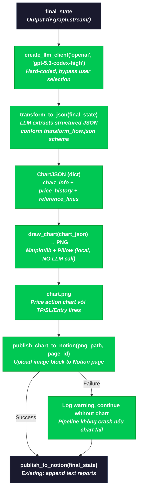
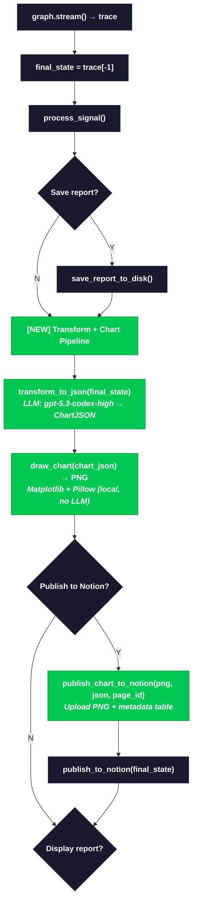

# Transforming Data Task — Full Pipeline: CLI → Graph → GPT-5.3-Codex-High → Chart → Notion

> **Status**: Proposed
> **Date**: 2026-04-27
> **Author**: William
> **Relates to**: [general_flow.md](./general_flow.md), [news_flow.md](./news_flow.md), [transform_flow.json](./transform_flow.json)

---

## 1. Problem Statement

Hiện tại pipeline kết thúc tại `final_trade_decision` — một chuỗi markdown thô từ Portfolio Manager. Khi publish lên Notion, data chỉ là text blocks, không có structured JSON hay chart visualization. User phải tự đọc và parse mentally.

Mục tiêu: sau khi graph chạy xong:

1. **Transform** `final_state` thành structured JSON theo schema `transform_flow.json` — force gọi `gpt-5.3-codex-high` (không cho user chọn model khác).
2. **Draw chart** từ JSON đó bằng **Matplotlib + Pillow** (local rendering, không gọi LLM) — tiết kiệm token.
3. **Publish** chart image (PNG) + structured JSON lên Notion page.

---

## 2. Proposed Solution

Thêm 3 bước mới vào post-processing pipeline (sau `graph.stream()`, trước `publish_to_notion()`):

```
graph.stream() → final_state
    ↓
[NEW] transform_to_json(final_state)        ← force gpt-5.3-codex-high (LLM call duy nhất)
    ↓
[NEW] draw_chart(chart_json)                 ← Matplotlib + Pillow (local, KHÔNG gọi LLM)
    ↓
[NEW] publish_chart_to_notion(chart_png)     ← Notion API với fallback
    ↓
publish_to_notion(final_state)               ← existing, không đổi
```

**Constraints**:
- `transform_to_json()` **luôn dùng `gpt-5.3-codex-high`** — hard-coded, không có lựa chọn.
- `draw_chart()` **không gọi LLM** — chỉ dùng Matplotlib + Pillow để render PNG từ JSON.
- Output JSON từ LLM **phải conform** schema trong `docs/transform_flow.json`.

---

## 3. Architecture Flow



---

## 4. Output JSON Schema

LLM output **phải conform** schema trong `docs/transform_flow.json`. Đây là contract giữa `transform_to_json()` (LLM) và `draw_chart()` (Matplotlib).

**File tham chiếu**: [`docs/transform_flow.json`](./transform_flow.json)

```json
{
  "chart_info": {
    "title": "string — Tiêu đề chart, VD: 'Kế Hoạch Giao Dịch BTC/USDT (26/04/2026)'",
    "current_price": "float — Giá hiện tại",
    "y_axis_range": "[float, float] — Min/max cho trục Y",
    "x_label": "string — Label trục X",
    "y_label": "string — Label trục Y"
  },
  "price_history": {
    "dates": ["string[] — Danh sách ngày, VD: '17/04', '18/04', ..."],
    "prices": ["float[] — Giá tương ứng mỗi ngày"]
  },
  "reference_lines": [
    {
      "price": "float — Giá level",
      "label": "string — Tên level: TP Max, ENTRY, HARD SL, Short TP1, ...",
      "color": "string — Matplotlib color: green, red, blue, orange, darkred, ...",
      "linestyle": "string — solid, dashed, dotted, dashdot",
      "linewidth": "float — Độ dày line",
      "align": "string — left hoặc right (vị trí label trên chart)"
    }
  ]
}
```

**Pydantic models** cho validation (file `tradingagents/graph/transform.py`):

```python
from __future__ import annotations
from pydantic import BaseModel, Field


class ChartInfo(BaseModel):
    title: str
    current_price: float
    y_axis_range: list[float] = Field(min_length=2, max_length=2)
    x_label: str = "Thời gian"
    y_label: str = "Giá (USDT)"


class PriceHistory(BaseModel):
    dates: list[str] = Field(min_length=1)
    prices: list[float] = Field(min_length=1)


class ReferenceLine(BaseModel):
    price: float
    label: str
    color: str = "gray"
    linestyle: str = "solid"
    linewidth: float = 1.0
    align: str = "right"


class ChartJSON(BaseModel):
    """Output schema from GPT-5.3-Codex-High — matches transform_flow.json."""
    chart_info: ChartInfo
    price_history: PriceHistory
    reference_lines: list[ReferenceLine] = Field(min_length=1)
```

---

## 5. Function Signatures

### 5.1. `transform_to_json` (NEW) — LLM call duy nhất

**File**: `tradingagents/graph/transform.py`

```python
import logging
from pathlib import Path
from tradingagents.llm_clients import create_llm_client

logger = logging.getLogger(__name__)

# Hard-coded — no user selection
_TRANSFORM_PROVIDER = "openai"
_TRANSFORM_MODEL = "gpt-5.3-codex-high"

# Schema reference for LLM prompt
_SCHEMA_PATH = Path(__file__).resolve().parent.parent.parent / "docs" / "transform_flow.json"


def transform_to_json(
    final_state: dict,
    ticker: str,
    trade_date: str,
    *,
    base_url: str | None = None,
    api_key: str | None = None,
) -> ChartJSON:
    """Transform raw final_state into structured JSON using GPT-5.3-Codex-High.

    This function ALWAYS uses gpt-5.3-codex-high regardless of the user's
    CLI model selection. The model is hard-coded by design.

    Output JSON conforms to docs/transform_flow.json schema:
    - chart_info: title, current_price, y_axis_range
    - price_history: dates[], prices[]
    - reference_lines[]: price levels (TP, SL, Entry, etc.)

    Args:
        final_state: Complete state dict from graph execution.
        ticker: Trading symbol (e.g. "AAPL", "BTCUSDT").
        trade_date: Analysis date in YYYY-MM-DD.
        base_url: Optional OpenAI-compatible base URL override.
        api_key: Optional API key override (default: OPENAI_API_KEY env).

    Returns:
        ChartJSON validated against transform_flow.json schema.

    Raises:
        RuntimeError: If LLM call fails after retries.
        ValidationError: If LLM output doesn't match ChartJSON schema.
    """
```

### 5.2. `draw_chart` (NEW) — Matplotlib + Pillow, KHÔNG gọi LLM

**File**: `tradingagents/graph/chart_renderer.py`

```python
from pathlib import Path
from tradingagents.graph.transform import ChartJSON

import matplotlib
matplotlib.use("Agg")  # Non-interactive backend
import matplotlib.pyplot as plt
from PIL import Image


def draw_chart(
    chart_json: ChartJSON,
    output_path: Path,
) -> Path:
    """Render trading plan chart as PNG using Matplotlib + Pillow.

    NO LLM call — pure local rendering from structured JSON.
    Tiết kiệm token bằng cách dùng Matplotlib vẽ trực tiếp.

    Renders:
    - Price history line (from chart_json.price_history)
    - Horizontal reference lines (TP, SL, Entry, Breakout, etc.)
    - Color-coded labels aligned left/right per reference_line config
    - Current price marker

    Args:
        chart_json: Validated ChartJSON from transform_to_json().
        output_path: Path to save the output PNG file.

    Returns:
        Path to the saved PNG file.

    Raises:
        ValueError: If chart_json has inconsistent data (dates/prices length mismatch).
    """
```

### 5.3. `publish_chart_to_notion` (NEW)

**File**: `cli/notion_chart_publisher.py`

```python
from pathlib import Path


def publish_chart_to_notion(
    chart_png_path: Path,
    chart_json: dict,
    page_id: str,
    api_key: str,
) -> None:
    """Upload chart PNG + JSON summary to an existing Notion page.

    Steps:
    1. Upload chart PNG as Notion image block (external URL or file upload)
    2. Append reference_lines as a formatted table block
    3. Append chart_info as a callout block with key metrics

    Handles:
    - Image upload via Notion file block or external hosting
    - Graceful fallback: logs warning on failure, never raises

    Args:
        chart_png_path: Path to the rendered chart PNG from draw_chart().
        chart_json: Raw dict from transform_to_json() for metadata table.
        page_id: Notion page ID to append blocks to.
        api_key: Notion API key.
    """
```

---

## 6. CLI Integration

**File**: `cli/main.py` — modify `run_analysis()` post-processing section.



**Key change in `run_analysis()`:**

```python
# --- EXISTING: after graph.stream() completes ---
final_state = trace[-1]
decision = graph.process_signal(final_state["final_trade_decision"])

# --- NEW: Transform pipeline ---
# Step 1: LLM call (gpt-5.3-codex-high, hard-coded) → JSON conform transform_flow.json
# Step 2: Matplotlib + Pillow (local, no LLM) → PNG chart
from tradingagents.graph.transform import transform_to_json
from tradingagents.graph.chart_renderer import draw_chart

chart_json = None
chart_png_path = None

try:
    chart_json = transform_to_json(
        final_state,
        selections["ticker"],
        selections["analysis_date"],
        base_url=selections.get("backend_url"),
        api_key=selections.get("openai_api_key"),
    )
    chart_png_path = draw_chart(
        chart_json,
        output_path=results_dir / "chart.png",
    )
    console.print("[green]✓ Data transformed and chart rendered[/green]")
except Exception as e:
    logger.warning("Transform pipeline failed, continuing without chart: %s", e)

# --- EXISTING: save + notion ---
# ... save_report_to_disk ...

# Notion publish: chart first, then text
if notion_choice in ("Y", "YES"):
    try:
        from cli.notion_publisher import publish_to_notion
        page_url = publish_to_notion(final_state, selections["ticker"], selections["analysis_date"])

        # NEW: upload chart PNG + metadata to the same Notion page
        if chart_png_path is not None and chart_json is not None:
            from cli.notion_chart_publisher import publish_chart_to_notion
            import re
            page_id = re.search(r"([a-f0-9]{32})", page_url)
            if page_id:
                publish_chart_to_notion(
                    chart_png_path, chart_json.model_dump(),
                    page_id.group(1), os.environ["NOTION_API_KEY"],
                )

        console.print(f"[green]✓ Published to Notion:[/green] {page_url}")
    except (EnvironmentError, RuntimeError) as e:
        console.print(f"[red]Notion publish failed:[/red] {e}")
```

---

## 7. Model & Rendering Strategy

User chọn provider/model ở CLI Step 6-7 chỉ áp dụng cho **graph execution**. Post-processing dùng chiến lược hybrid: LLM cho transform, local rendering cho chart.

| Component | Engine | Có chọn lựa? | Token cost |
|-----------|--------|---------------|------------|
| Analyst nodes | `config["quick_think_llm"]` — user chọn | Yes | Per-analysis |
| Research Manager, Portfolio Manager | `config["deep_think_llm"]` — user chọn | Yes | Per-analysis |
| `transform_to_json()` | `gpt-5.3-codex-high` — hard-coded | **No** | 1 LLM call |
| `draw_chart()` | **Matplotlib + Pillow** — local | **N/A** | **0 tokens** |

**Tại sao hybrid?**
- `transform_to_json()` cần LLM vì phải hiểu ngữ cảnh từ markdown reports → extract structured data.
- `draw_chart()` KHÔNG cần LLM — nhận JSON đã structured, chỉ cần render thành hình. Dùng Matplotlib + Pillow tiết kiệm 1 LLM call (~2-5k tokens).

Trong code, model được define là module-level constant:

```python
# tradingagents/graph/transform.py
_TRANSFORM_PROVIDER: str = "openai"
_TRANSFORM_MODEL: str = "gpt-5.3-codex-high"
```

Nếu sau này muốn đổi model, chỉ cần sửa 2 constants này. Không expose ra CLI hay config.

---

## 8. Project Layout (theo project structure hiện tại)

```
tradingagents/
├── graph/
│   ├── transform.py               # ChartJSON pydantic model + transform_to_json() (LLM call)
│   └── chart_renderer.py          # draw_chart() — Matplotlib + Pillow (local rendering, no LLM)
│
├── llm_clients/                   # Đã có sẵn openai_client.py — reuse, không tạo adapter mới
│
cli/
├── notion_chart_publisher.py      # publish_chart_to_notion() — upload PNG + metadata table
│
docs/
├── transform_flow.json            # Schema contract (đã có) — LLM output phải conform
│
tests/
├── test_transform.py              # Tests cho transform (LLM mock) + JSON schema validation
├── test_chart_renderer.py         # Tests cho Matplotlib rendering (output PNG exists, dimensions)
├── test_notion_chart_publisher.py # Tests cho Notion chart publishing
```

---

## 9. Error Handling Matrix

| Scenario | Behavior | Pipeline Impact |
|----------|----------|-----------------|
| `OPENAI_API_KEY` not set | `transform_to_json()` raises `EnvironmentError` | Caught → skip chart, continue to Notion text-only |
| GPT-5.3-Codex-High returns malformed JSON | Retry 2x with stricter prompt, then raise `RuntimeError` | Caught → skip chart |
| GPT-5.3-Codex-High returns JSON không match ChartJSON | `ChartJSON.model_validate()` raises `ValidationError` → retry | Caught → skip chart if exhausted |
| GPT-5.3-Codex-High rate limited (429) | Exponential backoff (1s, 2s, 4s), max 3 retries | Caught → skip chart if exhausted |
| `gpt-5.3-codex-high` model not available on API | `openai_client.py` raises from API error | Caught → skip chart, log model unavailability |
| `final_state` missing expected keys | `transform_to_json()` handles gracefully with defaults | Partial transform, reduced chart quality |
| `price_history.dates` và `prices` length mismatch | `draw_chart()` raises `ValueError` | Caught → skip chart |
| Matplotlib fails to render (font, backend issue) | `draw_chart()` raises `RuntimeError` | Caught → skip chart |
| Output PNG path not writable | `draw_chart()` raises `OSError` | Caught → skip chart |
| Notion API rejects image upload | `publish_chart_to_notion()` logs warning, returns silently | Text-only publish succeeds |
| Notion API down entirely | Both chart + text publish fail | Existing error handling in `cli/main.py` |

---

## 10. LLM Prompt Design

Chỉ có **1 LLM call duy nhất** — `transform_to_json()`. `draw_chart()` dùng Matplotlib, không cần prompt.

### 10.1. Transform Prompt (gpt-5.3-codex-high)

```
System: You are a financial trading plan extraction engine. Given raw trading
analysis reports from multiple AI agents, extract a trading plan into the
exact JSON schema below. You must produce valid JSON that can be parsed by
Python's json.loads().

The output MUST follow this exact schema:
{contents of docs/transform_flow.json as example}

Key rules:
- chart_info.title: Include ticker and date in Vietnamese format
- chart_info.current_price: Extract from market report or final decision
- chart_info.y_axis_range: [min_price - 5%, max_price + 5%] to fit all reference lines
- price_history: Extract from market report data (last 7-10 trading days)
- reference_lines: Extract ALL price levels mentioned in final_trade_decision:
  - Take Profit levels (TP) → color: "green"
  - Entry levels → color: "orange"
  - Breakout/Add levels → color: "blue"
  - Stop Loss levels (SL) → color: "darkred"
  - Short entry/TP levels → color: "red"
  - Caution/reduce levels → color: "darkorange"

User: Given the following trading analysis for {ticker} on {trade_date}:

## Market Report
{market_report}

## Sentiment Report
{sentiment_report}

## News Report
{news_report}

## Fundamentals Report
{fundamentals_report}

## Investment Debate
Bull: {bull_history}
Bear: {bear_history}
Judge: {judge_decision}

## Final Trade Decision
{final_trade_decision}

Output ONLY valid JSON, no markdown fences, no explanation.
```

### 10.2. Chart Rendering (Matplotlib + Pillow — NO LLM)

Không có prompt. `draw_chart()` nhận `ChartJSON` và render trực tiếp:

```python
def draw_chart(chart_json: ChartJSON, output_path: Path) -> Path:
    fig, ax = plt.subplots(figsize=(14, 8))

    # 1. Plot price history line
    ax.plot(chart_json.price_history.dates, chart_json.price_history.prices,
            color="white", linewidth=2, marker="o", markersize=4)

    # 2. Draw reference lines (TP, SL, Entry, etc.)
    for ref in chart_json.reference_lines:
        ax.axhline(y=ref.price, color=ref.color,
                    linestyle=ref.linestyle, linewidth=ref.linewidth)
        x_pos = 0.98 if ref.align == "right" else 0.02
        ha = "right" if ref.align == "right" else "left"
        ax.text(x_pos, ref.price, f" {ref.label} ({ref.price:,.0f})",
                transform=ax.get_yaxis_transform(),
                color=ref.color, fontsize=9, ha=ha, va="center")

    # 3. Mark current price
    ax.axhline(y=chart_json.chart_info.current_price,
               color="yellow", linestyle="solid", linewidth=1.5, alpha=0.7)

    # 4. Style
    ax.set_ylim(chart_json.chart_info.y_axis_range)
    ax.set_title(chart_json.chart_info.title, fontsize=14, color="white")
    ax.set_xlabel(chart_json.chart_info.x_label)
    ax.set_ylabel(chart_json.chart_info.y_label)
    ax.set_facecolor("#1a1a2e")
    fig.patch.set_facecolor("#0d0d1a")

    fig.savefig(output_path, dpi=150, bbox_inches="tight")
    plt.close(fig)
    return output_path
```

---

## 11. Files Changed Summary

| File | Action | Description |
|------|--------|-------------|
| `tradingagents/graph/transform.py` | **NEW** | ChartJSON pydantic models + transform_to_json() — force gpt-5.3-codex-high, output conform transform_flow.json |
| `tradingagents/graph/chart_renderer.py` | **NEW** | draw_chart() — Matplotlib + Pillow local rendering, no LLM |
| `cli/notion_chart_publisher.py` | **NEW** | publish_chart_to_notion() — upload PNG + metadata |
| `cli/main.py` | **MODIFY** | Add transform pipeline to run_analysis() post-processing |
| `tests/test_transform.py` | **NEW** | Unit tests for ChartJSON validation + transform LLM mock |
| `tests/test_chart_renderer.py` | **NEW** | Tests for Matplotlib rendering (PNG output, dimensions) |
| `tests/test_notion_chart_publisher.py` | **NEW** | Tests for Notion chart publishing |

---

## 12. Acceptance Criteria

### AC-1: Transform Output Conforms to transform_flow.json Schema

**Given** a completed `final_state` from graph execution
**When** `transform_to_json(final_state, ticker, date)` is called
**Then**:
- Returns a valid `ChartJSON` instance (Pydantic validated)
- `chart_info.title` contains ticker và date
- `chart_info.current_price` > 0
- `chart_info.y_axis_range` has exactly 2 elements, `[0] < [1]`
- `price_history.dates` và `price_history.prices` có cùng length, ≥ 2 elements
- `reference_lines` có ≥ 1 element
- Mỗi `reference_line` có `price > 0`, `label` non-empty, `color` là valid matplotlib color
- Output JSON parseable bằng `json.loads()` và passable qua `ChartJSON.model_validate()`

### AC-2: Model is Hard-Coded to gpt-5.3-codex-high

**Given** any CLI configuration (anthropic, openai, any model selection)
**When** transform pipeline runs
**Then**:
- LLM call trong `transform_to_json()` dùng model `gpt-5.3-codex-high`
- `draw_chart()` KHÔNG gọi LLM — chỉ dùng Matplotlib + Pillow
- No CLI prompt asks user to select a model for this step
- `_TRANSFORM_MODEL` constant equals `"gpt-5.3-codex-high"`
- Tổng LLM calls cho post-processing = **1** (chỉ transform)

### AC-3: Chart Rendered as PNG via Matplotlib + Pillow

**Given** a valid `ChartJSON` từ `transform_to_json()`
**When** `draw_chart(chart_json, output_path)` is called
**Then**:
- Tạo file PNG tại `output_path`
- File size > 0 bytes, readable bằng `PIL.Image.open()`
- Chart chứa price history line với đúng số data points
- Chart chứa horizontal reference lines cho mỗi entry trong `reference_lines`
- Mỗi reference line có đúng color, linestyle, và label text
- Chart title matches `chart_info.title`
- Y-axis range matches `chart_info.y_axis_range`
- **Không có LLM call nào** trong function này

### AC-4: Notion Chart Publishing Works

**Given** valid PNG file path và chart JSON dict
**When** `publish_chart_to_notion(png_path, chart_json, page_id, api_key)` is called
**Then**:
- Upload chart PNG as image block trên Notion page
- Append reference_lines as formatted table block (price | label | color)
- Append chart_info summary as callout block
- Blocks appear **above** the existing text reports on the page

### AC-5: Pipeline is Fault-Tolerant

**Given** the transform pipeline encounters any error
**When** error occurs in `transform_to_json()`, `draw_chart()`, or `publish_chart_to_notion()`
**Then**:
- Error is logged with `logger.warning()`
- Pipeline continues to existing Notion text publish
- CLI displays `[yellow]⚠ Chart generation skipped: {reason}[/yellow]`
- No `SystemExit` or unhandled exception propagates

### AC-6: OpenAI API Key Required for Transform Only

**Given** `OPENAI_API_KEY` is not set in environment
**When** transform pipeline attempts to run
**Then**:
- `transform_to_json()` raises `EnvironmentError` with message containing `"OPENAI_API_KEY"`
- Error is caught in `run_analysis()`, pipeline continues without chart
- `draw_chart()` không bị ảnh hưởng (không cần API key — local rendering)
- If user selected a non-OpenAI provider for graph execution, they are NOT prompted for an OpenAI key — the transform step simply skips

### AC-7: Retry Logic on Transient Failures

**Given** GPT-5.3-Codex-High returns a transient error (429, 500, 503)
**When** `transform_to_json()` encounters the error
**Then**:
- Retries up to 3 times with exponential backoff (1s, 2s, 4s)
- On final failure, raises `RuntimeError`
- Each retry is logged at `logger.info()` level
- (Không áp dụng cho `draw_chart()` — local, không có network call)

### AC-8: Project Structure

**Given** new files are created
**When** reviewing project layout
**Then**:
- `tradingagents/graph/transform.py` chứa ChartJSON models + transform_to_json() — consistent with `graph/` responsibility
- `tradingagents/graph/chart_renderer.py` chứa draw_chart() — Matplotlib + Pillow, thuộc `graph/` vì là post-processing
- `cli/notion_chart_publisher.py` lives in `cli/` — consistent with Notion publishing responsibility
- `graph/transform.py` imports from `llm_clients/` — no reverse dependency
- `graph/chart_renderer.py` imports from `graph/transform.py` (ChartJSON model) — same package, OK
- `cli/` imports from `tradingagents/` — no reverse dependency
- Reuses existing `llm_clients/openai_client.py` via `create_llm_client()` — no new adapter layer

### AC-9: Dependencies — Matplotlib + Pillow

**Given** the implementation requires Matplotlib and Pillow
**When** reviewing `pyproject.toml`
**Then**:
- `matplotlib>=3.7` added to `[project.dependencies]`
- `Pillow>=10.0` added to `[project.dependencies]`
- Both packages importable in the project virtualenv
- `matplotlib.use("Agg")` set before any plotting (non-interactive backend)

### AC-10: Tests Cover Critical Paths

**Given** the implementation is complete
**When** running `pytest tests/test_transform.py tests/test_chart_renderer.py tests/test_notion_chart_publisher.py --tb=short`
**Then**:
- `test_transform.py`: validates ChartJSON pydantic constraints, mocks OpenAI client, verifies LLM output parsed correctly, verifies malformed JSON triggers retry
- `test_chart_renderer.py`: feeds sample ChartJSON (from transform_flow.json), verifies PNG created, verifies image dimensions > 0, verifies no LLM imports in module
- `test_notion_chart_publisher.py`: mocks Notion API, verifies image block uploaded, verifies table block appended
- All tests pass, coverage ≥ 80% for `graph/transform.py`, `graph/chart_renderer.py`, `cli/notion_chart_publisher.py`

---

## 13. Implementation Checklist

- [ ] Add `matplotlib>=3.7` và `Pillow>=10.0` to `pyproject.toml`
- [ ] Create `tradingagents/graph/transform.py` — ChartJSON pydantic models + transform_to_json() + LLM prompt (conform transform_flow.json)
- [ ] Create `tradingagents/graph/chart_renderer.py` — draw_chart() bằng Matplotlib + Pillow (no LLM)
- [ ] Create `cli/notion_chart_publisher.py` — publish_chart_to_notion() (upload PNG + metadata)
- [ ] Modify `cli/main.py` — add transform pipeline to run_analysis() post-processing
- [ ] Write tests: `tests/test_transform.py` (mock LLM, validate ChartJSON schema)
- [ ] Write tests: `tests/test_chart_renderer.py` (feed transform_flow.json sample, verify PNG output)
- [ ] Write tests: `tests/test_notion_chart_publisher.py` (mock Notion API)
- [ ] Run `pytest --tb=short` — all green
- [ ] Manual test: run full pipeline with real ticker, verify chart PNG renders correctly
- [ ] Manual test: verify Notion page has chart image + metadata table
- [ ] Verify gpt-5.3-codex-high is used (check logs for model name in API calls)
- [ ] Verify draw_chart() does NOT import from llm_clients or make any HTTP calls
