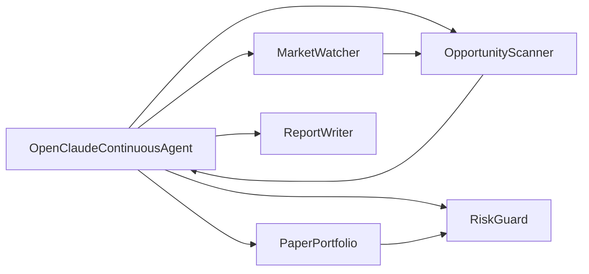

# OpenClaude Agent — Schemat

Ten sejf dokumentuje projekt `opencloude_agent`, czyli mały pakiet Python do ciągłego paper-tradingowego monitorowania rynku.

## Mapa vaultu

- [[Project Overview]] — cel projektu, zakres i najważniejsze decyzje.
- [[Repository Structure]] — układ plików projektu.
- [[Package Overview]] — eksporty pakietu.
- [[Agent Loop]] — główna pętla działania agenta.
- [[Market Data Flow]] — przepływ danych rynkowych.
- [[Opportunity Scoring]] — skanowanie i ocenianie okazji.
- [[Risk Evaluation]] — ocena ryzyka portfela.
- [[Paper Portfolio]] — symulowany portfel.
- [[Reporting and Persistence]] — zapisywanie wyników.
- [[CLI Entry Points]] — uruchamianie z linii poleceń.
- [[Configuration and Defaults]] — konfiguracja i wartości domyślne.
- [[Results Directory]] — katalog wyników.
- [[test_opencloude_agent]] — testy jednostkowe.
- [[Claude_Log]] — rejestr decyzji i wniosków.

## Główne zależności

## Szybkie linki

- [[run.py]]
- [[__init__.py]]
- [[Project Overview]]
- [[Architecture/Agent Loop]]
- [[Runtime/CLI Entry Points]]
- [[Tests/test_opencloude_agent]]
- [[Zapiski/Claude_Log]]
