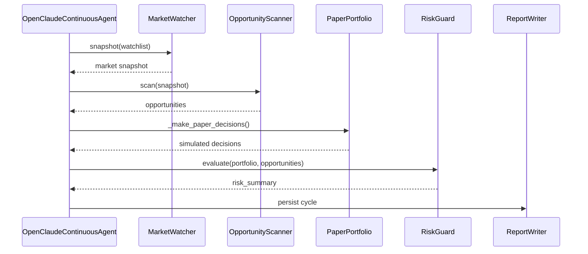

# Agent Loop

[[OpenClaudeContinuousAgent]] jest głównym koordynatorem jednego cyklu pracy.

## Jeden cykl

## Metody

- `run_once()` — wykonuje jeden pełny cykl.
- `run_watch_loop(interval_seconds=3600)` — wykonuje `run_once()` w nieskończonej pętli.
- `_make_paper_decisions(opportunities, snapshot)` — generuje decyzje kupna/trzymania.
- `_persist_cycle(...)` — zapisuje snapshot, okazje, decyzje i podsumowanie.
- `_latest_prices(snapshot)` — wyciąga aktualne ceny ze snapshotu.

## Stan agenta

- `results_dir` — katalog wyników.
- `watchlist` — lista tickerów.
- `portfolio` — instancja [[Paper Portfolio]].
- `market_watcher` — instancja [[Market Data Flow]].
- `scanner` — instancja [[Opportunity Scoring]].
- `risk_guard` — instancja [[Risk Evaluation]].
- `report_writer` — instancja [[Reporting and Persistence]].

## Linki

- [[run.py]]
- [[Market Data Flow]]
- [[Opportunity Scoring]]
- [[Risk Evaluation]]
- [[Paper Portfolio]]
- [[Reporting and Persistence]]
