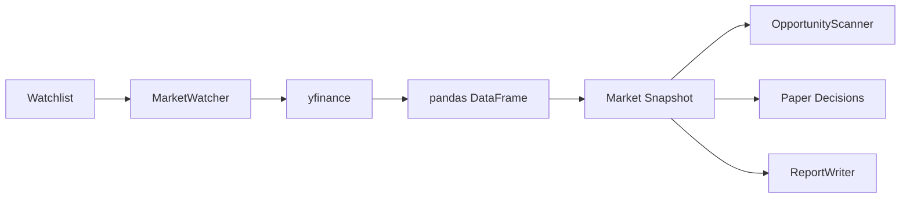

# Market Data Flow

[[MarketWatcher]] odpowiada za pobranie danych rynkowych i przygotowanie snapshotu dla reszty agenta.

## Odpowiedzialność

- Przyjmuje watchlistę tickerów.
- Pobiera dane przez `yfinance`.
- Normalizuje dane do słownika: `ticker -> metryki`.
- Obsługuje pusty snapshot bez błędu.

## Metryki snapshotu

- `close` — ostatnia cena zamknięcia.
- `volume` — ostatni wolumen.
- `return_1d` — zmiana 1-dniowa.
- `return_5d` — zmiana 5-dniowa.
- `return_20d` — zmiana 20-dniowa.
- `benchmark_return_20d` — względna zmiana wobec benchmarku, domyślnie `SPY`.

## Przepływ

## Linki

- [[MarketWatcher]]
- [[Agent Loop]]
- [[Opportunity Scoring]]
- [[Reporting and Persistence]]
