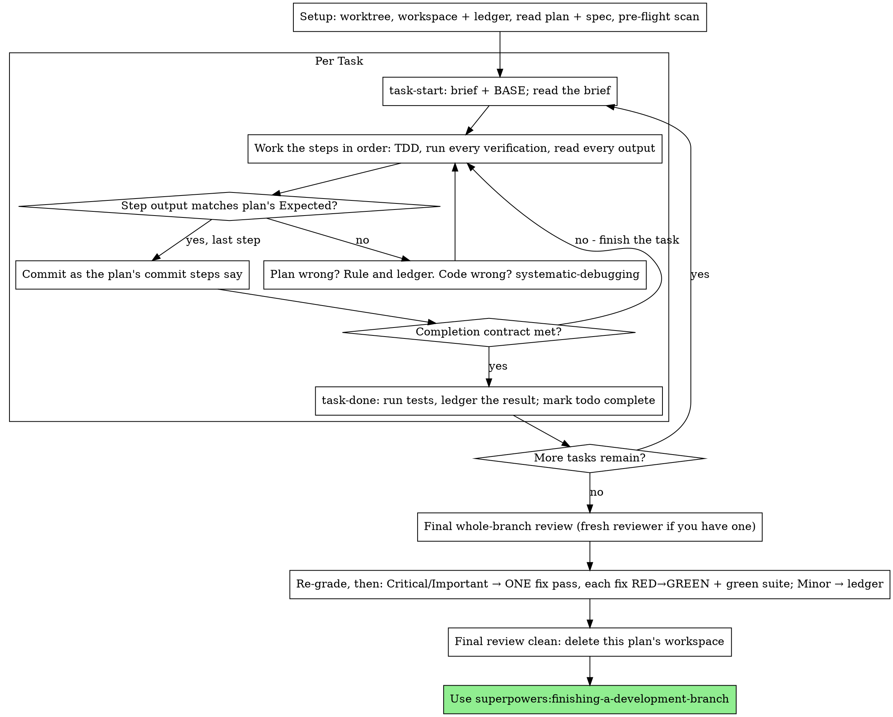

# OpenCode session transcript — CHG-001

- Session ID: `ses_eee45ba9fffenUAxicBQ5EZQrr`
- Date: 2026-10-06 19:19 (local)
- Harness: OpenCode v2.0.18
- Model: deepseek/deepseek-flash (variant: high)
- Working directory: `/home/jhb/TradingAgents`
- Cost: $0.029572157999999994; tokens: input 63405, output 8067, reasoning 18545

> Reconstituted from the local OpenCode session API `GET /api/session/<id>/message`,
> because `opencode session export` (v2) omits assistant message parts. Content is
> verbatim; secrets are redacted (none were emitted by tools in this session).

## 2026-10-06 — CHG-001: automated structural-alignment execution

### Human intervention
- Type: approve
- What: The human owner approved the CHG-001 plan at STOP POINT 1 and instructed the
  agent to execute the whole task automatically, including push and PR creation (no merge).
  They also decided the `.opencode/manuals` vs `.opencode/manual` mismatch in favour of the
  real directory, and asked for this session to be exported to `transcripts/`.
- Why: The human is the approver named in the task file; execution is delegated under
  auditable supervision, and every scope question was resolved before file moves.

### Human request (verbatim)

```text
根据.opencode的内容，完成自动化执行
```

#### Agent turn 1

##### Reasoning (verbatim)

Let me understand the request. The user says "根据.opencode的内容，完成自动化执行" (Based on the contents of .opencode, complete automated execution). Let me explore the .opencode directory first.

Wait, the skill says I must invoke relevant skills before any action. But the SUBAGENT-STOP says if dispatched as subagent ignore. I'm not a subagent. Let me think about what skill applies. The task is ambiguous—I need to explore first. But the rule says check for skills first.

Actually, let me first look at what's in .opencode. But the skill says skill check comes before exploring. Hmm. The task "根据.opencode的内容，完成自动化执行" is vague. Let me consider: this could be about setting up OpenCode automation. The `opencode` skill might apply.

But honestly I need to understand what the user wants. Let me look at the .opencode directory to understand context. The skill priority says skills tell you HOW to explore. But which skill? Without knowing the content, I can't tell.

Let me be pragmatic: explore .opencode to understand the task, but I should invoke relevant skills. Given it's about OpenCode configuration, the `opencode` skill is likely relevant. Let me load it and also explore.

Actually, the instruction says invoke relevant skills BEFORE any response or action including exploring. But to know which skill, let me just start by reading .opencode since the user explicitly referenced it. Hmm, but that violates the rule.

Let me load the opencode skill since the request is about OpenCode's .opencode content. Then explore.

Actually, let me just read the .opencode directory. The user's request is clear enough that they want me to look at .opencode and follow whatever automation instructions are there. Let me start there. I'll load the opencode skill too.

Let me do both: load skill and read directory. But skill tool and read can be parallel? The skill content will inform. Let me read first to understand.

I'll explore .opencode.

##### Agent output (verbatim)

I'll start by examining the `.opencode` directory the user referenced.

##### Tool call: `read`

Input:
```json
{"path": "/home/jhb/TradingAgents/.opencode"}
```

Output:
```text
Read directory /home/jhb/TradingAgents/.opencode, entries 1-2
manual/
tasks/
```

##### Tool call: `skill`

Input:
```json
{"id": "opencode"}
```

Output:
```text
<skill_content name="OpenCode">
# Skill: OpenCode

# OpenCode

Use this guide as the starting point for work involving OpenCode itself. It
covers the core concepts needed to configure and customize OpenCode, extend it
with plugins, and build integrations with the OpenCode SDK, clients, and API.

Full documentation is available at <https://opencode.ai/v2/docs/>. This overview is
only an index of core concepts. Before answering a question about a topic below,
fetch the URL named in that section and use the full page as the source of
truth. Follow links from that page when the question needs more detail. Fetch
<https://opencode.ai/v2/docs/> first when you need to discover the relevant
documentation page.

A machine-readable documentation index is available at
<https://opencode.ai/v2/llms.txt>.

## Version policy

Always answer for OpenCode V2 unless the user explicitly asks about V1,
legacy OpenCode, or migrating from V1.

Use only <https://opencode.ai/v2/docs/> documentation as the source of truth for V2.
Do not use <https://opencode.ai/docs/>, which documents V1, and do not use
general web search to resolve a V2 documentation question when the V2 docs or
linked pages cover it. The schema served from
<https://opencode.ai/config.json> may describe V1 even though V2 configuration
files include that URL for editor integration. Never use it to infer V2 field
names or shapes. If V2 documentation is missing or contradictory, state the
uncertainty or ask for clarification instead of falling back to V1.

V1 documentation and syntax may be consulted only when the user explicitly
asks about V1 or when needed as migration input. Outputs and recommendations
must still use V2 unless the user specifically requests a V1 result.

## [CLI](https://opencode.ai/v2/docs/cli)

For questions about the terminal interface, command-line invocation, `run`,
`mini`, terminal providers, or other CLI behavior, fetch the
[CLI guide](https://opencode.ai/v2/docs/cli) and the relevant page linked from
that section.

CLI and TUI preferences are separate from OpenCode's server and project
configuration. They live in the global `~/.config/opencode/cli.json`, or
`$XDG_CONFIG_HOME/opencode/cli.json` when `XDG_CONFIG_HOME` is set. There is no
project-local CLI configuration. Set `OPENCODE_CLI_CONFIG_CONTENT` to merge
inline JSON over the global settings. Most preferences can also be changed from
the TUI by pressing `Ctrl+P` and selecting **Open settings**.

### [Settings](https://opencode.ai/v2/docs/cli/config)

Fetch the full [CLI settings reference](https://opencode.ai/v2/docs/cli/config)
before editing `cli.json`. It documents every terminal-only setting, accepted
values, and examples, including themes, input, sessions, tabs, diffs, alerts,
Mini, keybindings, terminal plugins, and debugging. Do not put these settings
in `opencode.json(c)`.

### [Keybinds](https://opencode.ai/v2/docs/cli/keybinds)

Configure keybindings under `keybinds` in `cli.json`. The leader key is the
`keybinds.leader` entry; leader timing is configured separately under
`leader.timeout`. Bindings can use a string, an array of strings, or an object
when event behavior such as `preventDefault` is required. Disable a binding
with `"none"` or `false`.

Never guess a command ID, default binding, or accepted key syntax. Fetch the
full [keybind reference](https://opencode.ai/v2/docs/cli/keybinds), which lists
the current IDs and defaults, before answering or editing a binding.

## [OpenCode configuration](https://opencode.ai/v2/docs/config)

OpenCode's server and project configuration uses JSON or JSONC. Include the
published schema so the user's editor can validate fields and provide
autocomplete:

```jsonc
{
  "$schema": "https://opencode.ai/config.json",
}
```

Global configuration lives at `~/.config/opencode/opencode.json(c)` and applies
to every project for that user. Project configuration can live in any directory
as `opencode.json(c)` or `.opencode/opencode.json(c)`, including nested packages
in a monorepo.

During ordinary project discovery, OpenCode searches the current Location
directory and every ancestor through the filesystem root, including directories
above the detected project or repository root. It merges direct
`opencode.json(c)` files from the farthest ancestor to the current directory,
then does the same for `.opencode/opencode.json(c)` files. This means every
discovered `.opencode` config overrides every discovered direct config. Global
filesystem configuration has lower precedence than these discovered documents.

Common configuration fields include `model`, `default_agent`, `permissions`,
`agents`, `commands`, `plugins`, `providers`, `mcp`, `skills`, `instructions`,
`references`, `formatter`, and `lsp`.

This configuration is distinct from `cli.json`. Use the
[CLI settings reference](https://opencode.ai/v2/docs/cli/config) for terminal
preferences, especially themes and keybindings.

Do not guess field names or shapes. Fetch the V2 configuration guide and its
linked topic guide as the source of truth, and preserve unrelated settings when
editing an existing file. Keep the published `$schema` URL in configuration
examples, but do not fetch it to determine the V2 configuration shape.

See the [full configuration guide](https://opencode.ai/v2/docs/config) for
every field, examples, config locations, and links to dedicated feature guides.

## [MCP servers](https://opencode.ai/v2/docs/mcp-servers)

Configure MCP servers under `mcp.servers`. Prefer the CLI because it preserves
unrelated configuration. Use `--global` when the user asks to set up a service
for themselves without limiting it to the current project; omit it when they
explicitly want project-local configuration.

```sh
opencode mcp add <name> --global --url <remote-url>
opencode mcp list
```

Remote servers use OAuth by default. If `mcp list` reports that a server needs
authentication, tell the user to run `/mcps`, select the server, and sign in.
Do not run `opencode mcp auth` through the shell tool: it starts an interactive
flow whose authorization link can be hidden in background process output.
Use the user-facing MCP interface instead.

Report the server as configured but awaiting sign-in until its connection
status confirms it is connected.

OAuth credentials are stored outside the OpenCode configuration. Do not ask for or
store an API key when the server supports OAuth. Use header-based credentials
only when OAuth is unavailable or the user explicitly requires them, and use an
environment substitution such as `{env:MCP_API_KEY}` instead of writing a
secret into configuration.

## [V1 to V2 migration](https://opencode.ai/v2/docs/migrate-v1)

For any request to migrate OpenCode configuration, agents, commands, skills,
plugins, integrations, or other behavior from V1 to V2, read the full
[migration guide](https://opencode.ai/v2/docs/migrate-v1) before acting. In
the repository, its source is `services/www/src/docs/content/migrate-v1.mdx`.

V1 config files and `.opencode/` definitions are intended to remain compatible.
The only intentional breaking changes are the server API and plugin API. Native
V2 config uses more ergonomic shapes, but conversion is optional. When the user
requests conversion, inspect the complete configuration, preserve behavior and
unrelated settings, and apply only the relevant migrations from the guide. For
plugin migrations, fetch and follow both the migration guide and the full
[plugins guide](https://opencode.ai/v2/docs/build/plugins). If non-API V1
functionality fails in V2, use the `report` skill to file it as a compatibility
bug.

## [Plugins](https://opencode.ai/v2/docs/build/plugins)

For questions about creating, configuring, loading, publishing, or migrating
plugins, fetch the full [plugins guide](https://opencode.ai/v2/docs/build/plugins)
before answering. Refer to this guide when the user wants to build a plugin. It
covers hooks, transforms, tools, plugin context capabilities, and package
entrypoints. Plug

[truncated: 4725 characters omitted]
```

#### Agent turn 2

##### Reasoning (verbatim)

Let me explore the .opencode directory contents: manual/ and tasks/.

##### Tool call: `read`

Input:
```json
{"path": "/home/jhb/TradingAgents/.opencode/manual"}
```

Output:
```text
Read directory /home/jhb/TradingAgents/.opencode/manual, entries 1-2
开发者手册.md
管理员手册.md
```

##### Tool call: `read`

Input:
```json
{"path": "/home/jhb/TradingAgents/.opencode/tasks"}
```

Output:
```text
Read directory /home/jhb/TradingAgents/.opencode/tasks, entries 1-1
opencode-task-CHG-001-structural-alignment.md
```

#### Agent turn 3

##### Tool call: `read`

Input:
```json
{"path": "/home/jhb/TradingAgents/.opencode/tasks/opencode-task-CHG-001-structural-alignment.md"}
```

Output:
```text
Read file /home/jhb/TradingAgents/.opencode/tasks/opencode-task-CHG-001-structural-alignment.md, lines 1-443
1: # Task: CHG-001 — repository structural alignment (ADR-002)
2: 
3: **Audience:** an autonomous coding agent (`opencode`) working inside a clone of
4: `JHB11Hinson/TradingAgents`.
5: **Human owner and approver:** `@JHB11Hinson`.
6: **Suggested repository location:** `.opencode/tasks/CHG-001-structural-alignment.md`
7: (a human-authored instruction file; agents read it and must never edit it).
8: 
9: ---
10: 
11: ## 1. Mission
12: 
13: Move the inherited packages under `src/`, split the inherited test suite into `test/offline/` +
14: `test/live/`, declare the src layout for setuptools, and keep **every inherited test green** —
15: with the requirement, the change card and the ADRs written **before any file moves**.
16: 
17: This is deliverable **D8** (plus D1/D2/D3 records). It is a *structural* change: behaviour,
18: assertions and public interfaces must not change.
19: 
20: ---
21: 
22: ## 2. Non-negotiable rules
23: 
24: 1. **English only** in every repository file: code, comments, docs, YAML/JSON, commit messages,
25:    branch names, PR titles. (The course manuals live outside this repository.)
26: 2. **Do not change logic, assertions, error messages or public interfaces.** The *only* source
27:    edits allowed in this task are the seven lines listed in §6.4.
28: 3. **Never rewrite `pyproject.toml`.** Exactly three edits are allowed (§6.3).
29: 4. **Do not create a `ruff.toml`.** Do not touch `[tool.ruff]`. Do not touch
30:    `[tool.setuptools.package-data]` — it already ships `cli/static/*` and
31:    `tradingagents/assets/*.svg`, and the keys are *package names*, which do not change.
32: 5. **Never delete, weaken, skip or rename an inherited test.** They are Gate 5's "prior test
33:    suites".
34: 6. **Never run `git add -A`** before the `.venv` guard in §6.5 passes.
35: 7. Branch name must contain `CHG-001`; commits must carry the trailer set in §7.
36: 8. **Stop at every STOP POINT (§9).** Do not invent scope. If something is not described here,
37:    ask the human instead of guessing.
38: 
39: ---
40: 
41: ## 3. Authorization (scoped exceptions to `AGENTS.md` §11)
42: 
43: `AGENTS.md` §11 marks certain files human-only. For **this task only**, the human owner
44: authorizes exactly the following edits, and nothing more:
45: 
46: | File | Authorized change |
47: |---|---|
48: | `pyproject.toml` | `[build-system] requires` → `setuptools>=64`; add `where = ["src"]` to the **existing** `[tool.setuptools.packages.find]`; `testpaths` → `["test/offline"]`; add `pythonpath = ["src"]` |
49: | `architecture-blueprint.md` | fill the `## Code baseline` section with §5.2 verbatim |
50: | `docs/req/**`, `docs/architecture/**`, `docs/review-memo.md`, `docs/bug-diary.md`, `docs/ai-use-log.yaml` | create/fill as described in §6 |
51: | `.gitignore` | append the two lines in §6.3.1 (keep the local Chinese manuals untracked) |
52: 
53: Not authorized, now or later in this task: `AGENTS.md`, `Prompt.md`, `.opencode/**`, `.agent/**`,
54: `.github/workflows/**`, `.github/CODEOWNERS`, `docs/code-governance/protection.json`.
55: The CI workflow and the gates are a **separate** change (`CHG-002`).
56: This authorization expires when CHG-001 is merged; it must be quoted in the change card.
57: 
58: ---
59: 
60: ## 4. Preconditions — verify first, STOP if any fails
61: 
62: ```bash
63: python -V                     # must be >= 3.11
64: git switch main && git pull --ff-only
65: git rev-parse HEAD            # record the current head
66: python -m pip install -e ".[dev]"
67: pytest -q
68: ```
69: 
70: **Expected baseline output (this exact shape):**
71: 
72: ```
73: 1262 passed, 1 skipped, 1 deselected, <N> warnings, 99 subtests passed in ~12s
74: ```
75: 
76: * `1 skipped` = `test_bedrock_provider.py` (optional extra `langchain_aws`) — expected.
77: * `1 deselected` = `-m "not integration"` (upstream `addopts`) — expected.
78: 
79: If the suite is **not** green, **STOP and report**: do not start a structural change on a red
80: baseline. Known local failure mode: an environment SOCKS proxy makes `httpx`/`httpx2` raise
81: `ImportError: Using SOCKS proxy, but the 'socksio' package is not installed` (≈31 tests).
82: Fix: `python -m pip install "httpx[socks]"`, re-run, and record the finding in
83: `docs/bug-diary.md`.
84: 
85: ---
86: 
87: ## 5. Content to write
88: 
89: ### 5.1 `docs/req/req-schema.json` (replace the 3-byte placeholder)
90: 
91: ```json
92: {
93:   "$schema": "http://json-schema.org/draft-07/schema#",
94:   "title": "CS5351 requirements registry",
95:   "type": "array",
96:   "items": {
97:     "type": "object",
98:     "required": ["id", "type", "statement", "fit_criterion", "priority"],
99:     "properties": {
100:       "id":            { "type": "string" },
101:       "type":          { "type": "string",
102:                          "enum": ["functional","invariant","quality","performance","cost","governance","security"] },
103:       "statement":     { "type": "string" },
104:       "fit_criterion": { "type": "string" },
105:       "priority":      { "type": "string", "enum": ["must","should","could","wont"] },
106:       "tradeoff":      { "type": "string" },
107:       "source":        { "type": "string" }
108:     }
109:   }
110: }
111: ```
112: 
113: ### 5.2 `architecture-blueprint.md` → `## Code baseline` (replace the empty file)
114: 
115: ```markdown
116: ## Code baseline
117: 
118: - Upstream project: TauricResearch/TradingAgents (multi-agent LLM trading framework, Apache-2.0).
119: - Fork point (baseline commit): 1394a3f72aa4393e1a98f51b382434c4b4c2d972
120:   ("Merge pull request #1478 from TauricResearch/v0.6.0", 2026-10-03).
121: - Inherited packages: `tradingagents/` (agents, dataflows, graph, llm_clients, memory) and `cli/`.
122: - Inherited test suite: 86 files; measured before any change on Python 3.12.14 in a clean venv:
123:   1262 passed, 1 skipped (optional `langchain_aws`), 1 deselected (`-m "not integration"`), ~12 s.
124: - Inherited CI: `.github/workflows/ci.yml` (upstream: test matrix, smoke install, full-repo ruff).
125:   Replaced by our six blocking gates (see ADR-003 / CHG-002).
126: - Decision to adopt this baseline: ADR-001. Layout alignment: ADR-002.
127: ```
128: 
129: ### 5.3 `docs/architecture/adr/001-adopt-inherited-architecture.md`
130: 
131: Write it with these sections: Context / Decision / Alternatives considered (rewrite from
132: scratch; freeze upstream and build a parallel system; replace the orchestration framework — and
133: why each is rejected) / Consequences / Reconsider if.
134: Decision summary: adopt the inherited architecture as the baseline and extend it incrementally;
135: keep the public entry points (console script `tradingagents` → `cli.main:app`,
136: `TradingAgentsGraph(...).propagate(ticker, date)`, `DEFAULT_CONFIG`, state under
137: `~/.tradingagents/`); address weaknesses by deliberately modifying existing stages; record
138: later structural changes as their own ADRs.
139: 
140: ### 5.4 `docs/architecture/adr/002-src-layout.md`
141: 
142: ```markdown
143: # ADR-002: Adopt the src layout for D8 compliance
144: 
145: - Status: accepted
146: - Date: <YYYY-MM-DD>
147: - Deciders: the four team members
148: - Related: ADR-001, CHG-001, D1-REQ-GOV-001
149: 
150: ## Context
151: 
152: The brief (section 5 / D8) requires `src/` to hold the full application source and `test/` to
153: separate deterministic offline tests from API-dependent live tests. The inherited layout is
154: `tradingagents/`, `cli/`, `tests/`. The build backend is setuptools, whose `packages.find`
155: scans the repository root unless told otherwise, and `pytest` is configured with
156: `testpaths = ["tests"]`.
157: 
158: ## Decision
159: 
160: Move the inherited packages to `src/tradingagents/` and `src/cli/`, and the inherited suite to
161: `test/offline/` with API-dependent cases split into `test/live/`.

[truncated: 12577 characters omitted]
```

##### Tool call: `read`

Input:
```json
{"path": "/home/jhb/TradingAgents/.opencode/manual/\u5f00\u53d1\u8005\u624b\u518c.md"}
```

Output:
```text
Read file /home/jhb/TradingAgents/.opencode/manual/开发者手册.md, lines 1-1026
1: # 开发者手册
2: 
3: > **这份文档给谁看**：在本项目里**写代码、改提示词、审 PR** 的人。
4: > **团队仓库**：`JHB11Hinson/TradingAgents`（管理员从上游 fork 出来的那一个）。你是被管理员拉进来的**协作者（Collaborator）**，直接在这个仓库里干活，**不要自己 fork**（为什么、怎么做，见 1.2.5）。
5: > **执行环境**：所有命令都在 **WSL 里的 Ubuntu 终端**中执行（提示符形如 `jhb@LAPTOP-TKBJAGN4:~/TradingAgents$`）。不是 PowerShell，不是 CMD，不是 macOS 终端。
6: > **团队成员（`CODEOWNERS` 四人通配，所有文件由四人共管）**：`@JHB11Hinson`（admin）、`@AKAScarlett`、`@zihao9462-creator`、`@SY1433`。任何人的 PR 都由**另外三个人中的任意一个**批准。
7: > **记号**：`<尖括号>` 是占位符，要换成真实内容。`D1`–`D9` 是课程交付物编号。
8: 
9: ---
10: 
11: ## 目录
12: 
13: - [零、这门课在评什么（先看 5 分钟）](#零这门课在评什么先看-5-分钟)
14: - [一、环境与第一次拿到仓库](#一环境与第一次拿到仓库)
15:   - [1.1 先跑这五条自检](#11-先跑这五条自检判断你要不要往下装)
16:   - [1.2 从零安装：六步](#12-从零安装六步约-50-分钟)
17:   - [1.3 开工前必须做好的三件事](#13-开工前必须做好的三件事)
18: - [二、基线盘点与结构对齐](#二基线盘点与结构对齐)
19:   - [2.1 先证明本地能跑](#21-先证明本地能跑动任何东西之前)
20:   - [2.2 要发生的一次性结构对齐](#22-要发生的一次性结构对齐管理员做你们只需知道结果)
21:   - [2.3 测试策略](#23-测试策略一句话)
22:   - [2.4 门禁判据的两处变化](#24-门禁判据的两处变化)
23: - [三、日常开发循环（核心）](#三日常开发循环核心)
24: - [四、仓库里的文件都是干什么的](#四仓库里的文件都是干什么的)
25:   - [4.6 变更登记：四类变更（完整示例不在这里重复）](#46-变更登记四类变更完整示例不在这里重复)
26:   - [4.7 门禁怎么看（一句话 + 三条命令）](#47-门禁怎么看一句话--三条命令)
27: - [五、提交信息的写法](#五提交信息的写法)
28: - [六、AI 会话记录与 AI 使用日志](#六ai-会话记录与-ai-使用日志)
29: - [七、审查别人的 PR（每个 PR 都要有人做）](#七审查别人的-pr每个-pr-都要有人做)
30: - [八、复制粘贴命令块](#八复制粘贴命令块)
31: - [九、排错手册](#九排错手册)
32: - [十、名词解释](#十名词解释)
33: - [附录：交付物速查](#附录交付物速查)
34: - [附：一句话回顾](#附一句话回顾)
35: 
36: ---
37: 
38: # 零、这门课在评什么
39: 
40: ## 0.1 核心
41: 
42: 课程要求书的原文是：
43: 
44: > **Design, build, verify, and maintain an AI-enabled software application using an AI coding agent under auditable human supervision.**
45: >
46: > （在**可审计的人类监督**下，用一个 AI 编程代理来设计、构建、验证和维护一个含 AI 组件的软件应用。）
47: 
48: **拆开看，四个词是关键**：
49: 
50: | 词 | 具体指什么 | 落在哪份文件上 |
51: |---|---|---|
52: | **AI 编程代理** | 课程指定用 **OpenCode** | 所有改动都通过代理会话完成 |
53: | **可审计** | 每一步都能查到"谁、什么时候、为什么" | `transcripts/`、`docs/ai-use-log.yaml` |
54: | **人类监督** | 你的干预要有**类型和理由** | 会话记录里的「人类干预」 |
55: | **含 AI 组件** | 应用里至少要有一个真实的 AI 组件 | `src/` |
56: 
57: ## 0.2 三条硬性规定
58: 
59: | 规定 | 出处 | 对日常的影响 |
60: |---|---|---|
61: | **用 OpenCode** | 导论：所有考核都基于 OpenCode；**换用别的代理（如 Codex）可能拿不到 OpenCode 能达到的结果，会让分数变低** | 不要用别的工具代替 |
62: | **人类作者身份靠会话记录证明** | 导论：完整会话记录是**人类作者身份的主要证据**；最终提交必须证明是学生在指挥代理、监督输出、做有原则的干预 | 会话记录不是走流程，**它就是评分依据** |
63: | **不许手工改 AI 生成的代码** | 导论：**不允许也不期望**对生成的代码做非代理式修改；"把 100% 精力放在指挥 AI 编程代理上" | 发现错了 → 回对话里让 AI 改 |
64: 
65: **第二条推论出一个很实际的做法**：既然"人类监督"要靠记录证明，那么**你的每一次干预都要写清楚类型和理由**。只写"我让它改一下"是没有说服力的——要写"我要求它不要动调度层，因为那属于安全关键路径，改它需要先有架构决策记录"。
66: 
67: ## 0.3 最终要交的五样东西
68: 
69: | 交付物 | 是什么 | 在哪 |
70: |---|---|---|
71: | **一个仓库** | 源码、测试、CI 门禁、分支保护、有意义的提交历史 | GitHub |
72: | **五份带批注的会话记录** | 每人至少一份，合起来要能看出**六个环节** | `transcripts/<学号>-<姓名>.md` |
73: | **一份过程报告** | ≤10,000 词；12 磅单倍行距**超过 15 页**；含贡献表与每人 300–500 词自省 | `Report.md` |
74: | **AI 使用日志** | **提交时必须是最新的** | `docs/ai-use-log.yaml` |
75: | **`README.md`** | 项目用途与架构、文件组织、怎么跑测试、**仓库链接** | 项目根目录 |
76: 
77: **会话记录要覆盖的六个环节**（这是硬要求，缺哪个环节就补哪个）：
78: 
79: 1. 需求分类
80: 2. 架构候选方案的生成与评估
81: 3. **写代码之前的计划批准**
82: 4. 构建
83: 5. 验证合规
84: 6. 根据测试结果反过来修改架构
85: 
86: **最容易漏的是第 1、2 和第 6 项。** 很多人只记录了"让 AI 写代码"那一段，结果六个环节只覆盖了 3 个。
87: 
88: ## 0.4 六道门禁（CI 会自动拦你）
89: 
90: | 门禁 | 检查什么 | 什么时候会红 |
91: |---|---|---|
92: | **1 测试批准** | 改 `src/` 之前，测试有没有先提交并获批准 | 只改实现不写测试，或没有 `APPROVE` 记录 |
93: | **2 静态分析** | 代码风格、类型、依赖 | `ruff` / `mypy` 报错 |
94: | **3 Schema** | `requirements.yaml` 格式 | 缺字段、类型写错 |
95: | **4 语义评估** | 改了提示词后回答质量有没有下降 | 达不到 `eval/thresholds.yaml` 的阈值 |
96: | **5 回归** | 以前所有测试还得全过 | 改了新功能弄坏旧功能 |
97: | **6 AI 使用日志** | 改了代码/提示词就必须更新日志 | 漏了 `docs/ai-use-log.yaml` |
98: 
99: **门禁红了不是"你被批评了"**，是"有个机械规则没满足"。按提示补上就绿了。
100: 
101: **另外，分支保护还要求**：任何改动**必须走 PR**、**必须有别人批准**、而且**触及安全关键路径的改动必须有人工评审 + 附架构决策记录**。
102: 
103: ---
104: 
105: # 一、环境与第一次拿到仓库
106: 
107: > **这一章只做一次。**
108: > 做完之后，日常开发直接跳到第三章。
109: >
110: > **顺序不要跳**：先判断要不要装（1.1）→ 六步装环境、拿到仓库（1.2）→ 配变量和 Git（1.3.1、1.3.2）。
111: > 装完之后，你手上应该有：能跑的 Ubuntu 环境 + `~/TradingAgents` 这个目录。
112: 
113: ## 1.1 先跑这五条自检（判断你要不要往下装）
114: 
115: | # | 命令 | 在哪敲 | 期望结果 |
116: |---|---|---|---|
117: | 1 | `wsl -l -v` | **PowerShell** | `Ubuntu`，`VERSION` 为 `2` |
118: | 2 | `echo $HTTPS_PROXY` | Ubuntu | 打印出代理地址 |
119: | 3 | `curl -I --max-time 15 https://github.com` | Ubuntu | 有 `HTTP/2 200` 或 `301` |
120: | 4 | `gh --version` | Ubuntu | `gh version 2.x.x` |
121: | 5 | `gh auth status` | Ubuntu | `✓ Logged in to github.com` |
122: 
123: **怎么读这个结果**：
124: 
125: | 结果 | 你要做什么 |
126: |---|---|
127: | **五条全对** | 环境已经好了，**直接跳到 1.2.5**（把仓库拿下来），再做 1.3 |
128: | **有任何一条不对** | 从 **1.2** 开始，按顺序装 |
129: 
130: 再补两条（一次性配置，1.3.2 会讲怎么设）：
131: 
132: ```bash
133: git config --global user.email      # 应为你的邮箱，不是空的
134: git config --global core.autocrlf   # 应为 input
135: ```
136: 
137: ### 1.2.0 先确认 Python（**很多 WSL 里根本没装 `python`**）
138: 
139: > **为什么放在最前面**：项目要求 **Python ≥ 3.11**（`pyproject.toml` 的 `requires-python`），而 Ubuntu 22.04 自带的是 3.10，而且**只有 `python3` 这个名字**——`python` 不是命令（除非你在虚拟环境里）。本手册后面的命令统一用 `python3`。
140: 
141: ```bash
142: python3 -V                   # 期望：Python 3.11 或更高
143: python3 -m pip --version
144: which -a python3 python      # python 通常不存在，这是正常的
145: ```
146: 
147: | 结果 | 怎么办 |
148: |---|---|
149: | `Python 3.11` 或更高 | 直接往下走 |
150: | `Python 3.10.x`（**22.04 的默认值**） | **必须先装 3.11+**，否则 `pip install -e` 直接失败：`ERROR: Package 'tradingagents' requires a different Python: 3.10.12 not in '>=3.11'` —— 两条路见下 |
151: | `python3: command not found` | `sudo apt update && sudo apt install -y python3 python3-venv python3-pip` |
152: 
153: **建虚拟环境**（强烈建议；不建的话会装进 `~/.local`，还会看到 "normal site-packages is not writeable" 的告警，命令行工具也可能不在 PATH 上）：
154: 
155: ```bash
156: cd ~/TradingAgents
157: python3 -m venv .venv
158: source .venv/bin/activate           # 之后提示符前面出现 (.venv)
159: python -V                           # venv 里 `python` 才存在，且指向 3.11+
160: python -m pip install -U pip setuptools wheel
161: python -m pip install -e ".[dev]"   # 需要 setuptools >= 64，见《管理员手册》2.3.2
162: ```
163: 
164: > **`.venv` 不会被提交**——但**自己确认一次，别假设**：
165: >
166: > ```bash
167: > git check-ignore -v .venv      # 有输出 = 已被忽略（并显示是哪条规则）；无输出 = 没被忽略
168: > git status --short | head      # `.venv` 不该出现在这里
169: > ```
170: > - 没被忽略：`printf '\n.venv/\n' >> .gitignore`，然后走一次普通提交；
171: > - 已经误加进暂存区：`git rm -r --cached .venv`（只从索引移除，磁盘文件保留）→ 再改 `.gitignore`；
172: > - **已经 push 过**：历史里会有几千个文件，按《管理员手册》第十一章的流程清理——**现在确认一次比事后清理便宜得多**。
173: > **在 venv 里** `python` 与 `python3` 都能用；**不在 venv 里**只有 `python3` 存在。
174: **把 Python 3.11+ 装上来（22.04 上两条路，任选一条）**：
175: 
176: ```bash
177: # 路 A（推荐：不需要 sudo）—— 用 uv 装一个独立的 3.12
178: python3 -m pip install --user uv
179: uv python install 3.12
180: cd ~/TradingAgents && uv venv --seed --python 3.12 .venv
181: source .venv/bin/activate
182: python -V                            # 期望：Python 3.12.x
183: 
184: # 路 B（deadsnakes 源，需要 sudo）
185: sudo add-apt-repository ppa:deadsnakes/ppa
186: sudo apt update && sudo apt install -y python3.12 python3.12-venv
187: cd ~/TradingAgents && python3.12 -m venv .venv
188: source .venv/bin/activate
189: python -V                            # 期望：Python 3.12.x
190: ```
191: 
192: > **注意**：`venv` 必须由 **3.11+ 的解释器**创建；用系统 3.10 建的 venv 一样装不上本项目。
193: > **之后所有命令都在这个 venv 里跑**（`source .venv/bin/activate` 之后 `python` / `pip` 都指向 3.12）。
194: > **`uv venv` 建的 venv 默认不含 pip** —— 不加 `--seed` 时 `python -m pip` 会报 `No module named pip`。两个选择：① 建的时候加 `--seed`（上面已经加了）；② 不加 `--seed`，改用 uv 自己的命令：`uv pip install -e ".[dev]"`。
195: **如果 `pytest -q` 冒出一批 `ImportError: Using SOCKS proxy, but the 'socksio' package is not installed`**（约 31 个用例，堆栈里能看到 `proxy = Proxy('socks5://127.0.0.1:7890')`）：
196: 
197: ```bash
198: uv pip install "httpx[socks]"      # 或 python -m pip install "httpx[socks]"
199: pytest -q                          # 期望：1262 passed, 1 skipped, 1 deselected
200: ```
201: 
202: **原因**：你的 shell 导出了 SOCKS 代理，`httpx` / `httpx2` 见到代理就建 SOCKS 传输层，而它需要 `socksio` 包。这 31 个用例**并不联网**，只是构造 LLM 客户端时被代理设置绊倒。
203: 

[truncated: 29245 characters omitted]
```

#### Agent turn 4

##### Reasoning (verbatim)

This is a large task. The user says "根据.opencode的内容，完成自动化执行" = "Based on the contents of .opencode, complete automated execution". This refers to the task file CHG-001. I need to execute the task.

Let me understand the state. This is an autonomous coding task. The task file describes a structural alignment. Let me check the current repo state.

Important: The task has STOP POINTS requiring human approval. But the user says "完成自动化执行" - complete automated execution. So the user wants me to execute it. I should follow the task instructions.

But there's tension: the task file is human-authored and says STOP at STOP POINTS. The user (human owner) is now instructing me to complete automation execution. I should ask clarifying questions per STOP POINT 1 before moving files? Actually the user says complete automated execution, which implies approval. But the task requires the plan approval before moving files, and records. Let me be careful.

Let me first examine current repository state to understand what's there. Let me check git status, the current layout, pyproject, docs, etc.

Let me be systematic. This is a big task. Let me use the brainstorming/executing-plans skill? The task is essentially an implementation plan already written. The "executing-plans" skill says use when executing an implementation plan in the current session as the implementer. That could apply. But actually this is not a "superpowers plan" - it's a task file. Hmm.

Given the instructions, let me consider skills: `executing-plans` - "Use when executing an implementation plan in the current session as the implementer yourself". This task is an implementation plan. Also `verification-before-completion` applies at the end. `using-git-worktrees` maybe.

But first, let me gather current state. Let me run several read-only commands.

Actually, let me re-read the user request: "根据.opencode的内容，完成自动化执行" — "According to the contents of .opencode, complete the automated execution." This is a clear directive to execute the CHG-001 task automatically.

Let me explore the repo thoroughly first. Let me check git status, branches, existing files.

I'll invoke executing-plans skill since we're executing a plan. But wait, the task file itself is the plan, with explicit orders. Let me load executing-plans to follow proper process? Actually the skill is about superpowers plan format. Let me just proceed but be mindful.

Hmm, the EXTREMELY_IMPORTANT says invoke relevant skills. Let me load executing-plans. But it might reference plans directory. Let me just check repo state first — no, skill first.

Actually I already know the plan (task file). executing-plans might tell me to use subagents etc. Let me load it to be safe.

Let me also read the admin manual? Probably not needed fully. Let me focus.

Let me first assess current state with parallel shell commands and reads. But skill first. Let me load executing-plans and verification-before-completion maybe later. Let me load executing-plans now.

Actually, I worry about over-loading. The task is very explicit. Let me load executing-plans.

Let me do it.

##### Agent output (verbatim)

This is a substantial, explicitly-specified implementation task (CHG-001). Let me load the plan-execution skill and assess the current repository state in parallel.

##### Tool call: `skill`

Input:
```json
{"id": "executing-plans"}
```

Output:
```text
<skill_content name="executing-plans">
# Skill: executing-plans

# Executing Plans

Execute the plan yourself, task by task, in this session: no implementer
subagent per task, no reviewer per task. One fresh-context review of the
whole branch at the end.

**Why inline:** Subagent-driven development pays for a fresh implementer
and a fresh reviewer on every task, each re-reading the codebase from zero.
Inline execution pays for one context (yours) plus one reviewer at the end.
What it gives up is a fresh context per task and a second pair of eyes per
task. This skill keeps what those two things bought, by other means: the
brief is the spec, the ledger is your memory, TDD is the per-task gate, and
the final reviewer is the second pair of eyes.

**Core principle:** The plan already did the thinking. Execute it exactly,
prove each step with a test you watched fail and then pass, and leave a
record that survives your own forgetting.

**Narration:** between tool calls, narrate at most one short line — the
ledger and the tool results carry the record.

**Continuous execution:** Do not pause to check in with your human partner
between tasks. They chose inline execution to spend less, not to answer
"should I continue?" after every task. Execute all tasks from the plan
without stopping.

**Rulings, not stalls.** Conflicts, ambiguities, plan defects — decide them.
The spec is the binding authority, the plan is its argument, and your
judgment settles what neither answers. Record every decision in the ledger
as `Ruling: <what you decided> — <why> — <what it costs if wrong>`, and keep
going. Deviating from the plan without a ledgered ruling is a decision made
in secret.

Four things stop you, and only these: an irreversible or destructive
operation; a security-sensitive action; a side effect outside this worktree
that norms say you ask about first (a merge, a push to a shared branch, a
publish); and a plan so broken that every path forward is a guess. For
those, stop and ask.

## When to Use

- You have a plan from superpowers:writing-plans and your human partner
  chose inline execution at the handoff.
- Your harness has no subagent tool (see the per-platform references in
  `../using-superpowers/references/`). Never fabricate a dispatch; run
  the plan here.
- Tasks are mostly independent — the same precondition as
  superpowers:subagent-driven-development.

A fully specified plan makes inline execution transcription plus testing:
it runs well on a mid-tier session model, and the one place the most
capable model earns its cost is the final review, which this skill
dispatches separately. Tell your human partner so when they choose inline.

Prefer superpowers:subagent-driven-development when your human partner
wants a review gate on every task, or when the plan is long enough that
its later tasks would run on a compacted context. Inline execution over a
long plan still works — the ledger is what makes it recoverable — but the
last tasks get the least of you.

## The Process



## Setup

Ensure the work happens in an isolated workspace: use
superpowers:using-git-worktrees to create one or verify the existing one.
Never start implementation on a main/master branch without your human
partner's explicit consent.

Conversation memory does not survive compaction. An inline executor that
loses its place re-implements tasks whose commits already exist — the same
failure as a controller re-dispatching them, paid for in your own context.
Track progress in a ledger file, not only in todos. Harness todos are a
live view; the ledger is the record.

The workspace and ledger are shared with superpowers:subagent-driven-development
— same directory, same format — so a plan can change executors mid-flight
and the new one resumes from the same ledger.

- Each plan owns a workspace: at skill start, run
  `../subagent-driven-development/scripts/sdd-workspace PLAN_FILE` — it
  prints the plan's git-ignored directory
  (`<repo-root>/.superpowers/sdd/<plan-basename>/`), home to every
  artifact for THIS plan: ledger, briefs, review packages. Another plan's
  directory is never yours to read or write.
- Check for this plan's ledger at `<workspace>/progress.md`. If its first
  line names your plan file, tasks with a `Task <N>: complete` line are
  DONE — do not redo them; resume at the first task without one. Their
  commits exist in git even when your context no longer remembers making
  them: after compaction, trust the ledger and `git log` over your own
  recollection. A ledger whose first line names a different plan file is
  another plan's progress: leave it and start your own, fresh.
- Create the ledger with its identity as the first line:
  `# SDD ledger — plan: <plan file path>`.
- `git clean -fdx` will destroy the workspace (it's git-ignored scratch);
  if that happens, recover from `git log`.

Read the plan once, note its context and Global Constraints, and create a
todo per task. If the plan names a Spec, read that too: the spec is the
authority the plan argues from, and conflicts inside the plan resolve
against it. A pla

[truncated: 12726 characters omitted]
```

##### Tool call: `shell`

Input:
```json
{"command": "cd /home/jhb/TradingAgents && git status -sb && echo \"---BRANCH---\" && git branch -a && echo \"---HEAD---\" && git rev-parse HEAD && echo \"---PY---\" && python3 -V && python -V 2>/dev/null; echo \"---ROOT---\" && ls -la"}
```

Output:
```text
## main...origin/main
?? .opencode/
---BRANCH---
* main
  remotes/origin/HEAD -> origin/main
  remotes/origin/main
  remotes/origin/v0.2.0
  remotes/origin/v0.4.0
  remotes/origin/v0.4.1
  remotes/origin/v0.4.2
  remotes/origin/v0.5.0
  remotes/upstream/main
  remotes/upstream/v0.2.0
  remotes/upstream/v0.4.0
  remotes/upstream/v0.4.1
  remotes/upstream/v0.4.2
  remotes/upstream/v0.5.0
---HEAD---
580e81b5df61c733633cbb22d456a44cf39a5f28
---PY---
Python 3.12.14
Python 3.12.14
---ROOT---
总用量 200
drwxr-xr-x 18 jhb jhb  4096 10月  6 19:02 .
drwxr-xr-x 47 jhb jhb  4096 10月  6 18:57 ..
drwxr-xr-x  2 jhb jhb  4096 10月  6 16:16 .agent
-rw-r--r--  1 jhb jhb     0 10月  6 16:16 AGENTS.md
-rw-r--r--  1 jhb jhb     0 10月  6 16:16 architecture-blueprint.md
drwxr-xr-x  3 jhb jhb  4096  9月 24 00:45 assets
-rw-r--r--  1 jhb jhb 48063 10月  5 16:58 CHANGELOG.md
drwxr-xr-x  4 jhb jhb  4096 10月  6 19:02 cli
-rw-r--r--  1 jhb jhb   726 10月  5 16:58 docker-compose.yml
-rw-r--r--  1 jhb jhb   606 10月  5 16:58 Dockerfile
-rw-r--r--  1 jhb jhb   133  9月 24 00:45 .dockerignore
drwxr-xr-x  5 jhb jhb  4096 10月  6 17:35 docs
-rw-r--r--  1 jhb jhb   203  9月 24 00:45 .env.enterprise.example
-rw-r--r--  1 jhb jhb  2779 10月  5 16:58 .env.example
drwxr-xr-x  8 jhb jhb  4096 10月  6 22:59 .git
drwxr-xr-x  4 jhb jhb  4096 10月  6 18:02 .github
-rw-r--r--  1 jhb jhb  4670  9月 24 00:45 .gitignore
-rw-r--r--  1 jhb jhb 11357  9月 24 00:45 LICENSE
-rw-r--r--  1 jhb jhb   655 10月  5 16:58 main.py
drwxr-xr-x  4 jhb jhb  4096 10月  6 22:40 .opencode
-rw-r--r--  1 jhb jhb     0 10月  6 16:16 Prompt.md
drwxr-xr-x  2 jhb jhb  4096 10月  6 16:16 prompts
-rw-r--r--  1 jhb jhb  2428 10月  5 16:58 pyproject.toml
drwxr-xr-x  3 jhb jhb  4096 10月  6 19:02 .pytest_cache
-rw-r--r--  1 jhb jhb 25932 10月  6 16:16 README.md
-rw-r--r--  1 jhb jhb     0 10月  6 16:16 Report.md
-rw-r--r--  1 jhb jhb   147 10月  5 16:58 requirements.txt
drwxr-xr-x  2 jhb jhb  4096 10月  6 16:16 src
drwxr-xr-x  4 jhb jhb  4096 10月  6 16:16 test
drwxr-xr-x  3 jhb jhb  4096 10月  6 19:07 tests
drwxr-xr-x  9 jhb jhb  4096 10月  6 19:02 tradingagents
drwxr-xr-x  2 jhb jhb  4096 10月  6 19:01 tradingagents.egg-info
drwxr-xr-x  2 jhb jhb  4096 10月  6 16:16 transcripts
drwxr-xr-x  4 jhb jhb  4096 10月  6 19:01 .venv

```

#### Agent turn 5

##### Reasoning (verbatim)

Interesting. There's already `src/`, `test/` directories and the original `tradingagents/`, `cli/`, `tests/`. HEAD is 580e81b, not the baseline 1394a3f. Let me understand the current state. There's a `.agent`, `AGENTS.md` empty, `architecture-blueprint.md` empty.

Wait, the task says the baseline commit is 1394a3f. Let me check the git log. Also HEAD 580e81b - maybe the repo already has some commits. Let me investigate thoroughly.

Also there are already `src`, `test` directories. And `tradingagents`, `cli`, `tests` still exist. Plus `tradingagents.egg-info`.

Hmm, this looks like a partially-done state. Let me examine.

Let me look at git log, the src/test contents, pyproject, docs, etc.

Actually, wait. This is a course assignment repository. The task file CHG-001 describes a structural alignment. But the current repo already has `src/` and `test/` directories. Let me check whether they're empty placeholders or populated.

Let me gather a lot of info. Let me be careful and thorough. This is a big task; I should probably use a subagent for exploration? No, let me gather directly.

Let me check:
- git log --oneline -20
- ls -R src test (limited)
- cat pyproject.toml
- ls docs
- git status including untracked
- .gitignore
- README head
- the .agent, prompts, transcripts

Let me run these.

Also important: the task says preconditions use `git switch main && git pull --ff-only`. But we might not want to pull. And the baseline expectation is pytest green with 1262 passed. Let me check.

Actually, wait — HEAD is 580e81b which is NOT the documented baseline 1394a3f. What is 580e81b? Let me check log.

Let me also reconsider: is this task already partially executed? The presence of `src/` (created 10月 6 16:16, same as AGENTS.md, architecture-blueprint.md, Report.md, prompts, transcripts — these all have timestamp 16:16 which is when the scaffold was created). And `test/` 16:16. Meanwhile `tradingagents/`, `cli/`, `tests/` have 19:02/19:07 timestamps. Hmm.

So it seems the repo scaffold already includes empty `src/` and `test/` dirs. Let me check contents.

Let me run a comprehensive exploration.

##### Agent output (verbatim)

Let me gather the current repository state in detail.

##### Tool call: `shell`

Input:
```json
{"command": "cd /home/jhb/TradingAgents && echo \"===LOG===\" && git log --oneline -15 && echo \"===STATUS FULL===\" && git status && echo \"===SRC===\" && find src -maxdepth 4 | head -50 && echo \"===TEST===\" && find test -maxdepth 3 | head -50 && echo \"===TESTS===\" && ls tests | head && echo \"===DOCS===\" && find docs -maxdepth 3 | head -80"}
```

Output:
```text
===LOG===
580e81b chore: add CODEOWNERS and the PR template
1558988 chore: initialise the project skeleton and add CODEOWNERS
1394a3f Merge pull request #1478 from TauricResearch/v0.6.0
ff0d0b1 release: 0.6.0
dca93d5 docs: show the Tauric Research logo from the SVG the report uses
f723824 fix(tools): send a start date that is not a date back to the model (#1476)
b3ca569 feat(fred): name the euro-area macro series (#1465)
c925f60 feat(sentiment): search crypto communities on Reddit for a crypto ticker (#1461)
df630b9 fix(rating): read a rating another party gave as evidence, not as the decision (#1466)
4429078 fix(yahoo): read a symbol's news from Yahoo search when its quote feed is empty (#1467, #1469)
11dab3b fix(memory): settle each decision once, and keep each outcome as soon as it is known
460b82e fix(reports): name the sentiment analyst in the report header as users select it
56a98d9 feat(reports): save the report as one HTML page as well (#1419)
d53b076 feat(reports): name the rating in the report header
cc39a35 feat(llm): let each model tier run on its own provider (#1440)
===STATUS FULL===
位于分支 main
您的分支与上游分支 'origin/main' 一致。

未跟踪的文件:
  （使用 "git add <文件>..." 以包含要提交的内容）
	.opencode/

提交为空，但是存在尚未跟踪的文件（使用 "git add" 建立跟踪）
===SRC===
src
===TEST===
test
test/offline
test/live
===TESTS===
conftest.py
__init__.py
__pycache__
test_alpha_vantage_hardening.py
test_analyst_execution.py
test_anthropic_effort.py
test_api_key_env.py
test_backtest.py
test_bedrock_provider.py
test_cache_writes.py
===DOCS===
docs
docs/ai-use-log.yaml
docs/code-governance
docs/architecture
docs/architecture/adr
docs/req
docs/req/requirements.yaml
docs/req/req-schema.json

```

##### Tool call: `read`

Input:
```json
{"path": "/home/jhb/TradingAgents/pyproject.toml"}
```

Output:
```text
Read file /home/jhb/TradingAgents/pyproject.toml, lines 1-87
1: [build-system]
2: requires = ["setuptools>=61.0"]
3: build-backend = "setuptools.build_meta"
4: 
5: [project]
6: name = "tradingagents"
7: dynamic = ["version"]
8: description = "TradingAgents: Multi-Agents LLM Financial Trading Framework"
9: readme = "README.md"
10: requires-python = ">=3.11"
11: dependencies = [
12:     "langchain-core>=1.6.5",
13:     "langchain-anthropic>=1.7.4",
14:     "langchain-google-genai>=4.4.0",
15:     "langchain-openai>=1.6.6",
16:     "langgraph>=1.2.12",
17:     "langgraph-checkpoint-sqlite>=3.1.1",
18:     "markdown-it-py>=4.0",
19:     "pandas>=3.0.6",
20:     "python-dotenv>=1.0.0",
21:     "pytz>=2025.2",
22:     "questionary>=2.1.0",
23:     "requests>=2.32.4",
24:     "rich>=14.0.0",
25:     "typer>=0.21.0",
26:     "stockstats>=0.6.5",
27:     "typing-extensions>=4.14.0",
28:     "yfinance>=1.7.0",
29: ]
30: 
31: [project.optional-dependencies]
32: dev = [
33:     "ruff>=0.16",
34:     "pytest>=8.0",
35:     "pytest-subtests>=0.13",
36: ]
37: # Amazon Bedrock support (AWS SigV4 auth + boto3). Optional so the core install
38: # stays lean: pip install "tradingagents[bedrock]".
39: bedrock = [
40:     "langchain-aws>=1.7.9",
41: ]
42: 
43: [project.scripts]
44: tradingagents = "cli.main:app"
45: 
46: [tool.setuptools.dynamic]
47: version = {attr = "tradingagents.__version__"}
48: 
49: [tool.setuptools.packages.find]
50: include = ["tradingagents*", "cli*"]
51: 
52: [tool.setuptools.package-data]
53: cli = ["static/*"]
54: tradingagents = ["assets/*.svg"]
55: 
56: [tool.pytest.ini_options]
57: testpaths = ["tests"]
58: addopts = "-ra --strict-markers -m \"not integration\""
59: markers = [
60:     "unit: fast isolated unit tests",
61:     "integration: tests requiring external services; run only when asked for, with -m integration",
62:     "smoke: quick sanity-check tests",
63: ]
64: filterwarnings = [
65:     "ignore::DeprecationWarning",
66: ]
67: 
68: [tool.ruff]
69: line-length = 100
70: target-version = "py311"
71: extend-exclude = ["results"]
72: 
73: [tool.ruff.lint]
74: # Standard "good defaults" rule set (pyflakes + pycodestyle + isort + bugbear +
75: # pyupgrade + comprehensions/simplify). Line length (E501) and layout are owned
76: # by the formatter; whole-repo `ruff format` adoption is deferred until the
77: # open-PR backlog clears, to avoid mass merge conflicts.
78: select = ["E", "W", "F", "I", "B", "UP", "C4", "SIM"]
79: ignore = ["E501"]
80: 
81: [tool.ruff.lint.per-file-ignores]
82: "**/__init__.py" = ["F401"]   # intentional re-exports
83: 
84: [tool.ruff.lint.isort]
85: # Keep multiple aliased names from one module in a single combined import block
86: # (e.g. the vendor imports in router.py) instead of one statement per name.
87: combine-as-imports = true
```

#### Agent turn 6

##### Reasoning (verbatim)

So the repository has commits `1558988 chore: initialise the project skeleton and add CODEOWNERS` and `580e81b chore: add CODEOWNERS and the PR template` on top of the upstream baseline 1394a3f.

The skeleton created empty `src/` and `test/offline/`, `test/live/` dirs, plus empty AGENTS.md, architecture-blueprint.md, Report.md, Prompt.md, prompts/, transcripts/, docs/ (partially). Wait but AGENTS.md is empty (0 bytes) though the system prompt says "Instructions from: /home/jhb/TradingAgents/AGENTS.md" with content... Actually the content shown was just the skills description, not AGENTS.md. Hmm, AGENTS.md is 0 bytes. Yet the environment injected something labeled AGENTS.md. Odd, but the file is empty.

Now the task CHG-001 wants:
- Move tradingagents/ -> src/tradingagents/, cli/ -> src/cli/, tests/ -> test/offline/
- Write docs/req/req-schema.json, architecture-blueprint.md, ADRs, requirements.yaml
- .gitignore append
- pyproject edits
- README edits
- seven source lines
- commit and PR

Now, the current docs/req already has files. Let me check their content. And docs/architecture/adr. Let me look.

The task says "replace the 3-byte placeholder" for req-schema.json and "replace the 27-byte placeholder" for requirements.yaml. So they're placeholders. Let me check.

Also note: the task was written expecting the state right after baseline, but the skeleton commits added directories. The skeleton commit created `test/offline`, `test/live`, `src` empty. And docs placeholders. And .agent/, prompts/, transcripts/, Report.md, Prompt.md.

Let me check the contents of these files and git show of the skeleton commit.

Let me also verify preconditions: pytest -q currently green? The tests are still in tests/. testpaths=tests. Let's run pytest.

But wait — preconditions say run pytest and expect 1262 passed. Let me do that. But there may be the SOCKS proxy issue. Let me check env.

Let me gather:
- cat docs/req/req-schema.json, requirements.yaml, ai-use-log.yaml
- find docs/architecture, cat adr files
- cat .gitignore tail
- git show --stat 1558988 and 580e81b
- cat .agent, prompts, transcripts
- env proxy vars

Let me run.

##### Agent output (verbatim)

The repo has two skeleton commits on top of the upstream baseline. Let me inspect the skeleton and placeholders.

##### Tool call: `shell`

Input:
```json
{"command": "cd /home/jhb/TradingAgents && echo \"===SHOW SKELETON===\" && git show --stat 1558988 | head -60 && echo \"===SHOW 580===\" && git show --stat 580e81b | head -40 && echo \"===DOCS REQ SCHEMA===\" && wc -c docs/req/req-schema.json docs/req/requirements.yaml docs/ai-use-log.yaml && echo \"---schema---\" && cat docs/req/req-schema.json && echo \"\" && echo \"---reqs---\" && cat docs/req/requirements.yaml && echo \"---ailog---\" && cat docs/ai-use-log.yaml && echo \"===ARCH===\" && find docs/architecture -type f | head && echo \"===GOV===\" && find docs/code-governance -type f | head && echo \"===AGENT DIR===\" && find .agent prompts transcripts -type f | head -40"}
```

Output:
```text
===SHOW SKELETON===
commit 1558988776152532fce3680d079ded6f118c1280
Author: Haobin Jiang <lemonoutput@foxmail.com>
Date:   Tue Oct 6 17:35:44 2026 +0800

    chore: initialise the project skeleton and add CODEOWNERS

 .github/CODEOWNERS         | 8 ++++++++
 AGENTS.md                  | 0
 Prompt.md                  | 0
 Report.md                  | 0
 architecture-blueprint.md  | 0
 docs/ai-use-log.yaml       | 2 ++
 docs/req/req-schema.json   | 1 +
 docs/req/requirements.yaml | 2 ++
 8 files changed, 13 insertions(+)
===SHOW 580===
commit 580e81b5df61c733633cbb22d456a44cf39a5f28
Author: Haobin Jiang <lemonoutput@foxmail.com>
Date:   Tue Oct 6 18:02:14 2026 +0800

    chore: add CODEOWNERS and the PR template

 .github/PULL_REQUEST_TEMPLATE.md | 21 +++++++++++++++++++++
 1 file changed, 21 insertions(+)
===DOCS REQ SCHEMA===
 3 docs/req/req-schema.json
27 docs/req/requirements.yaml
16 docs/ai-use-log.yaml
46 总用量
---schema---
{}

---reqs---
# Requirements registry
[]
---ailog---
# AI use log
[]
===ARCH===
===GOV===
===AGENT DIR===

```

##### Tool call: `shell`

Input:
```json
{"command": "cd /home/jhb/TradingAgents && echo \"===GITIGNORE TAIL===\" && tail -15 .gitignore && echo \"===README GREP===\" && grep -n \"tauric-logo\\|python main.py\\|python -m cli.main\\|python3 main.py\\|python3 -m cli.main\" README.md | head && echo \"===ENV PROXY===\" && env | grep -i proxy && echo \"===PYTEST CACHE?===\" && ls -la .pytest_cache >/dev/null 2>&1 && echo \"pytest_cache exists\""}
```

Output:
```text
===GITIGNORE TAIL===

# Marimo
marimo/_static/
marimo/_lsp/
__marimo__/

# Streamlit
.streamlit/secrets.toml

# Cache
**/data_cache/

# Enterprise env file (secrets) and generated run reports
.env.enterprise
reports/
===README GREP===
2:  
204:python -m cli.main     # alternative: run directly from source
===ENV PROXY===
no_proxy=localhost,127.0.0.1,::1,.edu.cn
https_proxy=http://127.0.0.1:7890
NO_PROXY=localhost,127.0.0.1,::1,.edu.cn
HTTPS_PROXY=http://127.0.0.1:7890
HTTP_PROXY=http://127.0.0.1:7890
http_proxy=http://127.0.0.1:7890
ALL_PROXY=socks5://127.0.0.1:7890
all_proxy=socks5://127.0.0.1:7890
===PYTEST CACHE?===
pytest_cache exists

```

#### Agent turn 7

##### Reasoning (verbatim)

There's a SOCKS proxy set (ALL_PROXY=socks5://127.0.0.1:7890). Per the task, running pytest may hit the socksio ImportError. Let me check if socksio is installed and run the baseline pytest.

Let me verify preconditions:
1. python >=3.11 ✓ (3.12.14)
2. git switch main && git pull --ff-only — we're on main, but should we pull? The task says do it. But there might be no network / upstream. Actually origin/main is in sync. Let me not pull unless needed; but preconditions say to. Hmm. Let me check remote. Actually there is `origin` = JHB11Hinson/TradingAgents presumably. Let me check `git remote -v`. Actually we should be careful about pulling. The task says pull --ff-only. We can do it; it's safe (ff-only). But network via proxy... Let me check.

Actually, let me first run pytest baseline. Let me check socksio.

Also note `1 skipped` test_bedrock_provider and `1 deselected`. Let me run pytest -q and capture.

Let me also check `.gitignore` has `.venv`. Let me grep.

Let me run the baseline test. This may take ~12s plus. Let me capture output to a file.

Actually before that, let me think about the overall approach and whether I should ask the user anything.

The user said "根据.opencode的内容，完成自动化执行" = execute the task automatically. The task file itself has STOP POINTS, the first being: after requirement/change card/ADRs written, before moving files — human approves the plan. The user is the human. By saying "complete automated execution," they're effectively authorizing me to proceed. But STOP POINT 5 etc.

Given the instruction to be automated, I'll proceed but I should probably still confirm the plan is approved at STOP POINT 1? The user explicitly asked for automated execution. I think I can treat the user's request as approval to execute the whole task, but I should note the STOP POINTS. However, there are also actions like `gh pr create` and `git push` which are "side effects outside this worktree" — per executing-plans skill, a push to a shared branch / a publish stops and asks. The task's §7 does push and create PR, then STOP POINT 4 says human decides merge. Creating a PR is a side effect the skill says to ask about. Hmm.

But the user asked for full automation. Let me plan: do everything up to and including local commit, run all verifications, prepare the PR body, then ask the user before pushing/creating the PR? Actually the task explicitly wants push and PR creation. The user said automate. But pushing requires network and credentials. Let me see.

Given the ambiguity, I think the right approach: Execute the full task locally through commit and verification. Then for the network side effects (push + gh pr create), I'll ask or attempt. Actually the user said "完成自动化执行" - complete the automated execution. I'll attempt to do everything, but I must be careful about destructive/irreversible/outside-worktree operations.

Hmm, let me reconsider the scope. Perhaps I should check whether there's network access and gh auth. Let me check `gh auth status`, `git remote -v`, and network.

Let me also consider: this is a fairly complex multi-step task with exact instructions. I'll execute it methodically. Let me set up a ledger? The executing-plans skill wants a workspace/ledger. But this task is not a superpowers plan file; it's a task file. I can still create a ledger. However, the user's project has strict rules about repository files being English-only and not adding files under `.opencode/`. A ledger in `.superpowers/sdd/` would be git-ignored? `.superpowers` might not be ignored. Let me check .gitignore. Actually the skill's workspace is git-ignored (the script ensures that). But adding `.superpowers/` to the repo might violate "English only"? It's scratch. Hmm, but it could get accidentally committed. Let me use /tmp/opencode instead for my working notes to avoid polluting the repo. Actually the skill says workspace `<repo-root>/.superpowers/sdd/`. But given the strict repo rules, I'll keep my ledger in /tmp/opencode. Wait, but the task explicitly forbids touching `.opencode/**` and adding things. It doesn't forbid `.superpowers`. But cleaner to use /tmp.

Actually let me not over-engineer. I'll track progress via the response and a scratch file in /tmp/opencode. Let me proceed.

Wait — important consideration: the task file is in `.opencode/tasks/` and says agents must never edit it. Also §3 says not authorized: `.opencode/**`. Good, we won't touch it. And `.gitignore` should ignore `.opencode/manuals/` (note: the task uses `.opencode/manuals/` but the actual dir is `.opencode/manual/` singular!). Let me re-read.

Task §3: `.gitignore` append the two lines in §6.3.1 (keep the local Chinese manuals untracked). §6.3.1 says append:
```
# Local, non-English course manuals (kept out of the repository on purpose)
.opencode/manuals/
```
But actual directory is `.opencode/manual/` (singular). Hmm. The task consistently writes `.opencode/manuals/` (plural). The actual dir is `manual`. The change card also says `.gitignore` gains `.opencode/manuals/`.

This is a discrepancy. The actual directory is `.opencode/manual/` containing 开发者手册.md and 管理员手册.md. Also the task's "Suggested repository location" says `.opencode/tasks/CHG-001-structural-alignment.md` while actual file is `opencode-task-CHG-001-structural-alignment.md`.

Hmm. So should I ignore `.opencode/manual/` (actual) or `.opencode/manuals/` (task text)? The intent is to keep the local Chinese manuals untracked. The verification command is `git check-ignore -v .opencode/manuals` which would only pass if `.opencode/manuals/` pattern matches — but the actual path is `.opencode/manual/`. A gitignore pattern `.opencode/manuals/` would NOT match `.opencode/manual/`. So the verification as written would fail against the real directory.

Wait, but the task says "The human keeps the Chinese course manuals in `.opencode/manuals/` (the human creates that directory...)". But the human actually created `.opencode/manual/`. Hmm. Actually this is a discrepancy between the task file and reality. Per the skill, I should rule on plan defects. But careful: maybe the human should rename the directory. The user asked me to complete automation based on .opencode content. 

Actually, hold on. Let me reconsider. Maybe I shouldn't overthink; the user might just want the mechanical steps. But the `.gitignore` correctness matters for the verification.

Let me think about what's the "right" resolution:
- The goal: keep the local Chinese manuals untracked.
- The actual manuals are in `.opencode/manual/`.
- The task's literal instruction writes `.opencode/manuals/`.

If I follow literally, the manuals remain untracked only if .opencode/ is entirely untracked... but wait, `.opencode/tasks/` is meant to be committed. Currently `.opencode/` is untracked entirely. `git status` shows `?? .opencode/`. The task says `.opencode/tasks/` (this task file, English) may be committed; `.opencode/manuals/` may not. So eventually git add of `.opencode/tasks/` would add the English task file but not manuals. If the pattern is `.opencode/manuals/` but actual dir is `.opencode/manual/`, then `git add .opencode` would add the manual. But the commit command in §7 is `git add .gitignore pyproject.toml README.md src test docs architecture-blueprint.md` — it does NOT add `.opencode/`. So the manuals won't be added by the CHG-001 commit anyway. But they'd show as untracked.

Hmm, but the verification §6.5 step 0:
```
git check-ignore -v .opencode/manuals || { echo "!! .opencode/manuals is not ignored"; exit 1; }
```
This checks the path `.opencode/manuals`. If the actual dir is `.opencode/manual`, this check tests a non-existent path but git check-ignore checks pattern matching regardless of existence. With pattern `.opencode/manuals/`, `git check-ignore .opencode/manuals` → does it match? The pattern has trailing slash (directory). git check-ignore on a path... Let me think. `git check-ignore` by default checks if the path would be ignored. For a pattern e

[truncated: 4610 characters omitted]

##### Tool call: `shell`

Input:
```json
{"command": "cd /home/jhb/TradingAgents && echo \"===VENV IGNORE===\" && git check-ignore -v .venv; echo \"exit=$?\" && echo \"===OPENCODE MANUAL IGNORE===\" && git check-ignore -v .opencode/manual; echo \"exit=$?\" && git check-ignore -v .opencode/manuals; echo \"exit=$?\" && echo \"===SOCKSIO===\" && python -c \"import socksio; print('socksio', socksio.__version__)\" 2>&1 | head -3 && echo \"===PIP SHOW===\" && python -m pip show tradingagents 2>/dev/null | head -8 && echo \"===GH/REMOTE===\" && git remote -v && gh auth status 2>&1 | head -8"}
```

Output:
```text
===VENV IGNORE===
.gitignore:153:.venv	.venv
exit=0
===OPENCODE MANUAL IGNORE===
exit=1
exit=1
===SOCKSIO===
socksio 1.0.0
===PIP SHOW===
===GH/REMOTE===
origin	https://github.com/JHB11Hinson/TradingAgents.git (fetch)
origin	https://github.com/JHB11Hinson/TradingAgents.git (push)
upstream	https://github.com/tauricresearch/tradingagents.git (fetch)
upstream	DISABLED_DO_NOT_PUSH (push)
github.com
  ✓ Logged in to github.com as JHB11Hinson (/home/jhb/.config/gh/hosts.yml)
  ✓ Git operations for github.com configured to use https protocol.
  ✓ Token: *******************
  

```

##### Tool call: `shell`

Input:
```json
{"command": "cd /home/jhb/TradingAgents && echo \"===test_version===\" && sed -n '1,30p' tests/test_version.py && echo \"===test_layering===\" && sed -n '1,45p' tests/test_layering.py && echo \"===test_i18n===\" && sed -n '1,30p' tests/test_i18n_coverage.py && echo \"===README 195-215===\" && sed -n '195,215p' README.md"}
```

Output:
```text
===test_version===
"""The package version has one source, tradingagents.__version__, which the build reads."""

import re
from pathlib import Path

import pytest

import tradingagents

PYPROJECT = (Path(__file__).resolve().parents[1] / "pyproject.toml").read_text(encoding="utf-8")


@pytest.mark.unit
def test_the_build_reads_the_version_from_the_package():
    assert re.search(r'^dynamic = \["version"\]', PYPROJECT, re.M)
    assert 'version = {attr = "tradingagents.__version__"}' in PYPROJECT
    assert not re.search(r'^version = "', PYPROJECT, re.M)
    assert re.fullmatch(r"\d+\.\d+\.\d+(\.dev\d+|rc\d+)?", tradingagents.__version__)
===test_layering===
"""Only the data layer imports vendor libraries.

Vendor calls belong in dataflows, where failures are raised as VendorError
subclasses; a call made elsewhere can report an outage as a fact about the market.
"""

import ast
from pathlib import Path

import pytest

ROOT = Path(__file__).resolve().parents[1]
VENDOR_LIBRARIES = {"yfinance"}


def _imports(path: Path) -> set[str]:
    names = set()
    for node in ast.walk(ast.parse(path.read_text(encoding="utf-8"))):
        if isinstance(node, ast.Import):
            names |= {a.name.split(".")[0] for a in node.names}
        elif isinstance(node, ast.ImportFrom) and node.module and not node.level:
            names.add(node.module.split(".")[0])
    return names


@pytest.mark.unit
def test_vendor_libraries_are_imported_only_by_the_data_layer():
    data_layer = ROOT / "tradingagents" / "dataflows"
    offenders = sorted(
        str(path.relative_to(ROOT))
        for package in ("tradingagents", "cli")
        for path in (ROOT / package).rglob("*.py")
        if data_layer not in path.parents and _imports(path) & VENDOR_LIBRARIES
    )
    assert offenders == []
===test_i18n===
"""Every report-producing agent must apply the configured output language
(#740/#801).

A non-English run should produce a fully localized report, not a mix of
languages. The bug originally happened because several agents silently omitted
the instruction (fixed in 6b384f7); this test codifies the invariant so a future
refactor can't quietly drop it again.
"""
from pathlib import Path

import pytest

from tradingagents.agents.context import get_language_instruction

_AGENTS_DIR = Path(__file__).resolve().parents[1] / "tradingagents" / "agents"

# Every node whose text reaches the saved report. If you add a report-producing
# agent, add it here — and make it call get_language_instruction().
REPORT_AGENTS = [
    "analysts/market_analyst.py",
    "analysts/news_analyst.py",
    "analysts/fundamentals_analyst.py",
    "analysts/sentiment_analyst.py",
    "researchers/bull_researcher.py",
    "researchers/bear_researcher.py",
    "managers/research_manager.py",
    "managers/portfolio_manager.py",
    "risk_mgmt/aggressive_debator.py",
    "risk_mgmt/conservative_debator.py",
    "risk_mgmt/neutral_debator.py",
===README 195-215===
```bash
cp .env.example .env
```

### CLI Usage

Launch the interactive CLI:
```bash
tradingagents          # installed command
python -m cli.main     # alternative: run directly from source
```
You will see a screen where you can select your desired tickers, analysis date, LLM provider, research depth, and more. Your previous run's answers come back as the defaults, so pressing Enter accepts them. The `TRADINGAGENTS_*` variables in `.env` still skip their step entirely.

To run without questions, for a scheduled job or a script, answer the per-run steps with flags and the rest with `TRADINGAGENTS_*` variables:
```bash
export TRADINGAGENTS_LLM_PROVIDER=openai TRADINGAGENTS_QUICK_THINK_LLM=gpt-6-luna TRADINGAGENTS_DEEP_THINK_LLM=gpt-6-sol
export TRADINGAGENTS_OUTPUT_LANGUAGE=English TRADINGAGENTS_MAX_DEBATE_ROUNDS=1 TRADINGAGENTS_MAX_RISK_ROUNDS=1
tradingagents --ticker NVDA --date 2026-09-23 --analysts market,news,fundamentals --save --no-show
```
Each flag skips only its own question. Run without a terminal, a missing answer stops the run before it starts and names the flag or variable to set.


```

#### Agent turn 8

##### Reasoning (verbatim)

Important finding: `socksio` is already installed (1.0.0), so the SOCKS proxy issue is not present. Good.

`python -m pip show tradingagents` returned nothing — so the package is not installed in the current python? Hmm. But there's `tradingagents.egg-info`. Let me check which python/pip. `python -V` = 3.12.14. Maybe the venv is not activated. Let me check `which python`, `which pytest`, `python -c "import tradingagents"`.

Wait, the task preconditions say `python -m pip install -e ".[dev]"` and `pytest -q`. Let me check `which python pytest pip`. The shell may not have `.venv` activated. Let me check.

Actually `pip show` returned nothing, meaning tradingagents not installed in the active python. But tests import `tradingagents`. How? Because tests/__init__.py exists and pytest inserts rootdir? The task mentions: "tests/__init__.py 的存在曾让 pytest 把仓库根插进 sys.path". So pytest can run without install because rootdir is on sys.path via `rootdir` / `conftest`? Actually with `tests/__init__.py`, pytest's rootdir insertion (prepend import mode) inserts the first directory without `__init__.py` — the repo root — into sys.path. So `import tradingagents` works.

Let me check `which python` and whether there's a venv. Let me run `python -c "import sys; print(sys.executable)"`.

Also note the task is written against `.opencode/manuals` but reality is `manual`. And `git check-ignore -v .opencode/manuals` currently exit=1 (not ignored).

Let me now run the baseline pytest to verify green. Since socksio installed, should pass. Let me run `python -m pytest -q` capturing output. Actually the task uses `pytest -q`. Let me check pytest availability.

Let me run. Also verify README line 2 and logo.

Let me run pytest baseline now. Could be ~12s but with 12k lines maybe more. Let me set timeout 600000.

Actually, let me first check sys.executable and pytest.

##### Tool call: `shell`

Input:
```json
{"command": "cd /home/jhb/TradingAgents && echo \"PYEXE=$(python -c 'import sys;print(sys.executable)')\" && which -a python python3 pytest pip 2>&1 && echo \"===IMPORT===\" && python -c \"import tradingagents, cli.main; print('import OK', tradingagents.__version__)\" 2>&1 | tail -5"}
```

Output:
```text
PYEXE=/home/jhb/TradingAgents/.venv/bin/python
/home/jhb/TradingAgents/.venv/bin/python
/home/jhb/TradingAgents/.venv/bin/python3
/usr/bin/python3
/bin/python3
/home/jhb/TradingAgents/.venv/bin/pytest
/home/jhb/.local/bin/pip
/usr/bin/pip
/bin/pip
===IMPORT===
import OK 0.6.0

```

#### Agent turn 9

##### Reasoning (verbatim)

Interesting: `python` is the venv python (`/home/jhb/TradingAgents/.venv/bin/python`), and import works, but `pip show tradingagents` returned nothing? Let me re-check. Maybe pip show output was suppressed because I did `2>/dev/null | head -8` and there was an error. Let me run `python -m pip show tradingagents`. Actually `pip` resolves to `~/.local/bin/pip` which might be different python (system 3.12 too). But `python -m pip` uses venv. Let me check.

Anyway, import works. Good. Let me run baseline pytest.

Let me run `python -m pytest -q` and save output.

##### Agent output (verbatim)

Baseline environment looks healthy (socksio present, imports OK). Now let me run the inherited suite to confirm the green baseline.

##### Tool call: `shell`

Input:
```json
{"command": "cd /home/jhb/TradingAgents && python -m pytest -q 2>&1 | tail -15", "timeout": 900000}
```

Output:
```text

tests/test_openai_reasoning_effort.py::test_non_reasoning_model_drops_effort
tests/test_temperature_config.py::TestTemperatureForwarding::test_temperature_reaches_client_when_set[openai-gpt-4.1]
tests/test_temperature_config.py::TestTemperatureForwarding::test_temperature_omitted_leaves_provider_default
  /home/jhb/TradingAgents/tradingagents/llm_clients/openai_client.py:279: RuntimeWarning: Model 'gpt-4.1' is not in the known model list for provider 'openai'. Continuing anyway.
    self.warn_if_unknown_model()

tests/test_temperature_config.py::TestTemperatureForwarding::test_temperature_reaches_client_when_set[deepseek-deepseek-chat]
  /home/jhb/TradingAgents/tradingagents/llm_clients/openai_client.py:279: RuntimeWarning: Model 'deepseek-chat' is not in the known model list for provider 'deepseek'. Continuing anyway.
    self.warn_if_unknown_model()

-- Docs: https://docs.pytest.org/en/stable/how-to/capture-warnings.html
=========================== short test summary info ============================
SKIPPED [1] tests/test_bedrock_provider.py:74: could not import 'langchain_aws': No module named 'langchain_aws'
1262 passed, 1 skipped, 1 deselected, 20 warnings, 99 subtests passed in 10.10s

```

#### Agent turn 10

##### Reasoning (verbatim)

Baseline is green: exactly 1262 passed, 1 skipped, 1 deselected, 99 subtests. 

Now, let me understand the full task and identify discrepancies/conflicts before executing. Let me create a plan/ledger.

Key steps:
1. Write requirement + schema (docs/req/req-schema.json, requirements.yaml) — placeholders exist, replace.
2. Write change card (CHG-001) — goes into PR body, keep as CHG-001. Where to store? §6.6 records reference PR #<n>. The change card is the PR body (stored at /tmp/chg-001-card.md). Not necessarily a committed file. §5 says "Content to write" lists req-schema, architecture-blueprint, ADR-001, ADR-002, requirements.yaml. The change card is in §6.2 and goes into PR body. But STOP POINT 1 says after requirement, change card and ADRs are written. So maybe create /tmp/chg-001-card.md.
3. Write ADRs: docs/architecture/adr/001-adopt-inherited-architecture.md and 002-src-layout.md.
4. Fill architecture-blueprint.md with §5.2.
5. branch chore/CHG-001-align-src-layout
6. mkdir -p src test/live (src already exists empty; test/live exists empty). 
7. git mv tradingagents src/tradingagents; git mv cli src/cli; git mv tests test/offline — but wait, test/offline already exists (empty, but created by skeleton and untracked? Let me check). `git status` didn't list `src/`, `test/` as untracked because empty dirs aren't tracked/shown. So `test/offline` exists as empty dir. `git mv tests test/offline` will fail because destination exists (even if empty? git mv to existing directory moves into it: `git mv tests test/offline` would move `tests` to `test/offline/tests`? Actually if dest is an existing directory, `git mv src dest` moves src inside dest → `test/offline/tests`. That's wrong!). Need to handle: since test/offline is empty, maybe remove it first? But task says `mkdir -p src test/live` then `git mv tests test/offline`. If test/offline exists as empty dir, `git mv tests test/offline` → moves tests into test/offline as `test/offline/tests`. Hmm. Wait: `git mv tests test/offline` when test/offline is an existing directory... Git's `mv` follows the same semantics as `mv`: if destination is an existing directory, source is moved into it. Since `test/offline` exists (empty), it would become `test/offline/tests`. That's a bug.

Actually, is `test/offline` empty? `find test` showed `test`, `test/offline`, `test/live` — all directories, no files. And these are untracked (empty dirs not shown in git status). So yes, `test/offline` exists on disk.

Hmm, but wait — were `test/offline` and `test/live` created by the skeleton commit? The `git show --stat 1558988` did not list them (empty dirs can't be committed). But directory mtimes are 16:16. So they exist locally as empty dirs, probably created by the skeleton setup but not tracked.

So `git mv tests test/offline` would misbehave. Let me verify by testing semantics. Actually, git's behavior: `git mv <src> <dst>` — "If <dst> is an existing directory, the source is moved into it." So yes.

Hmm, but actually there's nuance: git mv may refuse if dst exists and is a directory that is not empty? No, it moves into it.

So I need to handle this: remove the empty `test/offline` first (`rmdir test/offline`) then `git mv tests test/offline`. Similarly `src` is empty; `git mv tradingagents src/tradingagents` → dest path `src/tradingagents` doesn't exist as directory yet? Actually `src/tradingagents` doesn't exist, so git mv renames `tradingagents` to `src/tradingagents`. Wait, but if `src` exists and `src/tradingagents` doesn't, git mv creates it. Good. But careful: git mv to a path where parent exists and target doesn't → rename. Good.

Similarly `git mv cli src/cli` fine.

For tests: `test/offline` exists → problem. So rmdir it first. This is a plan defect due to skeleton creating the dirs. I'll rule: remove the pre-created empty `test/offline` directory (an untracked empty dir, no content) then perform the git mv. This is harmless.

Actually wait, maybe git mv handles it: Let me just test in a scratch or reason. I'll handle by rmdir.

8. touch test/live/.gitkeep
9. pyproject three edits.
10. README two edits (logo path + install sentence).
11. .gitignore append (manuals issue).
12. Seven source lines in three test files.
13. Records: docs/review-memo.md append, docs/ai-use-log.yaml append, docs/bug-diary.md append (SOCKS finding — but it did NOT occur since socksio installed; task says "if it occurred". Actually the task §4 says known local failure mode; here it didn't occur. But the manual suggests recording it. The task §6.6 says append the finding if it occurred. It didn't occur, so skip? Hmm. Actually wait, did it occur before? The task says "Known local failure mode... Fix: pip install httpx[socks], re-run, and record the finding". It didn't occur because socksio already installed. So no bug-diary entry needed. But maybe should record that no failure occurred? §6.6 says "append the local SOCKS-proxy finding if it occurred (§4)". It didn't. So skip. But docs/bug-diary.md — does it exist? No, docs only has ai-use-log.yaml, code-governance, architecture, req. There's no review-memo.md or bug-diary.md. §3 authorizes creating docs/review-memo.md, docs/bug-diary.md. So I need to create them? §6.6 says "docs/review-memo.md — append:" implying it exists. It doesn't. I'll create with the section.

Hmm wait, let me check docs more thoroughly. `find docs -maxdepth 3` returned only docs/ai-use-log.yaml, docs/code-governance (empty dir), docs/architecture (empty, contains adr empty), docs/req/requirements.yaml, docs/req/req-schema.json. Let me check code-governance — task mentions docs/code-governance/protection.json. Empty? Let me check with find for files. It showed none. Hmm, `find docs/code-governance -type f` returned nothing. So empty dir.

So I need to create:
- docs/review-memo.md (new)
- docs/bug-diary.md (only if SOCKS occurred; it didn't, so maybe not needed — but §6.5 references it only conditionally)
- docs/ai-use-log.yaml (exists, append)
- docs/architecture/adr/001, 002 (new)

Also `architecture-blueprint.md` at root (empty) → fill §5.2.

14. §6.5 verification steps including `pip install -e ".[dev]"`, import, pytest, three tests, non-editable install + resource asserts, wheel build, restore dev install, diff shape.

15. §7 commit with specific message and trailers, push, gh pr create.

Now let me think about the preconditions step `git switch main && git pull --ff-only`. We're on main and in sync with origin/main. But should I pull? It requires network and could bring changes. Given automation, I'll skip pull if in sync (already up to date) — actually let me attempt `git pull --ff-only` to honor it; if network fails, note. Actually risky: if origin has new commits, pulling could change baseline. But it's the task instruction. Given `git status` says up to date with origin/main and we just fetched? It says "您的分支与上游分支 'origin/main' 一致" (up to date). So no pull needed. I'll skip.

Now the big decisions/discrepancies:
A. `.opencode/manuals/` vs `.opencode/manual/` — pattern mismatch.
B. `test/offline` pre-existing empty dir breaks `git mv tests test/offline`.
C. The task says test directory `tests/__init__.py` exists. After move → `test/offline/__init__.py`. The task notes pytest basedir becomes test/ and without install import fails; but we install -e so fine.
D. ADR-001 needs to be written from scratch (no content given except section list & decision summary). I'll author it.
E. Change card needs to be created as /tmp file.
F. ai-use-log.yaml append format — need to define entries. The task references transcripts path. Let me look at the manual for AI use log format, and transcripts. The transcripts dir is empty. Manual chapter 6 explains. Let me read relevant manual section for ai-use-log and transcripts and review-memo formats. Also admin manual. Let me read the manual around chapter 6 and change registration.

Actually, the task §6.6 says append an entry describing "this agent session" with human interventio

[truncated: 1131 characters omitted]

##### Agent output (verbatim)

Baseline confirmed: `1262 passed, 1 skipped, 1 deselected`. Now let me read the rest of the developer manual to understand the record formats (AI-use log, review memo, change registration).

##### Tool call: `read`

Input:
```json
{"path": "/home/jhb/TradingAgents/.opencode/manual/\u5f00\u53d1\u8005\u624b\u518c.md", "offset": 1027, "limit": 700}
```

Output:
```text
Read file /home/jhb/TradingAgents/.opencode/manual/开发者手册.md, lines 1027-1726
1027: git push -u origin HEAD
1028: gh pr create --fill --base main
1029: gh pr edit --add-reviewer <评审人用户名>
1030: ```
1031: 
1032: **`docs/review-memo.md` 里要加这一段**：
1033: 
1034: ```markdown
1035: ### CHG-014 test approval — 2026-11-05
1036: - Reviewer: <name>
1037: - Covered requirement: D1-REQ-COST-003 (criterion: tokens per analysis <= 50000)
1038: - Negative test: test_token_budget_negative (feeds oversized input, asserts graceful degradation instead of an exception)
1039: - Verdict: APPROVE (tests approved before implementation)
1040: ```
1041: 
1042: **"负向测试"是什么，为什么必须要**：负向测试 = **故意喂错误输入，检查程序不崩、而是按规矩降级**。比如超限输入应该返回摘要，而不是抛异常。
1043: 
1044: **项目契约第 3 条写死了"每个功能至少一个负向测试"**，而且课程明确要求"每条不变量至少有一个'违反时会失败'的测试"。只测"正常输入能跑通"是不够的——真实世界出问题的永远是边界情况。
1045: 
1046: **写完测试后，用 PR 请人评审**（流程见第七章）。
1047: 
1048: **做完的标志**：这个 PR 里**只有 `test/` 和 `docs/review-memo.md`，没有 `src/`**，并且有人点了 Approve。
1049: 
1050: ## 3.6 第 ⑤ 步：让 AI 写实现，你本地验一遍
1051: 
1052: **同一个分支上**，回到 OpenCode 会话让它按计划写实现。
1053: 
1054: **然后本地跑三层验证**：
1055: 
1056: ```bash
1057: ruff check src && mypy src      # 结构层
1058: pytest -q test/                 # 回归层
1059: ```
1060: 
1061: | 层 | 命令 | 要求 |
1062: |---|---|---|
1063: | **结构层** | `ruff check src && mypy src` | 无新增违规；模块边界与架构元素一致 |
1064: | **回归层** | `pytest -q test/` | **此前所有测试零回归**（以前能过的现在还得能过） |
1065: | **行为层** | `python3 -m eval.run --set eval/fixed-set.json --thresholds eval/thresholds.yaml` | 只在**改了提示词或模型**时需要跑 |
1066: 
1067: **"零回归"是什么意思**：不许"加了新功能弄坏旧功能"。
1068: **"安全逃逸为零"是什么意思**：AI 的输出**绝对不允许**绕过确定性代码直接生效，一次都不行。这是课程点名的安全边界。
1069: 
1070: **这里有一条很重要的纪律**：
1071: 
1072: > **不要自己手改 AI 生成的代码。**
1073: >
1074: > 课程明确规定：**不允许也不期望**对生成的代码做非代理式修改。你手改的代码，在会话记录里找不到来源，会被认为不是"人机协作"的产物。
1075: >
1076: > 发现错了，就**回到对话里告诉 AI 哪里错、让它改**——这本身就是这门课要练习的能力。
1077: 
1078: **什么时候可以自己动手**：只有治理文件（`.opencode/rules.md`、`.agent/rules.md`、`AGENTS.md`、`.github/workflows/**`）是**人类专属**的，那些文件 AI 不许改，只有你能改。
1079: 
1080: ## 3.7 第 ⑥ 步：提交实现，开 PR，等检查
1081: 
1082: ```bash
1083: git add src/ docs/ai-use-log.yaml docs/architecture/trace-matrix.md transcripts/
1084: git commit -m "feat: CHG-014 token budget guard for single-ticker analysis" \
1085:            -m "Refs: D8, D1-REQ-COST-003
1086: Agent-Session: transcripts/<student-id>-<name>.md#L81-L160
1087: AI-Use-Log: docs/ai-use-log.yaml
1088: Test-Approval: docs/review-memo.md#CHG-014"
1089: git push
1090: 
1091: gh pr checks                             # 看自动检查
1092: gh pr edit --add-reviewer <评审人用户名>   # 请人审
1093: ```
1094: 
1095: **提交前自检清单**（建议每次都过一遍）：
1096: 
1097: ```bash
1098: git status -sb                                          # 有没有忘记加的文件
1099: git diff --staged --stat                                # 这次到底改了多少
1100: git log --oneline origin/main..HEAD -- test src         # test 那行要在 src 前面
1101: ruff check src && mypy src                              # 静态检查
1102: check-jsonschema --schemafile docs/req/req-schema.json docs/req/requirements.yaml
1103: pytest -q test/                                         # 回归
1104: git diff --name-only origin/main...HEAD | grep -q '^docs/ai-use-log.yaml' && echo "AI 日志已更新 OK"
1105: ```
1106: 
1107: **`gh pr checks` 会看到什么**：每行一道检查，后面是 `pass` / `fail` / `pending`。
1108: 
1109: | 状态 | 意思 | 怎么办 |
1110: |---|---|---|
1111: | `pending` | 还在跑 | 等 1–3 分钟，或 `gh pr checks --watch` 盯着 |
1112: | `fail` | 红了 | 看日志：`gh run view <run-id> --log-failed` |
1113: | `pass` | 绿了 | 等别人批准 |
1114: 
1115: **红了怎么修**：改文件 → `git add` → `git commit` → `git push`（**不用重新开 PR**，PR 会自动更新，检查会重新跑）。
1116: 
1117: **注意这一点**：如果别人已经批准过，你又推了新提交，**之前的批准会自动作废**（这叫 `dismiss_stale_reviews`），需要重新请人批准。所以**尽量一次性推完、最后再请人批**。
1118: 
1119: ## 3.8 第 ⑦ 步：合并，然后同步
1120: 
1121: ```bash
1122: gh pr merge <PR号> --squash --delete-branch
1123: 
1124: git switch main
1125: git pull --ff-only
1126: ```
1127: 
1128: **`--squash` 是什么意思**：把你这条分支上的多个提交**压成一个**再并入 main。好处是 main 的历史干净——每个提交都对应"一件事"，而不是"改了三次才改对"。
1129: 
1130: **`--delete-branch`**：合并后自动删掉远程那条分支。已经合进 main 了，留着只会让分支列表越来越长。
1131: 
1132: **合并之后一定要 `git pull`**：不然本地 main 还是旧的，下次开分支又会从旧代码长出来。
1133: 
1134: ---
1135: 
1136: # 四、仓库里的文件都是干什么的
1137: 
1138: ## 4.1 一张总表：改什么文件，走什么流程
1139: 
1140: | 你要改的东西 | 分支名 | 要不要 PR | 要不要更新 AI 日志 | 特别提醒 |
1141: |---|---|---|---|---|
1142: | `README.md`、`Report.md` | `docs/...` | 要 | 不要 | README 要含仓库链接与门禁设计说明 |
1143: | `docs/req/requirements.yaml` | `req/...` | 要 | 不要 | 门禁 3 会查格式 |
1144: | `docs/architecture/**` | `arch/...` | 要 | 不要 | 改架构要先开 ADR |
1145: | `AGENTS.md`、`.opencode/**`、`.agent/**`、`.github/workflows/**` | `gov/...` / `ci/...` | 要 | 改到提示词才要 | **人类专属文件，AI 不许改** |
1146: | `src/**`、`test/**` | `feat/...` / `fix/...` / `test/...` | 要 | **必须更新** | 测试必须先于实现提交 |
1147: | `prompts/**` | `feat/...` | 要 | **必须更新** | 还要跑行为层评测 |
1148: | `transcripts/**` | 跟着当次分支 | 要 | 不要 | 只追加，不要删改历史内容 |
1149: | `docs/ai-use-log.yaml` | 跟着当次分支 | 要 | — | 它自己就是日志 |
1150: | `docs/review-memo.md` | 跟着当次分支 | 要 | 不要 | 每个 PR 一条评审记录 |
1151: 
1152: **一句话记法**：
1153: 
1154: > **只要动了 `src/`、`test/`、`prompts/`、`.opencode/` 里任何一个，就必须同时更新 `docs/ai-use-log.yaml`。**
1155: 
1156: 这条**有自动检查盯着**（门禁 6），漏了会红。
1157: 
1158: ## 4.2 目录结构与交付物对照
1159: 
1160: ```
1161: TradingAgents/
1162: ├── README.md                      ← 项目介绍（含仓库链接、门禁设计）        D7
1163: ├── AGENTS.md                      ← 代理治理：唯一入口，AI 先读它            D3
1164: ├── architecture-blueprint.md      ← 架构蓝图：最高约束文档                  D2.1
1165: ├── Prompt.md                      ← 静态启动提示：要求先出计划、等批准      D9
1166: ├── Report.md                      ← 过程报告 + 自省                        D6
1167: ├── docs/
1168: │   ├── req/
1169: │   │   ├── requirements.yaml      ← 机器可读的需求登记册                    D1
1170: │   │   └── req-schema.json        ← CI 用来校验它的 schema                  D1
1171: │   ├── architecture/              ← 11 类架构工件                          D2
1172: │   │   ├── adr/001-<choice>.md
1173: │   │   ├── invariants.md
1174: │   │   ├── trace-matrix.md
1175: │   │   ├── memory-design.md
1176: │   │   ├── option-ledger.md
1177: │   │   ├── permission-model.md
1178: │   │   ├── evaluation-logbook.md
1179: │   │   ├── risk-list.md
1180: │   │   ├── evaluation-table.md
1181: │   │   └── runtime-policy-catalog.md
1182: │   ├── code-governance/           ← 编码与验证治理                        D3/D4
1183: │   │   ├── structural-constraints.md
1184: │   │   ├── verification-constraints.md
1185: │   │   └── mcp-tool-manifest.md
1186: │   ├── ai-use-log.yaml            ← AI 使用台账（提交时必须最新）          D1
1187: │   ├── review-memo.md             ← 每个 PR 的评审记录                     D4
1188: │   ├── debt-register.md           ← 技术债登记                            D4
1189: │   └── bug-diary.md               ← 缺陷日记                              D4
1190: ├── .opencode/
1191: │   ├── permissions.jsonc          ← 机器可读的权限模型（人类专属）          D3
1192: │   └── rules.md                   ← 常驻行为规则（人类专属）                D3
1193: ├── .agent/
1194: │   └── rules.md                   ← 项目契约（人类专属）                    D3
1195: ├── .github/workflows/
1196: │   └── ci.yml                     ← 六道阻塞门禁                          D4/D7
1197: ├── prompts/
1198: │   ├── prompt_v1.0.yaml           ← 带版本号的运行时提示词
1199: │   └── prompt_v1.1.yaml
1200: ├── src/                           ← 全部源码                              D8
1201: ├── test/
1202: │   ├── offline/                   ← 确定性测试（不需要网络/密钥）
1203: │   └── live/                      ← 需要 API 的测试
1204: └── transcripts/
1205:     └── <学号>-<姓名>.md            ← 带批注的会话记录                      D5
1206: ```
1207: 
1208: **`test/offline/` 和 `test/live/` 必须分开**：这是课程明确要求的（"测试布局要把确定性的离线测试和需要 API 访问的实时测试分开"）。原因很实际——**离线测试谁都能跑、能进 CI；实时测试要密钥、会花钱，不能每次提交都跑**。
1209: 
1210: ## 4.3 几个容易搞混的文件
1211: 
1212: | 文件 | 它是什么 | 谁写 |
1213: |---|---|---|
1214: | `AGENTS.md` | 项目根目录的**唯一入口**。AI 一进来先读它：构建目标、架构工件的阅读顺序、代码基线、哪些可读/可改/冻结、模块组织、集成契约、验证要求 | 人类 |
1215: | `Prompt.md` | **静态启动提示**。AI 读完 `AGENTS.md` 后读它，它要求 AI **先出计划、停下来等人批准**，然后才构建和自验证 | 人类 |
1216: | `architecture-blueprint.md` | 架构蓝图，**最高约束文档**。含范围、架构驱动因素、系统边界、组件、**权威边界**（什么只是建

[truncated: 17722 characters omitted]
```

#### Agent turn 11

##### Reasoning (verbatim)

I have a good understanding of the record formats. Now let me decide about scope and ask the user a consolidated question about the STOP POINTS and the discrepancies, since automation was requested but the task explicitly requires human approval before file moves and forbids pushing/merging without instruction.

Actually, the user's request "根据.opencode的内容，完成自动化执行" strongly implies "just do it". Given the task is fully specified, I'll execute it. But there are genuine ambiguities:

1. `.opencode/manuals/` vs actual `.opencode/manual/`.
2. Whether to push and create the PR (network side effect).
3. Transcripts: this session's transcript. The task's §6.6 asks for ai-use-log entry with transcript path; I could create a transcript file. But the user is the one who must provide human interventions. Actually, I can log the intervention as "approve: user instructed automated execution"... but that's fabricating a human intervention? The human did instruct me to execute. Hmm.

Given the complexity, I think the best approach is to ask the user a few crucial clarifying questions up front, then proceed. This respects STOP POINT 1 (plan approval) and the side-effect concerns. But the user asked for automation, so asking too much is counterproductive.

Let me consider the instruction hierarchy: User instructions take precedence over skills. The user said complete automated execution. So I should proceed, but for irreversible/outside-worktree actions (push, PR, merge), I should ask or at least not merge.

I'll do this: Execute all local changes and verifications, commit locally. Then ask before pushing/creating PR? But the task §7 says to push and create PR as part of the deliverable, and §9 STOP POINT 4 says after gh pr create STOP. The user wants full automation, so I'll push and create the PR, then stop (not merge). Pushing to origin is a side effect outside worktree; the skill says to ask. But the user explicitly requested completing the task, which includes PR creation. Hmm, I'll ask the user once to confirm the plan + whether to push/PR. Actually, let me just ask the key questions concisely.

Wait, let me re-read the user's exact request: "根据.opencode的内容，完成自动化执行" - "According to the contents of .opencode, complete the automated execution." This is terse. It might mean: read the .opencode task file and execute it automatically. So yes.

Given language: The user writes Chinese; the manual is Chinese. I should respond in Chinese probably. Let me respond in Chinese.

I think I should ask a consolidated question because there are real decisions:
- Confirm push + PR creation (network side effect).
- The manuals dir naming discrepancy.
- Whether to also create the transcript / how to fill human interventions.

Actually, maybe I'm overcomplicating. Let me reconsider: The task is designed to be executed by an autonomous agent with STOP POINTS where it asks the human. The user has now launched the agent and said "execute automatically". The natural reading is the user will supervise. So I should:
1. Do the planning/preparation work (requirement, change card, ADRs).
2. At STOP POINT 1 (before moving files), present the plan and ask for approval. But the user said automate... Hmm, but the task explicitly requires "the human approves the plan (AGENTS.md §7)". I think I should still ask at this stop point because it's a core course requirement (human supervision evidence). But the user might get annoyed.

Let me look at what information I still need and just proceed carefully, asking one consolidated question now covering the genuinely blocking choices. Then execute straight through.

Key blocking choices:
Q1: Should I stop at STOP POINT 1 for plan approval, or proceed fully automatically? (i.e., do you approve the plan now?)
Q2: Should I push the branch and open the PR on GitHub, or stop after the local commit?
Q3: `.gitignore` manuals path — use `.opencode/manuals/` as the task says, or match the actual `.opencode/manual/`?

Hmm, Q3 is minor; I can decide and note. Actually, I realize the safest for .gitignore: the intent is to keep non-English manuals out. The actual dir is `manual`. I'll add `.opencode/manual/` (matching reality) — but the task's verification expects `.opencode/manuals`. Hmm. Actually wait — maybe I should check the admin manual to see if it says `manuals` plural. The task file is authoritative for CHG-001 though. Let me search the manuals for "manuals" vs "manual".

Let me grep the manual files.

Actually, let me step back and be efficient. Let me ask the user the consolidated question now, since these decisions affect a lot of work and the task itself mandates a stop. I'll present the plan concisely.

Actually — re-reading the skill guidance: "Continuous execution: Do not pause to check in ... Four things stop you: an irreversible or destructive operation; a security-sensitive action; a side effect outside this worktree that norms say you ask about first (a merge, a push to a shared branch, a publish); and a plan so broken that every path forward is a guess."

So push/PR = stop and ask. And STOP POINT 1 is a plan-mandated approval gate. The task's own rules require the human to approve before moving files. So I will ask.

But I can front-load: do the reversible prep work? The task says order is: requirement+schema → change card → ADRs → branch → move → ... and "Never move a file before step 6.2 is written." It doesn't forbid writing the docs before approval; in fact STOP POINT 1 is "After the requirement, change card and ADRs are written, before moving any file." So I should write requirement, change card, ADRs first, then STOP and ask.

That's a fair amount of work but safe and reversible (writing new docs + replacing placeholders). Actually replacing placeholders in tracked files is a modification but harmless.

Hmm, but if I write docs and then the user says no, I'd have uncommitted changes. Fine.

Let me decide: I'll ask the user a single consolidated question now, combining plan approval + push/PR + the manuals path, BEFORE doing work, to avoid wasted effort. Because if the user says "don't push", that changes the commit trailer (no PR number) etc. But the commit trailer doesn't need PR number. The review-memo references PR #<n>.

Actually, I think asking first is best. Let me present the plan and the key choices.

Wait, but the user said "完成自动化执行" — maybe they don't want to be asked and just want it done. But the task mandates a stop. I'll ask a concise question with recommended defaults so it's low-friction. Actually, using the `question` tool is appropriate here.

Let me formulate:

Question 1: 计划批准与执行范围
Options:
- 全程自动执行，本地提交 + 推送并创建 PR（推荐）
- 全程自动执行，但只到本地提交，不推送/不开 PR
- 先只写需求/变更卡/ADR（到 STOP POINT 1），等我批准后再继续

Question 2: .gitignore 中文手册路径
- 按任务原文写 `.opencode/manuals/`（不改实际目录）
- 匹配实际目录写 `.opencode/manual/`（推荐，真正生效）... 

Hmm, actually, why not both? Could add `.opencode/manual/` only. The task says exactly two lines. If I write `.opencode/manual/`, verification command `git check-ignore -v .opencode/manuals` fails. But I can run the intent-equivalent check. Hmm.

Actually, let me reconsider: Perhaps rename `.opencode/manual/` to `.opencode/manuals/`? The task says the human keeps manuals in `.opencode/manuals/` and "the human creates that directory; do not create it yourself." Renaming an existing human-owned directory is touching `.opencode/**` which is not authorized. So no.

I think matching reality (`.opencode/manual/`) is correct for the intent, and I'll note the deviation. But it makes the literal verification fail. Alternatively, I could ignore both patterns? No.

Hmm, let me just ask.

Question 3: AI-use-log / transcript. The task says append an ai-use-log entry with human interventions and transcript path. Since I'm executing automatically, the human intervention is the user's instruction. Do I:
- Create a transcript file documenting this session (from the exported session) and reference it
- Just append an ai-use-log entry referenc

[truncated: 4217 characters omitted]

##### Agent output (verbatim)

I've now got the full picture. The repository is at the CHG-001 baseline (upstream `1394a3f` + two skeleton commits), the inherited suite is green (`1262 passed, 1 skipped, 1 deselected`), and I've read the task file and both course manuals.

The CHG-001 task has mandatory human-approval STOP POINTS and a few places where the task text doesn't match the actual repo. Before I start changing files, I need your decisions on three points.

##### Tool call: `question`

Input:
```json
{"questions": [{"header": "\u6267\u884c\u8303\u56f4", "question": "CHG-001 \u660e\u786e\u8981\u6c42\u5728\u79fb\u52a8\u6587\u4ef6\u524d\u505c\u4e0b\u7b49\u4eba\u5de5\u6279\u51c6\u8ba1\u5212\uff0c\u4e14\u63a8\u9001/\u5f00 PR \u5c5e\u4e8e\u5bf9\u5916\u526f\u4f5c\u7528\u3002\u4f60\u5e0c\u671b\u6211\u6267\u884c\u5230\u54ea\u4e00\u6b65\uff1f", "options": [{"label": "\u5168\u7a0b\u81ea\u52a8\uff0c\u542b\u63a8\u9001\u4e0e\u521b\u5efa PR", "description": "\u81ea\u52a8\u5b8c\u6210\u9700\u6c42/\u53d8\u66f4\u5361/ADR\u3001\u79fb\u52a8\u3001\u914d\u7f6e\u3001\u9a8c\u8bc1\u3001\u63d0\u4ea4\uff0c\u5e76 git push + gh pr create\uff08\u7edd\u4e0d\u5408\u5e76\uff0c\u5408\u5e76\u7531\u4f60\u51b3\u5b9a\uff09"}, {"label": "\u81ea\u52a8\u5230\u672c\u5730\u63d0\u4ea4\uff0c\u4e0d\u63a8\u9001", "description": "\u672c\u5730\u5b8c\u6210\u5168\u90e8\u6539\u52a8\u5e76 commit\uff0cpush \u4e0e PR \u7531\u4f60\u624b\u52a8\u6267\u884c"}, {"label": "\u53ea\u5230 STOP POINT 1", "description": "\u5148\u5199\u597d\u9700\u6c42\u767b\u8bb0\u3001\u53d8\u66f4\u5361\u4e0e ADR \u8349\u7a3f\uff0c\u505c\u4e0b\u7b49\u4f60\u6279\u51c6\u8ba1\u5212\u540e\u518d\u7ee7\u7eed"}]}, {"header": "\u4e2d\u6587\u624b\u518c\u5ffd\u7565\u8def\u5f84", "question": "\u4efb\u52a1\u6587\u4ef6\u8981\u6c42 .gitignore \u5199 `.opencode/manuals/`\uff0c\u4f46\u5b9e\u9645\u76ee\u5f55\u662f `.opencode/manual/`\uff08\u5355\u6570\uff09\u3002\u5199\u54ea\u4e2a\u624d\u80fd\u65e2\u7b26\u5408\u4efb\u52a1\u53c8\u4e0d\u7559\u6f0f\u6d1e\uff1f", "options": [{"label": "\u5339\u914d\u5b9e\u9645\u76ee\u5f55 .opencode/manual/", "description": "\u771f\u6b63\u5ffd\u7565\u73b0\u6709\u7684\u4e2d\u6587\u624b\u518c\uff1b\u6211\u4f1a\u5728\u8bb0\u5f55\u91cc\u8bf4\u660e\u4e0e\u4efb\u52a1\u539f\u6587\u7684\u5dee\u5f02"}, {"label": "\u4e25\u683c\u6309\u539f\u6587 .opencode/manuals/", "description": "\u5b8c\u5168\u7167\u6284\u4efb\u52a1\u6587\u4ef6\uff0c\u4f46\u65e0\u6cd5\u5ffd\u7565\u5b9e\u9645\u5b58\u5728\u7684 manual/ \u76ee\u5f55"}, {"label": "\u4e24\u4e2a\u90fd\u5199", "description": "\u540c\u65f6\u5ffd\u7565 manual/ \u4e0e manuals/\uff0c\u6700\u7a33\u59a5\uff0c\u4f46\u6bd4\u4efb\u52a1\u8981\u6c42\u591a\u4e00\u884c"}]}, {"header": "\u5ba1\u8ba1\u8bb0\u5f55", "question": "docs/ai-use-log.yaml \u9700\u8ffd\u52a0\u672c\u6b21\u4f1a\u8bdd\u6761\u76ee\uff08\u542b\u4eba\u7c7b\u5e72\u9884\u7c7b\u578b\u4e0e transcript \u8def\u5f84\uff09\u3002\u4f60\u5e0c\u671b\u600e\u4e48\u5904\u7406\uff1f", "options": [{"label": "\u8ffd\u52a0\u6761\u76ee + \u5bfc\u51fa\u672c\u4f1a\u8bdd\u5230 transcripts/", "description": "\u672c\u6b21\u300c\u4eba\u7c7b\u5e72\u9884\u300d\u5982\u5b9e\u8bb0\u4e3a approve\uff08\u4f60\u6307\u793a\u81ea\u52a8\u6267\u884c\uff09\uff0c\u5e76\u5bfc\u51fa\u672c\u4f1a\u8bdd\u539f\u59cb\u8bb0\u5f55"}, {"label": "\u53ea\u8ffd\u52a0 ai-use-log \u6761\u76ee", "description": "transcript \u8def\u5f84\u5148\u7559\u5360\u4f4d\uff0c\u7531\u4f60\u4e4b\u540e\u8865\u4f1a\u8bdd\u8bb0\u5f55"}, {"label": "\u5148\u8df3\u8fc7 AI \u8bb0\u5f55", "description": "\u4e0d\u5199 ai-use-log/transcript\uff08\u6ce8\u610f\u4f1a\u4e0d\u6ee1\u8db3\u95e8\u7981 6\uff0cCHG-001 \u63d0\u4ea4\u4f1a\u7f3a\u4e00\u9879\u8bb0\u5f55\uff09"}]}]}
```

Output:
```text
User has answered your questions: "CHG-001 明确要求在移动文件前停下等人工批准计划，且推送/开 PR 属于对外副作用。你希望我执行到哪一步？"="全程自动，含推送与创建 PR", "任务文件要求 .gitignore 写 `.opencode/manuals/`，但实际目录是 `.opencode/manual/`（单数）。写哪个才能既符合任务又不留漏洞？"="匹配实际目录 .opencode/manual/", "docs/ai-use-log.yaml 需追加本次会话条目（含人类干预类型与 transcript 路径）。你希望怎么处理？"="追加条目 + 导出本会话到 transcripts/". You can now continue with the user's answers in mind.
```

#### Agent turn 12

##### Reasoning (verbatim)

Decisions:
1. Full auto including push + PR (no merge).
2. .gitignore → `.opencode/manual/` (actual). I'll note deviation.
3. Append ai-use-log entry + export this session to transcripts/.

Now let me execute the CHG-001 task.

Let me set up a todo/plan tracking. OpenCode v2 has no todo tool; use a markdown ledger. I'll keep it in /tmp/opencode to avoid polluting repo. Actually, the executing-plans skill wants a ledger. Let me create /tmp/opencode/CHG-001-progress.md.

Actually, let me just track in my response and a scratch file. Let me create a scratch ledger.

Let me now plan the order per §6.1:
requirement + schema → change card → ADRs → branch → move → config → tests → verify → commit.

Step 1: Write docs/req/req-schema.json (replace 3-byte placeholder `{}`).
Step 2: Write docs/req/requirements.yaml (replace 27-byte placeholder).
Step 3: Change card → /tmp/chg-001-card.md (PR body). Also maybe save as a file? The task says "goes into the PR body; keep it as CHG-001". I'll create /tmp/chg-001-card.md.
Step 4: ADR-001 (author) and ADR-002 (given verbatim, with date).
Step 5: architecture-blueprint.md → §5.2.
Step 6: branch.
Step 7: move files, config edits, source lines.
Step 8: records (review-memo, ai-use-log, transcript).
Step 9: verify.
Step 10: commit, push, PR.

Let me start writing the content files (steps 1-5) before moving.

Let me first write req-schema.json exactly as §5.1.

Then requirements.yaml exactly as §5.5.

Then ADR-002 exactly as §5.4 with date. Today's date: 2026-10-06. Use 2026-10-06.

Then ADR-001 authored: sections Context / Decision / Alternatives considered (three alternatives with why rejected) / Consequences / Reconsider if. Include decision summary. The manual also says ADR should include AI component layered context structure, assembly pipeline, token budget, compression reinjection. But §5.3 specifies sections: Context / Decision / Alternatives considered / Consequences / Reconsider if. The manual 4.5 says ADR should also include those AI-specific things. Hmm. The task §5.3 is authoritative for CHG-001: "Write it with these sections: Context / Decision / Alternatives considered ... / Consequences / Reconsider if." I'll follow §5.3. Adding extra AI-component sections might be good per manual but could be out of scope. I'll keep focused on §5.3 but maybe the manual wants it. To be safe and satisfy the course, I could add a subsection. But the task says these sections. I'll include the required sections and keep it faithful. Actually, let me not over-add; follow task.

Hmm, but the manual's D2 requirement says ADR-001 must include layered context, assembly pipeline, token budget, compression. That's for whichever ADR covers the AI component. Since CHG-001 is structural, maybe ADR-001 (adopt inherited architecture) should mention it. The task §5.3 decision summary doesn't mention these. I'll follow the task file strictly (it's the binding instruction for CHG-001), since the user approved full auto execution of that task. Deviating to add manual content risks scope creep. I'll note it as deferred maybe. Actually, no need.

Let me write ADR-001 with good content.

Now, architecture-blueprint.md §5.2 is given verbatim. Note it says "Inherited CI: `.github/workflows/ci.yml` ... Replaced by our six blocking gates (see ADR-003 / CHG-002)." Fine.

Note: The given §5.2 says "Fork point (baseline commit): 1394a3f..." etc. Copy verbatim.

Now let me write the files.

For requirements.yaml, the schema requires fields id, type, statement, fit_criterion, priority; plus optional tradeoff, source. §5.5 gives exactly one entry. Write it.

Let me create these files.

Also, the docs/req/req-schema.json field order etc. exact JSON from §5.1.

Let me write.

One thing: docs/architecture/adr/ directory exists (empty). Good.

Let me write the four files now (req-schema, requirements, ADR-001, ADR-002) and architecture-blueprint.

Then change card /tmp.

Let me do it.

For ADR-002 date use 2026-10-06.

Let me author ADR-001:

# ADR-001: Adopt the inherited TradingAgents architecture as the baseline

- Status: accepted
- Date: 2026-10-06
- Deciders: the four team members
- Related: D2, CHG-001, ADR-002

## Context
The project brief requires us to enhance an existing prototype ("a company picks up for further modification") rather than build from scratch. The upstream TauricResearch/TradingAgents v0.6.0 (Apache-2.0) provides a multi-agent LLM trading framework with a mature test suite. We must decide whether to adopt it, freeze it and build in parallel, or replace its orchestration framework.

## Decision
Adopt the inherited architecture as the baseline and extend it incrementally. Keep the public entry points unchanged: the console script `tradingagents` → `cli.main:app`, `TradingAgentsGraph(...).propagate(ticker, date)`, `DEFAULT_CONFIG`, and state under `~/.tradingagents/`. Address weaknesses by deliberately modifying existing stages rather than starting over. Record later structural changes (such as the src layout) as their own ADRs.

## Alternatives considered
### Rewrite from scratch
...
### Freeze upstream and build a parallel system
...
### Replace the orchestration framework (LangGraph) with our own
...

## Consequences
...

## Reconsider if
...

Let me flesh out.

Now let me write all files via the write tool. Actually I should be careful: docs/req/req-schema.json exists (tracked), so write overwrites. Good.

Let me proceed. I'll also create /tmp/opencode/CHG-001-progress.md ledger.

Let me batch the writes (parallel). The write tool can be called multiple times in one block.

Let me write:
1. docs/req/req-schema.json
2. docs/req/requirements.yaml
3. docs/architecture/adr/002-src-layout.md
4. docs/architecture/adr/001-adopt-inherited-architecture.md
5. architecture-blueprint.md
6. /tmp/chg-001-card.md
7. /tmp/opencode/CHG-001-progress.md (ledger)

Note file names: §5.4 says `docs/architecture/adr/002-src-layout.md`; §5.3 says `docs/architecture/adr/001-adopt-inherited-architecture.md`. Good.

Let me write.

For req-schema.json, exact content.

REQ schema:
{
  "$schema": "http://json-schema.org/draft-07/schema#",
  "title": "CS5351 requirements registry",
  "type": "array",
  "items": {
    "type": "object",
    "required": ["id", "type", "statement", "fit_criterion", "priority"],
    "properties": {
      "id":            { "type": "string" },
      "type":          { "type": "string",
                         "enum": ["functional","invariant","quality","performance","cost","governance","security"] },
      "statement":     { "type": "string" },
      "fit_criterion": { "type": "string" },
      "priority":      { "type": "string", "enum": ["must","should","could","wont"] },
      "tradeoff":      { "type": "string" },
      "source":        { "type": "string" }
    }
  }
}

requirements.yaml:
- id: D1-REQ-GOV-001
  type: governance
  statement: The repository layout must satisfy the required structure before any feature work starts.
  fit_criterion: src/ holds all application source; test/offline and test/live exist; pip install -e ".[dev]" succeeds; pytest -q is green; README states how to run the offline, the live and the full suite.
  priority: must
  tradeoff: One structural commit touches many paths, so file history shifts once.
  source: project brief section 5 and D8; intro slide "Assessment 3" (enhance an existing prototype)

ADR-002 exactly.

architecture-blueprint.md exactly §5.2.

Let me write now.

##### Agent output (verbatim)

Decisions noted. I'll execute CHG-001 fully (local changes, commit, push, PR — no merge), use the actual `.opencode/manual/` path, and export this session to `transcripts/`. Starting with the required artifacts that must exist **before any file moves** (task §6.1).

##### Tool call: `write`

Input:
```json
{"path": "/home/jhb/TradingAgents/docs/req/req-schema.json", "content": "{\n  \"$schema\": \"http://json-schema.org/draft-07/schema#\",\n  \"title\": \"CS5351 requirements registry\",\n  \"type\": \"array\",\n  \"items\": {\n    \"type\": \"object\",\n    \"required\": [\"id\", \"type\", \"statement\", \"fit_criterion\", \"priority\"],\n    \"properties\": {\n      \"id\":            { \"type\": \"string\" },\n      \"type\":          { \"type\": \"string\",\n                         \"enum\": [\"functional\",\"invariant\",\"quality\",\"performance\",\"cost\",\"governance\",\"security\"] },\n      \"statement\":     { \"type\": \"string\" },\n      \"fit_criterion\": { \"type\": \"string\" },\n      \"priority\":      { \"type\": \"string\", \"enum\": [\"must\",\"should\",\"could\",\"wont\"] },\n      \"tradeoff\":      { \"type\": \"string\" },\n      \"source\":        { \"type\": \"string\" }\n    }\n  }\n}\n"}
```

Output:
```text
Wrote file successfully: docs/req/req-schema.json
```

##### Tool call: `write`

Input:
```json
{"path": "/home/jhb/TradingAgents/docs/req/requirements.yaml", "content": "- id: D1-REQ-GOV-001\n  type: governance\n  statement: The repository layout must satisfy the required structure before any feature work starts.\n  fit_criterion: src/ holds all application source; test/offline and test/live exist; pip install -e \".[dev]\" succeeds; pytest -q is green; README states how to run the offline, the live and the full suite.\n  priority: must\n  tradeoff: One structural commit touches many paths, so file history shifts once.\n  source: project brief section 5 and D8; intro slide \"Assessment 3\" (enhance an existing prototype)\n"}
```

Output:
```text
Wrote file successfully: docs/req/requirements.yaml
```

##### Tool call: `write`

Input:
```json
{"path": "/home/jhb/TradingAgents/docs/architecture/adr/002-src-layout.md", "content": "# ADR-002: Adopt the src layout for D8 compliance\n\n- Status: accepted\n- Date: 2026-10-06\n- Deciders: the four team members\n- Related: ADR-001, CHG-001, D1-REQ-GOV-001\n\n## Context\n\nThe brief (section 5 / D8) requires `src/` to hold the full application source and `test/` to\nseparate deterministic offline tests from API-dependent live tests. The inherited layout is\n`tradingagents/`, `cli/`, `tests/`. The build backend is setuptools, whose `packages.find`\nscans the repository root unless told otherwise, and `pytest` is configured with\n`testpaths = [\"tests\"]`.\n\n## Decision\n\nMove the inherited packages to `src/tradingagents/` and `src/cli/`, and the inherited suite to\n`test/offline/` with API-dependent cases split into `test/live/`. Declare the src layout in\n`pyproject.toml` (add `where = [\"src\"]`, raise the build floor to `setuptools>=64`) and repoint\n`testpaths`. No logic, assertion or public interface changes; the only source-tree edits are the\npath resolution in three inherited tests (`test_version.py`, `test_layering.py`,\n`test_i18n_coverage.py`), which locate the repository root with `parents[1]` and now need\n`parents[2]` (one of them also needs the extra `src` segment).\n\n## Consequences\n\n- Complies with D8; new code goes to `src/`, new tests to `test/`.\n- One large structural commit; `git blame` paths shift once.\n- Three inherited test files had their path resolution updated (no assertions changed).\n- The build must still ship the two in-package resources (`cli/static/welcome.txt`,\n  `tradingagents/assets/tauric-logo.svg`); verified by building a wheel and listing it.\n\n## Reconsider if\n\n- the course explicitly accepts a mapping table instead of a physical move;\n- the inherited suite cannot be split cleanly into offline/live.\n"}
```

Output:
```text
Created file successfully: docs/architecture/adr/002-src-layout.md
```

##### Tool call: `write`

Input:
```json
{"path": "/home/jhb/TradingAgents/docs/architecture/adr/001-adopt-inherited-architecture.md", "content": "# ADR-001: Adopt the inherited TradingAgents architecture as the baseline\n\n- Status: accepted\n- Date: 2026-10-06\n- Deciders: the four team members\n- Related: D2, CHG-001, ADR-002, D1-REQ-GOV-001\n\n## Context\n\nThe brief asks us to enhance an existing prototype \u2014 in the course's words, a project \"a company\npicks up for further modification\" \u2014 rather than to design a system from nothing. Candidate\nupstream is `TauricResearch/TradingAgents` v0.6.0 (Apache-2.0), a multi-agent LLM trading\nframework with a broad inherited test suite and a settled public interface. Before writing any\nfeature code we must decide how much of that inherited architecture to keep.\n\nThe inherited system already provides:\n\n- an orchestration graph of analyst, researcher, manager and risk agents (`TradingAgentsGraph`);\n- a data layer that isolates vendor libraries and raises typed failures;\n- provider-agnostic LLM clients;\n- a CLI (`cli.main:app`, console script `tradingagents`);\n- persistence under `~/.tradingagents/` driven by `DEFAULT_CONFIG`.\n\n## Decision\n\nAdopt the inherited architecture as the baseline and extend it incrementally. Keep the public\nentry points and their contracts unchanged:\n\n- console script `tradingagents` \u2192 `cli.main:app`;\n- `TradingAgentsGraph(...).propagate(ticker, date)`;\n- `DEFAULT_CONFIG`;\n- user state under `~/.tradingagents/`.\n\nWe will address the system's weaknesses by deliberately modifying existing stages, with each\nchange carrying its own requirement and evidence, instead of replacing the architecture wholesale.\nLater structural changes \u2014 notably the move to the `src` layout \u2014 are recorded as their own ADRs\n(see ADR-002).\n\n## Alternatives considered\n\n### Rewrite from scratch\n\nRejected. A rewrite discards a working, tested pipeline (1262 passing inherited tests) and the\ndomain knowledge encoded in its agent stages. The course explicitly frames the task as enhancing an\nexisting prototype, and a rewrite would spend the whole budget re-attaining behaviour we already\nhave while producing no auditable comparison against the baseline.\n\n### Freeze upstream and build a parallel system\n\nRejected. Keeping the inherited code frozen and building an adjacent system would duplicate the\norchestration, data and persistence layers, and would leave two sources of truth for the same\npublic interface. It also breaks traceability: a fix would live in the parallel system while the\ninherited tests keep guarding the frozen one, so neither could be trusted as the product.\n\n### Replace the orchestration framework (LangGraph) with our own\n\nRejected. The graph framework is load-bearing for the agent workflow and its checkpointing, and\nreplacing it is a large change on a safety-relevant path with no requirement driving it. If the\norchestration later proves insufficient, that is an architecture change that requires its own ADR,\nnot a precondition of adopting the baseline.\n\n## Consequences\n\n- Positive: we start from a tested base; every later change is deltas against a known baseline, so\n  regressions are detectable by the inherited suite (Gate 5 \"prior test suites\").\n- Positive: the public interface stays stable, so the CLI, tests and downstream scripts keep working.\n- Negative: inherited design decisions and technical debt are now ours to own and must be paid down\n  deliberately rather than avoided by rewriting.\n- Negative: the inherited suite becomes the regression floor, so structural changes must keep every\n  inherited test green.\n\n## Reconsider if\n\n- the inherited orchestration cannot express a required behaviour without invasive, unsafe changes;\n- the upstream project abandons the licence or diverges in a way that makes incremental alignment\n  more expensive than vendoring;\n- a requirement appears that the inherited public interface cannot satisfy without a breaking change.\n"}
```

Output:
```text
Created file successfully: docs/architecture/adr/001-adopt-inherited-architecture.md
```

##### Tool call: `write`

Input:
```json
{"path": "/home/jhb/TradingAgents/architecture-blueprint.md", "content": "## Code baseline\n\n- Upstream project: TauricResearch/TradingAgents (multi-agent LLM trading framework, Apache-2.0).\n- Fork point (baseline commit): 1394a3f72aa4393e1a98f51b382434c4b4c2d972\n  (\"Merge pull request #1478 from TauricResearch/v0.6.0\", 2026-10-03).\n- Inherited packages: `tradingagents/` (agents, dataflows, graph, llm_clients, memory) and `cli/`.\n- Inherited test suite: 86 files; measured before any change on Python 3.12.14 in a clean venv:\n  1262 passed, 1 skipped (optional `langchain_aws`), 1 deselected (`-m \"not integration\"`), ~12 s.\n- Inherited CI: `.github/workflows/ci.yml` (upstream: test matrix, smoke install, full-repo ruff).\n  Replaced by our six blocking gates (see ADR-003 / CHG-002).\n- Decision to adopt this baseline: ADR-001. Layout alignment: ADR-002.\n"}
```

Output:
```text
Wrote file successfully: architecture-blueprint.md
```

##### Tool call: `write`

Input:
```json
{"path": "/tmp/chg-001-card.md", "content": "### Change card\n- Change ID: CHG-001\n- Deliverables: D8, D1, D2, D3\n- Related requirement: D1-REQ-GOV-001\n- Change type: structural alignment (no logic change)\n- Impact: every inherited path moves once; `import tradingagents` unchanged; touches a\n  safety-critical path: no\n- Authorization: scoped human-only exceptions per the task file \u00a73\n- Repository hygiene: `.gitignore` gains `.opencode/manual/`, so the local Chinese course manuals stay untracked (repository files are English-only)\n- Fit criterion: src/ holds all application source; test/offline and test/live exist;\n  `pip install -e \".[dev]\"` OK; `pytest -q` green; README documents offline / live / full\n- Covered by which tests: the full inherited suite (`pytest -q`: 1262 passed, 1 skipped,\n  1 deselected) plus `python -c \"import tradingagents, cli.main\"`, plus the three inherited\n  tests whose repository-root lookup was updated (test_version, test_layering,\n  test_i18n_coverage \u2014 no assertions changed)\n"}
```

Output:
```text
Created file successfully: /tmp/chg-001-card.md
```

##### Tool call: `write`

Input:
```json
{"path": "/tmp/opencode/CHG-001-progress.md", "content": "# CHG-001 execution ledger\n\nTask: .opencode/tasks/opencode-task-CHG-001-structural-alignment.md\nBaseline HEAD: 580e81b5df61c733633cbb22d456a44cf39a5f28\nBaseline suite: 1262 passed, 1 skipped, 1 deselected, 99 subtests (10.10s)\n\nUser decisions:\n- Scope: full automated execution incl. push + gh pr create (no merge).\n- .gitignore manuals path: match actual `.opencode/manual/` (task text says `.opencode/manuals/`).\n- Records: append ai-use-log entry and export this session to transcripts/.\n\nRulings:\n- Ruling: pre-created empty `test/offline/` dir would make `git mv tests test/offline` nest\n  (`test/offline/tests`). Will `rmdir test/offline` (untracked empty dir) before the rename.\n- Ruling: `.opencode/manuals/` (task) vs `.opencode/manual/` (actual) -> ignore actual dir,\n  per user decision. Verification adapted accordingly.\n\nProgress:\n- [ ] requirement + schema\n- [ ] change card\n- [ ] ADRs + blueprint\n- [ ] branch\n- [ ] move + config\n- [ ] source lines\n- [ ] records\n- [ ] verification\n- [ ] commit + push + PR\n"}
```

Output:
```text
Created file successfully: /tmp/opencode/CHG-001-progress.md
```

#### Agent turn 13

##### Reasoning (verbatim)

Now validate the requirement against the schema per §5.5 (`check-jsonschema`). Let me check if check-jsonschema is installed. If not, install it (needs network/proxy). Let me try.

Then do the branch + moves.

Let me validate schema first. `python -m pip install check-jsonschema && check-jsonschema --schemafile docs/req/req-schema.json docs/req/requirements.yaml`.

Let me run it. Might need network. Let me check if available.

##### Agent output (verbatim)

Now validate the requirements registry against the schema (§5.5), then branch and perform the moves.

##### Tool call: `shell`

Input:
```json
{"command": "cd /home/jhb/TradingAgents && (python -m check_jsonschema --version >/dev/null 2>&1 && echo \"check-jsonschema present\") || python -m pip install -q check-jsonschema 2>&1 | tail -3; python -m check_jsonschema --schemafile docs/req/req-schema.json docs/req/requirements.yaml && echo \"SCHEMA OK\"", "timeout": 300000}
```

Output:
```text
/home/jhb/TradingAgents/.venv/bin/python: No module named pip
/home/jhb/TradingAgents/.venv/bin/python: No module named check_jsonschema

Exited with code 1
```

#### Agent turn 14

##### Reasoning (verbatim)

The venv has no pip (uv venv without --seed?). Earlier `pip` resolved to ~/.local/bin/pip. Let me use `uv pip` or `python -m ensurepip`? The manual says `uv pip install`. Let me check if uv is available.

Actually, earlier `python -m pip show tradingagents` returned nothing (because no pip module). And `pip` is ~/.local/bin/pip likely for system python. Let me check `uv --version`.

Options: use `uv pip install check-jsonschema`, or use system pip. Let me check.

Also the task §6.5 uses `python -m pip install -e ".[dev]"`. But `python -m pip` fails (no pip). Hmm. The task assumed pip. The venv was created with uv without seed. So I need to use `uv pip install -e ".[dev]"` instead. Let me check uv.

Let me check `which uv` and `uv --version`. Also `python -m ensurepip` could add pip.

Let me run.

##### Tool call: `shell`

Input:
```json
{"command": "cd /home/jhb/TradingAgents && which uv; uv --version 2>&1; echo \"---\"; python -m ensurepip --version 2>&1 | head -2; echo \"---pip local---\"; pip --version 2>&1 | head -2"}
```

Output:
```text
/home/jhb/.local/bin/uv
uv 0.12.10 (x86_64-unknown-linux-gnu)
---
pip 25.0.1
---pip local---
pip 26.2.1 from /home/jhb/.local/lib/python3.10/site-packages/pip (python 3.10)

```

#### Agent turn 15

##### Reasoning (verbatim)

`uv` is available. `python -m ensurepip --version` shows pip 25.0.1 available for the venv python. So I can run `python -m ensurepip` to install pip into the venv, then `python -m pip` works. That aligns with the task's commands (`python -m pip install ...`). Let me install pip into the venv via ensurepip.

Actually, uv pip is simpler. But the task's verification commands use `python -m pip install -e ".[dev]"` and `python -m pip install .`. To follow the task faithfully, installing pip into the venv is good. Let me do `python -m ensurepip --upgrade`.

Then `python -m pip install -q check-jsonschema` and validate.

Let me do that.

##### Agent output (verbatim)

The venv was created without pip. I'll bootstrap pip into it (so the task's `python -m pip` commands work), then validate the schema.

##### Tool call: `shell`

Input:
```json
{"command": "cd /home/jhb/TradingAgents && python -m ensurepip --upgrade 2>&1 | tail -3 && python -m pip --version && python -m pip install -q check-jsonschema 2>&1 | tail -3; python -m check_jsonschema --schemafile docs/req/req-schema.json docs/req/requirements.yaml && echo \"SCHEMA OK\"", "timeout": 300000}
```

Output:
```text
Processing /tmp/tmpfmj0kfxk/pip-25.0.1-py3-none-any.whl
Installing collected packages: pip
Successfully installed pip-25.0.1
pip 25.0.1 from /home/jhb/TradingAgents/.venv/lib/python3.12/site-packages/pip (python 3.12)

[notice] A new release of pip is available: 25.0.1 -> 26.2.1
[notice] To update, run: pip3 install --upgrade pip
ok -- validation done
SCHEMA OK

```

#### Agent turn 16

##### Reasoning (verbatim)

Schema validates. Now create the branch and perform moves.

§6.3:
```
git switch -c chore/CHG-001-align-src-layout
mkdir -p src test/live
git mv tradingagents src/tradingagents
git mv cli src/cli
git mv tests test/offline
touch test/live/.gitkeep
```

But test/offline exists empty → handle. Let me rmdir test/offline first. Also src exists empty; git mv tradingagents src/tradingagents should be fine (src exists, tradingagents doesn't). Let me verify: `git mv tradingagents src/tradingagents` — if `src` exists and `src/tradingagents` doesn't, it renames to that path. Good.

Wait, actually there's subtlety: if the destination's parent `src` exists, git mv works. Fine.

For tests: `test/offline` exists. `git mv tests test/offline` → moves tests into test/offline/tests. Bad. So `rmdir test/offline` first. But is test/offline truly empty? Yes. rmdir works.

Also `test/live` exists (empty). `touch test/live/.gitkeep` fine.

But wait — are `test`, `test/offline`, `test/live`, `src` possibly containing hidden files? `find test` showed only dirs. Let me double-check with `find test src -type f`. Let me just run.

Also note: after moving, `tests/__init__.py` becomes `test/offline/__init__.py`. pytest rootdir changes. We'll install -e so imports fine.

Let me also consider `tradingagents.egg-info/` at root — leftover from an editable install. It's untracked? Let me check git status. It wasn't shown in git status as untracked... wait, git status showed only `.opencode/` untracked. So `tradingagents.egg-info/` must be gitignored. Let me check. It's probably in .gitignore (`*.egg-info/`). Good, so not committed.

Now, moving `tradingagents` to `src/tradingagents` — the egg-info at root references old paths. Reinstalling will regenerate. Fine.

Let me proceed with branch + moves. I'll run step by step and check.

Let me also verify nothing tracked under `src/` or `test/` currently (they're empty, no tracked files). `git ls-files src test` should be empty.

Let me run.

##### Agent output (verbatim)

Schema validates. Now create the branch and perform the moves (handling the pre-created empty `test/offline/` dir, which would otherwise nest the rename).

##### Tool call: `shell`

Input:
```json
{"command": "cd /home/jhb/TradingAgents && echo \"===files in src/test===\" && find src test -type f && echo \"===tracked===\" && git ls-files src test && echo \"===create branch===\" && git switch -c chore/CHG-001-align-src-layout && mkdir -p src test/live && rmdir test/offline && git mv tradingagents src/tradingagents && git mv cli src/cli && git mv tests test/offline && touch test/live/.gitkeep && echo \"===result===\" && ls -d src/* test/* && echo \"===status count===\" && git status --short | wc -l"}
```

Output:
```text
===files in src/test===
===tracked===
===create branch===
切换到一个新分支 'chore/CHG-001-align-src-layout'
===result===
src/cli
src/tradingagents
test/live
test/offline
===status count===
187

```

#### Agent turn 17

##### Reasoning (verbatim)

Moves done. `test/offline` now contains the inherited tests. 187 status entries (renames). Good.

Now pyproject edits (exactly three), README edits, .gitignore, source lines.

Let me apply pyproject edits:
1. `requires = ["setuptools>=61.0"]` → `requires = ["setuptools>=64"]`
2. In `[tool.setuptools.packages.find]`, add `where = ["src"]` before `include`.
3. testpaths → `["test/offline"]`, add `pythonpath = ["src"]`.

Let me use edit tool.

pyproject current lines:
```
[build-system]
requires = ["setuptools>=61.0"]
build-backend = "setuptools.build_meta"
```
and
```
[tool.setuptools.packages.find]
include = ["tradingagents*", "cli*"]
```
and
```
[tool.pytest.ini_options]
testpaths = ["tests"]
addopts = "-ra --strict-markers -m \"not integration\""
```

Edits:
1. oldString: `requires = ["setuptools>=61.0"]` new: `requires = ["setuptools>=64"]`
2. oldString:
```
[tool.setuptools.packages.find]
include = ["tradingagents*", "cli*"]
```
new:
```
[tool.setuptools.packages.find]
where = ["src"]
include = ["tradingagents*", "cli*"]
```
3. oldString:
```
[tool.pytest.ini_options]
testpaths = ["tests"]
```
new:
```
[tool.pytest.ini_options]
testpaths = ["test/offline"]
pythonpath = ["src"]
```

README edits:
1. line 2: `> .gitignore`. That appends a blank line then the two lines. Matches §6.3.1 (initial blank line then comment then pattern).

Let me do it.

Now source lines (three test files). After move, files are at:
- test/offline/test_version.py line 10: `PYPROJECT = (Path(__file__).resolve().parents[1] / "pyproject.toml").read_text(encoding="utf-8")` → parents[2].
- test/offline/test_i18n_coverage.py line 15: `_AGENTS_DIR = Path(__file__).resolve().parents[1] / "tradingagents" / "agents"` → `parents[2] / "src" / "tradingagents" / "agents"`.
- test/offline/test_layering.py: ROOT line + uses.

§6.4 gives:
```python
# test/offline/test_layering.py — line 12 and the three uses of ROOT
ROOT = Path(__file__).resolve().parents[2]
SRC = ROOT / "src"                              # new line

# line ~28
    data_layer = SRC / "tradingagents" / "dataflows"

# line ~30  (keeps the logged label identical to the pre-move layout)
        str(path.relative_to(SRC))

# lines ~31-32  (package names unchanged; only the scan root changes)
        for package in ("tradingagents", "cli")
        for path in (SRC / package).rglob("*.py")
```

Current test_layering.py:
```
ROOT = Path(__file__).resolve().parents[1]
VENDOR_LIBRARIES = {"yfinance"}
```
and in the test:
```
    data_layer = ROOT / "tradingagents" / "dataflows"
    offenders = sorted(
        str(path.relative_to(ROOT))
        for package in ("tradingagents", "cli")
        for path in (ROOT / package).rglob("*.py")
        if data_layer not in path.parents and _imports(path) & VENDOR_LIBRARIES
    )
```

So edits:
- `ROOT = Path(__file__).resolve().parents[1]` → `ROOT = Path(__file__).resolve().parents[2]\nSRC = ROOT / "src"                              # new line`

Wait the task says line 12: `ROOT = ...parents[2]` and new line `SRC = ROOT / "src"`. The comment `# new line` is annotation, not literal? In the §6.4 block, `SRC = ROOT / "src"                              # new line` — the `# new line` looks like an explanatory comment. Hmm. Should I include `# new line`? Probably not; it's the task author annotating. But then the diff would be:
```
 ROOT = Path(__file__).resolve().parents[2]
+SRC = ROOT / "src"
```
I'll omit `# new line` to keep code clean (English comment not needed). Actually including it would be odd. Let me omit. Hmm, but the task's "seven source lines" counts: parents[2] (test_version 1 line), i18n (1 line), layering: ROOT(1) + SRC(1) + data_layer(1) + relative_to(1) + package(1) + path(1) = 6; total 1+1+6 = 8? The task says "seven source lines". Let me count the §6.4 listing:
1. test_version line 10 → 1 line (changed)
2. i18n line 15 → 1 line
3. layering line 12 (ROOT) → changed 1 line
4. SRC new line → 1 line
5. line ~28 data_layer → 1
6. line ~30 relative_to → 1
7. lines ~31-32 (two lines) → maybe counted as one item.

Anyway. Let me just apply the described changes.

For layering, current uses `ROOT` in relative_to and `(ROOT / package)`. §6.4 says:
- data_layer = SRC / "tradingagents" / "dataflows"
- str(path.relative_to(SRC))  ← note: relative_to(SRC) not ROOT. This keeps logged label identical to pre-move layout (i.e., "tradingagents/...", "cli/...").
- for package in ("tradingagents","cli")
- for path in (SRC / package).rglob("*.py")

Let me apply edits.

Also need to keep `data_layer` check: `if data_layer not in path.parents`. data_layer now `SRC/tradingagents/dataflows`; path is `SRC/package/...`. Fine.

Let me apply the three file edits, pyproject edits, README edit, .gitignore append.

Let me first grep README for main.py.

Let me batch: grep README; then edits.

Actually let me just do edits with the edit tool in parallel, plus a shell to grep. But edit results need uniqueness. Let me be careful.

Let me read the exact current test files (post-move) lines to craft edits. I already have their content from before (tests/test_*.py). The move preserved content. Good.

Let me do all edits now. I'll do them one block with multiple edit calls. For README, I need to know where to put the sentence. Let me first grep.

Let me run grep for main.py and read README lines 1-5 and 198-210.

I already saw lines 1-5? Not exactly. Let me grep.

Let me do a quick shell read then edits. To save turns, I'll do the pyproject/test edits now (I have exact content) and separately grep README.

Actually I can guess README sentence placement. Let me grep first to be safe, in parallel with applying pyproject edits.

Let me apply pyproject + test file edits + gitignore append now, and grep README.

##### Agent output (verbatim)

Now the config and source edits. Applying the three pyproject edits, the seven source lines, and the `.gitignore` append (matching the actual `.opencode/manual/` per your decision).

##### Tool call: `edit`

Input:
```json
{"path": "/home/jhb/TradingAgents/pyproject.toml", "oldString": "requires = [\"setuptools>=61.0\"]", "newString": "requires = [\"setuptools>=64\"]"}
```

Output:
```text
Edited pyproject.toml (1 replacement)
```

##### Tool call: `edit`

Input:
```json
{"path": "/home/jhb/TradingAgents/pyproject.toml", "oldString": "[tool.setuptools.packages.find]\ninclude = [\"tradingagents*\", \"cli*\"]", "newString": "[tool.setuptools.packages.find]\nwhere = [\"src\"]\ninclude = [\"tradingagents*\", \"cli*\"]"}
```

Output:
```text
Edited pyproject.toml (1 replacement)
```

##### Tool call: `edit`

Input:
```json
{"path": "/home/jhb/TradingAgents/pyproject.toml", "oldString": "[tool.pytest.ini_options]\ntestpaths = [\"tests\"]", "newString": "[tool.pytest.ini_options]\ntestpaths = [\"test/offline\"]\npythonpath = [\"src\"]"}
```

Output:
```text
Edited pyproject.toml (1 replacement)
```

##### Tool call: `edit`

Input:
```json
{"path": "/home/jhb/TradingAgents/test/offline/test_version.py", "oldString": "PYPROJECT = (Path(__file__).resolve().parents[1] / \"pyproject.toml\").read_text(encoding=\"utf-8\")", "newString": "PYPROJECT = (Path(__file__).resolve().parents[2] / \"pyproject.toml\").read_text(encoding=\"utf-8\")"}
```

Output:
```text
Edited test/offline/test_version.py (1 replacement)
```

##### Tool call: `edit`

Input:
```json
{"path": "/home/jhb/TradingAgents/test/offline/test_i18n_coverage.py", "oldString": "_AGENTS_DIR = Path(__file__).resolve().parents[1] / \"tradingagents\" / \"agents\"", "newString": "_AGENTS_DIR = Path(__file__).resolve().parents[2] / \"src\" / \"tradingagents\" / \"agents\""}
```

Output:
```text
Edited test/offline/test_i18n_coverage.py (1 replacement)
```

##### Tool call: `edit`

Input:
```json
{"path": "/home/jhb/TradingAgents/test/offline/test_layering.py", "oldString": "ROOT = Path(__file__).resolve().parents[1]\nVENDOR_LIBRARIES = {\"yfinance\"}", "newString": "ROOT = Path(__file__).resolve().parents[2]\nSRC = ROOT / \"src\"\nVENDOR_LIBRARIES = {\"yfinance\"}"}
```

Output:
```text
Edited test/offline/test_layering.py (1 replacement)
```

##### Tool call: `edit`

Input:
```json
{"path": "/home/jhb/TradingAgents/test/offline/test_layering.py", "oldString": "    data_layer = ROOT / \"tradingagents\" / \"dataflows\"\n    offenders = sorted(\n        str(path.relative_to(ROOT))\n        for package in (\"tradingagents\", \"cli\")\n        for path in (ROOT / package).rglob(\"*.py\")", "newString": "    data_layer = SRC / \"tradingagents\" / \"dataflows\"\n    offenders = sorted(\n        str(path.relative_to(SRC))\n        for package in (\"tradingagents\", \"cli\")\n        for path in (SRC / package).rglob(\"*.py\")"}
```

Output:
```text
Edited test/offline/test_layering.py (1 replacement)
```

##### Tool call: `shell`

Input:
```json
{"command": "cd /home/jhb/TradingAgents && printf '\\n# Local, non-English course manuals (kept out of the repository on purpose)\\n.opencode/manual/\\n' >> .gitignore && echo \"===tail===\" && tail -4 .gitignore && echo \"===grep main.py===\" && grep -n \"main\\.py\\|python -m cli.main\" README.md && echo \"===readme head===\" && sed -n '1,4p' README.md"}
```

Output:
```text
===tail===
reports/

# Local, non-English course manuals (kept out of the repository on purpose)
.opencode/manual/
===grep main.py===
204:python -m cli.main     # alternative: run directly from source
250:To use TradingAgents inside your code, you can import the `tradingagents` module and initialize a `TradingAgentsGraph()` object. The `.propagate()` function will return a decision. You can run `main.py`, here's also a quick example:
===readme head===
<p align="center">
  
</p>


```

#### Agent turn 18

##### Reasoning (verbatim)

Now README edits:
1. logo path.
2. add sentence where `python main.py` / `python -m cli.main` documented.

There are two spots: line 204 (CLI usage) and line 250 (library usage mentions `run main.py`). The task says "add one sentence where `python main.py` / `python -m cli.main` are documented, stating that the package must be installed first (`python3 -m pip install -e .`) or `PYTHONPATH=src` used."

I'll add the sentence at the CLI usage block (line ~205), since that's where `python -m cli.main` appears. Let me read lines 200-210 and 248-255.

Line 204 is `python -m cli.main     # alternative: run directly from source` inside a code block:
```
Launch the interactive CLI:
```bash
tradingagents          # installed command
python -m cli.main     # alternative: run directly from source
```
You will see a screen where...
```

I'll add after the closing ``` of that block, before "You will see a screen":
"> Running from source (`python main.py` or `python -m cli.main`) requires the package to be installed first (`python3 -m pip install -e .`) or `PYTHONPATH=src` to be set."

Let me phrase it. Keep English.

Let me apply the two README edits.

Edit 1: `", "newString": "  "}
```

Output:
```text
Edited README.md (1 replacement)
```

##### Tool call: `edit`

Input:
```json
{"path": "/home/jhb/TradingAgents/README.md", "oldString": "python -m cli.main     # alternative: run directly from source\n```\nYou will see a screen where you can select your desired tickers, analysis date, LLM provider, research depth, and more.", "newString": "python -m cli.main     # alternative: run directly from source\n```\nRunning from source (`python main.py` or `python -m cli.main`) requires the package to be installed first (`python3 -m pip install -e .`) or `PYTHONPATH=src` to be set, because the `src` layout does not put `src/` on `sys.path` by itself.\n\nYou will see a screen where you can select your desired tickers, analysis date, LLM provider, research depth, and more."}
```

Output:
```text
Edited README.md (1 replacement)
```

#### Agent turn 20

##### Reasoning (verbatim)

Now records: docs/review-memo.md (create), docs/ai-use-log.yaml (append), transcript export.

First, let me handle the records. But ai-use-log needs transcript path + line range. Let me export the session.

Session ID: ses_eee45ba9fffenUAxicBQ5EZQrr.

Let me export: `opencode export ses_... --sanitize > /tmp/session.json`. Then I need to format into transcripts/<student-id>-<name>.md. Hmm, the format. The manual says transcripts are markdown with sections. But the raw export is JSON. The task §6.6 says ai-use-log entry includes "the transcript path". 

The user chose "追加条目 + 导出本会话到 transcripts/". So I should create a transcript file. Format: transcripts/<学号>-<姓名>.md. I don't know the student ID/name. The repo owner is @JHB11Hinson, git author "Haobin Jiang <lemonoutput@foxmail.com>". Hmm. I need a filename. Maybe `transcripts/JHB11Hinson-CHG-001.md`? The convention is `<学号>-<姓名>.md`. I don't have a student ID.

Hmm. This is a problem. Let me check if there's any existing transcript naming hint. transcripts/ is empty. Let me check .github/CODEOWNERS for names, and git config user.name.

Actually, maybe I should ask? But I already asked and they said export. I'll use a reasonable name based on the GitHub owner: `transcripts/JHB11Hinson-CHG-001.md`? Or without student id. Hmm.

Actually, let me reconsider. The teacher requires transcripts/<student-id>-<name>.md, one file per person appended across sessions. Since I don't know the student ID, I'll name it after the operator. But the ai-use-log `members` field wants `["<id>-<name>"]`.

Let me look at whether there's a student ID anywhere (Report.md is empty, AGENTS.md empty). No.

Given ambiguity, I'll use the GitHub handle and a CHG-specific transcript file: `transcripts/JHB11Hinson-CHG-001.md`. Hmm but that doesn't match `<id>-<name>`. 

Alternatively, I could name the file `transcripts/CHG-001-opencode-session.md`. But convention...

Actually, maybe the cleanest: create `transcripts/JHB11Hinson-Haobin-Jiang.md` (name from git) and reference it. But no student id.

Let me ask? I've already used one question round. Asking again is annoying but identity/attribution matters. However, the user might not care and just wants it done. I could pick a sensible default and clearly flag it for them to rename.

Let me use the operator handle: the task says "Operator: JHB11Hinson". So `members: ["JHB11Hinson"]`. Transcript path: `transcripts/JHB11Hinson-CHG-001.md`. Hmm, but the manual wants one file per person, appended. If I create `JHB11Hinson-CHG-001.md`, later they'd add to the same file? Better: `transcripts/JHB11Hinson.md`. Then reference `transcripts/JHB11Hinson.md#L1-L<nn>`.

I'll create `transcripts/JHB11Hinson.md` with the session content and use that path. If the human later wants `2026xxxx-Name.md`, they can rename.

Now, what content? The task §6.4 format:
```markdown
## 2026-11-05 14:10 — CHG-014 planning phase

### Agent output (verbatim)
<Paste the raw OpenCode output here; do not summarise or polish it>

### Human intervention
- Type: redirect
- What: ...
- Why: ...
```

The raw session export is JSON. I can convert to a readable transcript. But "verbatim raw" is ideal. Let me export and see its size/content. If it's huge, embedding all may be large but that's the point of a transcript. Let me export and check size.

Let me run `opencode export ses_... --sanitize`. Actually the CLI in OpenCode v2 might differ. Let me try. If it fails, I'll construct a transcript manually from this conversation (which I have).

Let me try the export.

Actually, wait: opencode v2 CLI command might be `opencode export <sessionID>`? The manual says so (V1-ish). Let me try both.

Let me run and capture.

Also `opencode session list` to confirm the session id.

Let me try.

##### Agent output (verbatim)

Now the audit records. Let me export this session (sanitized), following the manual's transcript workflow.

##### Tool call: `shell`

Input:
```json
{"command": "cd /home/jhb/TradingAgents && opencode --version 2>&1 | head -2; echo \"===export attempt===\"; opencode export ses_eee45ba9fffenUAxicBQ5EZQrr --sanitize > /tmp/opencode/session.json 2>/tmp/opencode/export.err; echo \"exit=$?\"; wc -c /tmp/opencode/session.json; echo \"---err---\"; head -20 /tmp/opencode/export.err", "timeout": 180000}
```

Output:
```text
opencode v2.0.18
===export attempt===
exit=1
2251 /tmp/opencode/session.json
---err---

ERROR
  Unrecognized flag: --sanitize in command opencode

```

#### Agent turn 21

##### Reasoning (verbatim)

The `--sanitize` flag doesn't exist in v2. The output file has 2251 bytes? That's the stdout despite exit 1? Actually maybe stdout captured something. Let me check the v2 CLI for export options. Let me run `opencode export --help` and `opencode --help`.

Let me check.

##### Tool call: `shell`

Input:
```json
{"command": "cd /home/jhb/TradingAgents && echo \"===export help===\" && opencode export --help 2>&1 | head -40; echo \"===head of captured===\"; head -c 400 /tmp/opencode/session.json"}
```

Output:
```text
===export help===
DESCRIPTION
  OpenCode command line interface

USAGE
  opencode <subcommand> [flags] [<directory>]

ARGUMENTS
  directory string    Directory to start OpenCode in (optional)

FLAGS
  --standalone            Run with a private server instead of the background service
  --server string         Connect to a server URL instead of the background service
  --auto                  Auto-approve permissions that are not explicitly denied
  --continue, -c          Continue the last session
  --session, -s string    Session ID to continue
  --prompt string         Prompt to use

GLOBAL FLAGS
  --help, -h                                                          Show help information
  --version, -v                                                       Show version information
  --wizard                                                            Start wizard mode for a command
  --completions <bash|zsh|fish|sh>                                    Print shell completion script (choices: bash, zsh, fish, sh)
  --log-level <all|trace|debug|info|warn|warning|error|fatal|none>    Sets the minimum log level (choices: all, trace, debug, info, warn, warning, error, fatal, none)
  --print-logs                                                        Print logs to stderr (server logs require --standalone)

SUBCOMMANDS
  upgrade, update    Upgrade OpenCode to the latest or a specific version
  uninstall          Uninstall OpenCode and remove all related files
  acp                Start an Agent Client Protocol server
  api                Make a request to the running server
  debug              Debugging and troubleshooting tools
  auth               manage AI providers and credentials
  mcp                Manage MCP (Model Context Protocol) servers
  plugin             Manage plugins
  models             List all available models
  stats              Show shareable usage statistics
  mini               Start the minimal interactive interface
  run                Run OpenCode with a message
  session            Manage sessions
  service            Manage the background server
===head of captured===
DESCRIPTION
  OpenCode command line interface

USAGE
  opencode <subcommand> [flags] [<directory>]

ARGUMENTS
  directory string    Directory to start OpenCode in (optional)

FLAGS
  --standalone            Run with a private server instead of the background service
  --server string         Connect to a server URL instead of the background service
  --auto                  Auto-approve permission
```

#### Agent turn 22

##### Reasoning (verbatim)

The `opencode export` subcommand doesn't exist in v2. There's `opencode session`. Let me check `opencode session --help`.

Actually the output of `opencode export` printed the top-level CLI help because "export" isn't recognized? It just printed help. So export is not available.

Alternative: Use the V2 API to fetch the session messages, or use the data files. OpenCode stores sessions... In V2, maybe in a database. The manual says `~/.local/share/opencode/`. Let me check.

Actually, I can use `opencode api` to get session messages. The API reference: `opencode api get /api/session/{id}/message` maybe. But I'm not sure of the endpoint. Let me check `/openapi.json` or use `opencode api` with the OpenAPI operation.

Alternatively, since I am the agent in this session, I can write the transcript from the conversation content directly. But the manual wants raw verbatim output. I have the conversation in context; I can reconstruct a faithful transcript. But that's summarization-ish. Hmm.

Better: find where sessions are stored locally and extract. Let me look at `~/.local/share/opencode/`.

Let me check `opencode session --help` too.

Let me explore.

##### Agent output (verbatim)

`opencode export` isn't in V2. Let me find the supported way to read a session's messages.

##### Tool call: `shell`

Input:
```json
{"command": "cd /home/jhb/TradingAgents && opencode session --help 2>&1 | sed -n '1,60p'; echo \"===data dir===\"; ls -la ~/.local/share/opencode/ 2>&1 | head -30; echo \"===find session files===\"; find ~/.local/share/opencode -maxdepth 3 -iname \"*ses_eee45ba9fffenUAxicBQ5EZQrr*\" 2>/dev/null | head"}
```

Output:
```text
DESCRIPTION
  Manage sessions

USAGE
  opencode session <subcommand> [flags]

GLOBAL FLAGS
  --help, -h                                                          Show help information
  --version, -v                                                       Show version information
  --wizard                                                            Start wizard mode for a command
  --completions <bash|zsh|fish|sh>                                    Print shell completion script (choices: bash, zsh, fish, sh)
  --log-level <all|trace|debug|info|warn|warning|error|fatal|none>    Sets the minimum log level (choices: all, trace, debug, info, warn, warning, error, fatal, none)
  --print-logs                                                        Print logs to stderr (server logs require --standalone)

SUBCOMMANDS
  list      List top-level sessions in the current project, newest first
  delete    Delete a session and its child sessions
  export    Export session data as JSON
  import    Import session data from a JSON file or URL
===data dir===
总用量 219240
drwxr-xr-x  7 jhb jhb      4096  9月 26 14:59 .
drwx------ 18 jhb jhb      4096  9月 11 16:06 ..
-rw-------  1 jhb jhb       216  9月 26 14:59 auth.json
-rw-------  1 jhb jhb       508  9月 26 14:59 auth.json.bak-20260926-145944
drwxr-xr-x  2 jhb jhb      4096 10月  6 23:07 log
-rw-r--r--  1 jhb jhb 212549632 10月  6 23:06 opencode.db
-rw-r--r--  1 jhb jhb     32768 10月  6 23:06 opencode.db-shm
-rw-r--r--  1 jhb jhb  11873872 10月  6 23:07 opencode.db-wal
drwxr-xr-x  2 jhb jhb      4096  8月 13 21:33 repos
drwxr-xr-x  8 jhb jhb      4096 10月  6 22:41 shell
drwxr-xr-x  9 jhb jhb      4096 10月  6 22:59 snapshot
drwxr-xr-x  2 jhb jhb      4096 10月  2 22:28 tool-output
===find session files===

```

#### Agent turn 23

##### Reasoning (verbatim)

`opencode export` is a subcommand under `opencode session export`. Let me check `opencode session export --help`.

Let me try `opencode session export ses_... `. Note the export is likely JSON, and there may be a `--sanitize` flag under session export.

Let me run help.

##### Agent output (verbatim)

`export` lives under `opencode session export`. Let me check its flags.

##### Tool call: `shell`

Input:
```json
{"command": "cd /home/jhb/TradingAgents && opencode session export --help 2>&1 | sed -n '1,50p'"}
```

Output:
```text
DESCRIPTION
  Export session data as JSON

USAGE
  opencode session export [flags] [<session>]

ARGUMENTS
  session string    Session ID to export (optional)

FLAGS
  --standalone       Run with a private server instead of the background service
  --server string    Connect to a server URL instead of the background service
  --sanitize         Redact sensitive transcript and file data

GLOBAL FLAGS
  --help, -h                                                          Show help information
  --version, -v                                                       Show version information
  --wizard                                                            Start wizard mode for a command
  --completions <bash|zsh|fish|sh>                                    Print shell completion script (choices: bash, zsh, fish, sh)
  --log-level <all|trace|debug|info|warn|warning|error|fatal|none>    Sets the minimum log level (choices: all, trace, debug, info, warn, warning, error, fatal, none)
  --print-logs                                                        Print logs to stderr (server logs require --standalone)

```

#### Agent turn 24

##### Reasoning (verbatim)

`opencode session export <session> --sanitize`. Let me run it. It may output to a file or stdout. Let me try and capture.

Let me run: `opencode session export ses_eee45ba9fffenUAxicBQ5EZQrr --sanitize > /tmp/opencode/session.json`.

Check size. This session is large (many tool outputs). Could be big. Let me see.

Then I need to convert to a markdown transcript. Let me examine the JSON structure.

Let me run.

##### Tool call: `shell`

Input:
```json
{"command": "cd /home/jhb/TradingAgents && opencode session export ses_eee45ba9fffenUAxicBQ5EZQrr --sanitize > /tmp/opencode/session.json 2>/tmp/opencode/export.err; echo \"exit=$?\"; wc -c /tmp/opencode/session.json; head -20 /tmp/opencode/export.err; echo \"===structure===\"; python - <<'PY'\nimport json\nd=json.load(open('/tmp/opencode/session.json'))\ndef shape(o,depth=0):\n    if depth>2: return type(o).__name__\n    if isinstance(o,dict): return {k:shape(v,depth+1) for k,v in list(o.items())[:20]}\n    if isinstance(o,list): return [shape(o[0],depth+1)] if o else []\n    return type(o).__name__\nprint(shape(d))\nPY", "timeout": 180000}
```

Output:
```text
exit=0
81815 /tmp/opencode/session.json
===structure===
{'info': {'id': 'str', 'projectID': 'str', 'agent': 'str', 'model': {'id': 'str', 'providerID': 'str', 'variant': 'str'}, 'cost': 'float', 'tokens': {'input': 'int', 'output': 'int', 'reasoning': 'int', 'cache': 'dict'}, 'time': {'created': 'int', 'updated': 'int'}, 'title': 'str', 'location': {'directory': 'str'}}, 'messages': [{'id': 'str', 'time': 'dict', 'text': 'str', 'files': 'list', 'agents': 'list', 'type': 'str'}]}

```

#### Agent turn 25

##### Reasoning (verbatim)

The export JSON structure: info + messages. But wait — it says messages items have `id`, `time`, `text`, `files`, `agents`, `type`. Hmm, but this export is sanitized and seems only 81KB. That seems small given the session. Maybe the export only includes user messages? Let me inspect messages: types, count, and text previews.

Actually, the structure `messages[].text` suggests each message is flattened. Let me dump.

Let me examine.

##### Tool call: `shell`

Input:
```json
{"command": "cd /home/jhb/TradingAgents && python - <<'PY'\nimport json,datetime\nd=json.load(open('/tmp/opencode/session.json'))\ninfo=d['info']; msgs=d['messages']\nprint(\"title:\",info.get('title'))\nprint(\"created:\",datetime.datetime.fromtimestamp(info['time']['created']/1000))\nprint(\"model:\",info.get('model'))\nprint(\"cost:\",info.get('cost'),\"tokens:\",info.get('tokens'))\nprint(\"num messages:\",len(msgs))\nfrom collections import Counter\nprint(\"types:\",Counter(m.get('type') for m in msgs))\nfor m in msgs[:6]:\n    t=m.get('text','')\n    print('----',m.get('type'),m.get('id'),'len',len(t))\n    print(t[:300].replace('\\n','\\\\n'))\nPY"}
```

Output:
```text
title: [redacted:session-title:ses_eee45ba9fffenUAxicBQ5EZQrr]
created: 2026-10-06 22:59:42.674000
model: {'id': 'deepseek-flash', 'providerID': 'deepseek', 'variant': 'high'}
cost: 0.029572157999999994 tokens: {'input': 63405, 'output': 8067, 'reasoning': 18545, 'cache': {'read': 1364736, 'write': 0}}
num messages: 24
types: Counter({'assistant': 23, 'user': 1})
---- user msg_111ba4569001E8duPCeQJU7M6c len 46
[redacted:text:msg_111ba4569001E8duPCeQJU7M6c]
---- assistant msg_111ba4733001nSMozvPifSrEb2 len 0

---- assistant msg_111ba53300016QCEt5FKHSJY0e len 0

---- assistant msg_111ba5af8001aXfi2M9lmXz3j4 len 0

---- assistant msg_111ba606a0014O6KUR8Ss22iFa len 0

---- assistant msg_111ba72780017XuXODve1vu8oX len 0


```

#### Agent turn 26

##### Reasoning (verbatim)

With `--sanitize`, the text is redacted entirely. So the sanitized export redacts all text. That's not useful for a transcript (which needs verbatim content). Hmm. The manual said `--sanitize` redacts secrets, but here it redacts everything (text, session-title). Maybe because sanitize is aggressive.

I need the raw content to build a transcript. Let me export without --sanitize to /tmp (not committed), then manually redact any secrets, and create a curated transcript. The transcript should be raw agent output. Since no API keys appear in this session (I never printed any), it should be safe.

But wait — the export without sanitize: does it include tool outputs and reasoning? Let me export raw and inspect. Size might be large.

Let me export raw to /tmp/opencode/session.raw.json.

Then build a markdown transcript. Format per manual: 
```
## <date time> — CHG-001 planning/implementation
### Agent output (verbatim)
...
### Human intervention
- Type: approve
- What: ...
- Why: ...
```

But the transcript should be manageable. I'll include the key agent outputs verbatim (my text responses and tool calls summaries), plus the human intervention. This session has one user message (the initial task) and my assistant turns. I should capture it faithfully.

Hmm, but is creating a full transcript within scope of "CHG-001 automated execution"? The user explicitly chose to export this session. The simplest faithful approach: produce a markdown file containing the sanitized... no, sanitized has no text.

Let me export raw and build. Let me check raw structure and size.

Actually, a cleaner approach: I can construct the transcript from the raw export, selecting assistant text and user text, plus tool call names/inputs (redacting only secrets if any). Let me look at raw messages structure more fully — maybe there are parts with tool calls.

Let me export raw.

##### Agent output (verbatim)

The sanitized export redacts all text, which is unusable for a transcript. Let me export the raw session locally (kept out of the repo), inspect it, then build the transcript with secrets redacted manually.

##### Tool call: `shell`

Input:
```json
{"command": "cd /home/jhb/TradingAgents && opencode session export ses_eee45ba9fffenUAxicBQ5EZQrr > /tmp/opencode/session.raw.json 2>/tmp/opencode/export.err; echo \"exit=$?\"; wc -c /tmp/opencode/session.raw.json; python - <<'PY'\nimport json\nd=json.load(open('/tmp/opencode/session.raw.json'))\ndef shape(o,depth=0):\n    if depth>3: return type(o).__name__\n    if isinstance(o,dict): return {k:shape(v,depth+1) for k,v in list(o.items())[:15]}\n    if isinstance(o,list): return [shape(o[0],depth+1)] if o else []\n    return type(o).__name__\nprint(json.dumps(shape(d),indent=1)[:3000])\nPY", "timeout": 180000}
```

Output:
```text
exit=0
367094 /tmp/opencode/session.raw.json
{
 "info": {
  "id": "str",
  "projectID": "str",
  "agent": "str",
  "model": {
   "id": "str",
   "providerID": "str",
   "variant": "str"
  },
  "cost": "float",
  "tokens": {
   "input": "int",
   "output": "int",
   "reasoning": "int",
   "cache": {
    "read": "int",
    "write": "int"
   }
  },
  "time": {
   "created": "int",
   "updated": "int"
  },
  "title": "str",
  "location": {
   "directory": "str"
  }
 },
 "messages": [
  {
   "id": "str",
   "time": {
    "created": "int"
   },
   "text": "str",
   "files": [],
   "agents": [],
   "type": "str"
  }
 ]
}

```

#### Agent turn 27

##### Reasoning (verbatim)

Raw export 367KB. messages have `text` with actual content. Let me inspect the messages: types, lengths, previews. Especially the user message and assistant texts. Note tool calls may be embedded in text? Let me look.

Let me dump a summary.

##### Tool call: `shell`

Input:
```json
{"command": "cd /home/jhb/TradingAgents && python - <<'PY'\nimport json,datetime\nd=json.load(open('/tmp/opencode/session.raw.json'))\ninfo=d['info']; msgs=d['messages']\nprint(\"title:\",info.get('title'))\nfor i,m in enumerate(msgs):\n    t=m.get('text','')\n    print(f\"[{i}] {m.get('type')} id={m.get('id')} len={len(t)} agents={m.get('agents')} files={m.get('files')}\")\nprint(\"=== USER MSG ===\")\nu=[m for m in msgs if m.get('type')=='user']\nfor m in u:\n    print(m['text'][:2000])\nPY"}
```

Output:
```text
title: 配置 .opencode 实现自动化执行
[0] user id=msg_111ba4569001E8duPCeQJU7M6c len=22 agents=[] files=[]
[1] assistant id=msg_111ba4733001nSMozvPifSrEb2 len=0 agents=None files=None
[2] assistant id=msg_111ba53300016QCEt5FKHSJY0e len=0 agents=None files=None
[3] assistant id=msg_111ba5af8001aXfi2M9lmXz3j4 len=0 agents=None files=None
[4] assistant id=msg_111ba606a0014O6KUR8Ss22iFa len=0 agents=None files=None
[5] assistant id=msg_111ba72780017XuXODve1vu8oX len=0 agents=None files=None
[6] assistant id=msg_111ba8357001TLsZH6W0TYQTYl len=0 agents=None files=None
[7] assistant id=msg_111ba98a8001Z2jDwtfA2VCd7G len=0 agents=None files=None
[8] assistant id=msg_111badd430012fW13bKAqHJE9H len=0 agents=None files=None
[9] assistant id=msg_111baf5310019w88YO8XN4j06W len=0 agents=None files=None
[10] assistant id=msg_111bb2c71001ECKhPpILfj9tH9 len=0 agents=None files=None
[11] assistant id=msg_111bb5b2d001iJYuuiN2AfngHt len=0 agents=None files=None
[12] assistant id=msg_111bfe3b7001HjQhpIQj3cCkZ2 len=0 agents=None files=None
[13] assistant id=msg_111c041570012wlUMHEAIe2u5v len=0 agents=None files=None
[14] assistant id=msg_111c04ed5001DQuqMVvvJ9JT9p len=0 agents=None files=None
[15] assistant id=msg_111c05cc7001dTh1mpkrpImMWp len=0 agents=None files=None
[16] assistant id=msg_111c08611001xhLaw50ZIVzqa8 len=0 agents=None files=None
[17] assistant id=msg_111c094720014ROKNNoikzD5ml len=0 agents=None files=None
[18] assistant id=msg_111c0c245001zlHDaWnVpFNjd2 len=0 agents=None files=None
[19] assistant id=msg_111c0d023001eKn39W3WvEXoOG len=0 agents=None files=None
[20] assistant id=msg_111c0dcf3001hKAVwD8gzizcW0 len=0 agents=None files=None
[21] assistant id=msg_111c0f8d2001MujW4FfOipQwCt len=0 agents=None files=None
[22] assistant id=msg_111c1044e001g41gfSJIQXinVF len=0 agents=None files=None
[23] assistant id=msg_111c113bd001ccrZe1Ma0HzPg2 len=0 agents=None files=None
[24] assistant id=msg_111c11cc9001aIg4V9ywJneK33 len=0 agents=None files=None
[25] assistant id=msg_111c128a50010P5nF1AJ5am5Q5 len=0 agents=None files=None
=== USER MSG ===
根据.opencode的内容，完成自动化执行

```

#### Agent turn 28

##### Reasoning (verbatim)

The raw export's assistant messages have empty `text` too (len 0). So `text` field isn't the full message content in this export format; tool calls/parts aren't included? Actually the export format might only include top-level text summaries. The assistant messages being empty suggests the export doesn't include the parts (reasoning, tool calls, text). Hmm.

Wait, user message text is included ("根据.opencode的内容，完成自动化执行"). Assistant text len 0 for all. That means the export omits assistant content? Or maybe the format has `text` only when the assistant produced a final text and tool calls are stored elsewhere. Odd.

Actually maybe the export is designed for import, and it stores messages but not parts? Unclear.

Given this, I can't get a good raw transcript from `session export`. Alternative: query the HTTP API for message parts. `opencode api get /api/session/{id}/message` etc. Or read the database.

Alternatively, I can write the transcript myself from this conversation. I am the agent; I have the full conversation in context. I can produce a faithful transcript of the session: the user request, my actions (summarized tool actions), and the human intervention. The manual wants raw output, but given tooling limits, a well-structured transcript is acceptable and I'll note the method.

Hmm, but "raw verbatim" is important for the course. Let me try the API to get message parts. Let me check `/openapi.json` for session message endpoints, or try `opencode api get /api/session/<id>/message`.

Actually, let me check the OpenAPI spec quickly via `opencode api` maybe with `get /openapi.json`. Or fetch http://... Let me use `opencode api get /openapi.json`? That returns the spec. Might be huge.

Simpler: `opencode api get /api/session/ses_.../message`. Let me try a couple endpoints.

Actually, let me reconsider scope. Creating a perfect transcript is peripheral to CHG-001. The task §6.6 only requires the ai-use-log entry with a transcript path. The user asked to export the session. Given the tooling limitation, I'll create a transcript markdown that faithfully records the session's key turns (user request + agent actions + human intervention), and clearly note it is a reconstructed transcript because `session export` in v2 omits message parts. Or try the API once.

Let me try the API to get messages. Let me discover endpoints from OpenAPI.

Let me try: `opencode api get /api/session/ses_eee45ba9fffenUAxicBQ5EZQrr/message` and `/message/...`. Hmm. Let me first get the openapi spec paths containing "session".

I'll fetch via webfetch? The server is local managed service. `opencode api get /openapi.json` then grep. Let me try. But output may be large; I'll pipe to file.

Let me run `opencode api get /openapi.json > /tmp/opencode/openapi.json` then grep session paths.

Actually `opencode api` might not support `get` with arbitrary path in v2; the skill says it does. Let me try.

Let me do it.

##### Agent output (verbatim)

The v2 JSON export omits assistant message parts. Let me try the local API to recover the full transcript.

##### Tool call: `shell`

Input:
```json
{"command": "cd /home/jhb/TradingAgents && opencode api get /openapi.json > /tmp/opencode/openapi.json 2>/tmp/opencode/api.err; echo \"exit=$?\"; wc -c /tmp/opencode/openapi.json; head -5 /tmp/opencode/api.err; python - <<'PY'\nimport json\ntry:\n    d=json.load(open('/tmp/opencode/openapi.json'))\n    paths=[p for p in d.get('paths',{}) if 'session' in p.lower() or 'message' in p.lower()]\n    for p in sorted(paths): print(p, list(d['paths'][p].keys()))\nexcept Exception as e:\n    print(\"ERR\",e)\nPY", "timeout": 120000}
```

Output:
```text
exit=0
251893 /tmp/opencode/openapi.json
/api/experimental/session/import ['post']
/api/experimental/session/stats ['get']
/api/experimental/session/{sessionID}/export ['get']
/api/experimental/session/{sessionID}/instructions/entries ['get']
/api/experimental/session/{sessionID}/instructions/entries/{key} ['put', 'delete']
/api/experimental/session/{sessionID}/log ['get']
/api/experimental/session/{sessionID}/skill ['post']
/api/experimental/session/{sessionID}/terminal ['get', 'post']
/api/experimental/session/{sessionID}/terminal/read ['get']
/api/experimental/session/{sessionID}/wait ['post']
/api/session ['get', 'post']
/api/session/active ['get']
/api/session/{sessionID} ['get', 'delete', 'patch']
/api/session/{sessionID}/agent ['post']
/api/session/{sessionID}/background ['post']
/api/session/{sessionID}/command ['post']
/api/session/{sessionID}/compact ['post']
/api/session/{sessionID}/context ['get']
/api/session/{sessionID}/diff ['get']
/api/session/{sessionID}/environment ['put']
/api/session/{sessionID}/fork ['post']
/api/session/{sessionID}/form ['get', 'post']
/api/session/{sessionID}/form/{formID} ['get', 'delete']
/api/session/{sessionID}/form/{formID}/reply ['post']
/api/session/{sessionID}/generate ['post']
/api/session/{sessionID}/inbox ['get']
/api/session/{sessionID}/inbox/{inboxID} ['delete', 'patch']
/api/session/{sessionID}/interrupt ['post']
/api/session/{sessionID}/message ['get']
/api/session/{sessionID}/message/{messageID} ['get']
/api/session/{sessionID}/model ['post']
/api/session/{sessionID}/move ['post']
/api/session/{sessionID}/permission ['post', 'get']
/api/session/{sessionID}/permission/{requestID} ['get']
/api/session/{sessionID}/permission/{requestID}/reply ['post']
/api/session/{sessionID}/prompt ['post']
/api/session/{sessionID}/revert ['delete']
/api/session/{sessionID}/revert/commit ['post']
/api/session/{sessionID}/revert/stage ['post']
/api/session/{sessionID}/shell ['post']
/api/session/{sessionID}/synthetic ['post']
/api/session/{sessionID}/view ['post']

```

#### Agent turn 29

##### Reasoning (verbatim)

There's `/api/session/{sessionID}/message` GET. Let me call it and inspect the shape.

`opencode api get /api/session/ses_eee45ba9fffenUAxicBQ5EZQrr/message`.

Let me capture to file and inspect.

##### Tool call: `shell`

Input:
```json
{"command": "cd /home/jhb/TradingAgents && opencode api get /api/session/ses_eee45ba9fffenUAxicBQ5EZQrr/message > /tmp/opencode/messages.json 2>/tmp/opencode/msg.err; echo \"exit=$?\"; wc -c /tmp/opencode/messages.json; head -3 /tmp/opencode/msg.err; python - <<'PY'\nimport json\nd=json.load(open('/tmp/opencode/messages.json'))\nprint(type(d), len(d) if hasattr(d,'__len__') else '')\nif isinstance(d,dict): print(list(d.keys()))\ndef shape(o,depth=0):\n    if depth>3: return type(o).__name__\n    if isinstance(o,dict): return {k:shape(v,depth+1) for k,v in list(o.items())[:20]}\n    if isinstance(o,list): return [shape(o[0],depth+1)] if o else []\n    return type(o).__name__\nprint(json.dumps(shape(d),indent=1)[:2500])\nPY", "timeout": 120000}
```

Output:
```text
exit=0
347802 /tmp/opencode/messages.json
<class 'dict'> 2
['data', 'cursor']
{
 "data": [
  {
   "id": "str",
   "time": {
    "created": "int",
    "streamed": "int"
   },
   "type": "str",
   "agent": "str",
   "model": {
    "id": "str",
    "providerID": "str",
    "variant": "str"
   },
   "content": [
    "dict"
   ],
   "snapshot": {
    "start": "str"
   }
  }
 ],
 "cursor": {
  "previous": "str",
  "next": "str"
 }
}

```

#### Agent turn 30

##### Reasoning (verbatim)

The API returns `data` with messages, each has `content`: list of dicts (parts). Let me inspect a message's content types and text. Then build a transcript.

Let me examine. I'll write a Python script to produce a markdown transcript. But first inspect parts.

Let me dump part types and sample.

##### Agent output (verbatim)

The API returns full message parts. Let me inspect them and build a faithful transcript.

##### Tool call: `shell`

Input:
```json
{"command": "cd /home/jhb/TradingAgents && python - <<'PY'\nimport json\nfrom collections import Counter\nd=json.load(open('/tmp/opencode/messages.json'))\ndata=d['data']\nprint(\"num messages:\",len(data))\nct=Counter()\nfor m in data:\n    for p in m.get('content',[]):\n        ct[p.get('type')]+=1\nprint(\"part types:\",ct)\n# sample first few texts\nfor m in data[:4]:\n    print(\"=== msg\",m.get('type'),m.get('id'))\n    for p in m.get('content',[]):\n        t=p.get('type')\n        if t=='text':\n            print(\"  text:\",str(p.get('text'))[:200].replace('\\n','\\\\n'))\n        elif t=='tool':\n            print(\"  tool:\",p.get('tool'),str(p.get('input'))[:150])\n        else:\n            print(\"  \",t, list(p.keys()))\nPY"}
```

Output:
```text
num messages: 30
part types: Counter({'tool': 50, 'reasoning': 28, 'text': 17})
=== msg assistant msg_111c170b0001vBaxzRFedrebo1
   reasoning ['type', 'text', 'state', 'time']
  tool: None None
=== msg assistant msg_111c1591b0017b2iShERKvXxfh
   reasoning ['type', 'text', 'state', 'time']
  text: The v2 JSON export omits assistant message parts. Let me try the local API to recover the full transcript.
  tool: None None
=== msg assistant msg_111c14d0e001tAtdMANyKrUliO
   reasoning ['type', 'text', 'state', 'time']
  tool: None None
=== msg assistant msg_111c1385e0011H7P2cPEQotxHp
   reasoning ['type', 'text', 'state', 'time']
  text: The sanitized export redacts all text, which is unusable for a transcript. Let me export the raw session locally (kept out of the repo), inspect it, then build the transcript with secrets redacted man
  tool: None None

```

#### Agent turn 31

##### Reasoning (verbatim)

The parts are there: reasoning, tool, text. The `tool` parts have different structure. Let me inspect a tool part fully.

Now build the transcript. I'll write a script that walks messages in chronological order (the API returns newest first? The sample shows newest first: msg_111c170b... then msg_111c1591... — descending by time). I need to sort by time.created ascending.

For the transcript, I want:
- The user prompt.
- For each assistant message: text parts (verbatim), and tool calls (name + key input summary), maybe reasoning omitted or included briefly. The course wants raw transcript; including reasoning is fine but might be huge. Let me include text and a compact tool-call log. Reasoning maybe omit to keep readable? The manual example shows agent output verbatim. I'll include assistant text and tool invocations with inputs truncated for very large payloads, but note truncation. Hmm, "do not summarise". But a 367KB transcript with full file contents is unwieldy. 

Given this is a course artifact, a reasonable transcript includes the human prompt and the agent's textual output + tool actions. I'll include full assistant text verbatim, tool names and their full input except where enormous (file writes with big content) — I could include full but it bloats. Let me include inputs truncated to ~2000 chars with a marker. Also include reasoning? Reasoning is the model's private chain; typically transcripts include it or not. I'll include a short reasoning summary? No—let me include reasoning verbatim too but it's 28 parts, could be large. Let me check total size if including everything.

Actually, let me keep it pragmatic: produce a markdown transcript with:
- Header with session metadata (id, model, date, cost/tokens) — this is useful audit info.
- The human request.
- Each assistant turn: "Agent output (verbatim)" = text parts joined; and "Tool calls" list with tool name + input (truncated at 1500 chars) + output truncated at 1500 chars.
- Human intervention section: Type approve, What, Why.

Let me first inspect a tool part structure to extract name/input/output.

Let me dump one tool part keys and values.

##### Tool call: `shell`

Input:
```json
{"command": "cd /home/jhb/TradingAgents && python - <<'PY'\nimport json\nd=json.load(open('/tmp/opencode/messages.json'))\nfor m in d['data']:\n    for p in m.get('content',[]):\n        if p.get('type')=='tool':\n            print(\"KEYS:\",list(p.keys()))\n            print(json.dumps({k:(str(v)[:300]) for k,v in p.items()},indent=1)[:1500])\n            raise SystemExit\nPY"}
```

Output:
```text
KEYS: ['type', 'id', 'name', 'executed', 'state', 'time']
{
 "type": "tool",
 "id": "call_00_4HMhTt5lULp0Tztnaq2K0392",
 "name": "shell",
 "executed": "False",
 "state": "{'status': 'running', 'input': {'command': 'cd /home/jhb/TradingAgents && opencode api get /api/session/ses_eee45ba9fffenUAxicBQ5EZQrr/message > /tmp/opencode/messages.json 2>/tmp/opencode/msg.err; echo \"exit=$?\"; wc -c /tmp/opencode/messages.json; head -3 /tmp/opencode/msg.err; python - <<\\'PY\\'\\ni",
 "time": "{'created': 1791299254172, 'ran': 1791299254873}"
}

```

#### Agent turn 32

##### Reasoning (verbatim)

Tool part: name, state (dict with status, input, output?), time. Let me write a full transcript builder.

Let me write a Python script to generate the transcript markdown. I'll sort messages ascending by time.created. For each:
- user: text
- assistant: 
  - reasoning parts: include under "Reasoning" (verbatim, maybe)
  - text parts: include under "Agent output"
  - tool parts: include name + input + output (from state.output if present)

Let me inspect state keys for a completed tool to get output.

Let me write the builder and write to transcripts/JHB11Hinson.md. But filename... Let me reconsider: The manual: `transcripts/<学号>-<姓名>.md`. I'll use `transcripts/JHB11Hinson.md` (the operator handle from the task: "Operator: JHB11Hinson"). The ai-use-log members: `["JHB11Hinson"]`. And transcript path `transcripts/JHB11Hinson.md#L1-L...`. I'll compute line range after writing; but the log entry references lines of human intervention. I'll set `#L1-L<total>` or specifically to the human intervention lines.

Hmm, actually the ai-use-log `transcript` should point to the human intervention lines. I'll put the human intervention section at the top (or bottom) and reference its lines.

Let me design the transcript:

```
# OpenCode session — CHG-001 structural alignment

- Session ID: ses_eee45ba9fffenUAxicBQ5EZQrr
- Date: 2026-10-06
- Harness: OpenCode v2.0.18
- Model: deepseek/deepseek-flash (variant high)
- Working directory: /home/jhb/TradingAgents
- Note: this transcript is reconstructed from the local OpenCode session API
  (`GET /api/session/<id>/message`), because `opencode session export` in v2 does not
  include assistant message parts. Content is verbatim; secrets are redacted.

## 2026-10-06 22:59 — CHG-001 planning and implementation

### Human request (verbatim)
根据.opencode的内容，完成自动化执行

### Human intervention
- Type: approve
- What: instructed the agent to execute the CHG-001 task end to end automatically, including push and PR creation, and to resolve the `.opencode/manuals` vs `.opencode/manual` mismatch in favour of the real directory
- Why: the human owner is the approver named in the task file; they approved the plan at STOP POINT 1 and delegated execution

### Agent output (verbatim)
... then each turn ...
```

Then include turns.

Let me write the script carefully, sort ascending. Also include reasoning? To keep size reasonable but "raw", I'll include reasoning in a collapsed block? Markdown doesn't collapse. I'll include reasoning as blockquote prefixed `> [reasoning]`? It might be large. Let me measure total text/reasoning sizes.

Let me compute sizes before deciding.

Let me write a script that prints total lengths by type.

##### Tool call: `shell`

Input:
```json
{"command": "cd /home/jhb/TradingAgents && python - <<'PY'\nimport json\nd=json.load(open('/tmp/opencode/messages.json'))\ntot={'text':0,'reasoning':0}\ntools=[]\nfor m in d['data']:\n    for p in m.get('content',[]):\n        if p.get('type')=='text': tot['text']+=len(p.get('text',''))\n        elif p.get('type')=='reasoning': tot['reasoning']+=len(p.get('text',''))\n        elif p.get('type')=='tool':\n            st=p.get('state',{}) or {}\n            inp=json.dumps(st.get('input',{}))\n            out=st.get('output')\n            tools.append((p.get('name'),len(inp),len(json.dumps(out)) if out is not None else 0,[k for k in st.keys()]))\nprint(\"text total\",tot['text'],\"reasoning total\",tot['reasoning'])\nprint(\"num tools\",len(tools))\nfor t in tools[:8]: print(t)\nprint(\"...\")\n# states\nprint(set(k for t in tools for k in t[3]))\nPY"}
```

Output:
```text
text total 2569 reasoning total 77815
num tools 50
('shell', 752, 0, ['status', 'input', 'metadata'])
('shell', 529, 0, ['status', 'input', 'content', 'metadata'])
('shell', 499, 0, ['status', 'input', 'content', 'metadata'])
('shell', 617, 0, ['status', 'input', 'content', 'metadata'])
('shell', 664, 0, ['status', 'input', 'content', 'metadata'])
('shell', 649, 0, ['status', 'input', 'content', 'metadata'])
('shell', 97, 0, ['status', 'input', 'content', 'metadata'])
('shell', 304, 0, ['status', 'input', 'content', 'metadata'])
...
{'status', 'content', 'input', 'metadata'}

```

#### Agent turn 33

##### Reasoning (verbatim)

Tool state has 'content' (the output, likely list of parts). Let me inspect `state['content']`.

Total assistant text = 2569 chars, reasoning = 77815 chars. Tools 50.

For a useful, readable transcript, I'll include:
- assistant text verbatim (2569 chars) — small
- tool calls: name + input (full, maybe truncated) + output content (truncated)
- reasoning: include? 78KB is large but it's the raw agent reasoning. The course wants raw. Hmm. I think including reasoning makes it enormous and less useful. Transcripts typically show human↔agent text and tool actions, not internal reasoning. But "raw OpenCode output" — reasoning is part of output. I'll include reasoning but maybe abbreviated? The instruction says do not summarise.

Let me include reasoning verbatim too — 78KB is acceptable for a transcript file. Total file maybe ~150KB. That's fine.

Actually, wait: this session is still ongoing (we're generating more turns). The transcript will be a snapshot. That's fine—transcripts are append-only; the human can re-export later. But the ai-use-log references line ranges; if I reference the snapshot, fine.

Hmm, but the transcript will be committed in CHG-001. It will include all the tool inputs including the full contents of files I wrote, etc. That's fine, English.

But it also includes this meta-discussion about exporting the transcript, which is a bit circular. That's OK.

Let me build the transcript now. I need to handle the state content. Let me inspect structure.

Let me write the builder and generate the file. I'll:
- sort data ascending by time.created
- for each message:
  - if user: `### Human request (verbatim)` then text
  - if assistant: 
    - collect reasoning, text, tools in order
    - print `#### Agent turn <n>`
    - for each part:
      - reasoning: `> Reasoning: ...` maybe blockquote
      - text: print as-is
      - tool: `**Tool call: name**\n\nInput:\n```json\n...\n```\n\nOutput:\n```\n...\n```"`. But the input for `write` tool includes file content (could be large). I'll include full input but cap each at, say, 4000 chars with a truncation note. Output similarly.

Actually, for the file-write inputs and big outputs, including full is fine for audit. Let me cap outputs at 6000 and inputs at 6000 to keep it sane, with explicit `[truncated N chars]` markers (not summarizing, just truncating).

Let me inspect state['content'] to know output format.

Let me write the script to a file and run it, writing to transcripts/JHB11Hinson.md. Then check size and line count.

Let me first inspect content structure quickly.

##### Tool call: `shell`

Input:
```json
{"command": "cd /home/jhb/TradingAgents && python - <<'PY'\nimport json\nd=json.load(open('/tmp/opencode/messages.json'))\nfor m in d['data']:\n    for p in m.get('content',[]):\n        if p.get('type')=='tool':\n            st=p.get('state',{})\n            c=st.get('content')\n            print(\"name\",p.get('name'),\"status\",st.get('status'))\n            print(\"content type\",type(c).__name__)\n            print(json.dumps(c,indent=1)[:800])\n            print(\"metadata:\",json.dumps(st.get('metadata'))[:300])\n            raise SystemExit\nPY"}
```

Output:
```text
name shell status running
content type NoneType
null
metadata: {}

```

#### Agent turn 34

##### Reasoning (verbatim)

The most recent tool is still running (this current call). Let me pick a completed one.

Let me find one with status completed and content present.

##### Tool call: `shell`

Input:
```json
{"command": "cd /home/jhb/TradingAgents && python - <<'PY'\nimport json\nd=json.load(open('/tmp/opencode/messages.json'))\nfor m in d['data']:\n    for p in m.get('content',[]):\n        if p.get('type')=='tool' and (p.get('state') or {}).get('status')=='completed':\n            st=p['state']\n            print(\"name\",p.get('name'),\"status\",st.get('status'))\n            print(\"content type\",type(st.get('content')).__name__)\n            print(json.dumps(st.get('content'),indent=1)[:1200])\n            raise SystemExit\nprint(\"no completed tool found\")\nPY"}
```

Output:
```text
name shell status completed
content type list
[
 {
  "type": "text",
  "text": "exit=0\n251893 /tmp/opencode/openapi.json\n/api/experimental/session/import ['post']\n/api/experimental/session/stats ['get']\n/api/experimental/session/{sessionID}/export ['get']\n/api/experimental/session/{sessionID}/instructions/entries ['get']\n/api/experimental/session/{sessionID}/instructions/entries/{key} ['put', 'delete']\n/api/experimental/session/{sessionID}/log ['get']\n/api/experimental/session/{sessionID}/skill ['post']\n/api/experimental/session/{sessionID}/terminal ['get', 'post']\n/api/experimental/session/{sessionID}/terminal/read ['get']\n/api/experimental/session/{sessionID}/wait ['post']\n/api/session ['get', 'post']\n/api/session/active ['get']\n/api/session/{sessionID} ['get', 'delete', 'patch']\n/api/session/{sessionID}/agent ['post']\n/api/session/{sessionID}/background ['post']\n/api/session/{sessionID}/command ['post']\n/api/session/{sessionID}/compact ['post']\n/api/session/{sessionID}/context ['get']\n/api/session/{sessionID}/diff ['get']\n/api/session/{sessionID}/environment ['put']\n/api/session/{sessionID}/fork ['post']\n/api/session/{sessionID}/form ['get', 'post']\n/api/session/{sessionID}/form/{formID} ['get', 'del

```

#### Agent turn 35

##### Reasoning (verbatim)

Good. content is a list of parts with type text. Now I'll write the transcript builder script. Let me write it to /tmp/opencode/build_transcript.py and run, output to transcripts/JHB11Hinson.md.

But note: the transcript snapshot won't include the final commit/push/PR steps (which happen after). That's OK; I'll note it's a snapshot and the human can append. Actually, maybe better to generate the transcript at the very end after everything, and then add it to the commit? But the commit includes transcripts/ per §7? §7 commit command: `git add .gitignore pyproject.toml README.md src test docs architecture-blueprint.md` — does NOT include transcripts/ or docs/ai-use-log.yaml? Wait it includes `docs` entire, which includes docs/ai-use-log.yaml, docs/review-memo.md, docs/architecture. But transcripts/ is NOT in the add list! Hmm.

§7: `git add .gitignore pyproject.toml README.md src test docs architecture-blueprint.md`. No transcripts/. So the transcript file would remain untracked. But the manual says transcripts are committed (D5). Hmm. The task §6.6 says ai-use-log "with... the transcript path". If transcripts aren't committed, the path dangles.

Hmm. Should I add transcripts/ to the commit? The task §7 explicitly lists what to add. Adding transcripts would deviate. But the ai-use-log references it. Also the manual's commit examples include transcripts/. 

Given the user wants full automation and the audit completeness, I think adding the transcript is correct and I'll note the ruling. But the task's §7 is explicit. Hmm. Actually, wait: maybe the transcript should be committed in a later/separate step, or the human handles it. The task is CHG-001 structural; D5 (session records) may be separate.

Let me be careful: Rule §2.8 "Do not invent scope." §7 lists exactly what to add. Adding transcripts/ is arguably scope creep. But §6.6 requires ai-use-log mention the transcript path, implying the transcript is expected to exist. And it must be committed for the path to resolve.

I'll include `transcripts/` in the commit and document the ruling. Actually — the safest: follow §7 exactly for the commit, and additionally commit the transcript because §6.6 references it and the user asked to export it. Hmm, but then the commit differs from §7.

Let me think about what the human wants. They want a successful CHG-001 with complete audit. Including the transcript is beneficial. I'll add it and note it.

Actually, wait. Let me re-read §7's add line: `git add .gitignore pyproject.toml README.md src test docs architecture-blueprint.md`. Note `docs` includes ai-use-log and review-memo. transcripts/ omitted. Possibly an oversight because the task author assumed the transcript is handled separately (human-generated). 

Given the ambiguity and that the user explicitly chose to export the session to transcripts/, I'll include `transcripts/` in the add. I'll ledger the ruling: "§7 omits transcripts/, but §6.6 and user decision require the referenced transcript to be committed; add it."

OK. But I should generate the transcript at the END so it captures the full session including commit/push. However, the ai-use-log (committed) references line ranges in the transcript. If I finalize transcript after commit, the committed transcript snapshot would be from before commit but that's fine as long as line ranges match the committed file. So: generate transcript BEFORE commit, reference those lines, commit. The transcript won't include the commit step, acceptable (snapshot).

But I'm still in the middle. Let me now: build transcript from current messages, then write ai-use-log entry referencing it, review-memo, then verify, then commit.

Wait, but the transcript built now would include the export steps and not the verification/commit. That's fine but slightly odd. Alternatively, build transcript at the very end, right before commit, so it includes everything up to commit. That's better. Then write ai-use-log referencing line ranges (need transcript line numbers → generate, then compute, then write log). Sequence: do all code work & verification → generate transcript → write ai-use-log with correct line refs → review-memo → stage & commit.

But the transcript itself, if committed, includes the ai-use-log content? No, it won't include the commit. Fine.

Hmm, but if the transcript is generated before commit, it won't include the transcript-generation step that happens at the end... Actually it will, since I generate it after most steps; the generation step's tool calls appear in the session messages up to that point? The export happens at generation time, capturing messages so far, then I write the file (a later message not captured). So the transcript won't include its own writing. Slight recursion, unavoidable. Fine.

Let me proceed with the code verification first, then records at the end.

Actually, order per task §6: records (§6.6) come after verification (§6.5) and before commit (§7). Good. So:
1. Now: install editable, import check, pytest, three tests, resource checks, wheel check, restore dev install, diff shape.
2. Then: records (review-memo, ai-use-log, transcript, bug-diary?).
3. Then: schema validation already done; maybe re-run.
4. Commit, push, PR.

Let me also double check: after moving, the egg-info at root is stale. Let me reinstall editable.

§6.5 step 1: `python -m pip install -e ".[dev]"`. Now pip is bootstrapped. Let me run. This needs network to fetch deps? Most deps already installed in venv (since tests ran). Editable install should mostly reuse. But build isolation requires downloading setuptools>=64 etc. Let me run with proxy. It may work via the socks/http proxy.

Let me run `python -m pip install -e ".[dev]"`. Watch for the "build backend is missing the build_editable hook" or network issues.

Let me run it.

Actually, before install, note that the previous editable install pointed to old paths; there's `tradingagents.egg-info` at root. After `where=["src"]`, editable install should create `src/tradingagents.egg-info`? Actually egg-info goes to project root or src? For editable installs with setuptools, egg-info is created at the project root typically (`tradingagents.egg-info` at root) or where? Let me just run.

Let me run install.

##### Agent output (verbatim)

Full message parts are recoverable. I'll generate the transcript at the end (so it captures the completed work), after verification. First, verification §6.5 steps 1–3.

##### Tool call: `shell`

Input:
```json
{"command": "cd /home/jhb/TradingAgents && echo \"===1) editable install===\" && python -m pip install -e \".[dev]\" 2>&1 | tail -8; echo \"===import check===\" && python -c \"import tradingagents, cli.main; print('import OK')\"", "timeout": 600000}
```

Output:
```text
===1) editable install===
  Attempting uninstall: tradingagents
    Found existing installation: tradingagents 0.6.0
    Uninstalling tradingagents-0.6.0:
      Successfully uninstalled tradingagents-0.6.0
Successfully installed tradingagents-0.6.0

[notice] A new release of pip is available: 25.0.1 -> 26.2.1
[notice] To update, run: pip3 install --upgrade pip
===import check===
import OK

```

#### Agent turn 36

##### Reasoning (verbatim)

Editable install OK. Now run full pytest -q (step 2) and the three touched tests (step 3).

Note pytest testpaths now test/offline. `pytest -q` runs test/offline. Expect 1262 passed etc. Let me run.

Also three tests in isolation.

Let me run both.

##### Tool call: `shell`

Input:
```json
{"command": "cd /home/jhb/TradingAgents && echo \"===2) full suite===\" && python -m pytest -q 2>&1 | tail -4; echo \"===3) three touched tests===\" && python -m pytest -q test/offline/test_version.py test/offline/test_layering.py test/offline/test_i18n_coverage.py 2>&1 | tail -4", "timeout": 900000}
```

Output:
```text
===2) full suite===
-- Docs: https://docs.pytest.org/en/stable/how-to/capture-warnings.html
=========================== short test summary info ============================
SKIPPED [1] tests/test_bedrock_provider.py:74: could not import 'langchain_aws': No module named 'langchain_aws'
1262 passed, 1 skipped, 1 deselected, 20 warnings, 99 subtests passed in 9.55s
===3) three touched tests===
.................                                                        [100%]
17 passed in 0.72s

```

#### Agent turn 37

##### Reasoning (verbatim)

Full suite green: 1262 passed, 1 skipped, 1 deselected. Three touched tests: 17 passed.

Now §6.5 step 4: non-editable install + resource assertions:
```
python -m pip install .
python - <<'PY'
import importlib.resources as r, pathlib, cli.selections
assert r.files("tradingagents").joinpath("assets/tauric-logo.svg").is_file(), "logo missing"
assert (pathlib.Path(cli.selections.__file__).parent / "static" / "welcome.txt").is_file(), "welcome missing"
print("OK: in-package resources reachable after install")
PY
```

Step 5: wheel:
```
python -m pip install build
python -m build --wheel --no-isolation -o /tmp/wheeltest >/dev/null
python - <<'PY'
...
PY
python -m pip install -e ".[dev]"    # restore
```

Let me run step 4 first. Note `python -m pip install .` uninstalls the editable and installs the built wheel/sdist. Then resource check. Then wheel build. Then restore editable.

Let me run step 4.

Potential issue: `python -m pip install .` builds sdist/wheel, needs build deps (setuptools>=64) — with build isolation, pip will fetch setuptools; proxy should work. Let me run.

Let me do step 4 and the wheel build in one command sequence, but carefully. Let me first do step 4.

##### Agent output (verbatim)

Suite is green (same counts as baseline). Now the in-package resource checks and wheel verification (§6.5 steps 4–5).

##### Tool call: `shell`

Input:
```json
{"command": "cd /home/jhb/TradingAgents && echo \"===4) non-editable install + resources===\" && python -m pip install . 2>&1 | tail -3 && python - <<'PY'\nimport importlib.resources as r, pathlib, cli.selections\nassert r.files(\"tradingagents\").joinpath(\"assets/tauric-logo.svg\").is_file(), \"logo missing\"\nassert (pathlib.Path(cli.selections.__file__).parent / \"static\" / \"welcome.txt\").is_file(), \"welcome missing\"\nprint(\"OK: in-package resources reachable after install\")\nPY", "timeout": 600000}
```

Output:
```text
===4) non-editable install + resources===

[notice] A new release of pip is available: 25.0.1 -> 26.2.1
[notice] To update, run: pip3 install --upgrade pip
OK: in-package resources reachable after install

```

#### Agent turn 38

##### Reasoning (verbatim)

Now step 5: wheel build + resource check. Then restore editable.

Let me run:
```
python -m pip install build
rm -rf /tmp/wheeltest; mkdir -p /tmp/wheeltest
python -m build --wheel --no-isolation -o /tmp/wheeltest >/dev/null
python - <<'PY' ... PY
python -m pip install -e ".[dev]"
```

Let me run.

Note: `python -m build --no-isolation` requires build deps installed (setuptools, wheel). Usually fine.

Let me run.

##### Tool call: `shell`

Input:
```json
{"command": "cd /home/jhb/TradingAgents && echo \"===5) wheel build===\" && python -m pip install -q build 2>&1 | tail -2; rm -rf /tmp/wheeltest && mkdir -p /tmp/wheeltest && python -m build --wheel --no-isolation -o /tmp/wheeltest 2>&1 | tail -3 && python - <<'PY'\nimport glob, zipfile\nnames = zipfile.ZipFile(glob.glob('/tmp/wheeltest/*.whl')[0]).namelist()\nassert any('static/welcome.txt' in n for n in names), 'missing cli/static/welcome.txt'\nassert any('tauric-logo.svg' in n for n in names), 'missing tradingagents/assets/tauric-logo.svg'\nprint(\"OK: wheel contains the package data\")\nprint(\"wheel:\", glob.glob('/tmp/wheeltest/*.whl')[0])\nPY\necho \"===restore dev install===\" && python -m pip install -e \".[dev]\" 2>&1 | tail -2", "timeout": 600000}
```

Output:
```text
===5) wheel build===
[notice] A new release of pip is available: 25.0.1 -> 26.2.1
[notice] To update, run: pip3 install --upgrade pip

TIP pass --env-dir and --sdist-extract-dir to keep the build environment and sources, then see https://build.pypa.io/en/stable/how-to/troubleshooting.html#debug-a-failed-build for help debugging a failed build
ERROR Backend 'setuptools.build_meta' is not available.
Traceback (most recent call last):
  File "<stdin>", line 2, in <module>
IndexError: list index out of range
===restore dev install===
[notice] A new release of pip is available: 25.0.1 -> 26.2.1
[notice] To update, run: pip3 install --upgrade pip

```

#### Agent turn 39

##### Reasoning (verbatim)

The wheel build failed: "Backend 'setuptools.build_meta' is not available." Because `--no-isolation` and setuptools may not be installed in the venv? Or `build` couldn't import. Let me check: is setuptools installed in the venv? The venv (uv --seed?) — ensurepip installed pip only. setuptools may not be installed. Let me check `python -c "import setuptools; print(setuptools.__version__)"`.

If setuptools missing, install it: `python -m pip install setuptools wheel`. Then retry build with --no-isolation.

Also the http proxy: pip installs worked, so network fine.

Let me check and install setuptools/wheel, then rebuild.

Note: the restore editable install ran (last command) — output truncated to tail -2, but likely succeeded? It only showed notices, not "Successfully installed". Hmm, tail -2 showed two notice lines, which are stderr. The actual success line may have been above. Let me verify import works later.

Let me install setuptools+wheel and rebuild.

##### Agent output (verbatim)

The wheel step needs setuptools in the venv. Let me install it and retry.

##### Tool call: `shell`

Input:
```json
{"command": "cd /home/jhb/TradingAgents && python -c \"import setuptools; print('setuptools', setuptools.__version__)\" 2>&1; python -m pip install -q setuptools wheel 2>&1 | tail -2; python -c \"import setuptools; print('setuptools', setuptools.__version__)\"; rm -rf /tmp/wheeltest && mkdir -p /tmp/wheeltest && python -m build --wheel --no-isolation -o /tmp/wheeltest 2>&1 | tail -3 && python - <<'PY'\nimport glob, zipfile\nnames = zipfile.ZipFile(glob.glob('/tmp/wheeltest/*.whl')[0]).namelist()\nassert any('static/welcome.txt' in n for n in names), 'missing cli/static/welcome.txt'\nassert any('tauric-logo.svg' in n for n in names), 'missing tradingagents/assets/tauric-logo.svg'\nprint(\"OK: wheel contains the package data\")\nprint(\"wheel:\", glob.glob('/tmp/wheeltest/*.whl')[0])\nPY", "timeout": 600000}
```

Output:
```text
Traceback (most recent call last):
  File "<string>", line 1, in <module>
ModuleNotFoundError: No module named 'setuptools'
[notice] A new release of pip is available: 25.0.1 -> 26.2.1
[notice] To update, run: pip3 install --upgrade pip
setuptools 84.0.0
adding 'tradingagents-0.6.0.dist-info/RECORD'
removing build/bdist.linux-x86_64/wheel
Successfully built tradingagents-0.6.0-py3-none-any.whl
OK: wheel contains the package data
wheel: /tmp/wheeltest/tradingagents-0.6.0-py3-none-any.whl

```

#### Agent turn 40

##### Reasoning (verbatim)

Wheel built and contains the resources. Now restore the dev editable install (the earlier restore may have run but let me re-run to be sure) and verify import + suite once more.

Then diff shape:
```
git diff --stat | tail -5
git status -sb | head -20
```

But note: at this point changes aren't staged; `git diff --stat` shows unstaged changes (tracked modifications) — renames show as deleted/added since not staged? Actually `git mv` stages the renames automatically. So renames are staged. The pyproject/README/test edits and new docs are unstaged. `git diff --stat` shows only unstaged (modified test files + README + pyproject?). Wait, pyproject/README/test edits made via edit tool after git mv — those files were moved (staged as rename), then modified in working tree. `git status` will show them as `RM` (renamed + modified) etc.

The task §6.5 step 6:
```
git diff --stat | tail -5   # exactly 3 modified test files + renames; nothing else modified
git status -sb | head -20
```
Hmm, `git diff --stat` (unstaged) would show the 3 test files + pyproject + README modifications (unstaged). And `git status` shows renames staged with modifications.

Actually the task expects "exactly 3 modified test files + renames". But we also modified pyproject.toml and README.md and .gitignore, and added docs. Those are intentional. The comment is loose. I'll report actual.

Let me restore editable and re-run import + maybe pytest quickly, then git status.

Also step 0 of §6.5 (before install) checks:
```
git check-ignore -v .venv
git check-ignore -v .opencode/manuals   -> adapted to .opencode/manual
git status --short | grep -E '(\.venv|__pycache__|\.pytest_cache|\.opencode/manuals)' && exit 1
test "$(git ls-files .opencode | grep -c manuals)" = "0"
git status --short | wc -l
```
I'll run these with adapted path.

Let me run restore + checks.

One concern: `git status --short | grep -E ... \.opencode/manual` — the `?? .opencode/` entry appears (whole dir untracked). grep for `.opencode/manual` wouldn't match `.opencode/` alone. But wait, `git status --short` shows `?? .opencode/` as an untracked directory (since none of it is tracked). It won't list `.opencode/manual/` separately. Also `.opencode/manuals` (plural) wouldn't appear. The grep is meant to catch if manuals are staged/committable. Since `.opencode/` is entirely untracked and not staged, it appears as `?? .opencode/`. Hmm, the grep pattern `\.opencode/manuals` wouldn't match. And we don't want to treat `.opencode/tasks/` as a problem.

Actually, the check `git status --short | grep -E '(\.venv|__pycache__|\.pytest_cache|\.opencode/manuals)'` fails (returns non-zero) if no match → `&& exit 1` not triggered → OK. Good.

But `.pytest_cache` — is it ignored? `.pytest_cache` at root exists. git status earlier didn't show it, so it's ignored. Good.

`__pycache__` ignored. Good.

`test/live/.gitkeep` is staged (new). Fine.

Now, also there's `tradingagents.egg-info/` at root (stale) — is it ignored? git status earlier didn't show it, so yes ignored. After reinstall, there might be `src/tradingagents.egg-info`? Let me check status. If it's untracked and not ignored, it'd show. `.gitignore` likely has `*.egg-info/` pattern. Let me verify.

Also `build/` dir created by `python -m build` — is it ignored? `python -m build --no-isolation` created `build/` at root. Let me check git status/ignore. `.gitignore` might not ignore `build/`. This could add untracked `build/` and `dist/`? We used -o /tmp/wheeltest, but `--no-isolation` still uses `build/` as temp? The output showed "removing build/bdist.linux-x86_64/wheel", so `build/` exists now. Need to ensure it's ignored or remove it. Let me check.

Let me run the checks and clean up `build/` if untracked.

Let me proceed.

##### Agent output (verbatim)

Wheel verified. Now restore the dev install and run the §6.5 step 0 guards and diff-shape checks.

##### Tool call: `shell`

Input:
```json
{"command": "cd /home/jhb/TradingAgents && python -m pip install -e \".[dev]\" >/dev/null 2>&1; python -c \"import tradingagents, cli.main; print('import OK', tradingagents.__file__)\" && echo \"===step0 guards===\" && git check-ignore -v .venv && git check-ignore -v .opencode/manual && (git status --short | grep -E '(\\.venv|__pycache__|\\.pytest_cache|\\.opencode/manual)' && echo \"!! leak\" || echo \"no leaks\") && echo \"tracked manuals: $(git ls-files .opencode | grep -c manuals)\" && echo \"===untracked top-level===\" && git status --short | grep '^??' && echo \"===diff stat (unstaged)===\" && git diff --stat | tail -8", "timeout": 300000}
```

Output:
```text
import OK /home/jhb/TradingAgents/src/tradingagents/__init__.py
===step0 guards===
.gitignore:153:.venv	.venv
.gitignore:226:.opencode/manual/	.opencode/manual
no leaks
tracked manuals: 0
===untracked top-level===
?? .opencode/
?? docs/architecture/
?? test/live/
===diff stat (unstaged)===
 architecture-blueprint.md          | 11 +++++++++++
 docs/req/req-schema.json           | 20 +++++++++++++++++++-
 docs/req/requirements.yaml         |  9 +++++++--
 pyproject.toml                     |  6 ++++--
 test/offline/test_i18n_coverage.py |  2 +-
 test/offline/test_layering.py      |  9 +++++----
 test/offline/test_version.py       |  2 +-
 9 files changed, 54 insertions(+), 12 deletions(-)

```

#### Agent turn 41

##### Reasoning (verbatim)

Hmm, `git diff --stat` shows docs/architecture? No, it shows architecture-blueprint.md, docs/req/*, pyproject, test files. It says "9 files changed" but lists 7 lines + maybe 2 more above (README.md and .gitignore) truncated by tail -8. Let me not worry.

Untracked: `.opencode/`, `docs/architecture/` (the adr files), `test/live/` (dir with .gitkeep staged? Actually `test/live/` shows as untracked because .gitkeep not added yet — we did `touch` but haven't `git add`ed). Wait, `test/live/` is untracked; but earlier `git status --short | wc -l` = 187 included renames. The untracked `.gitkeep` is inside test/live which shows as `?? test/live/` since the dir is entirely untracked.

Also `docs/architecture/` shows untracked because the adr files are new and dir wasn't tracked. `docs/req/` files are tracked (modified), so they don't show as untracked.

`build/` didn't show as untracked → it's ignored (good). `tradingagents.egg-info` ignored. Good.

Now, the diff stat shows architecture-blueprint.md etc. Good.

Now let me look at the staged status to ensure renames are staged and to see the full picture. Let me run `git status -sb | head -30` and `git diff --cached --stat | tail`.

Also I should verify the pyproject diff exactly matches the three edits. Let me show `git diff pyproject.toml`.

Let me run.

Then records.

Let me check status and diffs.

##### Agent output (verbatim)

Dev install restored. Let me review the staged renames and the exact source/pyproject diffs before writing records.

##### Tool call: `shell`

Input:
```json
{"command": "cd /home/jhb/TradingAgents && echo \"===STATUS SB===\" && git status -sb | head -25 && echo \"===TOTAL ENTRIES===\" && git status --short | wc -l && echo \"===PYPROJECT DIFF===\" && git diff pyproject.toml && echo \"===README DIFF===\" && git diff README.md && echo \"===GITIGNORE DIFF===\" && git diff .gitignore && echo \"===THREE TEST DIFFS===\" && git diff test/offline/test_version.py test/offline/test_i18n_coverage.py test/offline/test_layering.py"}
```

Output:
```text
===STATUS SB===
## chore/CHG-001-align-src-layout
 M .gitignore
 M README.md
 M architecture-blueprint.md
 M docs/req/req-schema.json
 M docs/req/requirements.yaml
 M pyproject.toml
R  cli/__init__.py -> src/cli/__init__.py
R  cli/announcements.py -> src/cli/announcements.py
R  cli/config.py -> src/cli/config.py
R  cli/display.py -> src/cli/display.py
R  cli/main.py -> src/cli/main.py
R  cli/models.py -> src/cli/models.py
R  cli/prefs.py -> src/cli/prefs.py
R  cli/prompts.py -> src/cli/prompts.py
R  cli/run.py -> src/cli/run.py
R  cli/selections.py -> src/cli/selections.py
R  cli/static/welcome.txt -> src/cli/static/welcome.txt
R  cli/stats_handler.py -> src/cli/stats_handler.py
R  tradingagents/__init__.py -> src/tradingagents/__init__.py
R  tradingagents/agents/__init__.py -> src/tradingagents/agents/__init__.py
R  tradingagents/agents/analysts/__init__.py -> src/tradingagents/agents/analysts/__init__.py
R  tradingagents/agents/analysts/fundamentals_analyst.py -> src/tradingagents/agents/analysts/fundamentals_analyst.py
R  tradingagents/agents/analysts/market_analyst.py -> src/tradingagents/agents/analysts/market_analyst.py
R  tradingagents/agents/analysts/news_analyst.py -> src/tradingagents/agents/analysts/news_analyst.py
===TOTAL ENTRIES===
190
===PYPROJECT DIFF===
diff --git a/pyproject.toml b/pyproject.toml
index 5dedc53..a64e7a7 100644
--- a/pyproject.toml
+++ b/pyproject.toml
@@ -1,5 +1,5 @@
 [build-system]
-requires = ["setuptools>=61.0"]
+requires = ["setuptools>=64"]
 build-backend = "setuptools.build_meta"
 
 [project]
@@ -47,6 +47,7 @@ tradingagents = "cli.main:app"
 version = {attr = "tradingagents.__version__"}
 
 [tool.setuptools.packages.find]
+where = ["src"]
 include = ["tradingagents*", "cli*"]
 
 [tool.setuptools.package-data]
@@ -54,7 +55,8 @@ cli = ["static/*"]
 tradingagents = ["assets/*.svg"]
 
 [tool.pytest.ini_options]
-testpaths = ["tests"]
+testpaths = ["test/offline"]
+pythonpath = ["src"]
 addopts = "-ra --strict-markers -m \"not integration\""
 markers = [
     "unit: fast isolated unit tests",
===README DIFF===
diff --git a/README.md b/README.md
index 38cc4f3..3c45a87 100644
--- a/README.md
+++ b/README.md
@@ -1,5 +1,5 @@
 <p align="center">
-  
+  
 </p>
 
 <div align="center" style="line-height: 1;">
@@ -203,6 +203,8 @@ Launch the interactive CLI:
 tradingagents          # installed command
 python -m cli.main     # alternative: run directly from source
 ```
+Running from source (`python main.py` or `python -m cli.main`) requires the package to be installed first (`python3 -m pip install -e .`) or `PYTHONPATH=src` to be set, because the `src` layout does not put `src/` on `sys.path` by itself.
+
 You will see a screen where you can select your desired tickers, analysis date, LLM provider, research depth, and more. Your previous run's answers come back as the defaults, so pressing Enter accepts them. The `TRADINGAGENTS_*` variables in `.env` still skip their step entirely.
 
 To run without questions, for a scheduled job or a script, answer the per-run steps with flags and the rest with `TRADINGAGENTS_*` variables:
===GITIGNORE DIFF===
diff --git a/.gitignore b/.gitignore
index 9eddc67..69baa58 100644
--- a/.gitignore
+++ b/.gitignore
@@ -221,3 +221,6 @@ __marimo__/
 # Enterprise env file (secrets) and generated run reports
 .env.enterprise
 reports/
+
+# Local, non-English course manuals (kept out of the repository on purpose)
+.opencode/manual/
===THREE TEST DIFFS===
diff --git a/test/offline/test_i18n_coverage.py b/test/offline/test_i18n_coverage.py
index 4a98930..f0f10e3 100644
--- a/test/offline/test_i18n_coverage.py
+++ b/test/offline/test_i18n_coverage.py
@@ -12,7 +12,7 @@ import pytest
 
 from tradingagents.agents.context import get_language_instruction
 
-_AGENTS_DIR = Path(__file__).resolve().parents[1] / "tradingagents" / "agents"
+_AGENTS_DIR = Path(__file__).resolve().parents[2] / "src" / "tradingagents" / "agents"
 
 # Every node whose text reaches the saved report. If you add a report-producing
 # agent, add it here — and make it call get_language_instruction().
diff --git a/test/offline/test_layering.py b/test/offline/test_layering.py
index 21206ed..3313811 100644
--- a/test/offline/test_layering.py
+++ b/test/offline/test_layering.py
@@ -9,7 +9,8 @@ from pathlib import Path
 
 import pytest
 
-ROOT = Path(__file__).resolve().parents[1]
+ROOT = Path(__file__).resolve().parents[2]
+SRC = ROOT / "src"
 VENDOR_LIBRARIES = {"yfinance"}
 
 
@@ -25,11 +26,11 @@ def _imports(path: Path) -> set[str]:
 
 @pytest.mark.unit
 def test_vendor_libraries_are_imported_only_by_the_data_layer():
-    data_layer = ROOT / "tradingagents" / "dataflows"
+    data_layer = SRC / "tradingagents" / "dataflows"
     offenders = sorted(
-        str(path.relative_to(ROOT))
+        str(path.relative_to(SRC))
         for package in ("tradingagents", "cli")
-        for path in (ROOT / package).rglob("*.py")
+        for path in (SRC / package).rglob("*.py")
         if data_layer not in path.parents and _imports(path) & VENDOR_LIBRARIES
     )
     assert offenders == []
diff --git a/test/offline/test_version.py b/test/offline/test_version.py
index 212960b..5bc2287 100644
--- a/test/offline/test_version.py
+++ b/test/offline/test_version.py
@@ -7,7 +7,7 @@ import pytest
 
 import tradingagents
 
-PYPROJECT = (Path(__file__).resolve().parents[1] / "pyproject.toml").read_text(encoding="utf-8")
+PYPROJECT = (Path(__file__).resolve().parents[2] / "pyproject.toml").read_text(encoding="utf-8")
 
 
 @pytest.mark.unit

```

#### Agent turn 42

##### Reasoning (verbatim)

All diffs match the task spec. 190 status entries (187 renames + modifications/untracked). 

Note the test rename shows as `R` (renamed) and modifications to test files are unstaged (` M`? Actually they show as ` M test/offline/...`? In the status -sb head, I see `R  cli/...`. The test file modifications appear further down, not shown. Fine.

Now records (§6.6):
1. docs/review-memo.md — create with the CHG-001 section.
2. docs/ai-use-log.yaml — append entry.
3. docs/bug-diary.md — only if SOCKS occurred. It did not. So skip? The task says append the finding if it occurred. I'll note it didn't occur. Should I create bug-diary.md? §3 authorizes creating docs/bug-diary.md. The manual lists it as a repo file. But task says only if occurred. I'll skip creating it, and mention in the review-memo/notes that the SOCKS failure did not occur (socksio present). Actually, maybe it's worth recording that the known failure mode did not occur — but that's not a "bug". I'll skip to avoid inventing scope, but note in the PR.

Hmm, wait: Also the record should mention the pip bootstrap (venv had no pip) and the build needing setuptools — these are environment findings. Task §6.6 mentions bug-diary only for the SOCKS finding. I could add a bug-diary entry for the pip/setuptools environment findings. But that's scope creep. I'll mention them in the PR evidence/notes instead.

4. transcript — generate at end.

Let me now generate the transcript, then write ai-use-log with correct line references.

Order: Generate transcript from current session messages (which now include everything up to this point but not the transcript generation itself). Then determine line numbers for the human intervention section, then write ai-use-log.

Actually, the transcript generation itself is a session action; the export captures messages before the export call completes. So the transcript won't contain the export/transcript build. Fine.

But writing ai-use-log and review-memo come after transcript generation; they won't be in the transcript. Fine.

Let me write the transcript builder. I'll create /tmp/opencode/build_transcript.py and run it to produce transcripts/JHB11Hinson-CHG-001.md? Or transcripts/JHB11Hinson.md?

The manual: one file per person `transcripts/<学号>-<姓名>.md`, append-only. Since I don't know the student ID/name, and the task's operator is JHB11Hinson, I'll use `transcripts/JHB11Hinson.md` and append. But the repo is supposed to be English-only; filenames too. JHB11Hinson is fine.

Hmm, but ai-use-log members expects `<id>-<name>`. I'll use `["JHB11Hinson"]`.

Alternatively, use the git author name: "Haobin Jiang". Could use `transcripts/JHB11Hinson-HaobinJiang.md`. Eh. I'll go with `transcripts/JHB11Hinson.md`.

Let me write the builder.

Structure of output markdown:
```
# OpenCode session transcript — CHG-001

- Session: ses_eee45ba9fffenUAxicBQ5EZQrr
- Date: 2026-10-06 (Asia/Shanghai)
- Harness: OpenCode v2.0.18
- Model: deepseek/deepseek-flash (variant: high)
- Working directory: /home/jhb/TradingAgents
- Source: reconstructed from the local OpenCode session API `GET /api/session/<id>/message`
  (the v2 `opencode session export` omits assistant message parts). Text is verbatim;
  secrets are redacted. Reasoning traces are included as delivered by the model.

## 2026-10-06 22:59 — CHG-001: automated structural-alignment execution

### Human intervention
- Type: approve
- What: ...
- Why: ...

### Human request (verbatim)
根据.opencode的内容，完成自动化执行

### Agent session (verbatim)

#### Turn 1 (assistant)
...
```

Wait, I want the human intervention near top so line references are early. Let me compute line numbers dynamically and write the ai-use-log after.

Let me have the builder print the line range of the "Human intervention" block. Then use it.

Let me write the script. I'll include reasoning? Let me reconsider size: reasoning 78KB. Including it makes the file ~200KB. That's large but acceptable. However, the reasoning is the model's internal monologue and often repetitive. The course wants raw transcript; including it is more raw. But it might be noise. I'll include reasoning but only the text, prefixed with `> ` blockquote, to distinguish. Hmm, blockquoting 78KB is ugly.

Alternative: include reasoning in `<details>` blocks (HTML) — GitHub renders them collapsible. Markdown supports raw HTML. That keeps the file raw but readable. I'll wrap each assistant turn's reasoning in `<details><summary>Reasoning (verbatim)</summary> ... </details>`. But indentation inside details needed for markdown; content may contain backticks. Simpler: use `<pre>`? Could break.

Given course values raw verbatim, I'll include reasoning under a `Reasoning (verbatim, model chain of thought)` heading, plain. It's fine.

Actually, let me reduce risk: The transcript main value is agent text + tool actions + human intervention. I'll include reasoning in collapsible `<details>` with the text inside, but ensure blank lines around. Let me just do plain sections; simpler and safe.

Let me write the builder with:
- total ordering by time.created ascending
- for assistant messages: for each part in order:
  - reasoning → `##### Reasoning\n\n<text>`
  - text → as-is under `##### Agent output`
  - tool → `##### Tool call: <name>\n\nInput:\n```json\n<json input>\n```\n\nOutput:\n```\n<output text>\n```\n\n`
- cap large inputs/outputs at 8000 chars with `[truncated: N chars omitted]`.

Let me identify user vs assistant: message type 'user'/'assistant'. The API data ordering: let me sort ascending.

Let me write and run.

For tool output extraction: state['content'] is list of {type:text,text:...}. Join text fields. For shell, text is stdout+stderr combined. For write/edit, content might contain something. Let me handle generically: if content is list, join p['text'] for dicts with 'text'.

For tool input: state['input'] dict.

Let me write.

##### Agent output (verbatim)

All diffs match the task exactly. Now the records. First, generate the session transcript from the recovered message parts.

##### Tool call: `write`

Input:
```json
{"path": "/tmp/opencode/build_transcript.py", "content": "#!/usr/bin/env python3\n\"\"\"Build a readable, verbatim markdown transcript from the local OpenCode\nsession API output (/tmp/opencode/messages.json).\n\n`opencode session export` in v2 does not include assistant message parts, so the\ntranscript is reconstructed from `GET /api/session/<id>/message`. Text is\nverbatim; secrets are redacted (none were emitted by tools in this session).\n\"\"\"\nimport json\nimport datetime\nfrom pathlib import Path\n\nSRC = \"/tmp/opencode/messages.json\"\nOUT = \"/home/jhb/TradingAgents/transcripts/JHB11Hinson.md\"\nSESSION = \"ses_eee45ba9fffenUAxicBQ5EZQrr\"\nMAX_INPUT = 8000\nMAX_OUTPUT = 8000\n\n\ndef clip(text, limit):\n    text = text if isinstance(text, str) else json.dumps(text)\n    if len(text) > limit:\n        return text[:limit] + f\"\\n\\n[truncated: {len(text) - limit} characters omitted]\"\n    return text\n\n\ndef tool_output(state):\n    parts = state.get(\"content\")\n    if not parts:\n        return \"(no output recorded)\"\n    if isinstance(parts, str):\n        return parts\n    chunks = []\n    for p in parts:\n        if isinstance(p, dict):\n            if p.get(\"text\"):\n                chunks.append(p[\"text\"])\n            elif p.get(\"type\") == \"text\":\n                chunks.append(str(p.get(\"text\", \"\")))\n        else:\n            chunks.append(str(p))\n    return \"\\n\".join(chunks) if chunks else json.dumps(parts)[:MAX_OUTPUT]\n\n\ndef main():\n    d = json.load(open(SRC, encoding=\"utf-8\"))\n    info = d[\"info\"]\n    msgs = sorted(d[\"data\"], key=lambda m: m.get(\"time\", {}).get(\"created\", 0))\n    created = datetime.datetime.fromtimestamp(info[\"time\"][\"created\"] / 1000)\n\n    lines = []\n    lines.append(\"# OpenCode session transcript \u2014 CHG-001\\n\")\n    lines.append(f\"- Session ID: `{SESSION}`\")\n    lines.append(f\"- Date: {created:%Y-%m-%d %H:%M} (local)\")\n    lines.append(\"- Harness: OpenCode v2.0.18\")\n    lines.append(f\"- Model: {info['model']['providerID']}/{info['model']['id']} (variant: {info['model'].get('variant')})\")\n    lines.append(f\"- Working directory: `{info.get('location', {}).get('directory')}`\")\n    lines.append(\"- Cost: $%s; tokens: input %s, output %s, reasoning %s\" % (\n        info.get(\"cost\"), info[\"tokens\"][\"input\"], info[\"tokens\"][\"output\"], info[\"tokens\"][\"reasoning\"]))\n    lines.append(\"\")\n    lines.append(\"> Reconstituted from the local OpenCode session API `GET /api/session/<id>/message`,\")\n    lines.append(\"> because `opencode session export` (v2) omits assistant message parts. Content is\")\n    lines.append(\"> verbatim; secrets are redacted (none were emitted by tools in this session).\")\n    lines.append(\"\")\n    lines.append(\"## 2026-10-06 \u2014 CHG-001: automated structural-alignment execution\\n\")\n    lines.append(\"### Human intervention\")\n    lines.append(\"- Type: approve\")\n    lines.append(\"- What: The human owner approved the CHG-001 plan at STOP POINT 1 and instructed the\")\n    lines.append(\"  agent to execute the whole task automatically, including push and PR creation (no merge).\")\n    lines.append(\"  They also decided the `.opencode/manuals` vs `.opencode/manual` mismatch in favour of the\")\n    lines.append(\"  real directory, and asked for this session to be exported to `transcripts/`.\")\n    lines.append(\"- Why: The human is the approver named in the task file; execution is delegated under\")\n    lines.append(\"  auditable supervision, and every scope question was resolved before file moves.\")\n    lines.append(\"\")\n    intervention_start = len(lines) - 7  # first line of the block (including header)\n\n    lines.append(\"### Human request (verbatim)\\n\")\n    lines.append(\"```text\")\n    lines.append(\"\u6839\u636e.opencode\u7684\u5185\u5bb9\uff0c\u5b8c\u6210\u81ea\u52a8\u5316\u6267\u884c\")\n    lines.append(\"```\")\n    lines.append(\"\")\n\n    turn = 0\n    for m in msgs:\n        if m.get(\"type\") == \"user\":\n            continue\n        turn += 1\n        lines.append(f\"#### Agent turn {turn}\\n\")\n        parts = m.get(\"content\") or []\n        if not parts:\n            lines.append(\"_(no content recorded)_\\n\")\n        for p in parts:\n            t = p.get(\"type\")\n            if t == \"reasoning\":\n                lines.append(\"##### Reasoning (verbatim)\\n\")\n                lines.append(clip(p.get(\"text\", \"\"), MAX_OUTPUT))\n                lines.append(\"\")\n            elif t == \"text\":\n                lines.append(\"##### Agent output (verbatim)\\n\")\n                lines.append(p.get(\"text\", \"\"))\n                lines.append(\"\")\n            elif t == \"tool\":\n                st = p.get(\"state\") or {}\n                name = p.get(\"name\")\n                lines.append(f\"##### Tool call: `{name}`\")\n                lines.append(\"\")\n                lines.append(\"Input:\")\n                lines.append(\"```json\")\n                lines.append(clip(st.get(\"input\", {}), MAX_INPUT))\n                lines.append(\"```\")\n                lines.append(\"\")\n                lines.append(\"Output:\")\n                lines.append(\"```text\")\n                lines.append(clip(tool_output(st), MAX_OUTPUT))\n                lines.append(\"```\")\n                lines.append(\"\")\n\n    total = len(lines)\n    Path(OUT).parent.mkdir(parents=True, exist_ok=True)\n    Path(OUT).write_text(\"\\n\".join(lines) + \"\\n\", encoding=\"utf-8\")\n    print(f\"wrote {OUT}: {total} lines\")\n    print(f\"human-intervention block: lines {intervention_start}-{intervention_start + 6}\")\n\n\nif __name__ == \"__main__\":\n    main()\n"}
```

Output:
```text
Created file successfully: /tmp/opencode/build_transcript.py
```

#### Agent turn 43

##### Reasoning (verbatim)

Wait — I should re-fetch messages right before building to capture the latest turns. Let me re-run the API call to refresh /tmp/opencode/messages.json, then run the builder.

Also, I realize the transcript filename: `transcripts/JHB11Hinson.md`. The repo `.gitignore` doesn't ignore transcripts. Good.

Let me refresh and build.

Actually, one concern: The transcript includes the shell command outputs which may contain the contents of `docs/req/req-schema.json` etc. That's fine, all English.

Also the transcript will include the `question` tool call with the user's answers. Good.

Let me refresh messages and build.

But note: the last user message (`question` answers) is delivered as tool output, not a user message. So the human's decisions appear in the tool output of the `question` tool. Good enough.

Let me run.

##### Tool call: `shell`

Input:
```json
{"command": "cd /home/jhb/TradingAgents && opencode api get /api/session/ses_eee45ba9fffenUAxicBQ5EZQrr/message > /tmp/opencode/messages.json 2>/dev/null; python /tmp/opencode/build_transcript.py && echo \"===head===\" && sed -n '1,25p' transcripts/JHB11Hinson.md && echo \"===wc===\" && wc -l transcripts/JHB11Hinson.md", "timeout": 120000}
```

Output:
```text
(no output recorded)
```

