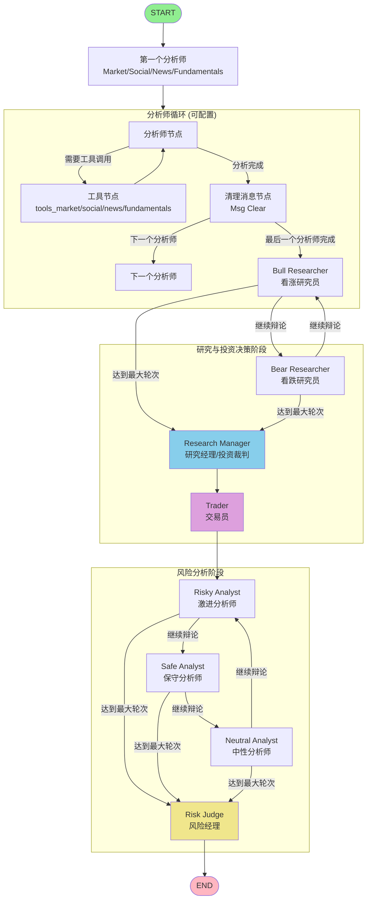

# TradingAgents Workflow Diagram

## 完整工作流程图

## 详细流程说明

### 阶段 1: 分析师阶段 (Analyst Phase)
- **顺序执行**: 根据 `selected_analysts` 配置，按顺序执行各个分析师
- **每个分析师**:
  1. 分析师节点分析市场数据
  2. 如果需要数据 → 调用工具节点 (`tools_xxx`)
  3. 工具返回数据 → 回到分析师节点继续分析
  4. 分析完成 → 清理消息 → 进入下一个分析师

### 阶段 2: 研究辩论阶段 (Research Debate Phase)
- **Bull Researcher** ↔ **Bear Researcher** 循环辩论
- 辩论轮次由 `max_debate_rounds` 控制
- 达到最大轮次后 → **Research Manager** 做出投资判断
- **Research Manager** → **Trader** 制定交易计划

### 阶段 3: 风险分析阶段 (Risk Analysis Phase)
- **Trader** → **Risky Analyst** (激进观点)
- **Risky** → **Safe** → **Neutral** → **Risky** (循环辩论)
- 辩论轮次由 `max_risk_discuss_rounds` 控制
- 达到最大轮次后 → **Risk Judge** 做出最终风险决策
- **Risk Judge** → **END** (输出最终交易决策)

## 条件判断逻辑

- **分析师条件**: 检查是否有 `tool_calls`，决定是否需要调用工具
- **辩论条件**: 检查辩论轮次 (`count`) 和当前响应者，决定继续辩论或进入下一阶段
- **风险分析条件**: 检查风险讨论轮次和最新发言者，决定继续讨论或进入风险判断

